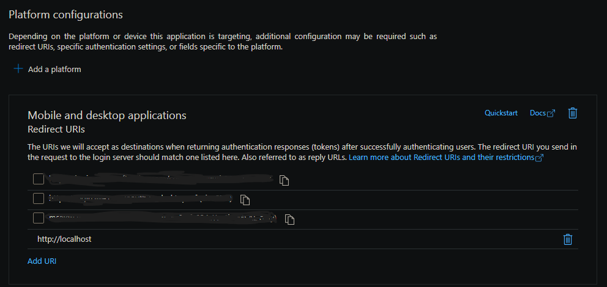

# Tutorial For Migrating Content From Azure Blob Storage Container To SharePoint Embedded Container

## Purpose

This tutorial will guide you through migrating content from Azure Blob Storage (ABS) to SharePoint Embedded (SPE) using C#. This is useful for customers who have 500 docs in the blob storage container.

### Prerequisites

1. A Microsoft Entra ID application registration. See [register an application](/graph/auth-register-app-v2).
1. Your Microsoft Entra ID tenant has a [Microsoft 365 subscription](/training/m365/).
1. A Microsoft Entra ID tenant. If you don't have a tenant, create a [free Azure account to get a free subscription](https://azure.microsoft.com/free/).
1. An account with at least the Global Administrator or SharePoint Embedded Administrator role.
1. .NET Core SDK [version 8.0.303](https://dotnet.microsoft.com/download/dotnet/8.0)
1. Dotnet environment to run the sample app

    - It can be run on Windows, Linux and macOS

1. SharePoint Embedded container

    - For more information on how to set up a [SPE container](https://aka.ms/start-spe)

1. Azure Blob Storage container

    - For more information on how to set up an [ABS container](/azure/storage/blobs/storage-blobs-introduction)

## Authentication

### Azure Blob Storage

1. Credentials - Container-level Shared Access Signature (SAS) URL.
1. Permission - Read and List

### SharePoint Embedded

1. An [Azure account](https://portal.azure.com)
1. A SharePoint Tenant where you'll create your containers and its Tenant ID
1. An onboarded application ID (sometimes called client ID) and its corresponding ContainerTypeId
1. Create a new App Registration in [Microsoft Entra ID portal](https://entra.microsoft.com).
1. In the App Registration, add a new Mobile & Console application platform in [Microsoft Entra ID App Registration Authenticate portal](https://entra.microsoft.com)

    

1. A ContainerType
1. A Container
1. Having the application registered in the consuming tenant (even if the owner of the application is the same as the consuming)
1. Having the containerType registered in the consuming tenant (even if the owner of the CT is the same as the consuming)
1. Consuming tenant user name and password credentials - will be required to authenticate the Microsoft Graph client
1. Permission - "User.Read", "FileStorageContainer.Selected"

## Migrating Data from Azure Blob Storage container to SharePoint Embedded container

### Description

This section provides code snippets on how to accomplish the migration. All the validation has been removed for readability.

### Connecting to Azure Blob Storage Container

```c#
_containerClient = new BlobContainerClient(new Uri(_containerLevelSASUrl));
```

### Connecting to SharePoint Embedded

```c#
string[] _scopes = { "User.Read", "FileStorageContainer.Selected" };
InteractiveBrowserCredentialOptions interactiveBrowserCredentialOptions = new InteractiveBrowserCredentialOptions()
  {
    ClientId = clientId,
    RedirectUri = new Uri("http://localhost"),
  };
InteractiveBrowserCredential interactiveBrowserCredential = new InteractiveBrowserCredential(interactiveBrowserCredentialOptions);

_graphClient = new GraphServiceClient(interactiveBrowserCredential, scopes, null);

// Will open up a browser to provide your consuming tenant admin credentials
var user = await _graphClient.Me.GetAsync();
```

### Getting the blob list

```c#
var blobs = new List<string>();
await foreach (var blobItem in _containerClient.GetBlobsAsync())
{
  blobs.Add(blobItem.Name);
}
return blobs;
```

### Thread pooling

```c#
private CountdownEvent _countdown;

// This is how the thread pool knows how many files are being migrated
_countdown = new CountdownEvent(blobs.Count);
```

### FileStructure

```c#
public class FileStructure
{
  public string blobName { get; set; }
  public string parentFolderId { get; set; }
}
```

### Traverse blob list

```c#
// It creates a new folder in the destination. The name of the folder is the blob's container name.
// root means it is the root of the document library.
// If you want to copy it to another drive item, you can put the drive item ID here.
containerFolder = await _graphClient.CreateFolder(_containerName, "root");

// Traverse the blob list
foreach (var blobName in fileList)
{
  FileStructure fs = new FileStructure() { blobName = blobName };

  // This function parses the flat file into the folder hierarchy and creates the folder structure in the destination. It will retrieve the parentFolderId that the file should be copied to.
  // If you are going to copy it to root you can comment this line out. The parentFolderId will be containerFolder.Id
  fs.parentFolderId = TraverseBlobName(fs, containerFolder.Id)

  // This is where the thread pool happens.
  // It takes in a callback function and an Object parameter.
  ThreadPool.QueueUserWorkItem(MigrateFile, fs);
}

// Call so the program doesn't end, it waits for all the files to be processed
_countdown.Wait();
```

### Traverse blob name

```c#
// Parse for folder path not including the file name and put it in an array
var pathSegments = filePath.Split(new char[] { '/' }, StringSplitOptions.RemoveEmptyEntries);
string[] directoriesParts = pathSegments.Take(pathSegments.Length - 1).ToArray();

// Traverse the folder listing and create 1 folder at a time
string relativePath = _containerName;
string newFolderId = parentFolderId;
foreach (string folderName in directoriesParts)
{
  string newPath = relativePath + _separator + folderName;
  ...

  DriveItem subFolder = await _graphClient.CheckIfItemExists(folderName, newFolderId);
  if (subFolder == null)
  {
    subFolder = await _graphClient.CreateFolder(folderName, newFolderId);
    ...
  }
  newFolderId = subFolder.Id;

  relativePath = newPath;
}

return newFolderId;
```

### Check if the item exists

```c#
var item = await _graphClient.Drives[_containerId].Items[parentFolderId].ItemWithPath(itemPath).GetAsync();
```

### Create folder

```c#
var folder = new DriveItem
{
  Name = folderName,
  Folder = new Folder(),
  AdditionalData = new Dictionary<string, object>()
  {
    { "@microsoft.graph.conflictBehavior", "fail" }
  }
};
var createdFolder = await _graphClient.Drives[_containerId].Items[parentFolderId].Children.PostAsync(folder);
```

### Migrate File

```c#
// The parameter must be of type Object.
internal async void MigrateFile(Object stateInfo)
{
  var fileStructure = (FileStructure)stateInfo;

  // Check if the file exists in the destination. If it exists
  // - don't upload
  // - check if the file is newer in the source than the destination - then upload
  ...

  // Migrate the file
  // This is where you download the blob as a stream from abs (code below)
  ...

  // Then upload the stream to SPE (code below)
  ...

  // Signal the countdown event that a file has been migrated
  _countdown.Signal();

  return;
}
```

### Downloading From The Blob From ABS As A Stream

```c#
BlobClient blobClient = _containerClient.GetBlobClient(blobName);

MemoryStream memoryStream = new MemoryStream();
await blobClient.DownloadToAsync(memoryStream);
memoryStream.Position = 0; // Reset the stream position to the beginning
```

### Uploading The Stream To SPE

```c#
int _maxChunkSize = 320 * 1024;

var uploadSessionRequestBody = new CreateUploadSessionPostRequestBody()
{
  AdditionalData = new Dictionary<string, object>
  {
    // Fail is set here, so it doesn't get upload again if it already exist
    { "@microsoft.graph.conflictBehavior", "fail" }
  }
};

var uploadSession = await _graphClient.Drives[_containerId]
    .Items[parentFolderId]
    .ItemWithPath(fileName)
    .CreateUploadSession
    .PostAsync(uploadSessionRequestBody);

// The stream is the same stream from the downloading the blob
var fileUploadTask = new LargeFileUploadTask<DriveItem>(uploadSession, memoryStream, _maxChunkSize, _graphClient.RequestAdapter);
IProgress<long> progress = new Progress<long>(prog => Console.WriteLine($"Uploaded {fileName} {prog} bytes"));

// Check uploadResult.UploadSucceeded to see if it is successful
var uploadResult = await fileUploadTask.UploadAsync(progress);
```

## Overview Of The Sample App

### Description

A sample app called **MigrateABStoSPE** that is designed to migrate files from an Azure Blob Storage (ABS) container to a SharePoint Embedded (SPE) container. The code snippets provided in the **Migrating Data from Azure Blob Storage container to SharePoint Embedded container** are from the sample app.

It uses Azure.Storage.Blobs and Newtonsoft.Json libraries for working with ABS and JSON data respectively. The app authenticates with both ABS and SPE using client credentials and performs the migration of files.

### Packages

1. Microsoft Graph SDK (version 5.56.0)
1. Azure.Identity (version 1.12.0)
1. Azure.Storage.Blobs (version 12.21.0)
1. CommandLineParser (version 2.9.1)
1. Newtonsoft.Json (13.0.3)

### Out Of Scope

1. How to deal with files that already exist in the destination - it fails, it doesn't overwrite or rename
1. How to deal with ABS version newer than the destination - it fails because the file already exists in the destination

### Running The Sample App

1.	Open a terminal or command prompt.
1.	Navigate to the directory where the Program.cs file is located.
1.	Make sure you have the .NET Core SDK installed on your machine. You can check this by running the command dotnet --version in the terminal. If the command isn't recognized, you can download and install the .NET Core SDK from the official Microsoft website.
1.	Once you have confirmed that the .NET Core SDK is installed, you can build the application by running the command `dotnet build`. This will compile the code and generate the necessary binaries.
1.	After the build process is complete, you can run the application by executing the command dotnet run followed by the required arguments. The required arguments are:

    - The container-level SAS URL: This is an Azure Blob container level SAS URL. It provides access to the container and its blobs.
    - The SPE tenant ID: This is the tenant you're authenticating against in the SPE.
    - The SPE client ID: This is the client you're authenticating against in the SPE.
    - The SPE container ID: This is the container you're migrating content to in the SPE. For more information on how to get the [container ID](/graph/api/filestorage-list-containers)
    - (optional) File name with full path that contains the blob list.
    - (optional) File name with full path where to output failed blobs.

For example, the command to run the application with the required arguments would look like this:

`dotnet run Program.cs -- --sasurl "<sas url>" --tenantid "<tenant id>" --clientid "<client id>" --containerid "<container id>" [ --blobfile "<file name>" --outputfile "<file name>" ]`

### Blob and SPE Item Structure

ABS container doesn't adhere to a folder structure, all the blobs are stored in a flat listing structure. When migrating to SPE, the sample app parses the blob name and creates the folder structure in the container ID provided, with the container name as the top folder. If you're migrating to the root folder, you can ignore this section.

**Source**

- Container Name: Container1
  - Blob name: FolderA/blob1.txt
  - Blob name: FolderA/FolderB/blob2.txt
  - Blob name: FolderA/FolderB/FolderC/blob3.txt

**Destination**

- Drive Item folder
  - Container1
    - FolderA
      - blob1.txt
      - FolderB
        - blob2.txt
        - FolderC
          - blob3.txt

## Handling Errors and Exceptions

### Common Issues

1. File already exists in the destination

    - This app checks to see if the file name exists in the destination before it uploads. If there's a file with the exact same name, it will not do the upload again. It will print to stdout a message that the file already exists. To fix it, you can either delete the file from the destination or change the conflictBehavior to replace and not call `CheckIfItemExists` on upload.

1. The file for the list of blobs isn't found
1. The format for the list of blobs - one blob per line, without quotes around the blob name
1. Not giving enough permission to access the ABS container

    - The minimum permissions are Read and List

1. Not giving enough permissions to the SPE container

    - The required scope is "User.Read" and "FileStorageContainer.Selected"
    - Remember to grant admin consent
    - Remember to create the mobile & console platform app

## Testing the Migration

### Verification

1. When the file is queued, it will print to stdout
1. It will print the stats of the total blobs that were processed: total, success, exists in destination, and failed.
1. If there are errors, it will send the failed blob list to a file. The file name will be printed to stdout. It will also, print a command for an incremental re-run.

## Conclusion

### Summary

In this tutorial, we explored how to migrate content from ABS container to SPE container. By following the steps outlined, writing your own app to migrate content should be easy.

To recap, we:

1. Authenticated with ABS and Graph
1. How to use a thread pool to queue migration of blob
1. Check if the item exists in destination
1. Retrieved the blob list from ABS container
1. Uploaded the blob to the SPE container

Understanding these steps is crucial for migrating content from ABS container to SPE container. Now, try implementing these steps in your own projects and see the difference it makes!

Happy coding!

### Next Steps

- For more information about Blob Storage, see [Blob Storage documentation](/azure/storage/blobs/storage-blobs-introduction).
- For more information about SPE, see [SharePoint Embedded documentation](https://aka.ms/start-spe).

## Appendix

### Code Repository

The sample app can be found in the [SharePoint Embedded Samples repository](https://github.com/microsoft/SharePoint-Embedded-Samples/tree/main/Samples/migrate-abs-to-spe).
