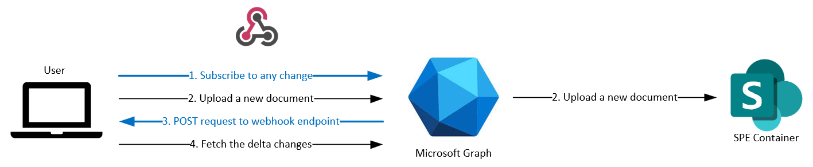
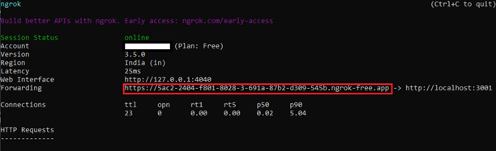

# Using Webhooks

## Set Up Webhooks with SharePoint Embedded

Webhooks are automated messages that are transmitted by an application when a trigger is activated. They can be used in SPE to enable the automation of workflows, the integration of systems, and to respond to events in real-time.

You'll use webhooks to invoke the Azure Cognitive Services APIs from the application whenever an existing file is updated, or a new file is uploaded.

To set up webhooks with your [current SharePoint Embedded application](/training/modules/sharepoint-embedded-create-app/), you need to:

1. Create and register a webhook endpoint to get notifications whenever there's a change in your container. This will be done using REST APIs.
1. Connect to Graph and subscribe to changes. You can expose your application to the internet by either running it locally or deploying it on the cloud. For the purposes of this tutorial, you'll be employing the former by utilizing ngrok and then subscribing to the changes by making a POST call.
1. Perform any desired action by handling the webhook data. One such use case is covered in [Enabling document processing with Azure Cognitive Services tutorial](./doc-processing-acs.md).



> [!TIP]
> To learn more about the Microsoft Graph APIs used in this tutorial, see [Create subscription](/graph/api/subscription-post-subscriptions).

## Create and register a webhook

Open the **index.ts** file and add an endpoint `onReceiptAdded`.

```typescript
server.post('/api/onReceiptAdded', async (req, res, next) => {
  try {
    const response = await onReceiptAdded(req, res);
    res.send(200, response)
  } catch (error: any) {
    res.send(500, { message: `Error in API server: ${error.message}` });
  }
  next();
});
```

You also need to add the query parser plugin at the top of this file so that it runs at server startup.

```typescript
server.use(restify.plugins.bodyParser(), restify.plugins.queryParser());
```

Create **onReceiptAdded.ts** and implement the method `onReceiptAdded` to read `validationToken` and `driveId`. `validationToken` is required when Graph makes a one-time call to verify the endpoint upon creation of the webhook subscription. `driveId` is the container-id for which  the subscription is created.

```typescript
require('isomorphic-fetch');

export const onReceiptAdded = async (req: Request, res: Response) => {

  const validationToken = req.query['validationToken'];
  if (validationToken) {
    res.send(200, validationToken, {"Content-Type":"text/plain"});
    return;
  }

  const driveId = req.query['driveId'];
  if (!driveId) {
    res.send(200, "Notification received without driveId, ignoring", {"Content-Type":"text/plain"});
    return;
  }

  console.log(`Received driveId: ${driveId}`);

  res.send(200, "");
  return;
}
```

## Connect to Graph and subscribe to changes

Follow the [documentation](https://ngrok.com/docs/getting-started/) to create a tunnel for your backend server by utilizing ngrok.

After starting the app, run the following command in a terminal:

```powershell
ngrok http 3001
```

On successful completion, you should get the following output. The public-facing endpoint for the app is highlighted in the red rectangle.


Once the tunneling is active, you can subscribe to delta changes in the container by adding the webhook URL. To do that, open Postman and make the following `POST` request with the appropriate graph access token and `notificationUrl` with the `driveId` appended as a query parameter to ensure that you get notifications for changes only in the desired container.

```json
POST  https://graph.microsoft.com/v1.0/subscriptions
{
  "changeType": "updated",
  "notificationUrl":"https://5ac2-2404-f801-8028-3-691a-87b2-d309-545b.ngrok-free.app/api/onReceiptAdded?driveId={{ContainerId}}",
  "resource": "drives/{{ContainerId}}/root",
  "expirationDateTime": "2024-01-20T03:58:34.088Z",
  "clientState": ""
}
```

You can use the following code snippet for setting the max possible expiration time of 4230 minutes from the current time by adding this to the "Pre-request Script" section. It will set an environment variable that can be used in the request body.

```javascript
var now = new Date()
var duration = 1000 * 60 * 4230; // max lifespan of driveItem subscription is 4230 minutes
var expiry = new Date(now.getTime() + duration);
var expiryDateTime = expiry.toISOString();

pm.environment.set("ContainerSubscriptionExpiry", expiryDateTime);
```

At this point, if you add/update any file in the container, you'll get a notification at the previously added endpoint (`/api/onReceiptAdded`) and a log message at the console: `Received driveId: <containerId>`
