# Embedding modern SharePoint pages in Microsoft Teams as personal apps (preview)

_**Applies to:** Microsoft 365_

You can use the Microsoft Teams personal app model to pin any modern SharePoint page to the left navigation of Microsoft Teams. This provides a great opportunity to expose intranet landing pages to serve corporate communication needs, directly accessible by Microsoft Teams users. Example scenarios could include:

- Adding your corporate intranet landing page to Teams for easy discovery of news and content
- Add the [Learning Pathways](https://lookbook.microsoft.com/details/3df8bd55-b872-4c9d-88e3-6b2f05344239) solution to Teams to embed Microsoft 365 learning paths for your users
- Add single page communications on important topics for your company

Use the steps defined in this article to embed any modern SharePoint page or site in Teams.


<br/>
<br/>

> [!VIDEO https://www.youtube.com/embed/G73jxqtjuIE]

You can embed any modern SharePoint page in Microsoft Teams by creating a Teams personal app and manually creating the needed configuration for this custom setup. Be aware of the following considerations:  

- This capability is provided as a PREVIEW INTEGRATION PATH until a native solution becomes available.
- The target must be a modern SharePoint site or page. Embedding classic publishing portals or other classic sites or pages is not supported and will not work.
- A user can add a personal app from the APPS link in Teams. A user can pin an app to the app bar (the left-most navigation in Teams) by right-clicking it and choosing PIN.
- Administrators can deploy and pin an app to all or targeted users from the Microsoft Teams admin center.
- There are some gaps in user experience including the following, which we are actively looking to address in a future, integrated solution:
    - There is no native navigation, header, or footer on embedded pages.
    - Search initiated from Teams will return search results from Teams, not search results from the embedded site.
    - You cannot create content (news, pages, lists, or libraries) in Teams. You must create content from the SharePoint site using a web browser or SharePoint mobile app.
- All users accessing the embedded SharePoint page will need to have at least read permission to access the page.
- If a tenant, SharePoint site or page name or URL is changed, the Teams personal app manifest will need to be updated.
- If changes are made to the pinning model for modern SP pages or sites, it could require you to delete existing pinned personal apps and redeploy them.

> [!IMPORTANT]
> This option is provided as a preview integration path. Microsoft reserves the right to make changes to the model, which could require you to delete existing pinned apps and re-deploy them with an updated solution. Changes to the integration path will not require you to delete or recreate the targeted SharePoint site or page.  

## Embed SharePoint modern sites & pages into Microsoft Teams with App Studio 

We will be using following tags in the steps below, which you should update based on the modern SharePoint page or site that you want to embed in Teams:

- [domainUrl] – Root URL of the domain
  - Example – https://contoso.sharepoint.com
- [PageUrl] – Page, which should be shown in the tab relative to the root of the tenant
  - Example - /sites/theperspective/SitePages/Home.aspx

> [!TIP]
> If you want to create a sample to demonstrate this integration, you can use the [https://lookbook.microsoft.com](https://lookbook.microsoft.com) service to create sample apps and pages in your tenant.

You will need to use **App Studio** or another editor to create the Teams manifest file with the necessary URLs to your SharePoint pages. Complete the following steps in App Studio.

1. Open Microsoft Teams.
1. Navigate to Teams store by clicking Apps on the Teams app bar (left navigation).

    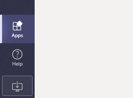

1. Use search to find App Studio.

    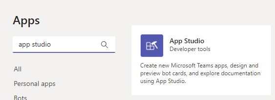

1. Install or open App Studio. 

    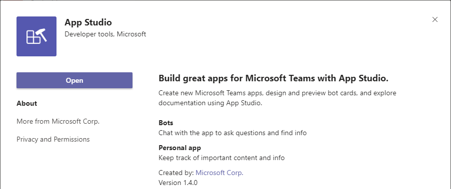

1. Open App Studio.
1. Navigate to the Manifest editor tab.
1. Click Create a new app.
1. Provide required app information on the form:
   1. **Short name** – Company Intranet  [use something descriptive that supports your scenario]  
   1. **Full name** – Contoso Intranet
   1. Click **Generate** to create a unique, random App ID
   1. **Package Name** – com.contoso.portal.app – Use a value that is unique to your environment
   1. **Version** – 1.0.0
   1. **Description** – My first intranet application
   1. **Full description** – My awesome intranet application to embed modern SharePoint in Teams
   1. **Developer Information - Name** – Your name
   1. **Developer Information - Website** – Your web site – company web site or whatever is your preference
   1. **Partner information** – Leave empty
   1. **App URLs** – These could be pages in your portal, but you can randomize the value for this tutorial
   1. **Terms of use** – Could be also a page in your portal, but let us use random value in this tutorial
   1. **Branding** – These would be visible on the app bar (left navigation) and in the app installation user interface. You can leave them as they are for the tutorial, but we absolutely recommend updating them for your production configuration  
      1. See branding guidance for the image and outline settings in  the Microsoft Teams official documentation

1.	Navigate to Tabs under Capabilities

    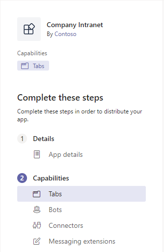

1. Click **Add** under the **Add a personal tab**
1. Fill in the **Personal tab** details based on your own setup
   1. **Name** – Intranet
   1. **Entity ID** – 19991 (Use random number)  
   1. **Content URL** – https:// [domainUrl] /_layouts/15/teamslogon.aspx?SPFX=true&dest=[pageUrl]  
      1. Update the URL based on your own tenant details. Example URL would be https://contoso.sharepoint.com/_layouts/15/teamslogon.aspx?SPFX=true&dest=/sites/theperspective/SitePages/Home.aspx
      1. The URL will need to be encoded to avoid issues accessing it across different devices.
   1. **Website URL** – You can leave this optional value empty 

1. Navigate to **Domains and Permissions** under **Finish**

    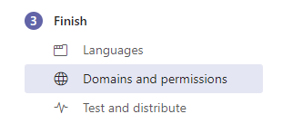

1. Make sure that **Domains from your tabs have your domain on it
   1. Example domain value `contoso.sharepoint.com`

1. Update **AAD App ID** as 00000003-0000-0ff1-ce00-000000000000
1. Include your domain URL to the **Single-Sign-On** value
   1. Example value `https://contoso.sharepoint.com`

    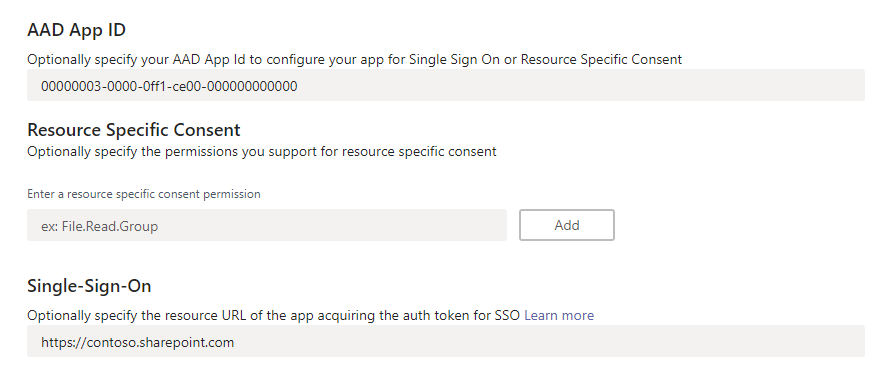

1. Navigate to **Test and distribute** under **Finish**

    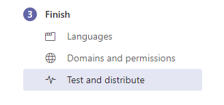

1. Install the solution to your usage by clicking **Install**
   1. This will enable you to test the configuration and validate the solution setup

    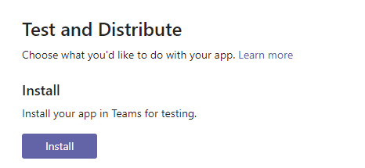

1. Click **Add** to install the application to your personal usage from the App Studio

    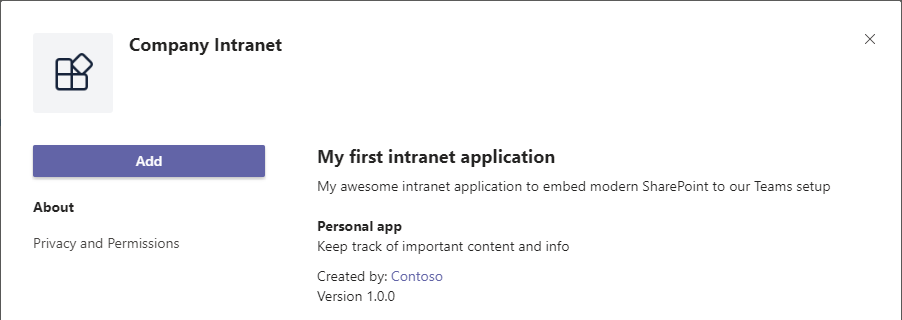

1. Verify that the application is working based on your objectives in both web and desktop.

    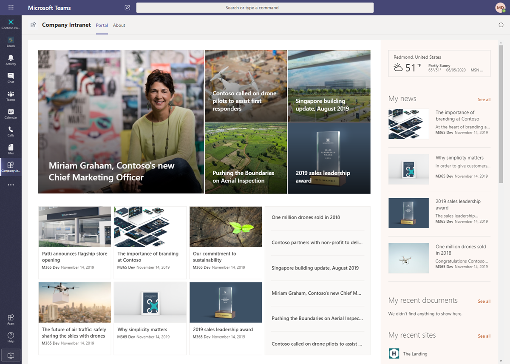

Notice that you can modify the settings by going back to **App Studio** and editing the manifest using the **Manifest editor**.

You can deploy the app to all users or to targeted users by downloading the manifest from the **App Studio** and publishing it to the app catalog in Teams administration.


> [!IMPORTANT]
> To deploy this solution to users in your tenant, you must have sufficient permissions to deploy apps in the Microsoft Teams app catalog.

## Sample manifest of the solution

If you download the solution file from the App Studio and see the detailed configuration of the manifest file, it has the following configuration to enable it to work properly in web and in desktop modes.

```json
{
    "$schema": "https://developer.microsoft.com/en-us/json-schemas/teams/v1.6/MicrosoftTeams.schema.json",
    "manifestVersion": "1.6",
    "version": "1.0.0",
    "showLoadingIndicator": false,
    "id": "7ad6f150-cba8-4c39-81ce-c4da8e4100d9",
    "packageName": "com.contoso.portal.app",
    "developer": {
        "name": "Portal App",
        "websiteUrl": "https://www.contoso.com",
        "privacyUrl": "https://www.contoso.com/privacy",
        "termsOfUseUrl": "https://www.contoso.com/temsofuse"
    },
    "icons": {
        "color": "color.png",
        "outline": "outline.png"
    },
    "name": {
        "short": "Portal App",
        "full": "Our modern portal"
    },
    "description": {
        "short": "My first portal application",
        "full": "My awesome portal application to embed modern SharePoint to our Teams setup"
    },
    "accentColor": "#FFFFFF",
    "staticTabs": [
        {
            "entityId": "19991",
            "name": "Portal",
            "contentUrl": "https://contoso.sharepoint.com/_layouts/15/teamslogon.aspx?SPFX=true&dest=/sites/theperspective/SitePages/Home.aspx",
            "scopes": [
                "personal"
            ]
        }
    ],
    "permissions": [
        "identity",
        "messageTeamMembers"
    ],
    "validDomains": [
        "m365pnp.sharepoint.com"
    ],
    "webApplicationInfo": {
        "id": "00000003-0000-0ff1-ce00-000000000000",
        "resource": "https://contoso.sharepoint.com"
    }
}
```

## Controlling app visibility in Microsoft Teams

You can also publish the app to be visible by default for all employees in your tenant by using the Teams app setup policies in the Microsoft Teams admin center. This provides you options to control which apps are visible to which users.  NOTE:  App policies do not apply to Guests of the tenant.

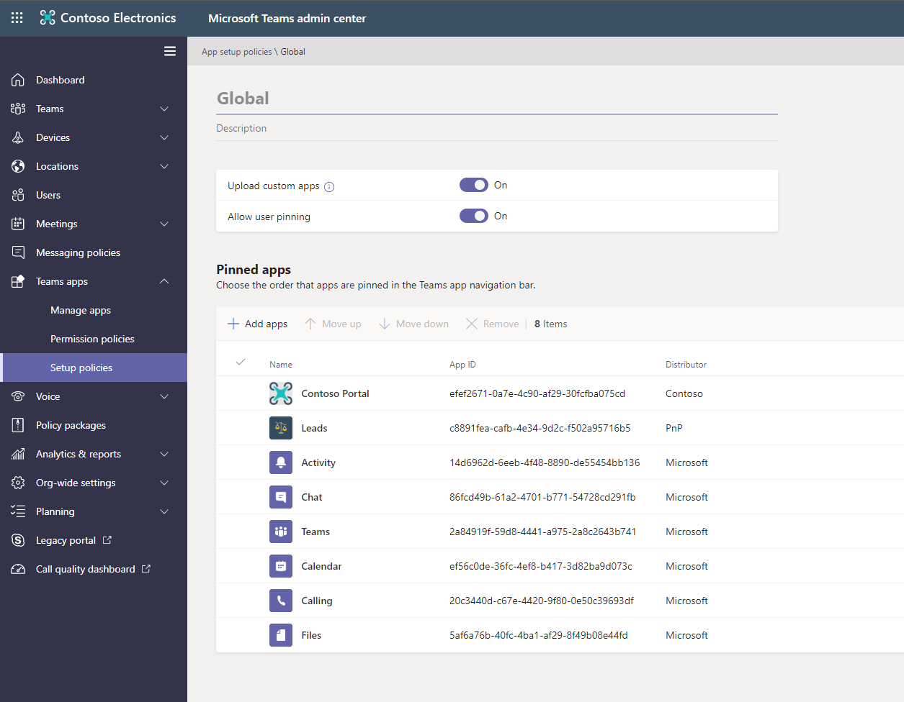

See more information on these options from the following Microsoft Teams documentation.

- [Manage app setup policies in Microsoft Teams](https://docs.microsoft.com/microsoftteams/teams-app-setup-policies)

## See also

- [Building Microsoft Teams tab using SharePoint Framework](https://docs.microsoft.com/sharepoint/dev/spfx/web-parts/get-started/using-web-part-as-ms-teams-tab)
