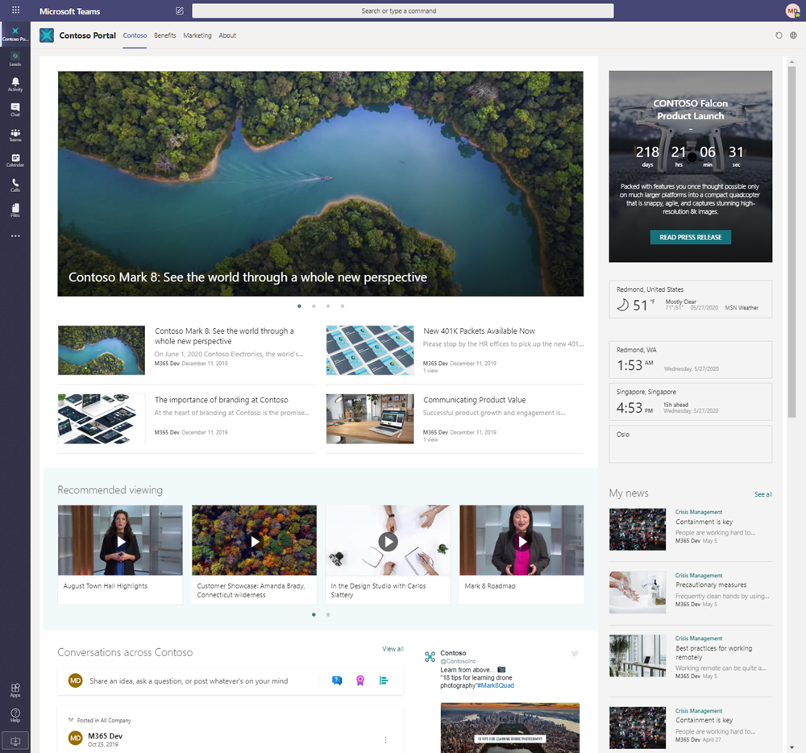

# Embedding modern SharePoint pages to Microsoft Teams as personal apps (preview)

You can use the Microsoft Teams personal app model to pin any modern SharePoint page to the left navigation in the Microsoft Team. This provides a great opportunity to expose intranet landing pages to serve corporate communication needs, directly accessible by Microsoft Teams users. Example scenarios could include:

- Adding your corporate intranet landing page to the Microsoft Teams for easy discovery and access of news and content
- Add Learning Pathways solution to Microsoft Teams left navigation to provide easy access on the learning materials
- Add single page communications on important topics for your company

Use the steps defined in this article on embedding any modern SharePoint Portal to Microsoft Teams for easily accessing the corporate communicational information from the Microsoft Teams.



VIDEO

You can embed any modern page on Microsoft Teams by creating a Teams Personal App and manually create the needed configuration for this custom setup. Be aware of the following considerations.  

- This capability is provided as a preview integration path until more native solution will be available
- You must use a modern SharePoint site or page to make this work. Embedding classic publishing portals or other classic sites is not supported and will not work  
- A personal app exposing SharePoint sites and pages   can be pinned to Microsoft Teams using normal app management capabilities, which can be also controlled centrally from the Microsoft Teams admin user interface
- We do acknowledge that there are some experience gaps with this approach, including the following, which we are actively looking to address:
    - There is no navigation, headers, or footer visible natively on the embedded pages
    - Search initiated from the suite navigation bar will leverage existing Teams search results, not those configured for the pinned site
    - Content creation cannot be performed through the Microsoft Teams, rather will happen from the native SharePoint Online portal
- All users accessing the target SharePoint page will need to have at least read permissions to access the target page
- If a tenant, SharePoint site or page name or URL is changed, Teams Personal App manifest will need to be updated
- If changes are made to the pinning model for modern SP pages or sites, it could require deletion of existing pinned personal apps and redeploying 

> [!IMPORTANT]
> This option is provided as a preview integration path and can evolve with a requirement to delete the existing configuration and re-adding native solution. This will not however require recreation or deletion of any content from the Microsoft Teams or from SharePoint side.  

## Embed SharePoint modern sites & pages into Microsoft Teams with App Studio 

We will be using following tags in the below steps, which you should be updating based on the SharePoint modern page or site, which you want to embed to Microsoft Teams:

- [domainUrl] – Root URL of the domain
  - Example – https://contoso.sharepoint.com
- [PageUrl] – Page, which should be shown in the tab relative to the root of the tenant
  - Example - /sites/theperspective/SitePages/Home.aspx

> [!TIP]
> If you are looking into creating a demo or sample content around this area, you can use the [https://lookbook.microsoft.com](https://lookbook.microsoft.com) service for creating sample portals for your usage.

You will need to use **App Studio** or other editor for creating the Microsoft Teams manifest file for the creating an app file with the necessary URLs to your SharePoint pages. Follow the next steps to complete the steps in App Studio.

1. Navigate to Microsoft Teams
1. Navigate to Teams store by clicking Apps on the Teams left menu

    

1. Use search to find App Studio

    

1. Install or open App Studio depending on whether you have previously installed the app. 

    

1. Open App Studio
1. Navigate  to the Manifest editor tab
1. Select Create a new app
1. Provide required app information on the form
   1. **Short name** – Company Intranet  [use something descriptive that supports your scenario]  
   1. **Full name** – Contoso Intranet
   1. Click **Generate** to randomize unique App ID
   1. **Package Name** – com.contoso.portal.app – Use unique value here for your own setup
   1. **Version** – 1.0.0
   1. **Description** – My first intranet application
   1. **Full description** – My awesome intranet application to embed modern SharePoint to our Teams setup
   1. **Developer Information - Name** – Your name
   1. **Developer Information - Website** – Your web site – company web site or whatever is your preference
   1. **Partner information** – Leave empty
   1. **App URLs** – These could be pages in your portal, but you can randomize the value for this tutorial
   1. **Terms of use** – Could be also a page in your portal, but let us use random value in this tutorial
   1. **Branding** – These would be visible on the left navigation and in the app installation user interfaces. You can leave them as they are for the tutorial, but we absolutely recommend to update them for the official configuration  
      1. See branding guidance from the Microsoft Teams official documentation related on the image and outline settings.

1.	Navigate to Tabs under Capabilities

    

1. Click **Add** under the **Add a personal tab**
1. Fill in the **Personal tab** details based on your own setup
   1. **Name** – Intranet
   1. **Entity ID** – 19991 (Use random number)  
   1. **Content URL** – https:// [domainUrl] /_layouts/15/teamslogon.aspx?SPFX=true&dest=[pageUrl]  
      1. Update provided URL based on your own tenant details. Example URL would be https://contoso.sharepoint.com/_layouts/15/teamslogon.aspx?SPFX=true&dest=/sites/theperspective/SitePages/Home.aspx
      1. Used URL will need to be encoded to avoid issues on accessing is across different devices.
   1. **Website URL** – You can leave this optional value empty 

1. Navigate to **Domains and Permissions** under **Finish**

    

1. Make sure that **Domains from your tabs** has your domain on it
   1. Example domain value `contoso.sharepoint.com`

1. Update **AAD App ID** as 00000003-0000-0ff1-ce00-000000000000
1. Include your domain URL to the **Single-Sign-On** value
   1. Example value `https://contoso.sharepoint.com`

    

1. Navigate to **Test and distribute** under **Finish**

    

1. Install the solution to your usage by clicking **Install**
   1. This will enable you to test the configuration and validate the solution setup

    

1. Click **Add** to install the application to your personal usage from the App Studio

    

1. Verify that the application is working based on your objectives in both web and desktop.

    

Notice that you can modify the settings by going back to the **App Studio** and edit the manifest by using the **Manifest editor**.

You can deploy the portal configuration available for your company employees by downloading the manifest from the **App Studio** and publishing it to be available from your company catalog.


> [!IMPORTANT]
> To be able to deploy this solution to your tenant for other users, you will need to have sufficient permissions to perform the app deployment to your tenant Microsoft Teams app catalog.

## Sample manifest of the solution

If you download the solution file from the App Studio and see the detailed configuration of the manifest file, it has the following configurations to enable it work properly in web and in desktop modes.

```json
{
    "$schema": "https://developer.microsoft.com/en-us/json-schemas/teams/v1.6/MicrosoftTeams.schema.json",
    "manifestVersion": "1.6",
    "version": "1.0.0",
    "showLoadingIndicator": false,
    "id": "7ad6f150-cba8-4c39-81ce-c4da8e4100d9",
    "packageName": "com.contoso.portal.app",
    "developer": {
        "name": "Portal App",
        "websiteUrl": "https://www.contoso.com",
        "privacyUrl": "https://www.contoso.com/privacy",
        "termsOfUseUrl": "https://www.contoso.com/temsofuse"
    },
    "icons": {
        "color": "color.png",
        "outline": "outline.png"
    },
    "name": {
        "short": "Portal App",
        "full": "Our modern portal"
    },
    "description": {
        "short": "My first portal application",
        "full": "My awesome portal application to embed modern SharePoint to our Teams setup"
    },
    "accentColor": "#FFFFFF",
    "staticTabs": [
        {
            "entityId": "19991",
            "name": "Portal",
            "contentUrl": "https://contoso.sharepoint.com/_layouts/15/teamslogon.aspx?SPFX=true&dest=/sites/theperspective/SitePages/Home.aspx",
            "scopes": [
                "personal"
            ]
        }
    ],
    "permissions": [
        "identity",
        "messageTeamMembers"
    ],
    "validDomains": [
        "m365pnp.sharepoint.com"
    ],
    "webApplicationInfo": {
        "id": "00000003-0000-0ff1-ce00-000000000000",
        "resource": "https://contoso.sharepoint.com"
    }
}
```

## Controlling app visibility in Microsoft Teams

You can also publish the app to be visible by default for all employees in your tenant by using the Teams app setup policies in the Microsoft Teams admin center. This provides you options to control which apps are visible to which users.  NOTE:  App policies do not apply to Guests of the tenant.


See more information on these options from the office Microsoft Teams documentation.

- [Manage app setup policies in Microsoft Teams](https://docs.microsoft.com/en-us/microsoftteams/teams-app-setup-policies)

## See also

- [Topic 1](#)
- [Topic 1](#)
- [Topic 1](#)