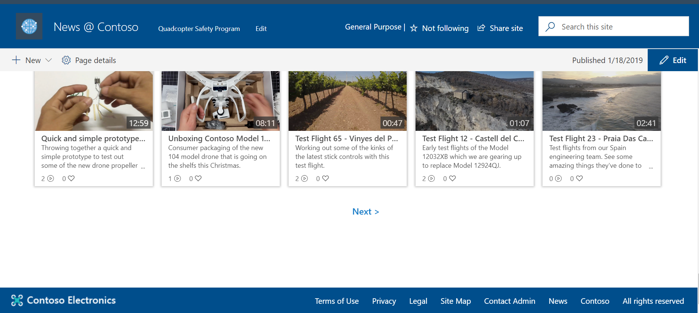
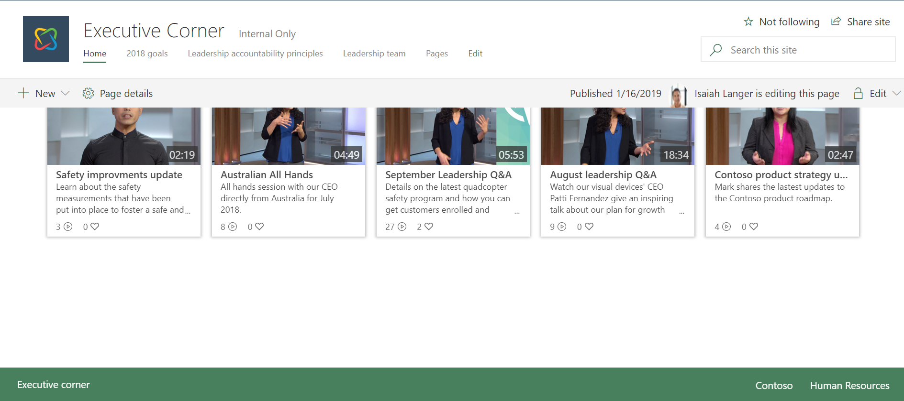
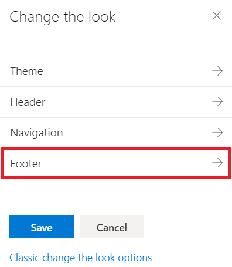
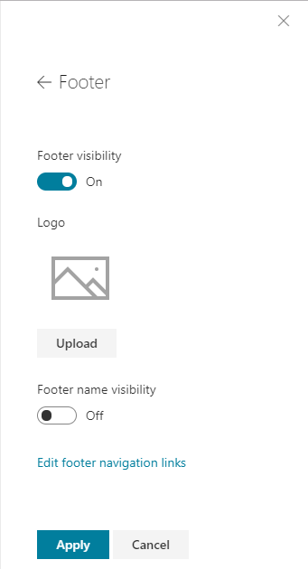

# SharePoint Site Footer

Footers are a common branding / navigation control in websites and portals. SharePoint Communication sites will have an out-of-the box footer control, which can be controlled either using UI elements or by using APIs. This control supports following elements

- 8 links or labels
- Footer logo or footer name

> [!NOTE]
> Site footers are current supported only in modern pages of communication sites. This feature is scheduled to start production roll out in January 2019.

> [!IMPORTANT]
> Footer will be enabled by default for all new and existing communication sites when the feature is initially rolled out.

## Footer with a logo

Following picture demonstrates a footer with a logo with additional labels and links.



## Footer with a label

Following picture demonstrates a footer with a label with additional labels and links.



## Controlling footer rendering using code or PowerShell

When this feature is initially released, all new and existing communication sites will get a footer by default. If you do not want the out-of-box footer in your existing communication site, you can pre-emptively turn it off before the feature rolls out to your site or disable the footer after feature is enabled.

You can control the footer existence with a `FooterEnabled` property in the `Web` object. Following PowerShell scripts shows how this can be done using [PnP PowerShell cmdlets](https://docs.microsoft.com/en-us/powershell/sharepoint/sharepoint-pnp/sharepoint-pnp-cmdlets?view=sharepoint-ps):

```ps

Connect-PnPOnline -Url "<SiteURL>" –Credentials (Get-Credential) 
$web = Get-PnPWeb 
$web.FooterEnabled = $false 
$web.Update() 
Invoke-PnPQuery  

```

> [!NOTE]
> Above PowerShell scripts assumes that you have already installed PnP PowerShell cmdlets for your environment and you are not using multi-factor authentication. You can install PnP PowerShell cmdlets to your computer by opening PowerShell console in administrative mode and executing following command: `Install-Module SharePointPnPPowerShellOnline`. If you are using multi-factor authentication, you can enable MFA login by updating the `Connect-PnPOnline` line as follows: `Connect-PnPOnline -Url "<SiteURL>" -UseWebLogin`.

## Controlling footer using the user interface

Site owner can control the footer visibility using the **Change the look** functionality of the site, which exposes the different user interface configuration options.

> [!NOTE]
> These options will be visible in the sites when the feature(s) are rolled out and released.



Footer configuration has multiple different options, which can be configured based on the site objectives.



## See also

- [Change the look of your SharePoint site](https://support.office.com/en-us/article/change-the-look-of-your-sharepoint-site-06bbadc3-6b04-4a60-9d14-894f6a170818)
