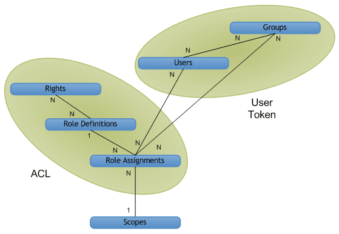

---
title: Authorization, users, groups, and the object model in SharePoint
ms.date: 09/25/2017
ms.prod: sharepoint
ms.assetid: aacf3398-f0b5-48cb-9071-440b4c3a9dd1
---

# Authorization, users, groups, and the object model in SharePoint

In SharePoint, access to websites, lists, folders, and list items is controlled through a role-based membership system by which users are assigned to roles that authorize their access to SharePoint objects.
  
    
    

To give a user access to an object, you can add the user to a group that already has permissions to the object, or you can create a role assignment object, set the user for the role assignment, optionally bind the role assignment to the appropriate role definition with base permissions, and then add the assignment to the collection of role assignments for the list item, folder, list, or website. If you do not bind the role assignment to a role definition when assigning a user to a role, the user has no permission.
Following are ways that SharePoint provides to control access to its objects:
  
    
    

- Objects can use the same permissions as the parent website, list, or folder (inheriting both the roles and users available on the parent object), or they can use unique permissions. 
    
  
- Sites, lists, folders, and items each provide role assignment collections, enabling fine management of user access to objects.
    
  
- Groups consist of users and may or may not be assigned to roles. SharePoint includes the following three groups by default:
    
  - **owners** (administrator)
    
  
  - **members** (contributor)
    
  
  - **visitors** (reader)
    
  

    When you create a website with unique permissions through the user interface, you are directed to a page where you can assign users to these groups as part of provisioning the site.
    
  
- Anonymous access allows users to contribute anonymously to lists and surveys, or to view pages anonymously. You can also grant access to "all authenticated users" to allow all members of your domain to access a website without having to enable anonymous access. 
    
  
- Site creation rights ( **CreateSSCSite** and **ManageSubwebs**) control whether users can create top-level websites, subsites, or workspaces.
    
  
Users become members of a SharePoint object indirectly through a group that has a role assignment, or directly through a role assignment. Users also can be members of a Microsoft Windows NT Domain Group that is added to a group or to a role. A role definition associates a user or group with a single right or set of rights corresponding to values of the  [Microsoft.SharePoint.SPBasePermissions](https://msdn.microsoft.com/library/Microsoft.SharePoint.SPBasePermissions.aspx) enumeration. Each user or group has a unique member [ID](https://msdn.microsoft.com/library/Microsoft.SharePoint.SPMember.ID.aspx) .You can use the object model to create or modify role assignments and definitions differently than the way you can through the functionality of the addrole.aspx file and the editrole.aspx file. Unlike these pages, which are presented in the user interface, the object model does not enforce rights dependency, so you can create a role definition with an arbitrary combination of rights. But, plan carefully when using the object model to customize role definitions and permissions, because a poorly planned role definition and inappropriately assigned rights can lead to a bad user experience.For more information about SharePoint rights, see  [SPBasePermissions](https://msdn.microsoft.com/library/Microsoft.SharePoint.SPBasePermissions.aspx) .
## Security policy

A security policy provides a way to enforce uniform security throughout all site collections within a web application (virtual server). Through policy, you can assign a role, or collection of rights, to individual SharePoint users, and to domain groups using Windows authentication or pluggable authentication systems, but not to SharePoint groups. Each policy entry specifies rights for a user or group in the web application.
  
    
    
Policy is set at the logical web application level or at the zone level. A user can have, for example, different policies on  `http://Server` and `http://Server.extranet.microsoft.com`, even if the two web applications have the same content.
  
    
    
Rights can be granted or denied through policy. Granting a right gives that right to the user or group on all secured objects within the web application, regardless of local permissions on the object. Denying a right is given a higher priority than granting the right, actively blocking that right for the user or group on all secured objects within the web application. Denying all for a user prevents that user from accessing any content, even if the user has explicit permissions on specific content: policy overrides site-level permissions.
  
    
    
In policy roles, the users and groups are identified by both their security identifier (SID) and their login or user name. Applying a policy role is similar to managing permissions for a website, list, folder, or document: You add users or groups and assign them to one or more role definitions. Each web application has its own policy roles. Another difference between policy roles and managing permissions is that central administrators can deny a right to a user throughout a web application.
  
    
    

> [!NOTE]
> Central administration policy roles differ from the role definitions for a site collection. 
  
    
    

## Users, groups, and principals

An individual user ( [SPUser](https://msdn.microsoft.com/library/Microsoft.SharePoint.SPUser.aspx) ) gains access to a SharePoint object directly through an individual role assignment, or indirectly through membership in either a domain group or a SharePoint group ( [SPGroup](https://msdn.microsoft.com/library/Microsoft.SharePoint.SPGroup.aspx) ) that has a role assignment. In a direct role assignment, the user is the principal ( [SPPrincipal](https://msdn.microsoft.com/library/Microsoft.SharePoint.SPPrincipal.aspx) ). In a domain group or SharePoint group role assignment, the domain group or SharePoint group is the principal.
  
    
    
SharePoint Server supports Windows users (for example,  _DOMAIN_\\ _User_Alias_) and external users (through pluggable authentication). The user identity is maintained by the identity management system (for example, the Active Directory directory service). The user profile (which includes the user's display name, email address, and other information) is scoped to the site-collection level. Changing a display name affects the entire site collection.
  
    
    
A group is a collection of users through which SharePoint Server manages security. User-based management is straightforward for simple sites, but becomes more complex as the number of uniquely secured resources grows. For example, a user may have the **Contribute** role for list 1, the **Read** role for list 2, and the **Design** role for list 3. This model does not scale well if there are, for example, 50,000 users—which would result in access control lists (ACLs) being 50,000 access control entries (ACEs) long on every uniquely secured object.
  
    
    
Groups provide an answer to the manageability and scale problems of user-based permissions management. Group-based management may be more abstract or more difficult to conceptualize, but it enables easier management of complex sites with many uniquely secured objects. For example, when adding a user to a group that has already been granted the appropriate role on various objects in the system. The permissions checking for groups scales better because far fewer group ACEs need to be stored.
  
    
    
SharePoint Server supports two kinds of groups: domain groups and SharePoint groups. Domain groups remain outside SharePoint Server control; users cannot use SharePoint Server to define, browse, or modify domain group membership. SharePoint groups are scoped to the site-collection level, and they can be used only within the site collection. Domain groups can be used anywhere within the scope of the Active Directory directory service.
  
    
    
A principal is a user or group that is used to control security. If you add a user to a site, the user is the principal, but if you add a group to the site, the group is the principal. The key to scaling security in SharePoint Server is to keep the number of principals per scope reasonable. By using groups, a smaller number of principals can be used to grant access to a much larger number of users.
  
    
    

## High-level view of object relations—scopes, users, groups, and roles

Figure 1 shows a high-level view of the SharePoint Server security management system in a logical database diagram. Each box represents a security object in the system. The lines represent relationships between the objects. The **1** and **N** notation represents the type of relationship. The figure shows how permissions data is structured into a user token and an ACL.
  
    
    

**Figure 1. Authorization object relations**

  
    
    

  
    
    

  
    
    
A scope represents a uniquely secured object or set of objects. You can scope to site, list, folder or item level.
  
    
    
Users and groups have a many-to-many relationship (N to N). Each user ( [SPUser](https://msdn.microsoft.com/library/Microsoft.SharePoint.SPUser.aspx) ) can be a member of multiple groups, and each group ( [SPGroup](https://msdn.microsoft.com/library/Microsoft.SharePoint.SPGroup.aspx) ) can contain multiple users.
  
    
    
Rights and role definitions also have a many-to-many relationship (N to N). Each right ( [SPBasePermissions](https://msdn.microsoft.com/library/Microsoft.SharePoint.SPBasePermissions.aspx) ) can be part of multiple role definitions. For example, the **Insert List Items** right is included in the **Contributor**, **Designer**, and **Administrator** role definitions. Each role definition ( [SPRoleDefinition](https://msdn.microsoft.com/library/Microsoft.SharePoint.SPRoleDefinition.aspx) ) can also contain multiple rights. For example, **Contributor** includes the rights for inserting, updating, and deleting list items.
  
    
    
Role definitions and role assignments ( [SPRoleAssignment](https://msdn.microsoft.com/library/Microsoft.SharePoint.SPRoleAssignment.aspx) ) have a one-to-many relationship (1 to N). Each role definition is used in multiple role assignments. The readers on list 1 and the readers on list 2 may be different, but their role assignments can share a single role definition: **Reader**.
  
    
    
Users or groups and role assignments have a many-to-many relationship (N to N). Each user or group can be a member of multiple role assignments on a given object. For example, a user may have both the **Designer** role and the **Administrator** role on the same object.
  
    
    
Scopes and role assignments have a one-to-many relationship (1 to N). Each scope has multiple role assignments, but each role assignment has only one scope. For example, one user may be a reader on the Events list, and another user may be a contributor on the Events list, but neither of these role assignments applies to the Announcements list. The only way for two lists to share the same role assignment is by inheriting their permissions from the parent container, in which case the security scope is the container, not the two lists.
  
    
    

## User tokens and access control lists

To make checking permissions faster, SharePoint Server implements user tokens and ACLs in its security model. The user token identifies the authentication process applied to a user. A Windows user has a complex token: a unique string for the user (SID) and a list of all the Windows domain groups for the user (for example,  _DOMAIN_\\Department 15688). A user who does not have Windows authentication may have a very simple token with a unique string for the user name, or a complex token with group/role membership just as expressed in Windows authentication. SharePoint group membership for each user is expressed through a user token so that, by reading the user token, SharePoint Server identifies all groups for the current user.
  
    
    
An ACL is a binary object that determines the rights that users and groups have on a given object. An ACL consists of multiple ACEs, each security principal (user or group) being one ACE in the ACL. Rights, role definitions, and role assignments are structured into an ACL for each scope, so that SharePoint Server knows what each user or group is allowed to do within the given scope.
  
    
    

## Object model changes: obsolete but backward-compatible security objects

In SharePoint, all object scopes share the same basic permissions management experience. SharePoint manages permissions through role definitions, which enable a consistent experience at the list, folder, and item level. The following security objects used in Windows SharePoint Services 2.0 are obsolete, but continue to function for backward-compatibility:
  
    
    

-  [Microsoft.SharePoint.SPPermission](https://msdn.microsoft.com/library/Microsoft.SharePoint.SPPermission.aspx)
    
  
-  [Microsoft.SharePoint.SPPermissionCollection](https://msdn.microsoft.com/library/Microsoft.SharePoint.SPPermissionCollection.aspx)
    
  
-  [Microsoft.SharePoint.SPRights](https://msdn.microsoft.com/library/Microsoft.SharePoint.SPRights.aspx)
    
  
-  [Microsoft.SharePoint.SPRole](https://msdn.microsoft.com/library/Microsoft.SharePoint.SPRole.aspx)
    
  
-  [Microsoft.SharePoint.SPRoleCollection](https://msdn.microsoft.com/library/Microsoft.SharePoint.SPRoleCollection.aspx)
    
  
To assign users to roles, use members of the  [Microsoft.SharePoint.SPRoleAssignment](https://msdn.microsoft.com/library/Microsoft.SharePoint.SPRoleAssignment.aspx) class and the [Microsoft.SharePoint.SPRoleAssignmentCollection](https://msdn.microsoft.com/library/Microsoft.SharePoint.SPRoleAssignmentCollection.aspx) class. The [SPBasePermisssions](https://msdn.microsoft.com/en-us/library/office/microsoft.sharepoint.spbasepermissions.aspx) enumeration, which replaced [SPRights](https://msdn.microsoft.com/library/Microsoft.SharePoint.SPRights.aspx) , includes additional permissions. The [SPBasePermisssions](https://msdn.microsoft.com/en-us/library/office/microsoft.sharepoint.spbasepermissions.aspx) enumeration also includes legacy permissions that map to the same constant values as previous permissions in [SPRights](https://msdn.microsoft.com/library/Microsoft.SharePoint.SPRights.aspx) . The SharePoint group concept maps to the existing [SPGroup](https://msdn.microsoft.com/library/Microsoft.SharePoint.SPGroup.aspx) object and [SPGroupCollection](https://msdn.microsoft.com/library/Microsoft.SharePoint.SPGroupCollection.aspx) object, which represent cross-site groups.
  
    
    

### Policy roles: create or modify security policies for URL zones

To create or modify security policies for URL zones, use the following classes and their members:
  
    
    

-  [Microsoft.SharePoint.Administration.SPPolicy](https://msdn.microsoft.com/library/Microsoft.SharePoint.Administration.SPPolicy.aspx)
    
  
-  [Microsoft.SharePoint.Administration.SPPolicyCollection](https://msdn.microsoft.com/library/Microsoft.SharePoint.Administration.SPPolicyCollection.aspx)
    
  
-  [Microsoft.SharePoint.Administration.SPPolicyRole](https://msdn.microsoft.com/library/Microsoft.SharePoint.Administration.SPPolicyRole.aspx)
    
  
-  [Microsoft.SharePoint.Administration.SPPolicyRoleCollection](https://msdn.microsoft.com/library/Microsoft.SharePoint.Administration.SPPolicyRoleCollection.aspx)
    
  
-  [Microsoft.SharePoint.Administration.SPPolicy.SPPolicyRoleBindingCollection](https://msdn.microsoft.com/library/Microsoft.SharePoint.Administration.SPPolicy.SPPolicyRoleBindingCollection.aspx)
    
  
-  [Microsoft.SharePoint.Administration.SPPolicyPermissions](https://msdn.microsoft.com/library/Microsoft.SharePoint.Administration.SPPolicyPermissions.aspx)
    
  

## Guest roles (Limited Access) to accommodate shared resources

The concept of a guest role is to accommodate the shared resources in the platform. For example, the theme and navigation structure of the website must be used to render the page for a list view. This concept is extended to include folder-level permissions and list-level permissions.
  
    
    
The SharePoint object model continues to call this the **Guest** role for semantic compatibility with the previous object model, although in the user interface the role is now called **Limited Access**. 
  
    
    

### Folder and item extensions

When a user is granted permissions on a folder, they are also granted the **Guest** role on the parent list of that folder and on the parent website of that list—on every uniquely secured scope above the folder, all the way to the first unique ancestor website. This is also true for list items: granting a user permissions on an item also grants that user the **Guest** role on all parent folders, lists, and websites up to the first unique ancestor website.
  
    
    

## Removing users from a scope or from all scopes

Removing a user from a scope also removes that user from all uniquely secured scopes beneath the current scope. For example, removing a user from a website also removes that user from uniquely secured lists in the site.
  
    
    
The only way to remove a user from all scopes is to delete that user from the site collection, which removes the user from all roles in all scopes within the site collection.
  
    
    

## Additional resources

-  [Authentication, authorization, and security in SharePoint](authentication-authorization-and-security-in-sharepoint.md)
    
  
-  [Role, inheritance, elevation of privilege, and password changes in SharePoint](role-inheritance-elevation-of-privilege-and-password-changes-in-sharepoint.md)
    
  
-  [Claims-based identity in SharePoint](claims-based-identity-in-sharepoint.md)
    
  
-  [Claims-based identity and concepts in SharePoint](claims-based-identity-and-concepts-in-sharepoint.md)
    
  
-  [Configuration, administration, and resources in SharePoint](configuration-administration-and-resources-in-sharepoint.md)
    
  

