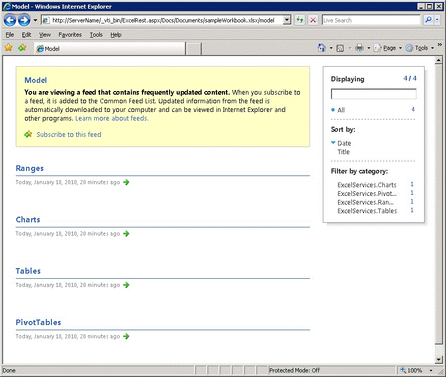

# Basic URI Structure and Path

This topic explains how to construct the URI structure and path for REST service commands in Excel Services.
  
    
    


> **Note:**
> The Excel Services REST API applies to SharePoint and SharePoint 2016 on-premises. For Office 365 Education, Business, and Enterprise accounts, use the Excel REST APIs that are part of the  [Microsoft Graph](http://graph.microsoft.io/en-us/docs/api-reference/v1.0/resources/excel
) endpoint.
  
    
    


## Basic URL Structure and Path

The REST API in Excel Services gives you the ability to access resources like charts, PivotTables, tables, and named ranges in a workbook directly through a URL. Each REST URL in Excel Services is built of three parts. Following is the basic structure of the URL to access the resources in a workbook: 
  
    
    

1. **REST aspx Page URI** The entry point to an .aspx page
    
  
2. **Workbook Location** The path to the workbook
    
  
3. **Resource Location** The path to the requested resource inside the workbook
    
  
Following is the construct for the REST URL to a specific element in a workbook:
  
    
    


```

http://<ServerName>/_vti_bin/ExcelRest.aspx/<DocumentLibrary>/<FileName>/<ResourceLocation>
```

Following is an example of how a REST URL in Excel Services looks with all three parts combined. In this example, the REST URL is accessing a workbook called "sampleWorkbook.xlsx" that contains a chart called "SampleChart":
  
    
    


```
http://<ServerName>/_vti_bin/ExcelRest.aspx/Docs/Documents/sampleWorkbook.xlsx/model/Charts('SampleChart')
```

The workbook is stored in a document library. The full path to the workbook is  `http://` _<ServerName>_ `/Docs/Documents/sampleWorkbook.xlsx`.
  
    
    
The three parts of the REST URL are:
  
    
    

1. **REST aspx Page URI**: `http://` _<ServerName>_ `/_vti_bin/ExcelRest.aspx`
    
  
2. **Workbook Location**: `/Docs/Documents/sampleWorkbook.xlsx`
    
  
3. **Resource Location**: `/model/Ranges('nameOfTheNamedRange')`
    
  

### Accessing by Using the Discovery User Interface

You can also access the chart by using the discovery user interface. To learn how access resources like charts, tables, PivotTables, and ranges by using the discovery mechanism shown in the following screen shot, see  [Discovery in Excel Services REST API](discovery-in-excel-services-rest-api.md).
  
    
    

  
    
    

  
    
    

  
    
    

  
    
    

  
    
    

### Marker Path

Following is the aspx page for the REST service in Excel Services:
  
    
    

```
http://<ServerName>/_vti_bin/ExcelRest.aspx
```

To access the REST service in Excel Services, you must preface the URL with  `http://` _<ServerName>_ `/_vti_bin/ExcelRest.aspx`.
  
    
    

### Workbook Location

The workbook location is the relative path to the workbook that has resources that you are interested in accessing. For example, assume that you have a workbook named sampleWorkbook.xlsx, saved to a trusted SharePoint document library. In this example, following is the path to the location of sampleWorkbook.xlsx: 
  
    
    

```
http://<ServerName>/Docs/Documents/sampleWorkbook.xlsx
```

You take the relative path to the workbook ( `Docs/Documents/sampleWorkbook.xlsx`) and append it to the marker path. Following is the URL with the marker path and workbook location appended:
  
    
    


```
http://<ServerName>/_vti_bin/ExcelRest.aspx
```


### Resource Location

The resource location is the path inside the workbook to the element that you request. For example, if you want to get a chart, the resource location would be similar to  `/model/Charts('Chart 1')`.
  
    
    
For the full URL, you append this to the marker path and the relative path to the workbook. Following is the full example URL:
  
    
    


```
http://<ServerName>/_vti_bin/ExcelRest.aspx/Docs/Documents/sampleWorkbook.xlsx/model/Charts('Chart 1')

```


## See also


#### Concepts


  
    
    
 [Resources URI for Excel Services REST API](resources-uri-for-excel-services-rest-api.md)
  
    
    
 [Discovery in Excel Services REST API](discovery-in-excel-services-rest-api.md)
