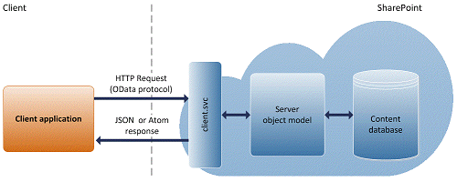

# Build mobile apps for other platforms using SharePoint
Learn how to use Representational State Transfer (REST) to create a SharePoint mobile app for any platform.
Mobile devices have become more powerful and easy to use nowadays. Laptops, netbooks, tablet PCs, and mobile phones provide workers access to the information and applications that they need to do their jobs. And developing applications for mobile devices is now easier than ever. As a result, more and more business scenarios demand integrating client applications together with their business processes. This article describes how to integrate mobile client apps together with SharePoint. You can create a mobile app to browse SharePoint content from any location and connect with SharePoint lists and libraries to access data.
  
    
    

To develop a mobile app that interacts with SharePoint, you can use common services that can be accessed using open protocols. SharePoint Foundation 2010 introduced the client object models, which enabled developers to perform remote communication with SharePoint by using the web programming technology of their choice: .NET Framework, Microsoft Silverlight, or JavaScript. SharePoint introduces a Representational State Transfer (REST) service that is fully comparable to the client object models. In SharePoint, nearly every API in the client object models will have a corresponding REST endpoint. Now, developers can interact remotely with the SharePoint object model by using any technology that supports REST web requests. REST can be consumed by any programming language that you want to use for your mobile application development.
You can perform basic create, read, update, and delete (CRUD) operations by using the REST interface provided by SharePoint. REST exposes all of the SharePoint entities and operations that are available in the other SharePoint client APIs. One advantage of using REST is that you don't have to add references to any SharePoint libraries or client assemblies. Instead, you make HTTP requests to the appropriate endpoints to retrieve or update SharePoint entities, such as webs, lists, and list items. For a thorough introduction to the SharePoint REST interface and its architecture, see  [Use OData query operations in SharePoint REST requests](http://msdn.microsoft.com/library/d4b5c277-ed50-420c-8a9b-860342284b72%28Office.15%29.aspx).
  
    
    


## REST endpoints in SharePoint
<a name="BuildMobileAppsInSharePoint2013ForNonWindowsPhone_REST_EndpointsInSharePoint2013"> </a>

To use the REST capabilities that are built into SharePoint, you can construct a RESTful HTTP request using the Open Data Protocol (OData) standard that corresponds to the desired client object model API. The client.svc web service handles the HTTP request and serves the appropriate response, in either Atom or JavaScript Object Notation (JSON) format. The client application must then parse that response. Figure 1 shows a high-level view of the SharePoint REST architecture.
  
    
    

**Figure 1. SharePoint REST architecture**

  
    
    

  
    
    

  
    
    
The endpoints in the SharePoint REST service correspond to the types and members in the SharePoint client object models. By using HTTP requests, you can use these REST endpoints to perform typical CRUD operations against SharePoint artifacts, such as lists and sites.
  
    
    
In general:
  
    
    

- Endpoints that represent read operations map to HTTP **GET** commands.
    
  
- Endpoints that represent update operations map to HTTP **POST** commands.
    
  
- Endpoints that represent update or insert operations map to HTTP **PUT** commands.
    
  
In choosing an HTTP request to use, you should also consider the following:
  
    
    

- Use **POST** to create artifacts such as lists and sites. The SharePoint REST service supports sending **POST** commands that include object definitions to endpoints that represent collections.
    
  
- For **POST** operations, any properties that are not required are set to their default values. If you try to set a read-only property as part of a **POST** operation, the service returns an exception.
    
  
- Use **PUT**, **PATCH**, and **MERGE** operations to update existing SharePoint objects. Any service endpoint that represents an object property **set** operation supports both **PUT** requests and **MERGE** requests. For **MERGE** requests, setting properties is optional; any properties that you do not explicitly set retain their current property. But for **PUT** commands, any properties you do not explicitly set are set to their default properties. In addition, if you do not specify all settable properties in object updates when you use HTTP **PUT** commands, the REST service returns an exception.
    
  
- Use the HTTP **DELETE** command against the specific endpoint URL to delete the SharePoint object represented by that endpoint. For recyclable objects, such as lists, files, and list items, this results in a **Recycle** operation. For more information, see [Get to know the SharePoint REST service](http://msdn.microsoft.com/library/2de035a0-ac75-43bd-9665-5c5a59c4c590%28Office.15%29.aspx).
    
  

## Authenticate users to SharePoint
<a name="BuildMobileAppsInSharePoint2013ForNonWindowsPhone_AuthenticatingNonWindowsAppForSharePoint"> </a>

To authenticate your mobile app with SharePoint, you can use the MS-OFBA protocol. For more information, see  [[MS-OFBA]: Office Forms Based Authentication Protocol Specification](http://msdn.microsoft.com/library/30c7bbe9-b284-421f-b866-4e7ed4866027%28Office.15%29.aspx). The protocol client is configured to store and transmit cookies. The protocol client relies on the remote protocol server to set the user's identity as one or more HTTP cookies. After the user's identity is established, the client then sends each cookie with each subsequent HHT request.
  
    
    
When a user signs in to SharePoint, the user's token is validated and then used to sign in to SharePoint. The user's token is a security token that is issued by an identity provider. SharePoint supports several kinds of authentication. For more information, see  [Authentication, authorization, and security in SharePoint](authentication-authorization-and-security-in-sharepoint.md). To authenticate a user, you can use the REST interface. The authorization process verifies that an authenticated subject (an app or a user the app is acting on behalf of.md) has permission to perform certain operations or to access specific resources (for example, a list or a SharePoint document folder.md).
  
    
    
OData lets you access a data source, such as a database, by browsing to a specially constructed URL. This allows for a simplified approach for connecting to, and working with, data sources that are hosted within an organization. OData is a protocol that uses HTTP, Atom, and JavaScript Object Notation (JSON) to enable developers to write applications that communicate with an ever-growing number of data sources. Microsoft supports the creation of this standard as a way to enable the exchange of data between applications and data stores that can be accessed from the web. The new OData connector enables SharePoint to communicate with OData providers. For more information, see  [Open Data Protocol](http://www.odata.org).
  
    
    
The following code demonstrates how to authenticate your app to SharePoint using REST endpoints for basic or forms-based authentication. The following code example is written in C#, but any other programming language can be used to create the Http request, as per the requirement of the platform.
  
    
    


```cs

string SharePointUrl = "https://Target SharePoint site";

private void AuthenticateToSharePoint(object sender, RoutedEventArgs e)
{
    ODataAuthenticator odataAt = new ODataAuthenticator("<Username>", "<password>");
    odataAt.CookieCachingEnabled = true;
    odataAt.AuthenticationCompleted += new EventHandler<AuthenticationCompletedEventArgs>(odataAt_AuthenticationCompleted);
    odataAt.Authenticate(new Uri(SharePointUrl, UriKind.Absolute));
}

void odataAt_AuthenticationCompleted(object sender, AuthenticationCompletedEventArgs e)
{
    HttpWebRequest endpointRequest = (HttpWebRequest)HttpWebRequest.Create(SharePointUrl.ToString() + "/_api/web/lists");
    endpointRequest.Method = "GET";
    endpointRequest.Accept = "application/json;odata=verbose";
          endpointRequest.CookieContainer = (sender as ODataAuthenticator).CookieContainer;
    
    endpointRequest.BeginGetResponse(new AsyncCallback((IAsyncResult res) =>
    {
        HttpWebRequest webReq = res.AsyncState as HttpWebRequest;
        WebResponse response = webReq.EndGetResponse(res);

        HttpWebResponse httpResponse = response as HttpWebResponse;
        HttpStatusCode code = httpResponse.StatusCode;
        this.Dispatcher.BeginInvoke(() =>
        {
            MessageBox.Show(code.ToString());
        });
    }), endpointRequest);
}

```

To authenticate an **HttpWebrequest** to the endpoint, you should first authenticate to SharePoint with the **ODataAuthenticator** class. Before calling the **Authenticate** method, register the **ODataAuthenticator** object to the **AuthenticationCompleted** event.
  
    
    
After authentication is done inside the **OnAuthenticationCompleted** event, you can use the **CookieContainer** property on the **ODataAuthenticator** object, which can be attached to the **HttpWebRequest** object to authenticate the REST calls to SharePoint.
  
    
    

## Work with SharePoint list items using REST
<a name="BuildMobileAppsInSharePoint2013ForNonWindowsPhone_WorkingWithTheSharePointListItemUsingREST"> </a>

The following example shows how to **retrieve** all of a list's items.
  
    
    

```

url: http://site url/_api/web/lists/GetByTitle('Test')/items
method: GET
headers:
// MS-OFBA protocol returns a cookie.
  Cookie: cookie


    accept: "application/json;odata=verbose" or "application/atom+xml"

```

The following example shows how to **retrieve** a specific list item.
  
    
    


```

url: http://site url/_api/web/lists/GetByTitle('Test')/items(item id)
method: GET
headers:
    
// MS-OFBA protocol return a cookie.
  Cookie: cookie
    accept: "application/json;odata=verbose" or "application/atom+xml"

```

The following XML shows an example of the list item properties that are returned when you request the XML content type.
  
    
    


```XML

<content type="application/xml">
        <m:properties>
        <d:FileSystemObjectType m:type="Edm.Int32">0</d:FileSystemObjectType>
        <d:Id m:type="Edm.Int32">1</d:Id>
        <d:ID m:type="Edm.Int32">1</d:ID>
        <d:ContentTypeId>0x010049564F321A0F0543BA8C6303316C8C0F</d:ContentTypeId>
        <d:Title>an item</d:Title>
        <d:Modified m:type="Edm.DateTime">2012-07-24T22:47:26Z</d:Modified>
        <d:Created m:type="Edm.DateTime">2012-07-24T22:47:26Z</d:Created>
        <d:AuthorId m:type="Edm.Int32">11</d:AuthorId>
        <d:EditorId m:type="Edm.Int32">11</d:EditorId>
        <d:OData__UIVersionString>1.0</d:OData__UIVersionString>
        <d:Attachments m:type="Edm.Boolean">false</d:Attachments>
        <d:GUID m:type="Edm.Guid">eb6850c5-9a30-4636-b282-234eda8b1057</d:GUID>
    </m:properties>
</content>
```

The following example shows how to **create** a list item.
  
> [!NOTE]
> 
> To do this operation, you must know the **ListItemEntityTypeFullName** property of the list and pass that as the value of **type** in the HTTP request body.
  
    
    


```

url: http://site url/_api/web/lists/GetByTitle('Test')/items
method: POST
body: { '__metadata': { 'type': 'SP.Data.TestListItem' }, 'Title': 'Test'}
headers:
    
// MS-OFBA protocol returns a cookie.
  Cookie: cookie
     X-RequestDigest = form digest value
    accept: "application/json;odata=verbose"
    content-type: "application/json;odata=verbose"
    content-length:length of post body
```

The following example shows how to **update** a list item.
  
> [!NOTE]
> To do this operation, you must know the **ListItemEntityTypeFullName** property of the list and pass that as the value of **type** in the HTTP request body.
  
    
    


```

url: http://site url/_api/web/lists/GetByTitle('Test')/items(item id)
method: POST
body: { '__metadata': { 'type': 'SP.Data.TestListItem' }, 'Title': 'TestUpdated'}
headers:
// MS-OFBA protocol returns a cookie.
  Cookie: cookie
     X-RequestDigest = form digest value
    "IF-MATCH": etag or "*"
    "X-HTTP-Method":"MERGE",
    accept: "application/json;odata=verbose"
    content-type: "application/json;odata=verbose"
    content-length:length of post body
```

The following example shows how to **delete** a list item.
  
    
    


```

url: http://site url/_api/web/lists/GetByTitle('Test')/items(item id)
method: POST
headers:
// MS-OFBA protocol returns a cookie.
  Cookie: cookie
     X-RequestDigest = form digest value
    "IF-MATCH": etag or "*"
    "X-HTTP-Method":"DELETE"

```

For more information, see  [Complete basic operations using SharePoint REST endpoints](http://msdn.microsoft.com/library/e3000415-50a0-426e-b304-b7de18f2f7d9%28Office.15%29.aspx).
  
    
    

## Additional resources
<a name="bk_addresources"> </a>


-  [Build Windows Phone apps that access SharePoint](build-windows-phone-apps-that-access-sharepoint.md)
    
  
-  [Using the SharePoint REST service](http://msdn.microsoft.com/library/e1ff2979-1c16-4cb0-a57e-9168dfe20a7c.aspx)
    
  
-  [Build Windows Phone apps that access SharePoint](build-windows-phone-apps-that-access-sharepoint.md)
    
  
-  [Choose the right API set in SharePoint](choose-the-right-api-set-in-sharepoint.md)
    
  
-  [Use OData query operations in SharePoint REST requests](http://msdn.microsoft.com/library/d4b5c277-ed50-420c-8a9b-860342284b72%28Office.15%29.aspx)
    
  
-  [Get to know the SharePoint REST service](http://msdn.microsoft.com/library/2de035a0-ac75-43bd-9665-5c5a59c4c590%28Office.15%29.aspx)
    
  
-  [Making REST calls with C# and JavaScript for SharePoint](http://www.microsoft.com/resources/msdn/en-us/office/media/video/videol?cid=sdc&amp;from=mscomsdc&amp;VideoID=4e4cc094-ff69-405b-852f-2ac7c41293c5)
    
  
-  [Making REST calls with C# and JavaScript for SharePoint demo](http://www.microsoft.com/resources/msdn/en-us/office/media/video/videol?cid=sdc&amp;from=mscomsdc&amp;VideoID=b1e7c9c5-0f62-4a78-bb7b-8e283c86145c)
    
  
-  [Open Data Protocol](http://www.odata.org/)
    
  
-  [Authorization and authentication of SharePoint Add-ins](http://msdn.microsoft.com/library/bde5647a-fff1-4b51-b67b-2139de79ce4a%28Office.15%29.aspx)
    
  
-  [Windows Phone SDK 8.0](http://www.microsoft.com/en-us/download/details.aspx?id=35471)
    
  
-  [Microsoft SharePoint SDK for Windows Phone 8](http://www.microsoft.com/en-us/download/details.aspx?id=36818)
    
  

