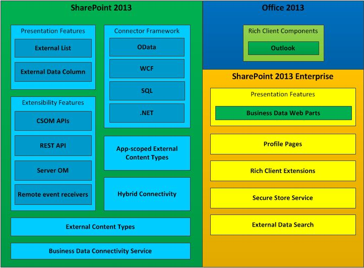

# Business Connectivity Services in SharePoint
Learn what Business Connectivity Services (BCS) is, what you can do with it, and the information you need to get started developing BCS applications in SharePoint.
You can use SharePoint as a hub for creating rich productivity and collaboration solutions that can work with a variety of external systems. Business Connectivity Services (BCS) provides the infrastructure that enables SharePoint to bring data from those external systems into a central system. By providing a flexible and extensible means to describe the external system data source and how to interact with it, BCS makes a compelling argument for using SharePoint as the central interface for working with legacy business systems in addition to new SharePoint Add-ins.
  
    
    

## What can BCS do?

BCS provides mechanisms to enable experienced users, developers, and business unit IT professionals to do the following much more easily:
  
    
    

- Reveal external data from enterprise applications, web services, and OData services in SharePoint and in rich-client Office applications.
    
  
- Provide Office-type behaviors (such as Contacts, Tasks, and Appointments) and capabilities to external data and services.
    
  
- Provide complete interaction with the data, including write-back capabilities from Office applications and SharePoint Server to the underlying external system data and business objects.
    
  
- Enable offline use of external data and processes.
    
  
- Bridge the unstructured world of documents and people and the appropriate structured data that is locked in external systems.
    
  

## Components of BCS

Figure 1 shows the features that are included in SharePoint and Office 2013.
  
    
    

**Figure 1. Business Connectivity Services feature set**

  
    
    

  
    
    

  
    
    

  
    
    

  
    
    

## Using external content types in BCS

External content types are the core of BCS. They enable you to manage and reuse the metadata and behaviors of a business entity, such as Customer or Order, from a central location. They enable users to interact with that external data and process it in a more meaningful way.
  
    
    
For example, consider a business entity, such as a customer. You want to be able to pull data from your proprietary database and work with it in SharePoint. You also want to be able to allow your field salespeople to take data offline in Outlook 2013. Or, you might want the user to be able to choose a customer from a list of customers in an orders contract document inside Microsoft Word. To make all this possible, you can create a single external content type and then reuse it anywhere you need it.
  
    
    
For more information about using external content types in BCS, see  [External content types in SharePoint](external-content-types-in-sharepoint.md).
  
    
    

## Developing solutions using BCS

You can build a broad spectrum of solutions in SharePoint by using BCS. These include simple solutions that rely on native capabilities with little or no customization, intermediate solutions that involve customizing features in SharePoint and Office 2013, and advanced solutions that enable complex scenarios and rich applications that extend their functionality. Advanced solutions involve writing code using Visual Studio. They can be either complete end-to-end solutions, or reusable code-based components that are included in an intermediate solution.
  
    
    
BCS empowers business users to quickly and easily address a broad array of external data needs by using a web browser and a Microsoft Office client application, such as Word or Excel. Without writing code, users can assemble composite solutions by using BCS features, such as external lists and external data columns, and reusable BCS components, which are created by developers and approved by IT, in Office client applications and SharePoint sites. These solutions enable business users (and their teams) to work with external data as easily as with SharePoint data, either offline or connected, or directly in Office 2013.
  
    
    
For information about how to get started, see  [Setting up a development environment for BCS in SharePoint](setting-up-a-development-environment-for-bcs-in-sharepoint.md).
  
    
    

## Using OData with Business Connectivity Services in SharePoint

The Open Data Protocol (OData) is a web protocol that lets you expose data to the web using technologies such as HTTP, JavaScript Object Notation (JSON), and AtomPub. Access to the data is through specially constructed URLs. This architecture lets you interact with data using a variety of technologies.
  
    
    
For more information, see  [Using OData sources with Business Connectivity Services in SharePoint](using-odata-sources-with-business-connectivity-services-in-sharepoint.md).
  
    
    

## In this section

-  [What's new in Business Connectivity Services in SharePoint](what-s-new-in-business-connectivity-services-in-sharepoint.md)
    
  
-  [Get started with Business Connectivity Services in SharePoint](get-started-with-business-connectivity-services-in-sharepoint.md)
    
  
-  [External content types in SharePoint](external-content-types-in-sharepoint.md)
    
  
-  [Using OData sources with Business Connectivity Services in SharePoint](using-odata-sources-with-business-connectivity-services-in-sharepoint.md)
    
  
-  [External events and alerts in SharePoint](external-events-and-alerts-in-sharepoint.md)
    
  
-  [Add-in-scoped external content types in SharePoint](add-in-scoped-external-content-types-in-sharepoint.md)
    
  
-  [Get started using the client object model with external data in SharePoint](get-started-using-the-client-object-model-with-external-data-in-sharepoint.md)
    
  
-  [Business Connectivity Services programmers reference for SharePoint](business-connectivity-services-programmers-reference-for-sharepoint.md)
    
  

## See also

-  [Add SharePoint capabilities](add-sharepoint-capabilities.md)
    
  
-  [Setting up a development environment for BCS in SharePoint](setting-up-a-development-environment-for-bcs-in-sharepoint.md)
    
  
-  [SharePoint development overview](sharepoint-development-overview.md)
    
  

