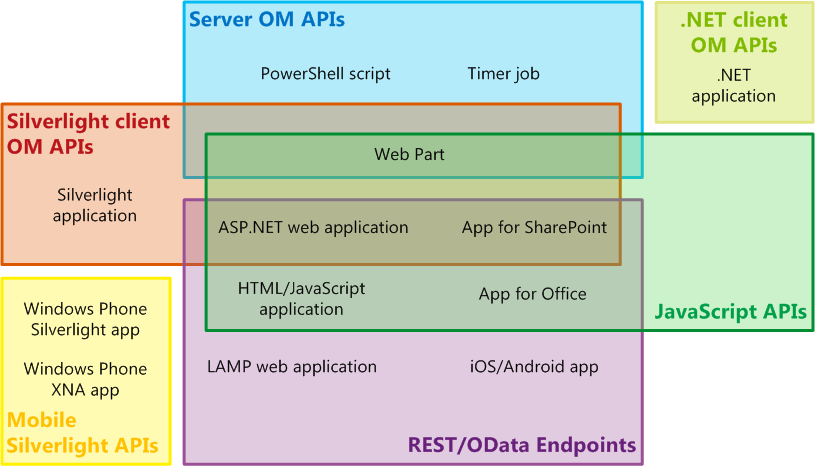
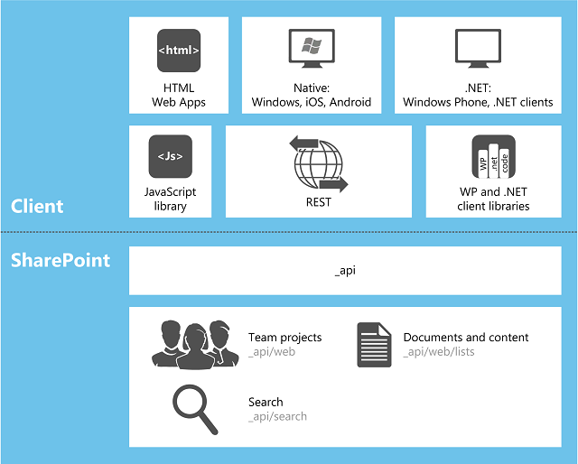

# Choose the right API set in SharePoint
Learn about the several sets of APIs that are provided in SharePoint, including the server object model and the various client object models, and the REST/OData web service.
    
    

## Factors that determine which API set to use

You can choose from several sets of APIs to access the SharePoint platform. Which one you use depends on the following factors:
  
    
    

- **The type of application.** The possibilities include, but are not limited to, the following, which are not mutually exclusive categories: an SharePoint Add-in, a Web Part on a SharePoint page, a Silverlight application running on either a client computer or a client mobile device, an ASP.NET application exposed in SharePoint by an IFrame, JavaScript running in a SharePoint site page, a SharePoint application page, a Microsoft .NET Framework application running on a client computer, a Windows PowerShell script, and a timer job running on a SharePoint server.
    
  
- **Your existing skills.** To a surprising degree, you can create applications in SharePoint without needing to learn a lot about SharePoint programming. You can jump right into SharePoint development if you already have experience in any of the following programming models:
    
  - JavaScript
    
  
  - ASP.NET
    
  
  - REST/OData
    
  
  - .NET Framework
    
  
  - Windows Phone
    
  
  - Silverlight
    
  
  - Windows PowerShell
    
  
- **The device on which the code runs.** The possibilities include a server in the SharePoint farm, an external server such as a server in the cloud, a client computer, and a mobile device.
    
  
This topic provides an overview of the various API sets that are provided by SharePoint. Figure 1 shows which sets of APIs can be used to develop each of 13 common SharePoint-related applications. For many applications, you can choose from more than one API.
  
    
    

**Figure 1. Selected SharePoint extension types and SharePoint sets of APIs**

  
    
    

  
    
    

  
    
    

  
    
    
The following table provides guidance on which set of APIs to use for a selected list of common SharePoint extensibility projects. The remaining sections of this topic describe the various sets of APIs.
  
    
    

|**If you want to do this ...**|**... use these APIs**|
|:-----|:-----|
|Create an ASP.NET web application that performs create/read/update/deleted (CRUD) operations across a firewall on SharePoint data or external data that is surfaced in SharePoint by a Microsoft Business Connectivity Services (BCS) external content type    |JavaScript client object model    |
|Create an ASP.NET web application that performs CRUD operations on SharePoint data or external data that is surfaced in SharePoint by a BCS external content type, but does not have to call SharePoint across a firewall    |.NET Framework client object model, Silverlight client object model, or REST/OData endpoints    |
|Create a LAMP web application that performs CRUD operations on SharePoint data or external data that is surfaced in SharePoint by a BCS external content type    |REST/OData endpoints    |
|Create a Windows Phone app that performs CRUD operations on SharePoint data    |Mobile client object model    |
|Create a Windows Phone app that uses the Microsoft Push Notification Service to alert the mobile device of events in SharePoint    |Mobile client object model and the server object model    |
|Create an iOS or Android app that performs CRUD operations on SharePoint data    |REST/OData endpoints    |
|Create a .NET Framework application that performs CRUD operations on SharePoint data    |.NET Framework client object model    |
|Create a Silverlight application that performs CRUD operations on SharePoint data    |Silverlight client object model    |
|Create an HTML/JavaScript application that performs CRUD operations on SharePoint data    |JavaScript client object model    |
|Create an Office Add-in that works with SharePoint    |JavaScript client object model    |
|Create a custom Windows PowerShell command    |Server object model    |
|Create a timer job    |Server object model    |
|Create an extension of Central Administration    |Server object model    |
|Create consistent branding across an entire SharePoint farm    |Server object model    |
|Create a custom Web Part, application page, or ASP.NET user control    |Server object model    **Important:** If the functionality you want to offer customers is not oriented to SharePoint administration at a scope broader than site collection, we recommend that, instead of using the server object model, you create an SharePoint Add-in that includes a remote ASP.NET web application with custom Web Parts and user controls as needed. See the top two rows of this table.           |
   

## Server object model

The largest set of APIs is in the server object model of managed classes. At the level of SharePoint Foundation 2013, this object model includes classes and members that enable programmatic control of the basic site and list structure of SharePoint Foundation. Most of these classes are in the  [Microsoft.SharePoint](https://msdn.microsoft.com/library/Microsoft.SharePoint.aspx) namespace. In addition, you can extend almost every SharePoint Foundation component by using the server object model, including workflows, alerts, Web Parts, basic search, and Microsoft Business Connectivity Services (BCS). The server object model also includes an extensive set of APIs enable extensions of the administration and security system of SharePoint Foundation, including backup, farm health and diagnostics, logging, farm and web application management, upgrade, deployment, caching, and Windows PowerShell customization.
  
    
    
At the level of SharePoint, many more classes are added to enable programming of Enterprise Content Management (ECM), user profiles, taxonomy, advanced search, and other features of SharePoint.
  
    
    
You can use  [LINQ to Objects](http://msdn.microsoft.com/en-us/library/bb397919.aspx) to query any **IEnumerable** collection in memory, but a [LINQ to SharePoint provider](http://msdn.microsoft.com/library/3fa2dc5f-d308-4337-aefd-191a5df8dbbe%28Office.15%29.aspx) enables direct querying of the lists in the SharePoint content databases. Strictly speaking, this provider is not available with any other set of APIs discussed in this topic; however, there are ways to use LINQ syntax in most of the others.
  
    
    
The assemblies that define the built-in server-side classes are installed to the global assembly cache of each server when SharePoint is installed. When you program against the server object model, your assemblies are installed as farm solutions to the global assembly cache.
  
> [!NOTE]
> Developing new sandboxed solutions against SharePoint is deprecated in favor of developing SharePoint Add-ins, but sandboxed solutions can still be installed to site collections on SharePoint. The assemblies of these solutions remain in the package except when they are actually in use, at which time they are temporarily installed to a folder on the server. For more information, see  [Where are Assemblies in Sandboxed Solutions Deployed?](http://msdn.microsoft.com/library/dadbb20b-1bf7-442c-9eeb-bd9f01dbda45%28Office.15%29.aspx). 
  
    
    

### Limitations on when you can use the server object model

Custom logic in SharePoint Add-ins is always distributed "down" to the client or "up" to the cloud (or "over" to some server outside the SharePoint farm). In all of these distribution models, one of the client object models or the REST/OData endpoints must be used. (You cannot use the server object model in an SharePoint Add-in.) For example, if the app contains SharePoint-hosted pages, those pages can access SharePoint data by using the JavaScript client object model. Such pages could also expose Silverlight applications that use the SharePoint Silverlight client object model. For more information about SharePoint Add-ins, see  [Important aspects of the SharePoint Add-in architecture and development landscape](http://msdn.microsoft.com/library/ae96572b-8f06-4fd3-854f-fc312f7f2d88%28Office.15%29.aspx).
  
    
    

## Client object models for managed code

SharePoint has three client object models for managed code: .NET, Silverlight, and mobile.
  
    
    

### .NET client object model

The SharePoint object model for .NET Framework is used in .NET Framework applications that run on a non-phone Windows client. Any of the following counts as such a client:
  
    
    

- A user's computer
    
  
- A server that is external to the SharePoint farm
    
  
- A web role or worker role on Microsoft Azure
    
  
Almost every class in the core site and list server object model has a corresponding class in the .NET Framework client object model. In addition, the .NET Framework client object model exposes a full set of APIs for extending other features, including some SharePoint features such as ECM, taxonomy, user profiles, advanced search, analytics, BCS, and others.
  
    
    
To improve performance, lines of code written against in the .NET Framework client object model are sent to the SharePoint server in batches where they are converted to server-side code and executed. The queried results, and the new state of all variables, are then returned to the client. You as the developer determine whether a batch runs synchronously or asynchronously. (In a synchronous batch, the .NET Framework application waits for the returned results from the server before continuing; in an asynchronous batch, client-side processing continues immediately and the client user interface (UI) remains responsive.)
  
    
    
You can use LINQ query syntax in your client code to query any **IEnumerable** object, including SharePoint objects that implement **IEnumerable**. However, when you do this, you are using  [LINQ to Objects](http://msdn.microsoft.com/en-us/library/bb397919.aspx), not the  [LINQ to SharePoint provider](http://msdn.microsoft.com/library/3fa2dc5f-d308-4337-aefd-191a5df8dbbe%28Office.15%29.aspx), so documentation of the latter is not relevant to client-side code.
  
    
    
The assemblies for the .NET Framework client object model must be installed on the client. They are included in a redistributable package that you can obtain on the  [SharePoint Client Components](http://www.microsoft.com/en-us/download/details.aspx?id=35585).
  
    
    
For examples of using the .NET Framework object model, see  [Complete basic operations using SharePoint client library code](http://msdn.microsoft.com/library/5a69c9e3-73bf-4ed5-bc19-182056bdb394%28Office.15%29.aspx).
  
> [!NOTE]
> You can also use the SharePoint REST/OData endpoints in a .NET Framework application. For a comparison of the .NET Framework client object model with the SharePoint REST/OData endpoints, see the section  [REST/OData endpoints](#RESTOData) later in this article.
  
    
    

### Silverlight client object model

The SharePoint object model for Silverlight is used in Silverlight applications, regardless of where the compiled .xap file is persisted. It may be in an assets library on a SharePoint website, on a client computer, in cloud storage, or on an external server. Typically, a Silverlight application is surfaced in SharePoint in a  [SilverlightWebPart](https://msdn.microsoft.com/library/Microsoft.SharePoint.WebPartPages.SilverlightWebPart.aspx) object. The Silverlight client object model in SharePoint is nearly identical to the .NET Framework client object model, and it includes support for the same extensibility areas. The principal difference is that in the Silverlight version, all batches of commands are sent to the server asynchronously so that the UI of the application remains active.
  
    
    
The assemblies for the Silverlight client object model are persisted on every SharePoint server at %ProgramFiles%\\Common Files\\Microsoft Shared\\web server extensions\\15\\TEMPLATE\\LAYOUTS\\ClientBin. They do not have to be installed on the computer that is running the Silverlight application, although you have the option of doing so. Also, you can package them into the .xap file of the application.
  
    
    
Silverlight .xap files can be included in SharePoint Add-ins, including SharePoint-hosted apps. In the latter case, the .xap file is deployed to a library on the app web. (For more information about app webs, see  [Host webs, add-in webs, and SharePoint components in SharePoint](http://msdn.microsoft.com/library/b791cdf5-8aa2-47fa-bc4c-aee437354759%28Office.15%29.aspx).) This makes a Silverlight application a useful way of including custom SharePoint code in an app, because custom server-side code is not allowed in SharePoint Add-ins. It also enables Silverlight developers to use their existing skills to create SharePoint applications with a minimal learning curve.
  
> [!NOTE]
> You can also use the SharePoint REST/OData endpoints in a Silverlight application. For a comparison of the Silverlight client object model with the SharePoint REST/OData endpoints, see the section  [REST/OData endpoints](#RESTOData) later in this article.
  
    
    

### Mobile object model

A special version of the Silverlight client object model is available for Windows Phone devices. It includes some additional APIs that are relevant only to telephones, such as APIs that enable a phone app to register for notifications from the Microsoft Push Notification Service. It supports all core SharePoint functionality; however, it does not provide support for any of the non-core extensibility areas that are supported by the other two client object models for managed code. To access those additional areas, use the SharePoint REST/OData endpoints in your mobile app. See the section  [REST/OData endpoints](#RESTOData) later in this article.
  
    
    
The assemblies for the mobile object model are persisted on every SharePoint server at %ProgramFiles%\\Common Files\\Microsoft Shared\\web server extensions\\15\\TEMPLATE\\LAYOUTS\\ClientBin. You package them into the .xap file of your Windows Phone application.
  
    
    

## JavaScript object model

SharePoint provides a JavaScript object model for use in either inline script or separate .js files. It includes all the same functionality as the .NET Framework and Silverlight client object models. Like the Silverlight client object model, the JavaScript object model is a useful way of including custom SharePoint code in an app, because custom server-side code is not allowed in SharePoint Add-ins. It also enables web developers to use their existing JavaScript skills to create SharePoint applications with a minimal learning curve.
  
    
    
Just like the managed-code client object models, the JavaScript infrastructure for SharePoint interacts with the farm servers in batches. These batches always run asynchronously. In addition, it is now possible to access SharePoint data across domains in JavaScript (but only data that is within the same parent site collection), which was not allowed in previous versions of SharePoint. For more information, see  [Access SharePoint data from add-ins using the cross-domain library](http://msdn.microsoft.com/library/bc37ff5c-1285-40af-98ae-01286696242d%28Office.15%29.aspx). Data is returned from the server in JavaScript Object Notation (JSON).
  
    
    
The JavaScript object model is defined in a set of *.js files located at %ProgramFiles%\\Common Files\\Microsoft Shared\\web server extensions\\15\\TEMPLATE\\LAYOUTS on each server.
  
    
    
For examples of using the .NET Framework object model, see  [Complete basic operations using JavaScript library code in SharePoint](http://msdn.microsoft.com/library/29089af8-dbc0-49b7-a1a0-9e311f49c826%28Office.15%29.aspx).
  
> [!NOTE]
> You can also use the SharePoint REST/OData endpoints in a JavaScript application. For a comparison of the JavaScript client object model with SharePoint's REST/OData endpoints, see the following section,  [REST/OData endpoints](#RESTOData). 
  
    
    

## REST/OData endpoints

For scenarios in which you need to access SharePoint entities from client technologies that do not use JavaScript and are not built on the .NET Framework or Silverlight platforms, SharePoint provides an implementation of a Representational State Transfer (REST) web service that uses the  [OData protocol](http://www.odata.org/) to perform CRUD operations on SharePoint list data. In addition, almost every API in the client object models has a corresponding REST endpoint. This enables your code to interact directly with SharePoint artifacts by using any technology that supports standard HTTP requests and responses. To use the REST capabilities that are built into SharePoint, your code constructs a RESTful HTTP request to an endpoint that corresponds to the desired client object model API. The client.svc web service handles the HTTP request and serves a response in either Atom or JSON format.
  
    
    
For more information about using the REST/OData web service, see the node  [Use OData query operations in SharePoint REST requests](http://msdn.microsoft.com/library/d4b5c277-ed50-420c-8a9b-860342284b72%28Office.15%29.aspx); for examples, see the topic  [Complete basic operations using SharePoint REST endpoints](http://msdn.microsoft.com/library/e3000415-50a0-426e-b304-b7de18f2f7d9%28Office.15%29.aspx).
  
    
    

### Comparing REST/OData programming with client object model programming

In some situations, it might be preferable to use the REST endpoints even in applications for which a SharePoint object model is available, especially for developers who do not have Windows development experience. The following table provides a comparison of the major features of these programming choices for a developer creating an application on a Windows platform or with a platform that supports JavaScript.
  
    
    

|**Feature**|**.NET Framework or Silverlight object models**|**JavaScript object model**|**REST/OData endpoints called from a Windows platform or JavaScript**|
|:-----|:-----|:-----|:-----|
|Object-oriented programming    |Yes    |Yes    |No    |
|Batch processing    |Yes    |Yes    |Yes    |
|APIs for conditional processing and exception handling    |Yes    |No    |No    |
|Availability of LINQ syntax    |Yes    |No    |No    |
|Combining list data from different SharePoint web applications    |Yes    |No    |Yes    |
|Familiarity to experienced REST/OData developers    |No    |No    |Yes    |
|Similarity to non-Windows programming or JavaScript programming    |No    |Yes    |Yes    |
|Strong typing for list item fields    |No (except with LINQ)    |No    |Yes, from Windows platform          No, from JavaScript    |
|Leveraging jQuery, Knockout, and other JavaScript libraries    |No    |Yes    |No, from Windows platform          Yes, from JavaScript    |
   

## WCF Data Services Framework

If you prefer to use LINQ syntax in .NET Framework or Silverlight client applications, SharePoint supports  [WCF Data Services](http://msdn.microsoft.com/en-us/library/cc668792.aspx) as a LINQ provider. You can target either the listdata.svc (for list data only) as in earlier versions of SharePoint Foundation, or you can target the same client.svc that supports the OData interface for access to all SharePoint entities in addition to list data. For more information, see [Query SharePoint Foundation with ADO.NET Data Services](http://msdn.microsoft.com/library/3e3e16f7-620a-4710-a3f3-19d0236f4b4a%28Office.15%29.aspx).
  
    
    
Figure 2 illustrates the relationship of the various client APIs, various types of client applications, and SharePoint. The various _api* URLs are the farm-relative URLs for the REST endpoints. For more information, see the topic  [Learning more about the SharePoint 15 REST service](http://msdn.microsoft.com/library/2de035a0-ac75-43bd-9665-5c5a59c4c590%28Office.15%29.aspx#bk_learnmore).
  
    
    

**Figure 2. Client applications and APIs in SharePoint**

  
    
    

  
    
    

  
    
    

  
    
    

  
    
    

## Deprecated API sets

Two API sets are still supported in the SharePoint framework for backward compatibility, but we recommend that you not use them for new projects: the  [ASP.NET (asmx) web services](http://msdn.microsoft.com/library/c587ee90-1f88-43f3-b1a7-5f3072d038f8%28Office.15%29.aspx), and  [direct Remote Procedure Calls (RPC) calls to the owssvr.dll](http://msdn.microsoft.com/library/4aa5c82b-90fb-4be5-b30c-d35ecae42a81%28Office.15%29.aspx) file.
  
    
    

## See also

-  [SharePoint development overview](sharepoint-development-overview.md)
    
  
-  [Programming models in SharePoint](programming-models-in-sharepoint.md)
    
  
-  [SharePoint Add-ins compared with SharePoint solutions](sharepoint-add-ins-compared-with-sharepoint-solutions.md)
    
  
-  [Use OData query operations in SharePoint REST requests](http://msdn.microsoft.com/library/d4b5c277-ed50-420c-8a9b-860342284b72%28Office.15%29.aspx)
    
  
-  [Complete basic operations using SharePoint REST endpoints](http://msdn.microsoft.com/library/e3000415-50a0-426e-b304-b7de18f2f7d9%28Office.15%29.aspx)
    
  
-  [Complete basic operations using SharePoint client library code](http://msdn.microsoft.com/library/5a69c9e3-73bf-4ed5-bc19-182056bdb394%28Office.15%29.aspx)
    
  
-  [Complete basic operations using JavaScript library code in SharePoint](http://msdn.microsoft.com/library/29089af8-dbc0-49b7-a1a0-9e311f49c826%28Office.15%29.aspx)
    
  
-  [Query SharePoint Foundation with ADO.NET Data Services](http://msdn.microsoft.com/library/3e3e16f7-620a-4710-a3f3-19d0236f4b4a%28Office.15%29.aspx)
    
  

  
    
    
