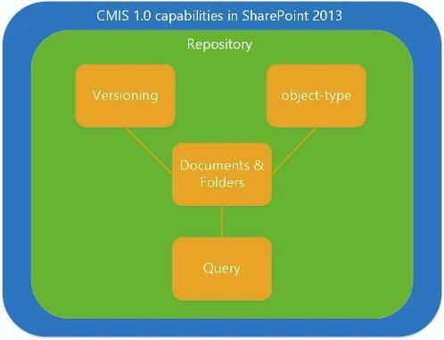
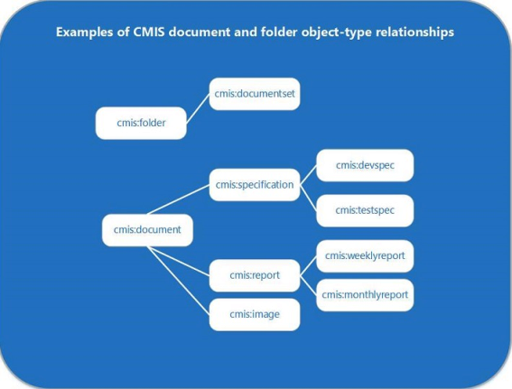

# Content Management Interoperability Services (CMIS) in SharePoint
Learn about the SharePoint implementation of version 1.0 of the OASIS Content Management Interoperability Services (CMIS) standard.
## Introduction to CMIS in SharePoint

SharePoint Server compliance with version 1.0 of the  [OASIS Content Management Interoperability Services (CMIS) standard](https://www.oasis-open.org/committees/tc_home.php?wg_abbrev=cmis) enables integration between SharePoint Server content repositories and other enterprise content management (ECM) repositories in an enterprise. CMIS enables information to be shared across Internet protocols among and between document systems, publishers, and repositories, within the enterprise, and between companies—all in a vendor-neutral format. The CMIS standard supports basic document management operations such as create, read, update, delete, check in, and check out. The standard supports managing versions of documents and their metadata. CMIS is available on any on-premises SharePoint site after the **Content Management Interoperability Services (CMIS) Producer** feature is activated in the **Manage Site Features** section of **Site Settings**. In SharePoint, the SharePoint CMIS Producer is available but turned off by default on all on-premises sites.
  
    
    
CMIS provides interoperability between the APIs that support it, but it is not a replacement for native APIs. The objects that CMIS supports intersect with objects that SharePoint Server developers commonly interact with, including documents and folders. But, developers writing applications that support CMIS will likely have to continue writing custom SharePoint Server code. CMIS can save 60-70 percent of development time for solutions that implement it—consider it yet another tool in the development toolbox.
  
    
    

## A detailed look at the CMIS implementation in SharePoint

Some parts of the CMIS spec are mandatory, but many others are optional. Many vendors, including Microsoft, implement the mandatory portions of the standard and some of its optional components. Figure 1 shows capabilities specified in the CMIS 1.0 specification that are implemented in SharePoint.
  
    
    
Figure 1. CMIS 1.0 capabilities implemented in SharePoint.
  
    
    

  
    
    

  
    
    
The CMIS data model defines a repository that contains the other CMIS data types, including object-types, versioning, documents and folders, and query functionality.
  
    
    

### CMIS repositories and SharePoint document libraries

The CMIS repository is the container for the rest of the CMIS data model. In SharePoint, the document library is equivalent to the CMIS repository (lists are not supported in the SharePoint CMIS Producer). Accessing the repository is usually the launching point for a client application. For example, consider a SharePoint Server site that contains multiple document libraries, which are equivalent to repositories in CMIS. The CMIS specification describes a mandatory service, **getRepositories**, that in SharePoint Server obtains all of the valid repositories (document libraries) in the current  [SPWeb](https://msdn.microsoft.com/library/Microsoft.SharePoint.SPWeb.aspx) object. A developer can connect to repositories by calling either the **getRepositories** service or the **getRepositoryInfo** service; **getRepositoryInfo** obtains the repository specified by the developer.
  
    
    
The CMIS repository contains the other CMIS capabilities that SharePoint Server supports, including the document and folder object-types specified by CMIS, CMIS versioning capabilities (which mirror the native versioning capabilities in SharePoint Server), and the CMIS query capability, which uses a SQL-like syntax to query CMIS repositories for specific data.
  
    
    

### CMIS documents, folders, and other object types

CMIS defines an object-type capability that is equivalent to the idea of content types in SharePoint Server (specifically, the [SPContentType](https://msdn.microsoft.com/library/Microsoft.SharePoint.SPContentType.aspx) class). Each read-only CMIS object-type consists of attributes and property definitions. Attributes define whether an object can be, for example, queried or versioned. CMIS supports property definitions for properties that are associated with equivalent object types in SharePoint, where applicable. For example, a document object or a folder object in CMIS may have a **LastModifiedBy** property, which uses this syntax: `cmis:LastModifiedBy`. An **Author** property associated with a **Document** object is written as `cmis:Author`. The CMIS standard defines four object-types, which serve as base types. Table 1 describes the CMIS object-types, whether they are supported in SharePoint, and their equivalent functionality in SharePoint, if any.
  
    
    

  
    
    

**Table 1. CMIS object-type values and their SharePoint equivalents**

|**CMIS object-type**|**Supported in SharePoint Server?**|**SharePoint equivalent functionality**|**Description**|
|:-----|:-----|:-----|:-----|
|document    |yes    |**Document** objects   |The CMIS document object-type maps directly to the **Document** object in SharePoint Server.   Documents have properties and a content stream attached to them, can be versioned, and support basic create, read, update, and delete (CRUD) operations.    |
|folder    |yes    | [SPFolder](https://msdn.microsoft.com/library/Microsoft.SharePoint.SPFolder.aspx) objects   |The CMIS folder object-type maps directly to the **SPFolder** object in SharePoint Server.   Folders can contain documents and other folders, and must have a single parent folder. Folders have properties attached to them, and they support the same CRUD operations that the document object supports.    CMIS folders cannot be versioned.    |
|policy    |no    |none    |The CMIS policy object-type is not equivalent to the concept of policy in SharePoint, or to any policy objects defined in the SharePoint object model.    |
|relationship    |no    |none    |Not supported.    |
   

  
    
    
CMIS does not provide methods for creating, modifying, or deleting object-types. Developers who want to create, modify, or delete a SharePoint Server document object-type or folder object-type can do so by using the proprietary SharePoint Server object model.
  
    
    
Figure 2 shows example relationships that can exist between CMIS document and folder object-types. The figure uses labels that one may find in a SharePoint Server document management scenario. For example, a CMIS object-type named **cmis:folder** is the parent of an object-type named **cmis:documentset**. The **cmis:documentset** can contain, but does not have to contain, document objects organized into a [DocumentSet](https://msdn.microsoft.com/library/Microsoft.Office.DocumentManagement.DocumentSets.DocumentSet.aspx) object.
  
    
    
The CMIS document object-type also supports parent/child relationships, as shown here where the **cmis:document** object-type is a parent to the **cmis:specification**, **cmis:report**, and **cmis:image** document object-types. It is possible that these documents could be organized into SharePoint Server document sets, but CMIS does not define such a construct. Instead, CMIS recognizes individual objects as being of the document object-type or the folder object-type, or as a subset of either of those two object-types.
  
    
    
Figure 2. Examples of the CMIS document object-type and folder object-type
  
    
    

  
    
    

  
    
    

  
    
    

  
    
    

### CMIS query in SharePoint

Query is an optional part of the CMIS specification that SharePoint Server supports. The CMIS query uses a simplified, SQL-like syntax. Every query in CMIS is scoped to one repository, so all query results are returned from the single repository to which the query is scoped. Running multiple queries against multiple repositories returns results from one repository for each query that is run, which has the effect of returning results from multiple repositories. Table 2 presents some examples of basic CMIS query statements.
  
    
    

  
    
    

**Table 2. CMIS query syntax examples**

|**CMIS query statement**|**Description**|
|:-----|:-----|
| `SELECT * FROM cmis:document`   |Selects all documents in the repository.    |
| `SELECT cmis:name, cmis:author FROM cmis:document WHERE cmis:author='Tina Makovec'`   |Selects the name and author of any document in the repository where the author is equal to Tina Makovec.    |
| `SELECT * FROM cmis:document WHERE CONTAINS('4Q13')`   |This is an example of a full-text search using CONTAINS. This query returns any documents in the repository that contain the word 4Q13.    |
   

  
    
    
SharePoint Server does not support joins, but the CMIS 1.0 specification does. Non-SharePoint CMIS repositories may support joins in their CMIS query implementation. All repositories that support CMIS query do support sorting, selecting which properties to return, and paging.
  
    
    

### CMIS versioning and SharePoint versioning

CMIS versioning is identical to document versioning in SharePoint Server—major and minor versioning and check in and check out operations are supported in CMIS for documents only.
  
    
    
Folders cannot be versioned.
  
    
    

### CMIS change log support

CMIS specifies a change log concept. CMIS change logs support basic create, update, and delete events that are tied to an object ID and properties. The properties are triggered when a create, update, or delete event occurs. The change log supports paging, so developers can store their own change log where they want.
  
    
    

## Authentication and CMIS in SharePoint

By default, SharePoint Server supports authentication for Anonymous AuthN, Basic AuthN, NTLM AuthN, Digest AuthN, Kerberos Protocol Transitioning/Constrained Delegation, Windows-Claims, Claims MultiAuth, and Claims Mixed Mode.
  
    
    
Inbound OAuth is not supported.
  
    
    

## The CMIS Producer in SharePoint

The CMIS Producer is available by default in SharePoint Server for on-premises deployment. The Producer creates CMIS-compliant endpoints with which CMIS-compliant consumer web services can interoperate. CMIS support and the CMIS Producer feature are available on any on-premises SharePoint Server implementation where the CMIS Producer feature is activated. CMIS is not supported in SharePoint Online.
  
    
    

## CMIS scenarios and application ideas

With CMIS capabilities in SharePoint, developers can create applications that incorporate CMIS-compliant data from both SharePoint Server and other CMIS-compliant applications. Because CMIS is a vendor-neutral format, developers can write code that produces CMIS-compliant endpoints that can be shared with CMIS-compliant consumer applications without having to write code against the native application's API. For example, the default SharePoint CMIS Producer can share a CMIS repository (for example, a SharePoint Server document library) with another vendor's photo-editing application. A user can open an image file that is stored in the photo-editing application producer's CMIS repository and check it out in SharePoint Server from within the photo-editing application. After making and saving changes, the user can, from the photo-editing application, check in the latest version into the SharePoint Server document library. Because the CMIS specification defines versioning in terms of major and minor versions the same way that SharePoint does, the photo-editing application user saves changes to a version in the CMIS repository using versioning logic identical to logic found in SharePoint Server.
  
    
    
When creating an app, consider code that implements a dictionary that initializes all of the parameters. The parameters are used to authenticate to repositories, and specify data such as the binding that is in use (for example, REST, AtomPub, SOAP), the URL for the server to access the REST endpoint, user name, password, and the authentication provider class (for example, Basic AuthN). After the parameters have been set up, the developer can use the **getRepositories** call to connect to each repository.
  
    
    
CMIS supports the development of a broad range of applications that consume data from multiple CMIS producers. CMIS is designed to support scenarios that enterprises commonly encounter when managing content across multiple content management systems in rich, hybrid environments, including: 
  
    
    

- Data migration to and from content management systems in an enterprise.
    
  
- Graphical user interfaces (GUIs) in apps that read data from multiple content repositories.
    
  
- A SharePoint Web Part that uses CMIS to roll up personnel data from multiple legacy content management systems within an enterprise.
    
  
- A mobile application that can access documents from any ECM system.
    
  
- A photo-editing application that saves files to a CMIS repository with ECM features enabled, such as the ability to check in and check out files.
    
  
- A line-of-business (LOB) system that exports report data to an ECM repository.
    
  
- A contract-approval app that uses SharePoint user interface (UI) elements to manage a central approval process while still enabling the contract to be published to several different systems.
    
  

### Example: Contoso Finances app

Consider as an app a SharePoint Server Web Part that consumes data from multiple CMIS data providers—the Contoso Finances app. The Contoso Finances app gathers and tabulates financial data that is distributed across three servers: an IBM server, a server running SharePoint Server, and an in-house Contoso server. The SharePoint Server app uses a Web Part to display data from all three data sources within any SharePoint Server page . The app does not require any custom code that is specific to any implementation of the CMIS repository (the SharePoint Server document library).
  
    
    

## CMIS and the SharePoint object model

The SharePoint object model offers developers many extensibility options that are not supported by CMIS, including APIs for managing object-types, managing site or repository columns, queries that use keywords and syntax that are specific to SharePoint, social tagging, and access control entries (ACE). 
  
    
    
The SharePoint Server implementation of CMIS uses the  [BlockedFileExtensions](https://msdn.microsoft.com/library/Microsoft.SharePoint.Administration.SPWebApplication.BlockedFileExtensions.aspx) property to get a list of file extensions that cannot be uploaded or downloaded from sites in the Web application. CMIS respects the [file types that SharePoint blocks by default](http://technet.microsoft.com/en-us/library/cc262496.aspx).
  
    
    
Developers can write CMIS clients in any language. For example, a SharePoint developer can use the .NET client-side object model (CSOM) or the JavaScript object model (JSOM) to create a client. A developer could also use server-side code to develop a SharePoint application that is auto-hosted on Microsoft Azure or provider-hosted on any server, including Internet Information Services (IIS) or Microsoft Azure.
  
    
    

## Finding and interoperating with open source CMIS implementations

Many open source projects exist and can be tested with the SharePoint implementation of the CMIS 1.0 standard. Some examples include the  [Apache Chemistry Project](http://chemistry.apache.org); the  [Open CMIS project](http://chemistry.apache.org/java/opencmis.html), which tests both client and server CMIS implementations with Java; the  [DotCMIS](http://chemistry.apache.org/dotnet/dotcmis.mdl) project for .NET client, the [cmislib, a CMIS client library for Python](http://chemistry.apache.org/python/cmislib.html) project; and the [phpclient, a CMIS client library for PHP](http://chemistry.apache.org/php/phpclient.html).
  
    
    
The  [CMIS Workbench](http://chemistry.apache.org/java/developing/tools/dev-tools-workbench.html) is a CMIS desktop client application for developers that supports browsing CMIS repositories and interactively testing CMIS development projects for Open CMIS. The Workbench is configurable through system properties. Using the expert login dialog box, developers can also configure additional properties.
  
    
    

## CMIS 1.1 features

CMIS 1.1 is not supported in SharePoint, but the newer version of the CMIS specification will include some new features that are worth being aware of. Some highlights include:
  
    
    

- **Type mutability**: Capability to create and modify content types.
    
  
- **Repository features**: Capability to extend the **getRepositoryInfo** service to publish a list of extensions to the standards it supports.
    
  
- **Retention and hold**: Services for requiring a document to not be deleted for a period of time or indefinitely.
    
  
- **Browser binding**: A new optional binding that is specifically designed to support applications that run in a Web browser. The binding uses JSON instead of XML, and it always uses the HTTP GET and POST commands.
    
  
- **Secondary object types**: Named sets of properties that can be dynamically added and removed from CMIS objects.
    
  
- **cmis:item type**: New top-level data model type for repositories that have to expose any object types via CMIS that do not fit the CMIS model's definition for document, folder, policy, or relationship object-types.
    
  
- **Bulk update properties**: Method for supporting bulk property updates on a set of objects within a single service call.
    
  
- **Append to a stream**: Support for appending to a content stream. This feature enables clients to break very large uploads of document content into many smaller calls.
    
  

## Additional resources

-  [Add SharePoint capabilities](add-sharepoint-capabilities.md)
    
  
-  [Manage blocked file types](http://technet.microsoft.com/en-us/library/cc262496.aspx)
    
  
-  [OASIS Content Management Interoperability Specification (CMIS) version 1.0](http://docs.oasis-open.org/cmis/CMIS/v1.0/os/cmis-spec-v1.0.html)
    
  
-  [OASIS Content Management Interoperability Specification (CMIS) version 1.1](http://docs.oasis-open.org/cmis/CMIS/v1.1/cs01/CMIS-v1.1-cs01.html) (not supported in SharePoint)
    
  

  
    
    

