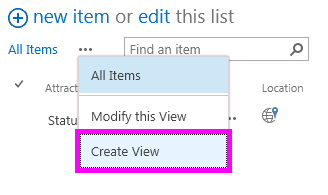
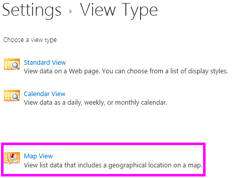
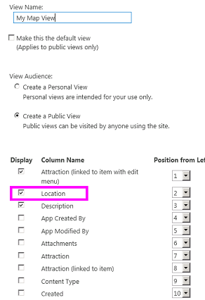
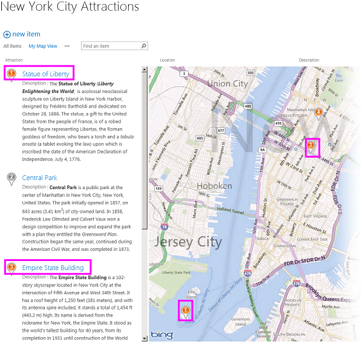
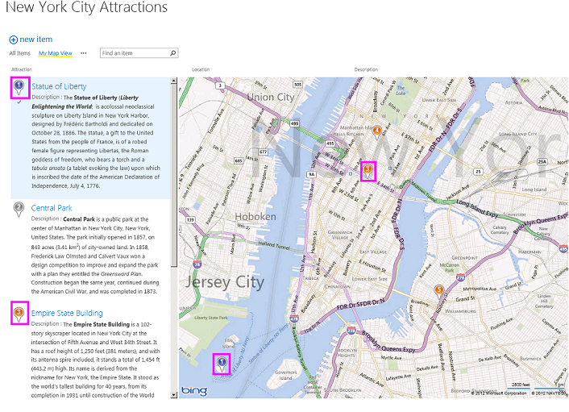
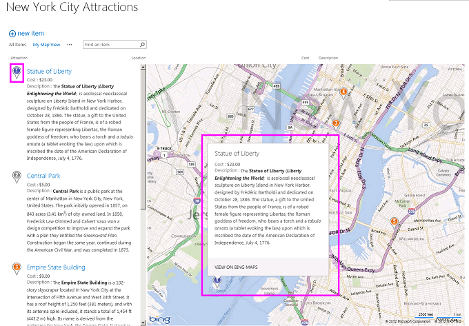

# Create a map view for the Geolocation field in SharePoint
Learn how to display location information by using a map view in SharePoint lists. You can create a map view manually via the SharePoint user interface (UI) or programmatically by using the new **Geolocation** field type.
SharePoint introduces a new field type named **Geolocation** that enables you to annotate SharePoint lists with location information. For example, you can now make lists "location-aware" and display latitude and longitude coordinates through Bing Maps. An entry is typically seen as a pushpin on a map view.
  
    
    

To display a map view in a SharePoint list, you must use the Bing Maps services. The **Geolocation** field is not available when you create a list by using the UI. Instead, this field must be inserted programmatically. For information about how to render and work with this data type programmatically, see [Integrating location and map functionality in SharePoint](integrating-location-and-map-functionality-in-sharepoint.md).
The **Geolocation** field and the map view enable you to give spatial context to any information by integrating data from SharePoint into a mapping experience in web and mobile apps. This article does not explain how to render the **Geolocation** field or provide developer guidance for creating a location-based mobile application; it does provide instruction for creating map views programmatically and from the SharePoint UI by using Bing Maps.
  
    
    

An MSI package named SQLSysClrTypes.msi must be installed on every SharePoint front-end web server to view the **Geolocation** field value or data in a list. This package installs components that implement the new geometry, geography, and hierarchy ID types in SQL Server 2008. By default, this file is installed for SharePoint Online. However, it is not installed for an on-premises deployment of SharePoint. You must be a member of the Farm Administrators group to perform this operation. To download SQLSysClrTypes.msi, see [Microsoft SQL Server 2008 R2 SP1 Feature Pack](http://www.microsoft.com/en-us/download/details.aspx?id=26728) for SQL Server 2008, or [Microsoft SQL Server 2012 Feature Pack](http://www.microsoft.com/en-us/download/details.aspx?id=29065) for SQL Server 2012 in the Microsoft Download Center.
## Prerequisites for creating a map view
<a name="SP15CreatingMapViews_Preqs"> </a>


- Access to a SharePoint list, with sufficient privileges to create a view.
    
  
- A SharePoint list that contains a **Geolocation** column
    
  
- A valid Bing Maps key set at the farm or web level, which can be obtained from the  [Bing Maps Account Center](http://www.bingmapsportal.com/)
    
    > **Important:**
      > You are responsible for compliance with terms and conditions applicable to your use of the Bing Maps key, and any necessary disclosures to users of your application regarding data passed to the Bing Maps service. 
- Visual Studio 2012 or Visual Studio 2010
    
  

## What is a map view?
<a name="SP15CreatingMapViews_AMapView"> </a>

A map view is a SharePoint view that displays a map (with data obtained from the Bing Maps service), using longitude and latitude entries from the **Geolocation** field type. When the **Geolocation** field type is available on the SharePoint list, a map view can be created either programmatically or from the SharePoint UI. In the list, SharePoint displays the location on a map powered by Bing Maps. In addition, a new view type named **Map View** displays the list items as pushpins on a Bing Maps Ajax control V7 with the list items as cards on the left pane.
  
> [!NOTE]
> Any SharePoint list can have maximum of two **Geolocation** columns in it; you won't be able to add a third **Geolocation** column in the same list. A map view can have only one **Geolocation** column. You can create multiple map views with different **Geolocation** columns.
  
    
    


## Create a map view from the SharePoint UI
<a name="SP15CreatingMapViews_FromSharePointUI"> </a>

The following steps demonstrate how to create a map view from the SharePoint UI.
  
    
    

1. Open the SharePoint list with **Geolocation** column.
    
  
2. Choose **Create view** from the ECB (Edit Control Block) menu, as shown in Figure 1.
    
   **Figure 1.Creating a view from the ECB menu**

  

  
  

  

  
3. On the **Choose a view type** page, choose **Map View**, as shown in Figure 2.
    
   **Figure 2. Choosing a view type**

  

  
  

  

  
4. After you choose a view type, you can select various fields to display in the map view, as shown in Figure 3.
    
   **Figure 3. Choosing fields for a map view**

  

  
  

    
    > [!NOTE]
    > At least one **Geolocation** field is required to create a map view. You cannot select multiple **Geolocation** fields for a map view, although you can create two different map views that use two different **Geolocation** fields.
5. After you add the required **Geolocation** field and any other field you need, choose **OK**. A map view is created, as shown in Figure 4.
    
   **Figure 4. Completed map view**

  

  
  

  

  

## Create a map view programmatically
<a name="SP15CreatingMapViews_ByProgramatically"> </a>

Follow these steps to create a map view for a SharePoint list programmatically.
  
    
    

1. Start Visual Studio.
    
  
2. On the menu bar, choose **File, New Project**. The **New Project** dialog box opens.
    
  
3. In the **New Project** dialog box, choose **C#** in the **Installed Templates** box, and then choose the **Console Application** template.
    
  
4. Give the project a name, and then choose the **OK** button.
    
  
5. Visual Studio creates the project. Add a reference to the following assemblies, and choose **OK**.
    
  - Microsoft.SharePoint.Client.dll
    
  
  - Microsoft.SharePoint.Client.Runtime.dll
    
  
6. In the default .cs file, add a **using** directive as follows.
    
     `using Microsoft.SharePoint.Client;`
    
  
7. Add the following code to the **Main** method in the .cs file.
    
    > [!NOTE]
    > The JSLink property is not supported on Survey or Events lists. A SharePoint calendar is an Events list. 

```cs
  
class Program
    {
        static void Main(string[] args)
        {
            CreateMapView ();
            Console.WriteLine("A map view is created successfully");
        }
        private static void CreateMapView()
        { 
         // Replace <Site URL> and <List Title> with valid values.
            ClientContext context = new ClientContext("<Site Url>"); 
            List oList = context.Web.Lists.GetByTitle("<List Title>");
            ViewCreationInformation viewCreationinfo = new ViewCreationInformation();
         // Replace <View Name> with the name you want for your map view.
             viewCreationinfo.Title = "<View Name>";
             viewCreationinfo.ViewTypeKind = ViewType.Html;
             View oView = oList.Views.Add(viewCreationinfo);
             oView.JSLink = "mapviewtemplate.js";
            oView.Update();
            context.ExecuteQuery();
        } 
    }
```

8. Replace  _<Site Url>_ and _<List Title>_ with valid values.
    
  
9. Navigate to the list. You should be able to see a newly created view that has the name you specified in the preceding code.
    
  

## Understand color-coded pushpins in a map view
<a name="SP15CreatingMapViews_ColorCode"> </a>

A map view providesthree colors of pushpins (as shown in Figure 5), each of which provides a difference user experience. A pushpin on the map has the same color as the pushpin of the matching item in the left pane.
  
    
    

- **Orange** Indicates that the **Geolocation** field for the item is mapped with the Bing Maps services.
    
  
- **Grey** Indicates that the **Geolocation** field for the item is empty. The item cannot be mapped with Bing Maps services, so no pushpin for this item appears on the map.
    
  
- **Blue** When a user hovers over a list item, the pushpin color changes from orange to blue. Both the pushpin in the left pane and the matching pushpin on the map change color
    
  

**Figure 5. A map view with different pushpin colors**

  
    
    

  
    
    

  
    
    
After you create a map view, all items appear as pushpins. The user can get more information about an item by hovering over a pushpin, as shown in Figure 6.
  
    
    

**Figure 6. User experience of pushpins in a map view**

  
    
    

  
    
    

  
    
    

  
    
    

  
    
    

## See also
<a name="SP15CreatingMapViews_AdditionalResources"> </a>


-  [Integrating location and map functionality in SharePoint](integrating-location-and-map-functionality-in-sharepoint.md)
    
  
-  [How to: Add a Geolocation column to a list programmatically in SharePoint](how-to-add-a-geolocation-column-to-a-list-programmatically-in-sharepoint.md)
    
  
-  [How to: Set the Bing Maps key at the web and farm level in SharePoint](how-to-set-the-bing-maps-key-at-the-web-and-farm-level-in-sharepoint.md)
    
  
-  [How to: Integrate maps with Windows Phone apps and SharePoint lists](how-to-integrate-maps-with-windows-phone-apps-and-sharepoint-lists.md)
    
  
-  [Use the SharePoint location field type in mobile applications](http://technet.microsoft.com/en-us/library/fp161355%28v=office.15%29.aspx)
    
  

