# Create a workflow with elevated permissions by using the SharePoint Workflow platform
Learn how to create a workflow with elevated permissions by using the SharePoint Workflow platform.
## SharePoint App Catalog and workflow
<a name="section1"> </a>

This article describes how to create SharePoint workflows that access objects in SharePoint that require elevated permissions. These solutions use two features: granting permissions to the workflow app and wrapping actions with the App Step.
  
    
    

> **Important:**
> This article assumes that the SharePoint Workflow platform has been installed and configured and that SharePoint has been configured for apps. For more information on SharePoint Workflow and apps for SharePoint, including installation and configuration, see  [Workflow in SharePoint](http://technet.microsoft.com/sharepoint/jj556245.aspx) and [Install and manage apps for SharePoint](http://msdn.microsoft.com/library/733647a3-a5d3-475b-967d-3bb627c2a0c2.aspx). 
  
    
    


### Overview of creating a workflow with elevated permissions

Imagine that as a SharePoint administrator, you would like to define some processes for managing user requests for purchases of apps from the Office Store. In the simplest case you want to send an acknowledgment email when a user requests an app. In addition, you could also want to add structure to the request approval process.
  
    
    
By default, workflow does not have permissions to access the app request catalog. Catalog lists in SharePoint require owner (full control) permissions. Workflows generally run at permission level equivalent to write. 
  
    
    
To solve this, you have to create a workflow with elevated permissions by doing the following in the Site Collection site:
  
    
    

1. Allow workflow to use app permissions.
    
  
2. Grant full control permission to workflow.
    
  
3. Develop the workflow to wrap actions inside an App Step.
    
  

### Allowing a workflow to use app permissions in a SharePoint site

The first step is to allow workflow to use app permissions. You configure workflow to use app permissions on the **Site Settings** page of the SharePoint site where the workflow will run. The following procedure configures the SharePoint site to allow workflow to use app permissions.
  
    
    

> **Important:**
> The procedure must be completed by a user that has **Site Owner** permissions.
  
    
    


### To allow workflow to use app permissions


1. Click the **Settings** icon as shown in the figure.
    
   **Figure: Opening the Site Settings page**

  

  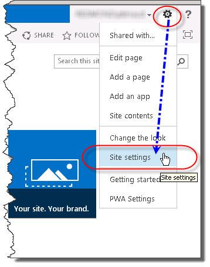
  

  

  
2. Go to **Site Settings**.
    
  
3. In the **Site Actions** section, select **Manage site features**.
    
  
4. Locate the feature called **Workflows can use app permissions**, as shown in the figure, and then click **Activate**.
    
    > **Caution:**
      > This feature will not activate unless you have properly configured the SharePoint Workflow platform and also apps for SharePoint. 

   **Figure: The site feature, 'Workflows can use app permissions'**

  

  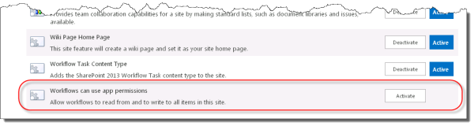
  

  

  

### Granting full control permission to a workflow

In order for the workflow to function properly it must be granted full control in the site. The following procedure grants the full control permission to the workflow.
  
    
    

> **Important:**
>  The procedure assumes the following:>  The procedure must be completed by a user that has **Site Owner** permissions.>  The workflow must already be published to the SharePoint site.
  
    
    


### To grant full control permission to a workflow


1. Click the **Settings** icon as shown in the figure.
    
   **Figure: Opening the Site Settings page**

  

  
  

  

  
2. Go to **Site Settings**.
    
  
3. In the **Users and Permissions** section, select **Site app permissions**.
    
  
4. Copy the **client** section of the **App Identifier**. This is the identifier between the last "|" and the "@" sign, as shown in the figure.
    
   **Figure: Selecting the App Identifier**

  

  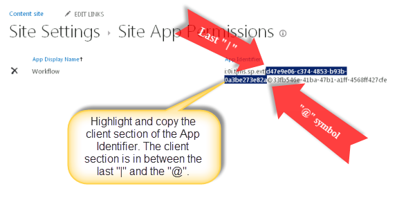
  

  

  
5. Navigate to the **Grant permission to an app** page. This must be done by browsing to the appinv.aspx page of the site.
    
    Example: http://{hostname}/{the Site Collection}/_layouts/15/appinv.aspx. 
    
    > [!NOTE]
    > The 'app' in this step refers to the Workflow app in general and not just a specific workflow. Individual workflows cannot be access controlled. When you enable app permissions you are enabling for all workflows within the Site Collection. 

    For more information about setting up a workflow, see  [Blog article from Sympraxis Consulting: Looping Through Content in a SharePoint Site Workflow](http://sympmarc.com/2016/01/14/looping-through-content-in-a-sharepoint-site-workflow-part-1-introduction)
    
    The following figure shows an example.
    

 **Figure: The appinv.aspx page and URL example**

  

  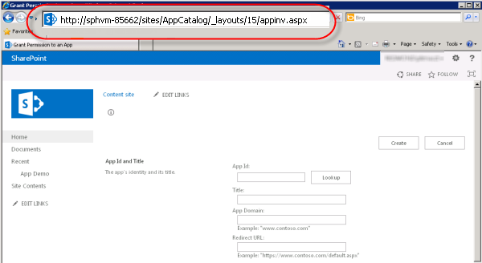
  

  
6. Paste the client id in the **App Id** field and then click **Lookup**, as shown in the figure.
    
  
7. Paste the following **Permissions Request** XML to grant full control permission.
    
``` xml 
<AppPermissionRequests>
    <AppPermissionRequest Scope="http://sharepoint/content/sitecollection/web" Right="FullControl" />
</AppPermissionRequests>

```


> **Caution:**
> There are no placeholders in the **Scope** value above. It is a literal value. Enter it exactly as it appears here.

  The following figure shows an example of the completed page.
    

  **Figure: Looking up an App Id**

  

  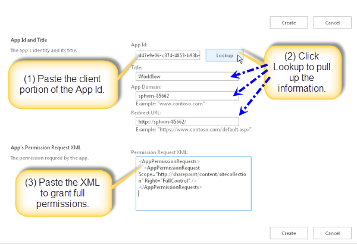


8. Click **Create**.
    
  
9. You will then be asked to trust the Workflow app, as shown in the figure. Click **Trust It**.
    
  **Figure: Trust the Workflow app**

  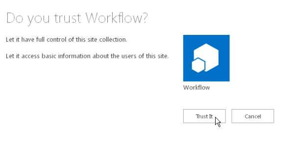
  
### Wrapping actions inside an App Step

Finally, you need to wrap the workflow actions inside an App Step. The following procedure wraps a **Send an Email** action inside an App Step. The workflow in this example sends an acknowledgement email message from a custom list.
  
    
    

### To wrap actions inside an App Step


1. Open the App Catalog site in SharePoint Designer 2013.
    
  
2. Create a new Custom List on which to run the workflow. In this example the list name is **App Demo**.
    
  
3. Click **Workflows** in the navigation window.
    
  
4. Create a new List Workflow for the App Demo list, as shown in the figure.
    
  **Figure: Create a new List workflow**

  

  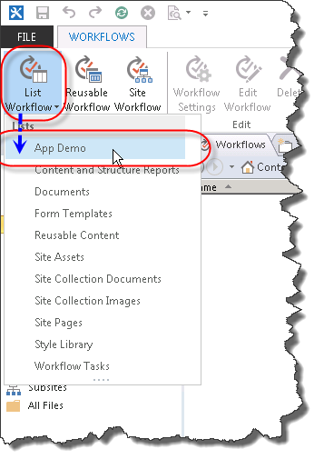
  

  

  
5. Insert an **App Step**, as shown in the figure.
    
  **Figure: Add an App Step**

  

  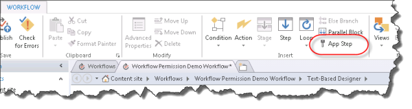
  

  

  
6. Insert a **Send an Email** action in the **App Step**.
    
  
7. Click the **address book** button. In the **To** field select **Workflow lookup for a user** and click **add** as shown in the figure.
    
  **Figure: Select Workflow lookup for a user**

  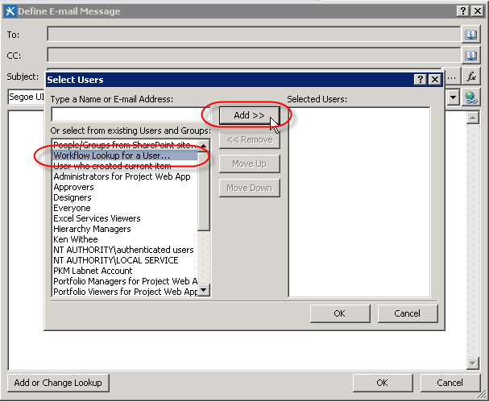
  

8. Enter the **Created By** field as the lookup value, as shown in the figure.
    
  **Figure: Lookup for Person dialog box**

  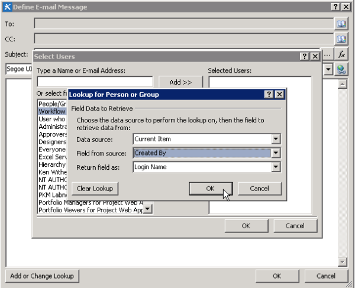
  
9. Enter Email from App Demo list in the email message body.
    
  
10. Click **OK** to return to the workflow. The completed workflow is shown in the figure.
    
  **Figure: Email action in App Step**

  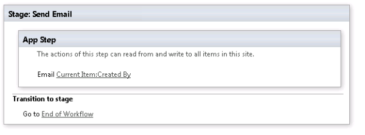
    
11. Click the **Workflow Settings** icon in the ribbon, as shown in the figure.
    
  **Figure: Workflow Settings icon in ribbon**

  

  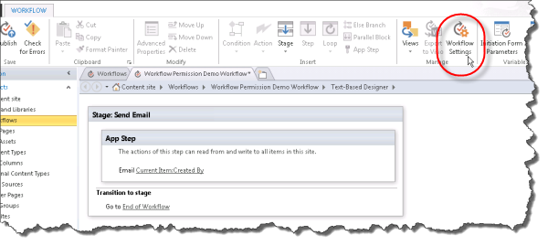
  

  

  
12. Clear the check box next to **Automatic updates to workflow status to the current stage name**, and then click **Publish**, as shown in the figure.
    
  **Figure: Clear the automatic updates check mark and then publish**

  

  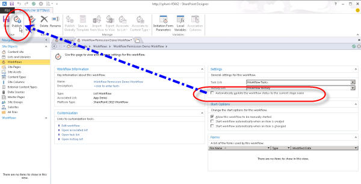
  


## Understanding how it works
<a name="section2"> </a>

To understand why elevating permissions for a workflow is required, consider that workflows are fundamentally apps for SharePoint and they follow the same authorization rules of the app model. The default configuration for workflow is that the effective permissions of the workflow are an intersection of user permissions and the app permissions, as shown in the figure.
  
    
**Figure: Permissions diagram**

  
    
    

  
    
    

  
    
    
There are two reasons why it is necessary to elevate permissions to create a workflow in the App Request list. These are:
  
    
    

- By default, workflow only has write permission.
    
  
- The user has no permissions.
    
  
The first step to solve this problem is to allow the application to authorize by using only its identity and ignoring that of the user. This is done by enabling the App Step feature. The second step grants full control permission to the workflow. 
  
    
    
The following diagram illustrates the change in permissions
  
    
    

**Figure: Permissions matrix**

  
    
    

  
    
    
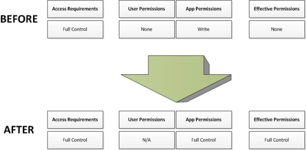
  
    
    

  
    
    

  
    
    

## See also
<a name="section3"> </a>


-  [Workflow in SharePoint ](http://technet.microsoft.com/en-us/sharepoint/jj556245.aspx)
    
  
-  [Install and manage apps for SharePoint](http://msdn.microsoft.com/library/733647a3-a5d3-475b-967d-3bb627c2a0c2.aspx)
    
  
-  [What's new in workflow in SharePoint](http://msdn.microsoft.com/library/6ab8a28b-fa2f-4530-8b55-a7f663bf15ea.aspx)
    
  
-  [Getting started with SharePoint workflow](http://msdn.microsoft.com/library/cc73be76-a329-449f-90ab-86822b1c2ee8.aspx)
    
  
-  [Workflow development in SharePoint Designer and Visio](workflow-development-in-sharepoint-designer-and-visio.md)
    
  
-  [Workflow actions quick reference (SharePoint Workflow platform)](workflow-actions-quick-reference-sharepoint-workflow-platform.md)
    
  
-  [Blog article from the SharePoint Designer team: Workflow package and deploy scenario](http://blogs.msdn.com/b/sharepointdesigner/archive/2012/08/30/packaging-list-site-and-reusable-workflow-and-how-to-deploy-the-package.aspx)
    
  
-  [Blog article from Sympraxis Consulting: Looping Through Content in a SharePoint Site Workflow](http://sympmarc.com/2016/01/14/looping-through-content-in-a-sharepoint-site-workflow-part-1-introduction)
    
  

