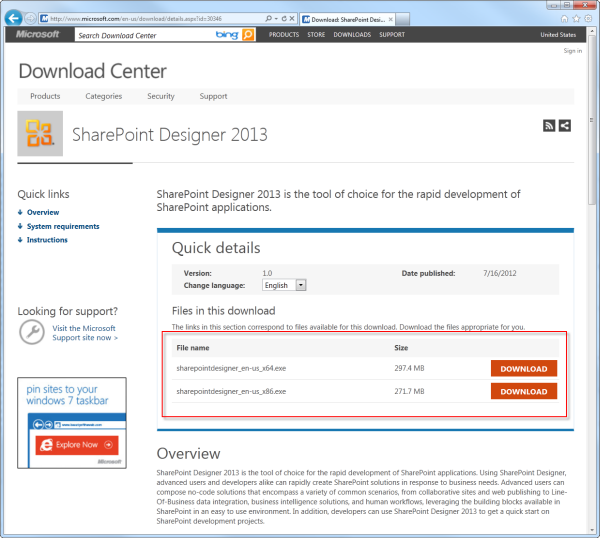
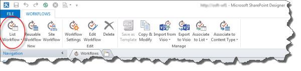
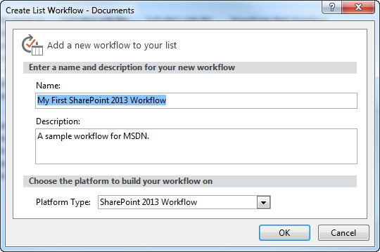

# Creating a workflow by using SharePoint Designer 2013 and the SharePoint Workflow platform
Learn how to install, open, and create a workflow by using SharePoint Designer 2013 and the SharePoint Workflow platform. 
   

## Install SharePoint Designer 2013

SharePoint Designer 2013 is a free download. To download and install SharePoint Designer 2013 follow these steps: 
  
    
    

### To install SharePoint Designer 2013

1. Open your web browser and navigate to the Microsoft Download Center:  [http://www.microsoft.com/download](http://www.microsoft.com/download.aspx). 
    
  
2. Type SharePoint Designer 2013 in the search field.
    
  
3. Click the link for "SharePoint Designer 2013". 
    
  
4. Read the overview, system requirements, and installation instructions. Make sure your system is compatible. 
    
  
5. Select your platform type: 64-bit ( **x64**) or 32-bit ( **x86**) as shown in the figure. 
    
  
6. Follow the instructions to install SharePoint Designer 2013.
    
  

**Figure: SharePoint Designer 2013 download page**

  
    
    

  
    
    

  
    
    

  
    
    

  
    
    

## Open SharePoint Designer 2013 and connect to a SharePoint site

SharePoint Designer 2013 installs as an Office 2013 application. To open SharePoint Designer 2013 and connect to a SharePoint site follow these steps: 
  
    
    

### To open SharePoint Designer 2013 and connect to a SharePoint site

1. Open SharePoint Designer 2013 by selecting it on the **Start** menu. Click **Start** icon, click **All Programs**, click **Microsoft Office 2013**, and then click **SharePoint Designer 2013**. 
    
  
2. Click **Open Site** on the SharePoint Designer 2013 start page.
    
  
3. Enter the SharePoint site that you want to connect to. For example, http://www.contoso.com/sites/a-sharepoint-site.
    
  
4. Click **Open** to open the site.
    
  
5. Enter your credentials, if prompted. (If security is not integrated with the computer you signed in on then you are prompted to enter your credentials.) Make sure to use credentials that have access to the SharePoint site.
    
  

## Create a List workflow based on the SharePoint Workflow platform

SharePoint Designer 2013 can be used for many important tasks. The navigational pane is used to switch between different aspects of SharePoint Designer 2013. To create a new List workflow based on the SharePoint Workflow platform, follow these steps:
  
    
    

### To create a workflow based on the SharePoint Workflow platform

1. Click the Workflows node in the Navigation pane.
    
  
2. Click the **List Workflow** drop-down in the **New** section of the ribbon, as shown in the figure.
    
  
3. Select the list that you want to associate with the new workflow.
    
  
4. On the **Create List Workflow** dialog box, enter a name and description for the workflow and then make sure that the **Platform Type** is set to **SharePoint Workflow**, as shown in the figure.
    
    > **Note:**
      > If you do not see SharePoint Workflow as an available platform type then Workflow Manager is not configured to work with the SharePoint farm. 
5. Click **OK** to create the workflow.
    
  

**Figure: The ribbon button for creating a new list workflow**

  
    
    

  
    
    

  
    
    

  
    
    

  
    
    

**Figure: Create List Workflow dialog box**

  
    
    

  
    
    

  
    
    

  
    
    

  
    
    
Now that the workflow is created, you can add Actions, Conditions, Stages, Steps, and Loops to build your workflow. These workflow components are available in the ribbon of SharePoint Designer 2013, as shown in the figure. 
  
    
    

**Figure: Workflow items for the SharePoint Workflow platform**

  
    
    

  
    
    

  
    
    

    
> **Note:**
> The above procedure is used to create a List workflow. A Reusable workflow or Site workflow can be created using the same procedure with the following modification. Instead of selecting the List Workflow button in the ribbon select the **Reusable Workflow** or **Site Workflow** button when creating the workflow.
  
    
    

To learn more about the available components of workflow development, see  [Workflow actions quick reference (SharePoint Workflow platform)](workflow-actions-quick-reference-sharepoint-workflow-platform.md).
  
    
    

## Additional resources

-  [What's new in workflow in SharePoint](http://msdn.microsoft.com/library/6ab8a28b-fa2f-4530-8b55-a7f663bf15ea.aspx)
    
  
-  [Getting started with SharePoint workflow](http://msdn.microsoft.com/library/cc73be76-a329-449f-90ab-86822b1c2ee8.aspx)
    
  
-  [Workflow development in SharePoint Designer and Visio](workflow-development-in-sharepoint-designer-and-visio.md)
    
  

  
    
    

