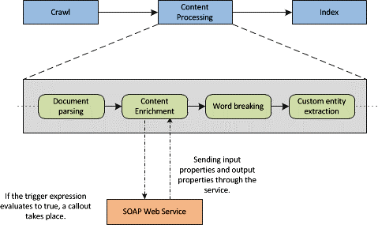

# Custom content processing with the Content Enrichment web service callout
Learn about the content enrichment web service callout in SharePoint that enables developers to create an external web service to modify managed properties for crawled items during content processing.
Search in SharePoint enables users to modify the managed properties of crawled items before they are indexed by calling out to an external content enrichment web service. The ability to modify managed properties for items during content processing is helpful when performing tasks such as data cleansing, entity extraction, classification, and tagging.
  
    
    


**Figure 1. Content enrichment within content processing**

  
    
    

  
    
    

  
    
    
Figure 1 shows a part of the process that takes place in the content processing component. The content enrichment web service is a SOAP-based service that you can create to receive a callout from the web service client inside the content processing component. Based on Figure 1, the web service client refers to the Content Enrichment operator inside the content processing component; theweb service refers to the SOAP web service that you implement.The web service receives a configurable payload from the content processing component. Then, the resulting response from the web service is merged into the crawled item before it is added to the search index. The web service client works with managed properties that you can configure as input properties or as output properties. Input properties are sent to the web service; output properties are returned by the web service. Certain managed properties are hidden or are read-only and can't be sent to the web service or received from the web service. See  [How to list all read-only managed properties for the Content Enrichment web service](#SP15contentprocess_read-only_managed_properties) for information about how to verify which managed properties are read-only.
    
> **Important:**
> The content enrichment callout step can only be configured with a single web service endpoint. Any kind of fault tolerance, or routing capabilities to support multiple implementations must be handled by the developer implementing the web service. In addition, the developer may have various web service implementations hosted at different endpoints; however, at any given time, only one of these endpoints can be used in the configuration. 
  
    
    


## Content enrichment web service contract
<a name="SP15webservcallout_enrich"> </a>

The web service client is a SOAP (version 1.1) RPC client with a predefined behavior. The web service contract has the following characteristics:
  
    
    

- The content processing component sends a SOAP RPC call to a configurable endpoint over HTTP.
    
  
- The payload contains an array of property objects.
    
  
- The web service performs some custom logic on the array of property objects, and returns an array of modified or new property objects.
    
  
- The web service must send a response to the web service client within a given timeout.
    
  
- No specific authentication or encryption mechanisms are supported as part of the contract. You can, however, apply your own security on the transport mechanism.
    
  

## Configuring the Content Enrichment web service client
<a name="content_enrichment_configuration"> </a>

To configure the web service client, you use the following Windows PowerShell cmdlets:
  
    
    

-  [Get-SPEnterpriseSearchContentEnrichmentConfiguration](http://technet.microsoft.com/en-us/library/jj219783%28office.15%29.aspx)
    
  
-  [Set-SPEnterpriseSearchContentEnrichmentConfiguration](http://technet.microsoft.com/en-us/library/jj219659%28office.15%29.aspx)
    
  
-  [Remove-SPEnterpriseSearchContentEnrichmentConfiguration](http://technet.microsoft.com/en-us/library/jj219742%28office.15%29.aspx)
    
  
-  [New-SPEnterpriseSearchContentEnrichmentConfiguration](http://technet.microsoft.com/en-us/library/jj219502%28office.15%29.aspx)
    
  
Table 1 lists the properties you can configure through the Windows PowerShell cmdlets mentioned previously.
  
    
    

**Table 1. Properties that are configurable for the client by using Windows PowerShell cmdlets**


|**Configuration property**|**Description**|**Default value**|
|:-----|:-----|:-----|
|**Endpoint** <br/> |Specifies the URL of the external web service.  <br/> |Empty.  <br/> |
|**InputProperties** <br/> |The managed properties that the external web service receives.  <br/> |Empty.  <br/> |
|**OutputProperties** <br/> |The managed properties that the external web service returns.  <br/> |Empty.  <br/> |
|**Timeout** <br/> |The amount of time until the web service times out in milliseconds.  <br/> Depending on **FailureMode**, the item fails to be processed or a warning is written to the ULS log. <br/> |5000 milliseconds; Valid range [100, 30000].  <br/> |
|**SendRawData** <br/> |Enables or disables sending raw data to the web service.  <br/> |False.  <br/> |
|**MaxRawDataSize** <br/> |The maximum size of raw data sent to the web service in kilobytes (KB). If the binary data of an item exceeds this limit, the item is not sent. This does not prevent the **InputProperties** from being sent, and the **OutputProperties** from being received. <br/> |5120 kilobytes.  <br/> |
|**FailureMode** <br/> |Controls the behavior of the web service client when errors occur. When **FailureMode** is set to **ERROR**, any problems that occur during content enrichment processing send a failed callback for that particular item.  <br/> When **FailureMode** is set to **WARNING**, the item is indexed, without any modifications by the web service and a warning is written to the ULS log.  <br/> |Error.  <br/> |
|**DebugMode** <br/> |A mode that when set to **true** enables the content enrichment client to send all managed properties to the client without expecting any properties in return. Any configured **Trigger** property, **InputProperties** property, and **OutputProperties** property are ignored. <br/> |False.  <br/> |
|**Trigger** <br/> |A **Boolean** predicate that is executed on every crawled item. If the predicate evaluates to **true**, the record is sent to the web service. Otherwise, the item is passed through to the search index. <br/> |Empty.  <br/> |
   

### How to list all read-only managed properties for the Content Enrichment web service
<a name="SP15contentprocess_read-only_managed_properties"> </a>

Certain managed properties are read-only and cannot be output from the web service. These properties can be listed by using the  [Get-SPEnterpriseSearchServiceApplication](http://technet.microsoft.com/en-us/library/ff608050%28office.15%29.aspx) and [Get-SPEnterpriseSearchMetadataManagedProperty](http://technet.microsoft.com/en-us/library/ff607560%28office.15%29.aspx)Windows PowerShell cmdlets, shown in the following example:
  
    
    

```

$ssa = Get-SPEnterpriseSearchServiceApplication
Get-SPEnterpriseSearchMetadataManagedProperty -SearchApplication $ssa  | ?{$_.IsReadOnly -or $_.MappingDisallowed -or $_.DeleteDisallowed}

```


## About trigger conditions for configuring the web service callout
<a name="SP15contentprocess_trigger"> </a>

A trigger condition is an expression that is used to configure the web service callout. If a trigger condition evaluates to **true**, the web service client performs a callout for that record. If a trigger condition evaluates to **false**, the web service client does not perform a callout and passes the crawled item to the search index. Alternatively, if no trigger condition is configured; all items are sent to the web service.
  
    
    
Trigger conditions use an expression language to refer to the values of managed properties. You can use the operators and functions in the expression language to build simple or complex trigger conditions so you can determine when to perform a web service callout. 
  
    
    
Table 2 lists examples of trigger conditions.
  
    
    

**Table 2. Trigger condition examples for configuring the Content Enrichment web service callout**


|**Expression**|**Description**|**Requirements**|
|:-----|:-----|:-----|
|MP1 > 2  <br/> |Returns **true** if the value of the managed property named MP1 is greater than 2. <br/> |MP1 must have a numeric type.  <br/> |
|IsNull(MP2)  <br/> |Returns **true** if the managed property named MP2 is not present for the crawled item or is empty/null. <br/> |MP2 can be of any type.  <br/> |
|StartsWith(MP1, "sample") AND MP2 != 18  <br/> |Returns **true** if the value in the managed property MP1 starts with "sample" and the value of managed property MP2 is not 18. <br/> |MP1 must be of type **string** and MP2 must be a numeric type. <br/> |
|IsDay(MP1, 2009, 12, 24)  <br/> |Checks whether the managed property MP1 contains a **DateTime** that falls on December 24, 2009. <br/> |MP1 must be of type **DateTime**.  <br/> |
   
See  [Trigger expressions syntax in SharePoint](trigger-expressions-syntax-in-sharepoint.md) for the elements that can be used in a trigger expression and a list of supported functions.
  
    
    

## Implementing the Content Enrichment external web service
<a name="SP15contentprocess_implement"> </a>

For a basic implementation, do the following: 
  
    
    

1. Include the **Microsoft.Office.Server.Search.ContentProcessingEnrichment.dll** located in `C:\\Program Files\\Microsoft Office Servers\\15.0\\Search\\Applications\\External` in your project as a reference.
    
  
2. Implement **IContentProcessingEnrichmentService** as a web service.
    
  

## See also
<a name="bk_addresources"> </a>


-  [Configure search in SharePoint](configure-search-in-sharepoint.md)
    
  
-  [Custom content processing with the Content Enrichment web service callout](custom-content-processing-with-the-content-enrichment-web-service-callout.md)
    
  

