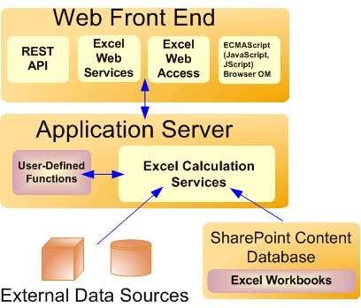

---
title: Excel Services Architecture
ms.date: 09/25/2017
keywords: excel services design
f1_keywords:
- excel services design
ms.prod: sharepoint
ms.assetid: e0349b4a-2d52-46c4-a167-801e9c24eaca
---

# Excel Services Architecture

Excel Services is part of Microsoft SharePoint Server 2010. Excel Services is built on ASP.NET and SharePoint Foundation technologies. Following are the core components in Excel Services:
  
    
    

- Excel Web Access
    
  
- Excel Web Services
    
  
- User-defined functions (UDFs)
    
  
- ECMAScript (JavaScript, JScript)
    
  
- Representational State Transfer (REST) service
    
  
- Excel Calculation Services
    
> [!NOTE]
> Microsoft Excel Online, part of Office Online, also supports Excel workbooks in the browser. For more information about Excel Online, see  [documentation about Office Web Apps](https://technet.microsoft.com/en-us/library/ee855124.aspx). 
  
    
    

The Excel Web Access, Excel Web Services, UDFs, JavaScript, the REST service, and Excel Calculation Services components can be divided into two major groups: the components on a front-end server (also known as the "Web front end") and the component on a back-end application server.
**Components of a Web front end and a back-end application server**

  
    
    

  
    
    

  
    
    

  
    
    

  
    
    

## Web Front-End Servers and Back-End Application Servers

The Excel Web Access, Excel Web Services, UDFs, JavaScript, the REST service, and Excel Calculation Services components can be divided into components on the Web front-end server and components that live on a back-end application server. The Web front end includes Excel Web Access, JavaScript, the REST service, and Excel Web Services. The Excel Calculation Services component resides on the back-end application server, alongside any UDF assemblies that an administrator has added.
  
    
    
In the simplest configuration in SharePoint Server 2010—that is, a single computer running SharePoint Server 2010 as a stand-alone installation—all five components are installed on the same computer. However, in a typical enterprise environment with a large number of users, the components on the Web front-end server and the components on the back-end application server are on different computers in a farm configuration. It is possible to scale out the Web front-end server independently from the back-end application server. For example, you can have more Web front-end servers or more back-end application servers, depending on your organizational needs.
  
    
    
For information about Excel Services topology, scalability, performance, and security, see the SharePoint Server 2010 documentation on  [TechNet](http://technet.microsoft.com/en-us/library/cc303422%28office.14%29.aspx). 
  
    
    

## Excel Web Access

Excel Web Access is a viewer page and an Excel Services web part that you can add to any web parts page in SharePoint Server 2010. Excel Web Access renders (in other words, creates the HTML for) live Excel workbooks on a Web page, and enables the user to interact with those workbooks and explore them. Excel Web Access is the visible Excel Services component for the user. You can use Excel Web Access like any other web part in SharePoint Server 2010. Excel Web Access does not require the user to install anything on the client computer.
  
    
    
The Excel Web Access web part properties are also customizable. For more information, see the **Microsoft.Office.Excel.Server.WebUI** namespace reference documentation.
  
    
    

## Excel Web Services

Excel Web Services is the Excel Services component that provides programmatic access to its Web service. You can develop applications that call Excel Web Services to calculate, set, and extract values from workbooks, and to refresh external data connections. By using Excel Web Services, you can incorporate server-side workbook logic into an application, automate the updating of Excel workbooks, and create application-specific user interfaces around server-side Excel calculation. 
  
> [!NOTE]
> When you make changes to a workbook—for example, by setting values to a range by using Excel Web Services—the changes to the workbook are preserved only for that session. The changes are not saved or persisted back to the original workbook. When the current workbook session ends (for example, when you call the **CloseWorkbook** method, or when the session times out), the changes that you made are lost.> If you want to save changes that you make to a workbook, you can use the **GetWorkbook** method, and then save the workbook. For more information, see [Microsoft.Office.Excel.Server.WebServices](https://msdn.microsoft.com/library/Microsoft.Office.Excel.Server.WebServices.aspx) . You can also open the workbook in edit mode and save the changes.
  
    
    

For more information about Excel Web Services, see  [Excel Services Development Roadmap](excel-services-development-roadmap.md).
  
    
    

## User-Defined Functions (UDFs)

Excel Services UDFs enable you to use formulas in a cell to call custom functions that are written in managed code and deployed to SharePoint Server 2010. For more information about UDFs in Excel Services, see  [Understanding Excel Services UDFs](understanding-excel-services-udfs.md).
  
    
    

## ECMAScript (JavaScript, JScript)

The JavaScript object model in Excel Services enables developers to customize, automate, and drive the Excel Web Access web part control on a page. By using the JavaScript object model, you can build mashups and other integrated solutions that interact with one or more Excel Web Access web part controls on a page or an **iframe** with script on the page. It also enables you to add more capabilities to your workbooks and code around them.
  
    
    
For more information about the JavaScript object model in Excel Services, see the  [Ewa](http://msdn.microsoft.com/library/6fe73191-3213-b986-1ad6-2c3b918a2241%28Office.15%29.aspx) namespace reference documentation.
  
    
    

## REST API

The REST API in Excel Services enables you to access workbook parts or elements directly through a URL. The URL contains a "marker" path, which is the entry point to an .aspx page, to the workbook file location, and to the path to the requested element inside the workbook. 
  
    
    
The discovery mechanisms built into the Excel Services REST API enables developers and users to explore the content of a workbook manually or programmatically. 
  
    
    
For more information about the REST API in Excel Services, see  [Excel Services REST API](excel-services-rest-api.md). 
  
    
    

## Excel Calculation Services

The role of Excel Calculation Services is to load workbooks, calculate workbooks, call custom code (UDFs), and refresh external data. It also maintains the session state for interactivity. Excel Calculation Services maintains a session for the duration of interactions with the same workbook by a user or caller. A session is closed when the caller explicitly closes it or when the session times out on the server. Excel Services caches the opened Excel workbooks, calculation states, and external data query results, for improved performance when multiple users access the same set of workbooks.
  
    
    

## Load-Balancing

In multiple-server configurations, Excel Services load-balances requests across multiple Excel Calculation Services occurrences in a farm configuration. If your installation includes multiple application servers, Excel Services will balance the load in an attempt to help ensure that no single application server is overloaded by requests.
  
    
    
Administrators can configure the load-balancing behavior.
  
    
    

## See also

#### Concepts

  
    
    
 [Excel Services Overview](excel-services-overview.md)
  
    
    
 [Excel Services Development Roadmap](excel-services-development-roadmap.md)
  
    
    
 [Supported and Unsupported Features](supported-and-unsupported-features.md)
#### Other resources

  
    
    
 [Walkthrough: Developing a Custom Application Using Excel Web Services](walkthrough-developing-a-custom-application-using-excel-web-services.md)
