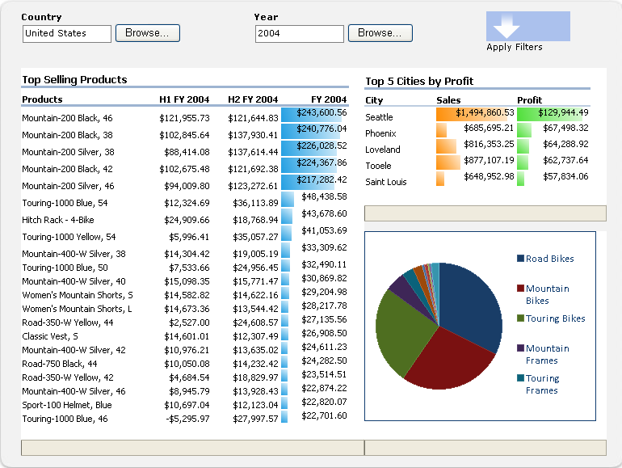
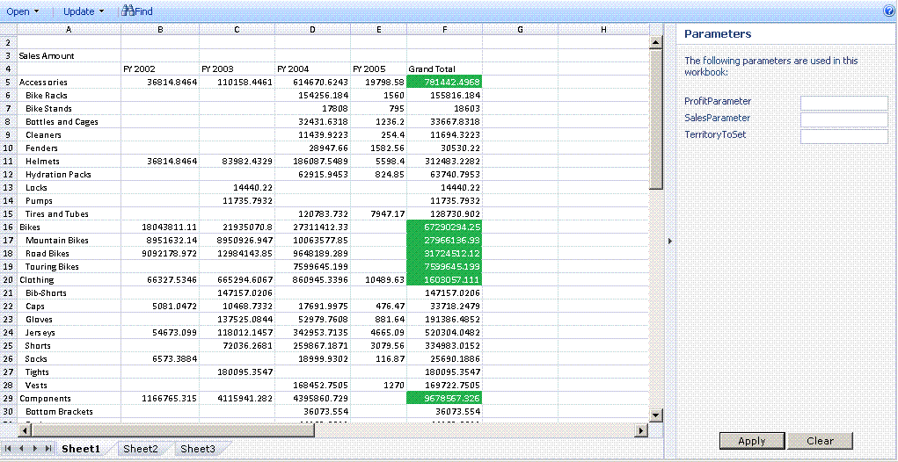

# Excel Services Overview

Excel Services is a service application that enables you to load, calculate, and display Microsoft Excel workbooks on Microsoft SharePoint 2013. Excel Services was first introduced in Microsoft Office SharePoint Server 2007.
  
    
    

By using Excel Services, you can reuse and share Excel workbooks on SharePoint 2013 portals and dashboards. For example, financial analysts, business planners, or engineers can create content in Excel and share it with others by using an SharePoint 2013 portal and dashboard—without writing custom code. You can control what data is displayed, and you can maintain a single version of your Excel workbook. 
There are four primary interfaces for Excel Services: 
  
    
    

- An Excel Web Access Web Part, which enables you to view and interact with a live workbook by using a browser 
    
  
- Excel Web Services for programmatic access
    
  
- An ECMAScript (JavaScript, JScript) object model for automating and customizing, and to drive the Excel Web Access control and help build more compelling, integrated solutions as well as the ability to user user-defined functions to extend the ECMAScript (JavaScript, JScript) object model
    
  
- A Representational State Transfer (REST) API for accessing workbook parts directly through a URL
    
  

> **Note:**
> The Excel Interactive View feature has been disabled. For information about removing this feature from your website, see  [Removing Excel Interactive View from a webpage](removing-excel-interactive-view-from-a-webpage.md). 
  
    
    

You can also extend Excel Calculation Services by using user-defined functions (UDFs).
> **Note:**
> For more information about Excel Calculation Services, see  [Excel Services Architecture](excel-services-architecture.md). 
  
    
    

By using Excel Services, you can view live, interactive workbooks by using only a browser. This means that you can save Excel workbooks and interact with them from within portal sites.You can also interact with Excel-based data by sorting, filtering, expanding, or collapsing PivotTables, and by passing in parameters; this provides the ability to perform analysis on published workbooks. You can interact with a workbook without changing the published workbook—which is valuable for report authors and report consumers.Excel Services supports workbooks that are connected to external data sources. You can embed connection strings to external data sources in the workbook or save them centrally in a data connection library file.You can also make selected cells in worksheets editable by making them named ranges (parameters). Items that you choose to make viewable, when you save to Excel Services, appear in the **Parameters** pane in Excel Web Access. You can change the values of these named ranges in the **Parameters** pane and refresh the workbook. You can also use the portal's filter Web Part to filter several Web Parts (Excel Web Access and other types of Web Parts) together.However, you cannot use Excel Services to create new workbooks or to edit existing workbooks. To author a workbook for use with Excel Services, you can use Microsoft Excel 2013.
> **Note:**
> Microsoft Excel Online, part of Office Online, also supports Excel workbooks in the browser. For more information about Excel Online, see  [Get started with the new Office](http://office.microsoft.com/en-us/support/getting-started-with-office-FX102809998.aspx). 
  
    
    

Excel Services also has a Web service. You can use Excel Web Services to load workbooks, set values in cells and ranges, refresh external data connections, calculate worksheets, and extract calculated results (including cell values, the entire calculated workbook, or a snapshot of the workbook). In SharePoint 2013, you can also save, save a copy, and participate in collaborative editing sessions by using Excel Web Services.
> **Note:**
> For more information about snapshots, see  [How to: Get an Entire Workbook or a Snapshot](how-to-get-an-entire-workbook-or-a-snapshot.md). 
  
    
    

Excel Services supports UDFs, which you can use to extend the capabilities of Excel Calculation Services—for example, to implement custom calculation libraries or to read data from Web services and data sources that are not natively supported by Excel Services.Excel Services is designed to be a scalable, robust, enterprise-class server that provides feature and calculation fidelity with Excel.
## Scenarios and Features

Excel Services supports many different scenarios and features, some of which are described in this section. 
  
    
    

### Business Intelligence Portal and Workbook Analysis

A business intelligence portal displays scorecards and reports, and enables users to explore data by using only a browser. The **BI Center** feature in SharePoint Server includes a business intelligence portal and dashboard functionalities. Figure 1 shows a report center dashboard with a library of reports, a chart, and Key Performance Indicators (KPIs) already set up.
  
    
    
Excel Services also enables you to calculate data on the server. Excel Services participates in the **BI Center** by providing the ability to calculate and expose Excel-based content on integrated BI dashboards.You can display an Excel workbook by using the Excel Web Access Web Part, connect to external data sources, and further interact with the data in the workbook.
  
    
    
 Figure 1 shows a dashboard with a filter Web Part, and Excel workbooks displayed by using Excel Web Access Web Parts.
  
    
    

**Figure 1. Dashboard with filtering and Excel content**

  
    
    

  
    
    

  
    
    
In addition to participating in integrated dashboards, Excel Services can also be used to display all or part of Excel workbooks to enable users to interact with that content in the familiar Excel user interface. Figure 2 shows a range being displayed, and cells being exposed for user input through parameters. Designating specific cells as parameters enables users to change values in those cells in a worksheet by using the edit boxes in the right pane. Excel Services then recalculates the worksheet based on the new values.
  
    
    
If you want to use certain functionalities in Excel or if you want to analyze a workbook by using all Excel functionalities, you can open a workbook in Excel by clicking **Open in Excel**. You can also open a workbook in Excel to print it and to work offline.
  
    
    

    
> **Note:**
> To open a workbook by using the **Open in Excel** command, you must have "open" rights. For more information, see the next section, **Managing Workbooks**, and  [User Permissions and Permission Levels](http://technet.microsoft.com/en-us/library/cc721640%28office.14%29.aspx) on [TechNet](http://technet.microsoft.com/en-us/library/cc263215%28office.14%29.aspx). Users who do not have "open" rights can still open a snapshot in Excel. 
  
    
    

**Figure 2. Using the Parameters pane**

  
    
    

  
    
    

  
    
    
You can also analyze, pivot, and interact with data by using Excel Web Access.
  
    
    
For more information about Excel Services and business intelligence capability in SharePoint 2013, see the business intelligence documentation in SharePoint Server Help. 
  
    
    

### Managing Workbooks

The workbook management and lockdown capabilities of Excel Services enable you to:
  
    
    

- Maintain only one copy of a workbook, that is created and changed by a trusted author in a central, secure place, instead of maintaining multiple copies on each user's computer. The correct version of the worksheet is easier to find, share, and use from within Excel, SharePoint, and other applications. 
    
  
- Secure and protect workbook models and back-end data. You can give users view-only rights to limit access to the workbook. For example, you can prevent users from opening a workbook by using Excel or you can control what they are allowed to view in a workbook. Users can have browser-based access to the content in a workbook that the author wants to share, but no ability to open the workbook in the Excel client, view formulas, or view supporting content or other intellectual property that may be in the workbook. 
    
  
- Create snapshots of a workbook.
    
  
Excel Services is optimized for many users and many workbooks. It can also help load-balance calculation across the server farm.
  
    
    
For more information about managing workbooks by using Excel Services, see the SharePoint Server documentation on  [TechNet](http://technet.microsoft.com/en-us/library/ee424405%28office.14%29.aspx) or SharePoint Server Help.
  
    
    

### Programmatic Access through Custom .NET Applications

You can create custom applications—for example, ASP.NET applications—that:
  
    
    

- Call Excel Web Services to access, parameterize, and calculate workbooks.
    
  
- Open, refresh external data, set cells or ranges, recalculate, participate in collaborative editing sessions with other applications or people, save, and save as. 
    
  
- Use custom workflows to schedule calculation operations or send e-mail notifications. (This uses SharePoint capabilities and is not a native part of Excel Services.)
    
  

### User-Defined Functions (UDFs)

You can also use Excel Services UDFs, which enable you to use formulas in a cell to call custom functions that are written in managed code and deployed to SharePoint Server.
  
    
    
For more information about UDFs in Excel Services, see  [Understanding Excel Services UDFs](understanding-excel-services-udfs.md).
  
    
    

### ECMAScript (JavaScript, JScript)

You can also use the JavaScript object model in Excel Services to automate, customize, and drive the Excel Web Access Web Part control. You can use the JavaScript object model to build more compelling and integrated solutions.
  
    
    

### JavaScript user-defined functions (UDFs)

New in Microsoft Excel Services and Microsoft SharePoint 2013, ECMAScript (JavaScript, JScript) UDFs enable you to add custom functions to Excel when you are using an embedded Excel workbook with OneDrive or an Excel Web AccessExcel Web Access Web Part in SharePoint. Besides the built-in functions that you use in Excel, you can add your own, custom functions using JavaScript UDFs that you can call from inside formulas in .
  
    
    
JavaScript UDFs are similar to  [UDFs](http://msdn.microsoft.com/en-us/library/ms499792.aspx) that you can create for Microsoft Excel. The difference is that JavaScript UDFs are only used in workbooks embedded in a webpage and only exist on that web page.
  
    
    

### JavaScript Object Model

The Excel Services JSOM API now includes the following:
  
    
    

- The ability to reload the embedded workbook. Now you can reset the embedded workbook to the data in the underlying workbook file.
    
  
- User-created floating objects. The EwaControl object has new methods that let you add/remove floating objects that you create.
    
  
- More control over viewable area of the Ewa control.
    
  
- SheetChanged Event. This event raises when something changes on a sheet, such as updating cells, deleting or clearing cells, copying, cutting or pasting ranges, and undo/redo actions.
    
  
- Enabling data validation. You can now validate data that is entered by a user.
    
  

### REST API

You can use the REST API in Excel Services to access workbook parts or elements directly through a URL. The discovery mechanisms built into the Excel Services REST API enable developers and users to explore the content of the workbook manually or programmatically. 
  
    
    
For more information about the REST API in Excel Services, see  [Excel Services REST API](excel-services-rest-api.md).
  
    
    

### REST ODATA

New in Microsoft Excel Services and Microsoft SharePoint 2013, by using the new OData functionality in the Excel Services REST API, you can request the tables inside an Excel workbook as OData. For example, to request Excel metadata about available resources in the SampleWorkbook.xlsx workbook using a REST call, you use the following syntax.
  
    
    
http://\<ServerName\>/_vti_bin/ExcelRest.aspx/Docs/Documents/SampleWorkbook.xlsx/model For more information about the REST API, see the 
  
    
    
 [Excel Services 2010 REST API](http://msdn.microsoft.com/en-us/library/ee556413.aspx) documentation in the SharePoint 2013 SDK documentation.
  
    
    
To request metadata about available resources in the SampleWorkbook.xlsx workbook using OData, use the same REST syntax, except replace /Model with /Odata as in the following request. 
  
    
    
http://\<ServerName\>/_vti_bin/ExcelRest.aspx/Docs/Documents/sampleWorkbook.xlsx/OData
  
    
    
From there you can use OData system query options to get specific information about tables inside the workbook.
  
    
    

## Additional resources

-  [Excel Services Development Roadmap](excel-services-development-roadmap.md)
    
  
-  [Excel Services Architecture](excel-services-architecture.md)
    
  
-  [JavaScript user-defined functions overview](javascript-user-defined-functions-overview.md)
    
  
-  [Using OData with Excel Services REST in SharePoint 2013](using-odata-with-excel-services-rest-in-sharepoint.md)
    
  
-  [Walkthrough: Developing a Custom Application Using Excel Web Services](walkthrough-developing-a-custom-application-using-excel-web-services.md)
    
  
-  [Frequently Asked Questions About Excel Services UDFs](frequently-asked-questions-about-excel-services-udfs.md)
    
  
-  [Unsupported Features in Excel Services](http://msdn.microsoft.com/library/5868e672-4786-4fed-9168-07ff538f6f5c%28Office.15%29.aspx)
    
  
-  [Excel Services Blogs, Forums, and Resources](excel-services-blogs-forums-and-resources.md)
    
  

