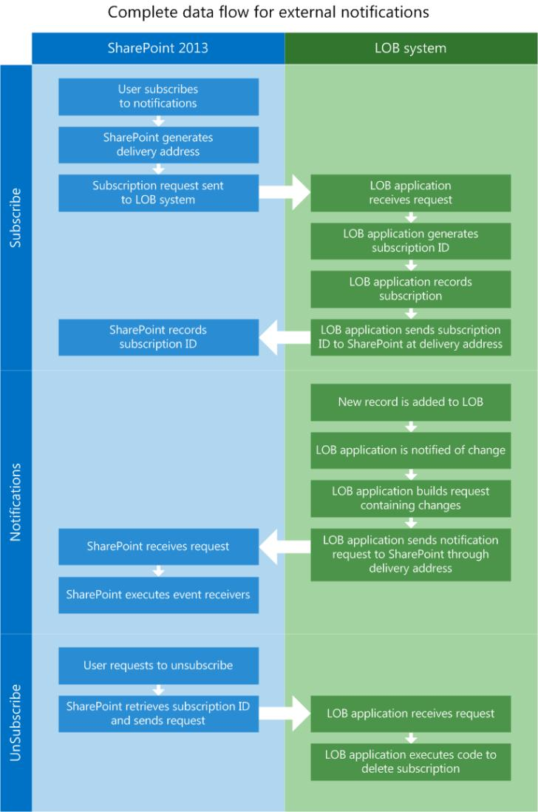
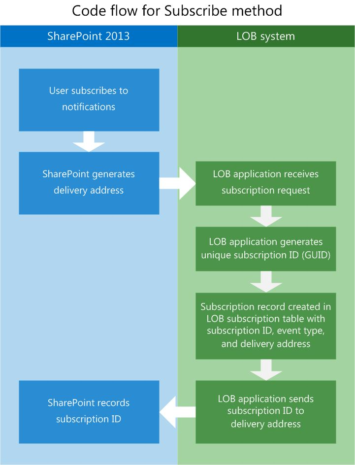
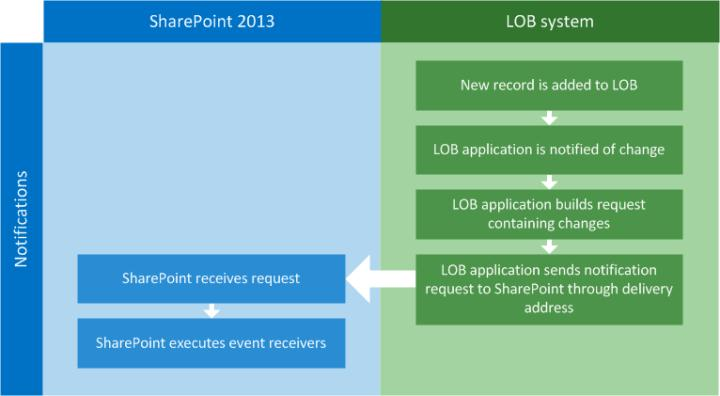
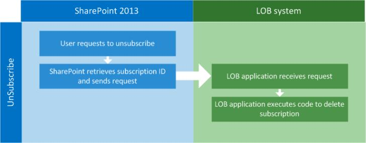

# External events and alerts in SharePoint
Learn the concepts behind creating remote event receivers in SharePoint that can be attached to external lists and execute when the external data that the list represents is updated.
## What are event receivers?
<a name="Externalevents_overview"> </a>

An event receiver is a piece of managed code that responds to SharePoint triggering events such as adding, moving, deleting, checking in, and checking out. When these events occur, and the event receiver's criteria are met, the code that you write to provide additional functionality is executed. When SharePoint objects, such as lists, workflows and features, are configured to wait on these events to occur, they are called event hosts. 
  
    
    
Event receivers let you perform business logic when a specific event occurs. Essentially, these are the hooks where you can create code to handle certain conditions, make notifications, update other systems, and so on. When you create event receivers, a DLL is generated. You can place that DLL into the global assembly cache, so that the event receivers are invoked in response to any changes in an external system.
  
    
    
The following example contains a simple external event receiver in C# that executes when a new item is added to the list.
  
    
    


```cs

public class EntryContentEventReceiver : SPItemEventReceiver
{
   public override void ItemAdded(SPItemEventProperties properties)
   {
      base.ItemAdded(properties);

      // properties.ExternalNotificationMessage holds the message sent by the external 
      // system.
   }
```

External event receivers can also be extended to work against an entity event receiver and as remote event receivers deployed as a service on-premise or in Microsoft Azure. 
  
    
    

## What are remote event receivers?
<a name="WhatIsARemoteEventReceiver"> </a>

Remote event receivers are new for SharePoint. In a traditional SharePoint solution, you use an event receiver to handle events such as users creating or deleting lists or items in lists. In an SharePoint Add-in, you use a remote event receiver to handle similar events. Remote event receivers work similarly to regular event receivers, except that remote event receivers handle events that occur when an SharePoint Add-in is on a different system from its host web application.
  
    
    
Business Connectivity Services (BCS) uses remote event receivers attached to external lists and entities to allow you to write code that can react to changes in data hosted in the external system.
  
    
    
To accommodate this, two stereotypes have been added to the schema of the BDC model: **EventSubscriber** and **EventUnsubscriber**.
  
> [!NOTE]
> Event receivers are not supported in sandboxed solutions. 
  
    
    


## What features and capabilities does the new external event receiver infrastructure provide?
<a name="FeaturesAddedWithRER"> </a>

By using and extending the SharePoint event receiver features, BCS is able to add alerts, external list event receivers, and entity receivers to provide extended functionality.
  
    
    

- **Alerts:** Alerts have been an integral part of SharePoint for several versions, but until SharePoint, they would not work with external lists. Now a user can create alerts on an external list that have the same behavior as alerts on a standard SharePoint list.
    
  
- **External list event receivers:** Event receivers can now be attached to external lists just like they can for standard lists. This provides an extensibility mechanism that lets you write code that is executed at specific times.
    
  
- **Entity event receivers:** Entity event receivers provide flexibility by letting you write more robust code that allows other operations like providing user context for filtering data. This can allow better personalization and customized security.
    
  
Remote eventing in SharePoint makes several interesting scenarios possible. For example, you might have a "Sales Lead Tracking" application that lets a sales team be notified when new sales leads are entered into an external lead application. When a new sales lead is entered, SharePoint is notified through the notification system that is part of the lead application. SharePoint receives the notification and then creates new tasks for the specified salespeople to follow up on each new lead. By configuring the sales lead entry application on the external system to send a notification to SharePoint on the creation of each new lead, SharePoint is kept completely up to date.
  
    
    

## Prerequisites for using event receivers for external lists
<a name="bkmk_Prerequisites"> </a>

To use event receivers for external lists, you need the following:
  
    
    

- SharePoint
    
  
- Visual Studio 2012
    
  
For more information about setting up a SharePoint development environment, see  [Set up a general development environment for SharePoint](set-up-a-general-development-environment-for-sharepoint.md).
  
    
    

## Configure the external system to notify SharePoint of external events
<a name="Externalevents_components"> </a>

For external events to work, a number of components have to be installed and configured on both the SharePoint host and the external system.
  
    
    
You have to configure the external system so that it can do the following:
  
    
    

- **Determine when underlying data changes.** For the external system to know when changes have been made, you have to create a mechanism for polling for specific changes. You can do this by using a timed service that polls the data source at specific intervals.
    
  
- **Receive and record requests for subscriptions to change notifications.** The external system has to implement a subscription store so that it can store who should receive change notifications. The simplest solution is probably a database table. The table (or whatever mechanism you choose) should record SubscriptionID, Delivery Address, Event Type, and Entity Name.
    
  
- **Post notifications to Representational State Transfer (REST) endpoints.** To let SharePoint subscribers know that a change has occurred, the external system application needs to send an HTTP WebRequest to the delivery address recorded in the subscription store. This delivery address is a RESTful endpoint generated by SharePoint during the subscription process.
    
  

## Configure SharePoint to allow communication with external systems
<a name="bkmk_configureSP"> </a>

To allow communication with the external system, SharePoint must be configured with the following:
  
    
    

- A BDC model with **EventSubscriber** and **EventUnsubscriber** stereotypes configured
    
  
- Event receivers
    
  

### How is external eventing enabled?

You can enable external eventing in SharePoint through **Site Settings** or by adding the following custom feature id to your project
  
    
    

```XML

<ActivationDependency FeatureTitle="BCSEvents" FeatureId="60c8481d-4b54-4853-ab9f-ed7e1c21d7e4" />
```

Eventing for an external system is enabled when SharePoint creates the delivery address and sends it to the external system during the Subscribe process.
  
    
    

## Overall flow of external eventing between SharePoint and external systems
<a name="bkmk_overallflow"> </a>

In Figure 1, notice that there are three distinct steps involved when using external event receivers: subscribe, notification, and unsubscribe.
  
    
    

**Figure 1 Complete data flow for external notifications**

  
    
    

  
    
    

  
    
    

  
    
    

  
    
    

## EventSubscriber: subscribe to notifications
<a name="bkmk_eventsubscriber"> </a>

For a user (SharePoint object) to receive notifications when the underlying data has changed, the user must subscribe to the notifications for an entity. To allow this, the BDC Model schema has been extended to include the **Subscribe** stereotype. The **Subscribe** stereotype is used by SharePoint to let the external system know that the sender is requesting to be notified of changes to the underlying data.
  
    
    
Figure 2 demonstrates the flow of information between SharePoint and the external system during the Subscribe process.
  
    
    

**Figure 2. Subscribe process flow**

  
    
    

  
    
    

  
    
    
The following describes the general flow of the subscription process:
  
    
    

  
    
    

1. **User requests a subscription for notifications.** Using a custom user interface (a button on a page or a ribbon), SharePoint initiates a request to the external system app for notifications.
    
  
2. **SharePoint generates a delivery address.** As part of the Subscribe process, SharePoint creates a REST endpoint where notifications will be delivered.
    
  
3. **Subscription request is sent to the external system.** SharePoint then encapsulates the requestor information along with the dynamically generated REST URL, and sends a web request to the external system.
    
  
4. **External system receives request.** There are different possibilities for implementing a subscription store. In this example, you will use a SQL Server database table.
    
  
5. **External system generates a subscriptionId.** A new **subscriptionId** is generated using code in the line-of-business (LOB) application. The **subscriptionId** should be a GUID.
    
  
6. **External system records the subscription.** The external system application records the **subscriptionId**, delivery address, event type, and other information sent from SharePoint into the subscription store.
    
  
7. **External system sends the subscriptionId back to SharePoint.** For SharePoint to correctly route the updates that are sent by the external system, the **subscriptionId** is sent back to SharePoint and SharePoint records that information in its database.
    
    The BDC model is working against a **Subscribe** function import. The metadata for function import is shown in this example.
    


```XML
  FunctionImport
 
<EntityType Name="EntitySubscribe">
   <Key>
      <PropertyRef Name="SubscriptionId" />
   </Key>
   <Property Name="SubscriptionId" Type="Edm.Int32" Nullable="false" 
      p6:StoreGeneratedPattern="Identity" 
      xmlns:p6="http://schemas.microsoft.com/ado/2009/02/edm/annotation" />
   <Property Name="EntityName" Type="Edm.String" MaxLength="250" FixedLength="false" 
      Unicode="true" />
   <Property Name="DeliveryURL" Type="Edm.String" MaxLength="250" FixedLength="false" 
      Unicode="true" />
   <Property Name="EventType" Type="Edm.Int32" />
   <Property Name="UserId" Type="Edm.String" MaxLength="50" FixedLength="false" 
      Unicode="true" />
   <Property Name="SubscribeTime" Type="Edm.Binary" MaxLength="8" FixedLength="true" 
      p6:StoreGeneratedPattern="Computed" 
      xmlns:p6="http://schemas.microsoft.com/ado/2009/02/edm/annotation" />
   <Property Name="SelectColumns" Type="Edm.String" MaxLength="10" FixedLength="false" 
      Unicode="true" />
</EntityType>

```


### Code example: BDC model with Subscribe

The following is an example of a BDC model with the **Subscribe** method added.
  
    
    

```XML

<Method Name="SubscribeCustomer" DefaultDisplayName="Customer Subscribe" IsStatic="true">
   <Properties>
     <Property Name="ODataEntityUrl" Type="System.String">/EntitySubscribes</Property>
     <Property Name="ODataHttpMethod" Type="System.String">POST</Property>
     <Property Name="ODataPayloadKind" Type="System.String">Entry</Property>
     <Property Name="ODataFormat" Type="System.String">application/atom+xml</Property>
     <Property Name="ODataServiceOperation" Type="System.Boolean">false</Property>
   </Properties>
   <AccessControlList>
      <AccessControlEntry Principal="NT Authority\\Authenticated Users">
         <Right BdcRight="Edit" />
         <Right BdcRight="Execute" />
         <Right BdcRight="SetPermissions" />
         <Right BdcRight="SelectableInClients" />
      </AccessControlEntry>
   </AccessControlList>
   <Parameters>
      <Parameter Direction="In" Name="@DeliveryURL">
         <TypeDescriptor TypeName="System.String" Name="DeliveryURL" >
            <Properties>
               <Property Name="IsDeliveryAddress" Type="System.Boolean">true</Property>
            </Properties>
         </TypeDescriptor>
      </Parameter>
      <Parameter Direction="In" Name="@EventType">
         <TypeDescriptor TypeName="System.Int32" Name="EventType" >
            <Properties>
               <Property Name="IsEventType" Type="System.Boolean">true</Property>
            </Properties>
         </TypeDescriptor>
      </Parameter>
      <Parameter Direction="In" Name="@EntityName">
         <TypeDescriptor TypeName="System.String" Name="EntityName" >
            <DefaultValues>
               <DefaultValue MethodInstanceName="SubscribeCustomer" 
                  Type="System.String">Customers</DefaultValue>
            </DefaultValues>
      </TypeDescriptor>
    </Parameter>
    <Parameter Direction="In" Name="@SelectColumns">
      <TypeDescriptor TypeName="System.String" Name="SelectColumns" >
        <DefaultValues>
          <DefaultValue MethodInstanceName="SubscribeCustomer" Type="System.String">*</DefaultValue>
        </DefaultValues>
      </TypeDescriptor>
    </Parameter>
    <Parameter Direction="Return" Name="SubscribeReturn">
      <TypeDescriptor Name="SubscribeReturnRootTd" TypeName="Microsoft.BusinessData.Runtime.DynamicType">
        <TypeDescriptors>
          <TypeDescriptor Name="SubscriptionId" TypeName="System.String" >
            <Properties>
              <Property Name="SubscriptionIdName" Type="System.String">Default</Property>
            </Properties>
            <Interpretation>
              <ConvertType LOBType="System.Int32" BDCType="System.String"/>
            </Interpretation>
          </TypeDescriptor>
          <TypeDescriptor Name="DeliveryURL" TypeName="System.String" />
          <TypeDescriptor Name="SelectColumns" TypeName="System.String" >
          </TypeDescriptor>
          <TypeDescriptor Name="EntityName" TypeName="System.String" />
          <TypeDescriptor Name="EventType" TypeName="System.Int32" />
          <TypeDescriptor Name="UserId" TypeName="System.String" />
          <!--TypeDescriptor Name="SubscribeTime" TypeName="System." /-->
        </TypeDescriptors>
      </TypeDescriptor>
    </Parameter>
  </Parameters>
  <MethodInstances>
    <MethodInstance Type="EventSubscriber" ReturnParameterName="SubscribeReturn" ReturnTypeDescriptorPath="SubscribeReturnRootTd" Default="true" Name="SubscribeCustomer" DefaultDisplayName="Customer Subscribe">
      <AccessControlList>
        <AccessControlEntry Principal="NT Authority\\Authenticated Users">
          <Right BdcRight="Edit" />
          <Right BdcRight="Execute" />
          <Right BdcRight="SetPermissions" />
          <Right BdcRight="SelectableInClients" />
        </AccessControlEntry>
      </AccessControlList>
    </MethodInstance>
  </MethodInstances>
</Method>
```

Table 1 lists the important attributes of the BDC model that are needed to make the **Subscribe** stereotype work.
  
    
    

**Table 1. BDC model attributes**


|**Attribute**|**Description**|
|:-----|:-----|
|**IsDeliveryAddress** <br/> |A **Boolean** flag used on a **TypeDescriptor** to indicate whether the delivery address provided is to be used to deliver notifications. <br/> |
|**IsEventType** <br/> |A **Boolean** flag used on a **TypeDescriptor** to indicate whether the event type provided is to be used as the event type. Valid event types are **ItemAdded**, **ItemUpdated**, **ItemDeleted**, and so on.  <br/> |
|**SubscriptionIdName** <br/> |A string used on a **TypeDescriptor** that represents the name of a **subscriptionId** part. <br/> |
   

## Notifications
<a name="bkmk_notifications"> </a>

In SharePoint, the event-handling infrastructure has been enhanced to allow external data sources to notify SharePoint when information in the external system has been modified. Then, when SharePoint receives a notification, event receivers that are associated with the SharePoint external list or entity can execute code to perform specified actions.
  
    
    
When a subscription is created, the external system needs a way to tell SharePoint about the changes that have occurred on a particular entity. The external system is expected to deliver notifications to the delivery address as provided by SharePoint to the external system during the Subscribe process using an OData Atom-formatted payload.
  
    
    
Figure 3 shows the communication flow between the external system and SharePoint when a new record is added to the data in the external system.
  
    
    

**Figure 3 Notification process**

  
    
    

  
    
    

  
    
    

  
    
    

1. **New record is added to external system.** In this example, a new record is added to the external system using the application user interface or directly into the database.
    
  
2. **External system application is notified of the change.** The external system application has to be made aware of the changes that are happening to the underlying data. There are a number of ways to do this. You can use SQL triggers that fire when data changes on specific tables, or you can create a polling mechanism to query the data store for changes. There are other ways to accomplish this, but each will have to be evaluated with performance in mind.
    
  
3. **External system sends notification request to SharePoint through delivery address.** To communicate the changes, an Atom-formatted request has to be sent to the delivery address that is stored in the LOB application's subscription store.
    
  

### Notification payload

In constructing the notification, the LOB system has to create an HTTP payload that includes either the full details of the item that changed, or just the identity of the item that changed.
  
    
    

- **Identity:** When the payload is sent as an identity, the payload is expected to have only information about the identity of the changed item. For example, for a customer in a Customers entity, the payload would only contain the ID of the customer that has changed.
    
  
- **Full item:** In this case, the payload is an entire record that has changed in the external system. In the customer example, the entire changed customer record is included.
    
> [!NOTE]
> The full item is only supported when you use the OData connector. 
  
    
    

The type of payload that is being sent by the external system must be indicated during the subscription process.
  
    
    
The following is an example of the BDC model property used for notifications.
  
    
    


```XML

<Property Name="NotificationParserType" Type="System.String">
   ODataEntryContentNotificationParser
</Property>

```

If it is not specified, the default payload is an identity payload.
  
    
    

### Notification delivery address (virtual address)

The subscription process initiated from SharePoint results in a virtual address being created by SharePoint, allowing an entry point for the external system to post notifications. The delivery address is used by the external system to post those notifications. The delivery address is also passed to the external system during the subscription request.
  
    
    

## EventUnsubscriber: remove subscription from the notifications list
<a name="bkmk_eventunsubscriber"> </a>

The **Unsubscribe** operation removes a subscription from the notifications list.
  
    
    
 Figure 4 shows that the **UnSubscribe** method is much simpler. Because the subscription ID was sent back to SharePoint, and SharePoint recorded it, all that is needed is to send the UnSubscribe request with the correct subscription ID.
  
    
    

**Figure 4 Code flow for UnSubscribe method**

  
    
    

  
    
    

  
    
    

### BDC model for Unsubscribe

The following XML example shows how you can create a BDC model that unsubscribes from the external system event notifications.
  
    
    

```XML

<Method Name="UnSubscribeExpenseReport" DefaultDisplayName="ExpenseReport
    Unsubscribe">
    <Properties>
        <Property Name="ODataEntityUrl" Type="System.String">
            /Subscriptions(@ID)</Property>
        <Property Name="ODataHttpMethod" Type="System.String">DELETE</Property>
        <Property Name="ODataPayloadKind" Type="System.String">Property</Property>
        <Property Name="ODataServiceOperation" Type="System.Boolean">false</Property>
    </Properties>
    <AccessControlList>
        <AccessControlEntry Principal="NT Authority\\Authenticated Users">
            <Right BdcRight="Edit" />
            <Right BdcRight="Execute" />
            <Right BdcRight="SetPermissions" />
            <Right BdcRight="SelectableInClients" />
        </AccessControlEntry>
    </AccessControlList>
    <Parameters>
        <Parameter Name="@ID" Direction="In">
            <TypeDescriptor Name="ID" TypeName="System.Int32">
                <Properties>
                    <Property Name="SubscriptionIdName" Type="System.String">ID</Property>
                </Properties>
                <Interpretation>
                    <ConvertType LOBType="System.Int32" BDCType="System.String" />
                </Interpretation>
            </TypeDescriptor>
        </Parameter>
    </Parameters>
    <MethodInstances>
        <MethodInstance Name="UnSubscribeExpenseReport" DefaultDisplayName="ExpenseReport 
             Unsubscribe" Type="EventUnsubscriber" Default="true">
            <AccessControlList>
                <AccessControlEntry Principal="NT Authority\\Authenticated Users">
                    <Right BdcRight="Edit" />
                    <Right BdcRight="Execute" />
                    <Right BdcRight="SetPermissions" />
                    <Right BdcRight="SelectableInClients" />
                </AccessControlEntry>
            </AccessControlList>
        </MethodInstance>
    </MethodInstances>
</Method>


<Method IsStatic="false" Name="Unsubscribe">
    <AccessControlList>
        <AccessControlEntry Principal="NT AUTHORITY\\Authenticated Users">
            <Right BdcRight="Edit" />
            <Right BdcRight="Execute" />
            <Right BdcRight="SetPermissions" />
            <Right BdcRight="SelectableInClients" />
        </AccessControlEntry>
    </AccessControlList>
    <Parameters>
        <Parameter Direction="In" Name="subscriptionId">
            <TypeDescriptor TypeName="System.String" Name="subscriptionId" 
                IsSubscriptionId="true" />
         </Parameter>
    </Parameters>
    <MethodInstances>
        <MethodInstance Type="EventUnsubscriber" Default="true" Name="Unsubscribe" 
            DefaultDisplayName="UnSubscriber">
            <Properties>
                <Property Name="LastDesignedOfficeItemType" Type="System.String">None</Property>
            </Properties>
            <AccessControlList>
                <AccessControlEntry Principal=" NT AUTHORITY\\Authenticated Users ">
                    <Right BdcRight="Edit" />
                    <Right BdcRight="Execute" />
                    <Right BdcRight="SetPermissions" />
                    <Right BdcRight="SelectableInClients" />
                </AccessControlEntry>
            </AccessControlList>
        </MethodInstance>
    </MethodInstances>
</Method>

```


## Code example: Attach an event receiver to an external list
<a name="AttachingRER"> </a>

The following code provides an example of how to attach an event receiver to an external list. After it is attached, the event receiver listens for notifications from the external system about updates, additions, and deletions that are performed on the native data.
  
    
    

```XML

private static void AddEventReceiver(string siteUrl, string listTitle)
{ 
   string assembly = "SampleEventReceiver, Culture=neutral, Version=1.0.0.0, 
      PublicKeyToken=1bfafa687d2e46a7";
   string className = "SampleEventReceiver.EntryContentEventReceiver"; 
   
   try
   {
      using (SPSite site = new SPSite(siteUrl)) 
      { 
         using (SPWeb web = site.OpenWeb()) 
         {
            SPList list = web.Lists[listTitle]; 
            list.EventReceivers.Add(SPEventReceiverType.ItemAdded, 
               assembly, className); 
         }
      }
   }
   catch (Exception e) 
   { 
      Console.WriteLine(e); 
   }
}

```


## Beyond the basics: Learn more about using external event receivers
<a name="Externalevents_Learnmore"> </a>

For more information about external events and alerts, see the following.
  
    
    

**Table 2. Advanced concepts for working with external event receivers**


|**Article**|**Description**|
|:-----|:-----|
| [How to: Create an OData data service for use as a BCS external system](how-to-create-an-odata-data-service-for-use-as-a-bcs-external-system.md) <br/> |Learn how to create an Internet-addressable Windows Communication Foundation (WCF) service that uses OData to send notifications to SharePoint when the underlying data changes. These notifications are used to trigger events that are attached to external lists.  <br/> |
   

## See also
<a name="Externalevents_Addres"> </a>


-  [What's new in Business Connectivity Services in SharePoint](what-s-new-in-business-connectivity-services-in-sharepoint.md)
    
  
-  [Business Connectivity Services in SharePoint](business-connectivity-services-in-sharepoint.md)
    
  
-  [Business Connectivity Services programmers reference for SharePoint](business-connectivity-services-programmers-reference-for-sharepoint.md)
    
  
-  [How to: Create external event receivers](how-to-create-external-event-receivers.md)
    
  

