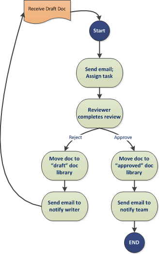
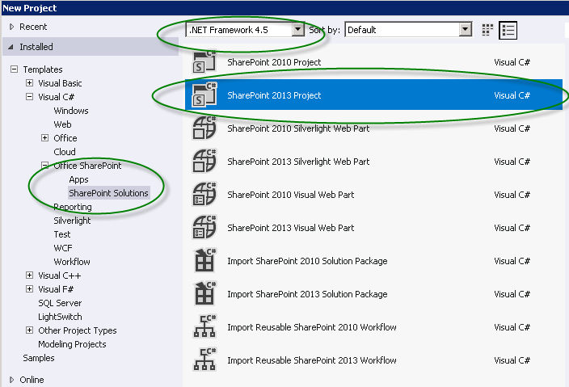
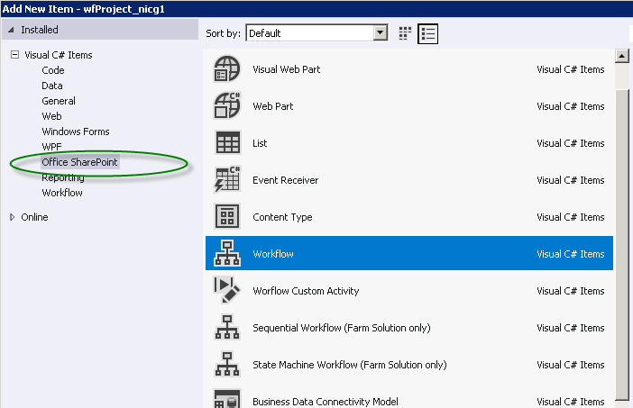
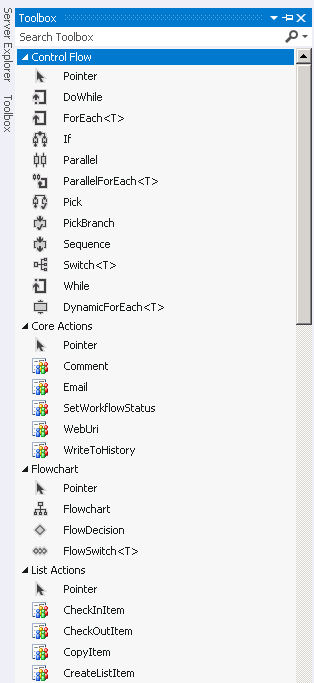

# Get started with workflows in SharePoint
Learn about the newly engineered Workflow Manager Client 1.0, which provides the infrastructure for workflows in SharePoint, and how SharePoint workflows are integrated with the new model for SharePoint Add-ins.
> **Important:**
> For instructions on setting up and configuring SharePoint and Microsoft Azure, see  [Set up and configure SharePoint Workflow Manager](set-up-and-configure-sharepoint-workflow-manager.md). 
  
    
    

## Overview of workflows in SharePoint

Workflows in SharePoint allow you to model and automate business processes. These business processes can be as simple as a document approval process with a single approver (shown in Figure 1), as complex as customer-facing product catalog using web service calls and database support, or as formidable as virtually any structured business process, full of conditions, loops, user inputs, tasks, and custom actions.
  
    
    

**Figure 1. Simple SharePoint workflow**

  
    
    

  
    
    

  
    
    

  
    
    
SharePoint marks the introduction of Workflow Manager Client 1.0 as the powerful new foundation for Visual Studio workflows. Build on Windows Workflow Foundation 4, Workflow Manager Client 1.0 provides advantages over previous versions that reflect the commitment of SharePoint to the model for SharePoint Add-ins and cloud-based computing. For details of these changes, see  [What's new in workflows for SharePoint](what-s-new-in-workflows-for-sharepoint.md) and [SharePoint workflow fundamentals](sharepoint-workflow-fundamentals.md).
  
    
    
Perhaps most importantly for workflow authors, the way that your create workflows has been vastly improved and simplified. Not only are workflows now entirely declarative (that is, designer-based, no-code workflows), but the primary workflow authoring environments, both Visual Studio 2012 and SharePoint Designer 2013, have been simplified and streamlined.
  
    
    
The key enhancements to workflows in SharePoint include the following. For a more detail overview of what's new in workflows for SharePoint, see  [What's new in workflows for SharePoint](what-s-new-in-workflows-for-sharepoint.md).
  
    
    

- Enhanced connectivity to enable cloud-based execution of workflows. In fact, there is 100 percent parity in SharePoint between on-premises and Office 365 -based workflows.
    
  
- There is full interoperability in SharePoint with SharePoint 2010 workflows, which is enabled by using the  [SharePoint workflow interop ](sharepoint-workflow-fundamentals.md#bkm_InteropBridge).
    
  
- Enhanced authoring expressiveness by using Visual Studio events and action, web services, and classic programming structures, all in a declarative, no-code environment.
    
  
- Scalability and robustness that is consistent with requirements for Office 365 and the Cloud App Model.
    
  
- Enhanced connectivity to promote highly functional integrated systems. You can call and control your workflows from any external system. Additionally, your workflow can make web service calls to any stream or data source using common protocols like HTTP, SOAP, the Open Data protocol (OData), and Representational State Transfer (REST).
    
  
- Enhanced authoring capabilities for the non-developer in SharePoint Designer 2013, and the ability to compose workflow logic in Visio.
    
  
- Enhanced, and yet simplified, workflow development in Visual Studio, including support for custom workflow actions, rapid development in a declarative environment, single-step deployment, and support for developing SharePoint Add-ins.
    
  
- Full support for workflow-powered SharePoint Add-ins, where workflows function as the middle tier for business process management.
    
  

## Workflow Manager Client 1.0 and the model for SharePoint Add-ins

Visual Studio 2012 is optimized for developing workflow-driven SharePoint Add-ins and for exploiting the enormous power and flexibility of the model for SharePoint Add-ins. You can use the SharePoint workflow object model to enable workflow logic underneath a SharePoint app in such a way that end users experience the app surface itself while underneath the app is driven by your workflow logic.
  
    
    
Additionally, Visual Studio 2012 is ideal for developing Office Add-ins, which can run workflows from inside a Microsoft Office application.
  
    
    

## Authoring SharePoint workflows

There are two primary authoring environments for Workflow Manager Client 1.0: SharePoint Designer 2013 and Visual Studio. Additionally, non-technical information workers can use Visio to construct workflow logic that you can then import into SharePoint Designer and assemble into a SharePoint workflow project.
  
    
    
However, the primary authoring environments are Visual Studio 2012 and SharePoint Designer 2013. To help you decide which of these best suits your needs, see the decision matrix in  [Comparing SharePoint Designer with Visual Studio](develop-sharepoint-workflows-using-visual-studio.md#bkm_Comparing).
  
    
    

## SharePoint Designer 2013 as workflow authoring tool

In many respects, SharePoint Designer 2013 is the authoring tool of choice for SharePoint workflows. Although some advanced tasks (like creating custom actions, for example) require the intervention of a developer using Visual Studio, SharePoint Designer 2013 provides the most flexible access to workflow development to the widest range of workflow authors.
  
    
    

## Create a workflow using Visual Studio 2012

Visual Studio 2012 has SharePoint workflow project types built in. To create a SharePoint workflow project in Visual Studio, follow these steps.
  
    
    

### To create a workflow using Visual Studio

1. Open Visual Studio 2012 and create a new project. In the **New Project** dialog box, choose **Templates**, **Visual C#**, **Office SharePoint**, **SharePoint Solutions**, and **SharePoint Project**, as shown in Figure 2.
    
   **Figure 2. New Project dialog box**

  

  
  

  

  
2. With the project created, choose **Add New Item** on the **Project** menu, and then choose **Workflow** under the **Office SharePoint** item, as shown in Figure 3.
    
   **Figure 3. Add New Item dialog box**

  

  
  

  

  
3. After the workflow project is created, you are presented with a designer surface on which to create your workflow. The workflow development environment includes a custom toolbox with a large palette of workflow authoring elements.
    
   **Figure 4. Visual Studio workflow authoring toolbox**

  

  
  

  

  

## Additional resources

For more information about **SharePoint Add-ins**, see the following:
  
    
    

-  [SharePoint Add-ins](http://msdn.microsoft.com/library/cd1eda9e-8e54-4223-93a9-a6ea0d18df70%28Office.15%29.aspx)
    
  
-  [Three ways to think about design options for SharePoint Add-ins](http://msdn.microsoft.com/library/0942fdce-3227-496a-8873-399fc1dbb72c%28Office.15%29.aspx)
    
  
-  [Important aspects of the SharePoint Add-in architecture and development landscape](http://msdn.microsoft.com/library/ae96572b-8f06-4fd3-854f-fc312f7f2d88%28Office.15%29.aspx)
    
  
-  [Work with external data in SharePoint](http://msdn.microsoft.com/library/1534a5f4-1d83-45b4-9714-3a1995677d85%28Office.15%29.aspx)
    
  
For more information about developing workflows using **Visual Studio 2012** and **SharePoint Designer 2013**, see the following:
  
    
    

-  [Develop SharePoint workflows using Visual Studio](develop-sharepoint-workflows-using-visual-studio.md)
    
  
-  [Workflow development in SharePoint Designer and Visio](workflow-development-in-sharepoint-designer-and-visio.md)
    
  
For more information about Windows Workflow Foundation 4, see the following: 
  
    
    

-  [A Developer's Introduction to Windows Workflow Foundation (WF) in .NET 4](http://msdn.microsoft.com/en-us/library/ee342461.aspx)
    
  
-  [What's New in Windows Workflow Foundation](http://msdn.microsoft.com/en-us/library/dd489410%28v=vs.110%29.aspx)
    
  
-  [Beginner's Guide to Windows Workflow Foundation](http://msdn.microsoft.com/en-us/netframework/first-steps-with-wf.aspx)
    
  
-  [The Workflow Way: Understanding Windows Workflow Foundation](http://msdn.microsoft.com/en-us/library/dd851337.aspx)
    
  
-  [Introduction to the Windows Workflow Foundation Rules Engine](http://msdn.microsoft.com/en-us/library/dd554919.aspx)
    
  
-  [Windows Workflow Foundation integration with Windows Communication Foundation](http://msdn.microsoft.com/en-us/library/cc626077.aspx)
    
  

