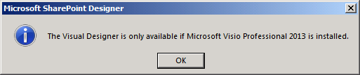
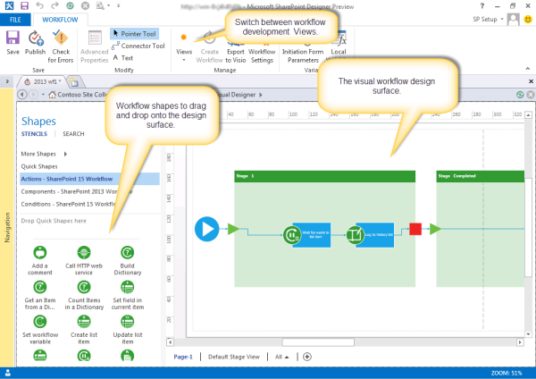
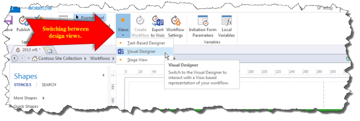

# Getting familiar with Visual Designer for workflow in SharePoint Designer 2013
Learn the basic features of the Visual Designer in SharePoint Designer 2013.
## Overview of the Visual Designer in SharePoint Designer 2013

SharePoint Designer 2013 includes a new workflow design surface called Visual Designer. You use Visual Designer to develop a workflow by dragging shapes onto the design surface.
  
    
    

> **Important:**
> In order to work with the Visual Designer, you must have Visio Professional 2013 installed on the same computer as SharePoint Designer 2013. If you do not have Visio installed you will receive an error, as shown in the figure. 
  
    
    

**Figure: Visio 2013 Professional is required to work with Visual Designer**

  
    
    

  
    
    

  
    
    
The **Shapes** pane on the left contains workflow shapes that you can drag to the design surface in order to create the workflow. Following are the three categories of shapes available for building a workflow.
  
    
    

- **Actions:** Specific actions that can be performed by the workflow. Some examples include calling an HTTP web service, adding a comment, and updating a list.
    
  
- **Components:** General components that can be added to provide a structured environment for workflow actions. Some examples include a stage container, a loop with conditions, and a start workflow shape.
    
  
- **Conditions:** Conditional logic shapes that can be used to provide a workflow path based on specific criteria. Some examples include checking if one value equals another value, checking if a person is a valid SharePoint user, and checking if an item is created within a specific date range.
    
  

    
> **Tip:**
> For a complete list of shapes available in SharePoint Designer 2013, see  [Shapes in the SharePoint Server workflow template in Visio](shapes-in-the-sharepoint-server-workflow-template-in-visio.md)
  
    
    

The figure shows a workflow in Visual Designer.
  
    
    

**Visual Designer in SharePoint Designer 2013**

  
    
    

  
    
    

  
    
    

  
    
    

  
    
    

## Using the Visual Designer in SharePoint 2013

The Visual Designer in SharePoint Designer 2013 is accessed through the Views drop-down menu of the **Workflow** tab. There are three different views that can be used for developing a workflow:
  
    
    

- **Text-Based Designer:** A text-based workflow development environment.
    
  
- **Visual Designer:** A visual workflow development environment where shapes can be dragged onto the design surface in order to develop the workflow. (Requires Visio Professional 2013)
    
  
- **Stage View:** Provides a high-level view of the visual design surface by showing how stages of the workflow fit together. It is similar to the **Visual Designer** view but it does not show the shape-level detail. (Requires Visio Professional 2013)
    
  
You can switch between **Views** in the **Manage** portion of the **Workflow** ribbon as shown in the figure.
  
    
    

**Switching between design views in SharePoint Designer 2013**

  
    
    

  
    
    

  
    
    
A workflow can be developed in either the Text-Based Designer or the Visual Designer or both. For example, if you are developing a workflow by using the Text-Based Designer you can switch the view to the Visual Designer and continue to develop the same workflow. Likewise, you can also begin developing a workflow by using the Visual Designer and then switch the view to the Text-Based Designer and continue to develop the same workflow. Moving back and forth between views provides flexibility in workflow development.
  
    
    

## Additional resources

-  [Workflow in SharePoint 2013 ](http://technet.microsoft.com/en-us/sharepoint/jj556245.aspx)
    
  
-  [What's new in workflow in SharePoint Server 2013](http://msdn.microsoft.com/library/6ab8a28b-fa2f-4530-8b55-a7f663bf15ea.aspx)
    
  
-  [Getting started with SharePoint Server 2013 workflow](http://msdn.microsoft.com/library/cc73be76-a329-449f-90ab-86822b1c2ee8.aspx)
    
  
-  [Workflow development in SharePoint Designer and Visio](workflow-development-in-sharepoint-designer-and-visio.md)
    
  
-  [Workflow actions quick reference (SharePoint 2013 Workflow platform)](workflow-actions-quick-reference-sharepoint-workflow-platform.md)
    
  

