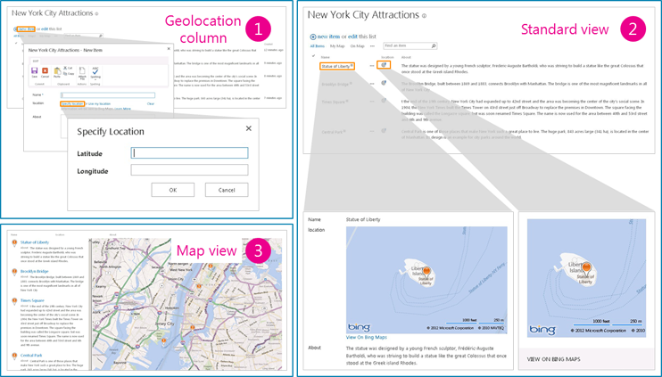

# How to: Add a Geolocation column to a list programmatically in SharePoint
Learn how to programmatically add a Geolocation column to a list in SharePoint. Integrate location information and maps in SharePoint lists and location-based websites by using the new Geolocation field creating your own Geolocation-based field type.
SharePoint introduces a new field type named Geolocation that enables you to annotate SharePoint lists with location information. In columns of type Geolocation, you can enter location information as a pair of latitude and longitude coordinates in decimal degrees or retrieve the coordinates of the user's current location from the browser if it implements the W3C Geolocation API. For more information about the Geolocation column, see [Integrating location and map functionality in SharePoint](integrating-location-and-map-functionality-in-sharepoint.md). The Geolocation column is not available by default in SharePoint lists. To add the column to a SharePoint list, you have to write code. In this article, learn how to add the Geolocation field to a list programmatically by using the SharePoint client object model.
  
    
    

An MSI package named SQLSysClrTypes.msi must be installed on every SharePoint front-end web server to view the geolocation field value or data in a list. This package installs components that implement the new geometry, geography, and hierarchy ID types in SQL Server 2008. By default, this file is installed for SharePoint Online. However, it is not for an on-premises deployment of SharePoint. You must be a member of the Farm Administrators group to perform this operation. To download SQLSysClrTypes.msi, see  [Microsoft SQL Server 2008 R2 SP1 Feature Pack](http://www.microsoft.com/en-us/download/details.aspx?id=26728) for SQL Server 2008, or [Microsoft SQL Server 2012 Feature Pack](http://www.microsoft.com/en-us/download/details.aspx?id=29065)for SQL Server 2012 in the Microsoft Download Center.
## Prerequisites for adding a Geolocation column
<a name="SP15addgeo_prereq"> </a>


  
    
    

- Access to a SharePoint list, with sufficient privileges to add a column.
    
  
- A valid Bing Maps key set at the farm or web level, which can be obtained from the  [Bing Maps Account Center](https://www.bingmapsportal.com/).
    
    > **Important:**
      > Please note that you are responsible for compliance with terms and conditions applicable to your use of the Bing Maps key, and any necessary disclosures to users of your application regarding data passed to the Bing Maps service. 
- Visual Studio 2010.
    
  

## Code example: Add a Geolocation column to a list programmatically
<a name="SP15addgeo_addcolumn"> </a>

Follow these steps to add the Geolocation column to a list using the SharePoint client object model.
  
    
    

### To add the Geolocation column to a list using the client object model


1. Start Visual Studio.
    
  
2. On the menu bar, choose **File, New Project**. The **New Project** dialog box opens.
    
  
3. In the **New Project** dialog box, choose **C#** in the **Installed Templates** box, and then choose the **Console Application** template.
    
  
4. Give the project a name, and then choose the **OK** button.
    
  
5. Visual Studio creates the project. Add a reference to the following assemblies, and choose **OK**.
    
    Microsoft.SharePoint.Client.dll
    
    Microsoft.SharePoint.Client.Runtime.dll
    
  
6. In the default .cs file, add a **using** directive as follows.
    
     `using Microsoft.SharePoint.Client;`
    
  
7. Add the following code to the **Main** method in the .cs file.
    
```cs
  
class Program
    {
        static void Main(string[] args)
        {
            AddGeolocationField();
            Console.WriteLine("Location field added successfully");
        }
        private static void AddGeolocationField()
        { 
         // Replace site URL and List Title with Valid values.
            ClientContext context = new ClientContext("<Site Url>"); 
            List oList = context.Web.Lists.GetByTitle("<List Title>");
            oList.Fields.AddFieldAsXml("<Field Type='Geolocation' DisplayName='Location'/>",true, AddFieldOptions.AddToAllContentTypes);                                        
            oList.Update();
            context.ExecuteQuery();
        } 
    }
```

8. Replace <Site Url> and <List Title> with valid values.
    
  
9.  Set the target framework in Project Properties as .NET Framework 4.0 or 3.5, and run the example.
    
  
10. Navigate to the list. You should be able to see a column named **Location** of type Geolocation in the list. You can now enter some values and see it in action. Figure 1 shows the default location and map features that you can expect to see in your list.
    
   **Figure 1. Summarized view of the default location and map features**

  

  
  

  

  

## Add a list item with the Geolocation field value to a SharePoint list programmatically
<a name="SP15addgeo_addlistitem"> </a>

After the Geolocation field is added to a SharePoint list, the developer can add the list item to the list programmatically. There are two ways to add the list item programmatically: by passing the **FieldGeolocationValue** object to the Geolocation field, and by passing **Raw Value** to the Geolocation field.
  
    
    

### Method A: Pass the FieldGeolocationValue object to the Geolocation field


- The following method adds a list item by passing the Geolocation value as an object.
    
```cs
  
private void AddListItem()
        {   // Replace site URL and List Title with Valid values.
            ClientContext context = new ClientContext("<Site Url>");
            List oList = context.Web.Lists.GetByTitle("<List Name>");

            ListItemCreationInformation itemCreationInfo = new ListItemCreationInformation();
            ListItem oListItem = oList.AddItem(itemCreationInfo);

            oListItem["Title"] = "New Title";

            FieldGeolocationValue oGeolocationValue = new FieldGeolocationValue();
            oGeolocationValue.Latitude = (double)17.4;
            oGeolocationValue.Longitude = (double)78.4;
            oListItem["location"] = oGeolocationValue;

            oListItem.Update();
            context.ExecuteQuery();
        }

```


### Method B: Pass a raw value to the Geolocation field


- The following method adds a list item to the SharePoint list by passing raw values to the Geolocation field.
    
```cs
  
private void AddListItem()
        {   // Replace site URL and List Title with Valid values.
            ClientContext context = new ClientContext("<Site Url>");
            List oList = context.Web.Lists.GetByTitle("<List Name>");

            ListItemCreationInformation itemCreationInfo = new ListItemCreationInformation();
            ListItem oListItem = oList.AddItem(itemCreationInfo);

            oListItem["Title"] = "New Title";
             // Data in WKT (World Known Text) format.
            oListItem["location"] = "POINT (78.4 17.4)" ; 

            oListItem.Update();
            context.ExecuteQuery();
        }

```


## Additional resources
<a name="SP15addgeo_addlresources"> </a>


-  [Integrating location and map functionality in SharePoint](integrating-location-and-map-functionality-in-sharepoint.md)
    
  
-  [How to: Set the Bing Maps key at the web and farm level in SharePoint](how-to-set-the-bing-maps-key-at-the-web-and-farm-level-in-sharepoint.md)
    
  
-  [How to: Extend the Geolocation field type using client-side rendering](how-to-extend-the-geolocation-field-type-using-client-side-rendering.md)
    
  
-  [Create a map view for the Geolocation field in SharePoint](create-a-map-view-for-the-geolocation-field-in-sharepoint.md)
    
  
-  [How to: Integrate maps with Windows Phone apps and SharePoint lists](how-to-integrate-maps-with-windows-phone-apps-and-sharepoint-lists.md)
    
  
-  [Use the SharePoint location field type in mobile applications](http://technet.microsoft.com/en-us/library/fp161355%28v=office.15%29.aspx)
    
  

