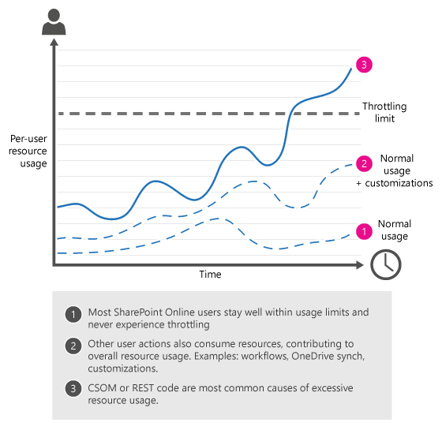
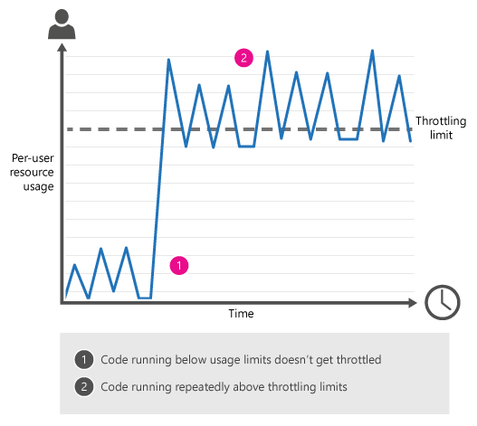
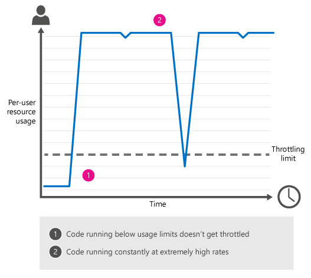

# Avoid getting throttled or blocked in SharePoint Online
Find out about throttling in SharePoint Online, and learn how to avoid being throttled or blocked. Includes sample CSOM and REST code you can use to make your task easier.

-  [What is throttling?](how-to-avoid-getting-throttled-or-blocked-in-sharepoint-online.md#BKMK_Whatisthrottling)

-  [Common throttling scenarios in SharePoint Online](how-to-avoid-getting-throttled-or-blocked-in-sharepoint-online.md#BKMK_Commonthrottlingscenarios)

-  [Why can't you just tell me the exact throttling limits?](how-to-avoid-getting-throttled-or-blocked-in-sharepoint-online.md#BKMK_Whycantyoujusttellmetheexactthrottlinglimits)

-  [Best practices to handle throttling](how-to-avoid-getting-throttled-or-blocked-in-sharepoint-online.md#BKMK_Bestpracticestohandlethrottling)
    
- [How to decorate your traffic to avoid getting throttled?](how-to-avoid-getting-throttled-or-blocked-in-sharepoint-online.md#BKMK_DecorateSharePointOnlineThrottling)
  
-  [GitHub CSOM code samples: SharePoint Online Throttling](how-to-avoid-getting-throttled-or-blocked-in-sharepoint-online.md#BKMK_GitHubCSOMandRESTcodesamplesSharePointOnlineThrottling)
    
  
-  [What should you do if you get blocked in SharePoint Online?](how-to-avoid-getting-throttled-or-blocked-in-sharepoint-online.md#BKMK_Whatshouldyoudoifyougetblocked)
    
  
-  [Additional resources](how-to-avoid-getting-throttled-or-blocked-in-sharepoint-online.md#BKMK_Additionalresources)

Does this sound familiar? You're running a CSOM process - for example, to migrate files in SharePoint Online - but you keep getting throttled. Or even worse, you get completely blocked. What's going on and what can you do to make it stop?
  
## What is throttling?
<a name="BKMK_Whatisthrottling"> </a>

SharePoint Online uses throttling to maintain optimal performance and reliability of the SharePoint Online service. Throttling limits the number of user actions or concurrent calls (by script or code) to prevent overuse of resources.
  
That said, it is extremely rare for a user to get throttled in SharePoint Online. The service is robust, and it is designed to handle very high volume. If you do get throttled, 99% of the time it is because of custom code. That doesn't mean that there aren't other ways to get throttled, just that they are less common. For example you spin up 10 machines and have a sync client going on all 10. On each sync 1TB of content. This would likely get you throttled.
  


  
### What happens when you get throttled in SharePoint Online?

When a user exceeds usage limits, SharePoint Online throttles any further requests from that user account for a short period. All user actions are throttled while the throttle is in effect.
  
- For requests that a user performs directly in the browser, SharePoint Online redirects you to the throttling information page, and the requests fail.
  
- For all other requests, including CSOM or REST calls, SharePoint Online returns HTTP status code 429 ("Too many requests") or 503 ("Server Too Busy") and the requests will fail.
  
If the offending process continues to exceed usage limits, SharePoint Online might completely block the process; in this case, you will not see any successful requests and we will notify you of the block in the Office 365 Message Center. 

### Application Throttling

In addition to throttling by user account, limits are also applied to each application.  Every application in SharePoint Online has its own available resources, but multiple applications running against the same tenant ultimately share from the same resource bucket and in rare occurrences can cause rate limiting. 
In these cases, SharePoint Online will attempt to prioritize interactive user requests over background activities.  

## Common throttling scenarios in SharePoint Online
<a name="BKMK_Commonthrottlingscenarios"> </a>

The most common causes of per-user throttling in SharePoint Online are client-side object model (CSOM) or Representational State Transfer (REST) code that performs too many actions too frequently.  
    

- **Sporadic traffic**
    
    Constant load or repetitive complex queries against SharePoint Online must be optimized for low impact.  Failing to follow [best practices for scanning applications](https://aka.ms/ScanGuidance) that process files in bulk will likely result in throttling.  These apps include sync engines, backup providers, search indexers, classification engines, data loss prevention tools, and any other which attempts to reason over the entirety of data and change. 
    
  - For example, after migrating files to SharePoint Online, you run a custom CSOM or REST script to update metadata on the files. The CSOM/REST script is updating a large number of files at a very high frequency, which triggers throttling. Similarly, an autocomplete UI widget using REST services, making too many calls to lists during each end user operation, may also cause throttling, depending on what other operations are consuming resources at the same time.
    
  
  
- **Overwhelming traffic**
    
    A single process dramatically exceeds throttling limits, continually, over a long time period.
    
  - You used web services to build a tool to synchronize user profile properties. The tool updates user profile properties based on information from your line-of-business (LOB) human resources (HR) system. The tool makes calls at too high a frequency.
 
  - You're running a load-testing script on SharePoint Online and you get throttled. Load testing is not allowed on SharePoint Online.
  
  - You customized your team site on SharePoint Online, for example, by adding a status indicator on the Home page. This status indicator updates frequently, which causes the page to make too many calls to the SharePoint Online service - this triggered throttling.
    
  
  
## Why can't you just tell me the exact throttling limits?
<a name="BKMK_Whycantyoujusttellmetheexactthrottlinglimits"> </a>

Setting and publishing exact throttling limits sounds very straightforward, but in fact it would result in more restrictive limits. We continually monitor resource usage on SharePoint Online. Depending on usage, we fine-tune thresholds so users can consume the maximum number of resources without degrading the reliability and performance of SharePoint Online. That's why it's so important for your CSOM or REST code to honor the retry-after header value; this lets your code run as fast as possible on any given day, and it lets your code back off "just enough" if it hits throttling limits. The code samples later in this article show you how to use the retry-after header.

## Best practices to handle throttling
<a name="BKMK_Bestpracticestohandlethrottling"> </a>

- Reduce the number of operations per request
    
- Reduce the frequency of calls
    
- Decorate your traffic so we know who you are (see section on traffic decoration best practice more on that below)

- Leverage the retry-after header
    
If you do run into throttling, we require leveraging the retry-after header to ensure minimum delay till the throttle is removed.

Retry after is the fastest way to handle being throttled because SharePoint Online dynamically determines the right time to try again. In other words, aggressive retries work against you because even though the calls fail, they still accrue against your usage limits.  Following the retry header will ensure the shortest delay. 

For information about ways to monitor your SharePoint Online activity, see  [Diagnosing performance issues with SharePoint Online](https://support.office.com/en-us/article/3c364f9e-b9f6-4da4-a792-c8e8c8cd2e86).

For a broader discussion of throttling on the Microsoft Cloud, see  [Throttling Pattern](http://msdn.microsoft.com/library/4baf5af2-32fc-47ab-8569-3e5c59a5ebd5.aspx).

## How to decorate your http traffic to avoid throttling?
<a name="BKMK_DecorateSharePointOnlineThrottling"> </a>

To ensure and maintain high-availability, some traffic may be throttled. Throttling happens when system health is at stake and one of the criteria used for throttling is traffic decoration, which impacts directly on the prioritization of the traffic. Well decorated traffic will be prioritized over traffic which is not properly decorated.
 
What is definition of undecorated traffic?

- Traffic is undecorated if there is no AppID/AppTitle and User Agent string in CSOM or REST API call to SharePoint Online.  The User Agent string should be in a specific format as described below.

What are the recommendations?

- If you have created an application, the recommendation is to register and use  AppID and AppTitle – This will ensure the best overall experience and best path for any future issue resolution. Include also the User Agent string information as defined in following step.

- Make sure to include User Agent string in your API call to SharePoint with following naming convention

| Type  | User Agent  | Description   |
|---|---|---|
| ISV Application | ISV&#124;CompanyName&#124;AppName/Version | Identify as ISV and include Company Name, App Name separated by a pipe character and then adding Version number separated with a slash character  |
| Enterprise application | NONISV&#124;CompanyName&#124;AppName/Version | Identify as NONISV and include Company Name, App Name separated by a pipe character and then adding Version number separated with a slash character |

- If you are building your own JavaScript libraries, which are used to call SharePoint Online APIs, make sure that you include the User Agent information to your http request and potentially register your web application also as an Application, where suitable.

> [!NOTE]
> Format of the  user agent string is expected to follow [RFC2616](http://www.ietf.org/rfc/rfc2616.txt), so please follow up on the above guidance on the right separators. It is also fine to append existing user agent string with the requested information.

> [!NOTE]
> If you are developing front end components executing in the browser, most of modern browsers don't allow overwritting the user agent string and you don't need to implement this.

### Example of decorating traffic with User agent when using Client Side Object Model (CSOM)

```cs
// Get access to source site
using (var ctx = new ClientContext("https://contoso.sharepoint.com/sites/team"))
{
    //Provide account and pwd for connecting to SharePoint Online
    var passWord = new SecureString();
    foreach (char c in pwd.ToCharArray()) passWord.AppendChar(c);
    ctx.Credentials = new SharePointOnlineCredentials("contoso@contoso.onmicrosoft.com", passWord);

    // Add our User Agent information
    ctx.ExecutingWebRequest += delegate (object sender, WebRequestEventArgs e)
    {
        e.WebRequestExecutor.WebRequest.UserAgent = "NONISV|Contoso|GovernanceCheck/1.0";
    };
                
    // Normal CSOM Call with custom User-Agent information
    Web site = ctx.Web;
    ctx.Load(site);
    ctx.ExecuteQuery();
}
```

### Example of decorating traffic with User agent when using REST APIs

Following sample is in c# format, but the similar User Agent information is recommended to be used even for the JavaScript libraries used in the SharePoint Online pages.

```cs
HttpWebRequest endpointRequest = (HttpWebRequest)HttpWebRequest.Create(sharepointUrl.ToString() + "/_api/web/lists");
endpointRequest.Method = "GET";
endpointRequest.UserAgent = "NONISV|Contoso|GovernanceCheck/1.0";
endpointRequest.Accept = "application/json;odata=verbose";
endpointRequest.Headers.Add("Authorization", "Bearer " + accessToken);
HttpWebResponse endpointResponse = (HttpWebResponse)endpointRequest.GetResponse();
```


### CSOM Code sample: ExecuteQueryWithIncrementalRetry method


```

public static void ExecuteQueryWithIncrementalRetry(this ClientContext context, int retryCount, int delay)
        {
            int retryAttempts = 0;
            int backoffInterval = delay;
            if (retryCount <= 0)
                throw new ArgumentException("Provide a retry count greater than zero.");
           if (delay <= 0)
                throw new ArgumentException("Provide a delay greater than zero.");
           while (retryAttempts < retryCount)
            {
                try
                {
                    context.ExecuteQuery();
                    return;
                }
                catch (WebException wex)
                {
                    var response = wex.Response as HttpWebResponse;
                    if (response != null &amp;&amp; response.StatusCode == (HttpStatusCode)429)
                    {
                       int retryAfterInMs = DefaultRetryAfterInMs;
                        string retryAfter = response.GetResponseHeader(RetryAfterHeaderName);
                        if (!string.IsNullOrEmpty(retryAfter * 1000))
                        {
                            if (!int.TryParse(retryAfter, out retryAfterInMs))
                            {
                                retryAfterInMs = DefaultRetryAfterInMs;
                            }
                        }

                        Console.WriteLine(string.Format("CSOM request exceeded usage limits. Sleeping for {0} milliseconds before retrying.", retryAfterInMs));
                        //Add delay.
                        System.Threading.Thread.Sleep(retryAfterInMs);
                        //Add to retry count.
                        retryAttempts++;
                    }

                    else
                    {
                        throw;
                    }
                }
            }
            throw new MaximumRetryAttemptedException(string.Format("Maximum retry attempts {0}, have been attempted.", retryCount));
       }

```


## What should you do if you get blocked in SharePoint Online?
<a name="BKMK_Whatshouldyoudoifyougetblocked"> </a>

Blocking is the most extreme form of throttling. We rarely ever block a tenant, unless we detect long-term, extremely excessive traffic that may threaten the overall health of the SharePoint Online service. We apply blocks to prevent excessive traffic from degrading the performance and reliability of SharePoint Online. A block - which is usually placed at the app or user level - prevents the offending process from running until you fix the problem. If we block your subscription, you must take action to modify the offending processes before the block can be removed.
  
If we block your subscription we will notify you of the block in the Office 365 Message Center. The message describes what caused the block, provides guidance on how to resolve the offending issue, and tells you who to contact to get the block removed.

## See also
<a name="BKMK_Additionalresources"> </a>

-  [Diagnosing performance issues with SharePoint Online](https://support.office.com/en-us/article/3c364f9e-b9f6-4da4-a792-c8e8c8cd2e86)
  
-  [Capacity planning and load testing SharePoint Online](https://support.office.com/en-us/article/capacity-planning-and-load-testing-sharepoint-online-c932bd9b-fb9a-47ab-a330-6979d03688c0)
  
-  [GitHub: SharePoint Online Throttling code sample](https://github.com/OfficeDev/PnP/tree/dev/Samples/Core.Throttling)
