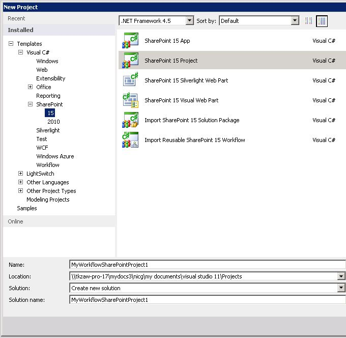
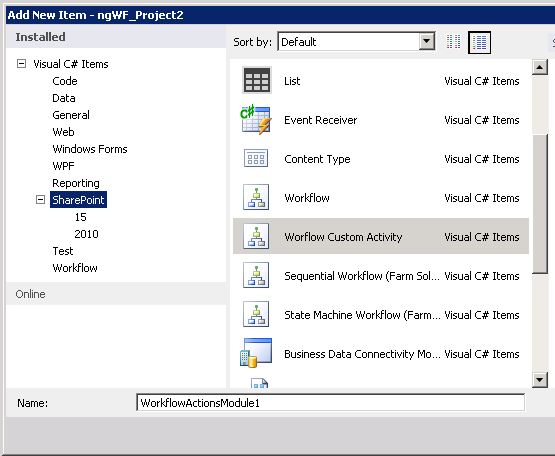
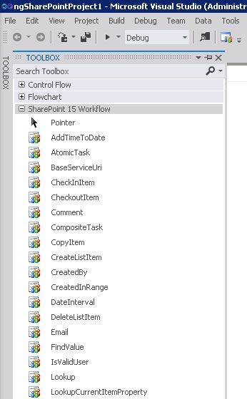
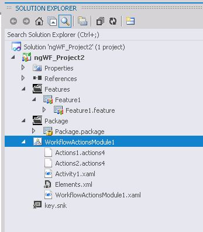

---
title: How to Build and deploy workflow custom actions
ms.date: 09/25/2017
ms.prod: sharepoint
ms.assetid: 9d2fa681-30c2-4549-9df2-ea9ed757fda9
---

# How to: Build and deploy workflow custom actions
Learn how to model business processes whose requirements are not met by the existing library of workflow actions in SharePoint Designer by creating custom workflow actions in SharePoint.
SharePoint Designer provides a collection of workflow actions that are available through the Workflow Designer user interface (UI). Although the range of workflow actions that are included in SharePoint Designer) is extensive, it is nevertheless finite. In some cases, you may need to model a business process whose requirements are not met by the existing library of workflow actions that are available in SharePoint Designer.
  
    
    

Recognizing that business processes often have specialized requirements, SharePoint lets you create custom workflow actions. You can develop these custom actions by using Visual Studio, and then package and deploy them to SharePoint. At that point, the custom action becomes available to workflow authors in SharePoint Designer, exactly as if it were among the library of existing actions. This capability lets you customize the functionality in your workflow authoring environment to match any of your specialized business processes.
> **Note:**
> A sample is provided that illustrates creating a custom action. The sample, along with a readme file, is available here:  [SharePoint workflow: Create a custom action](http://code.msdn.microsoft.com/SharePoint-workflow-41e5c0f9) (http://code.msdn.microsoft.com/SharePoint-workflow-41e5c0f9).
  
    
    

## Core scenario for custom workflow actions

The core scenario for custom workflow actions is captured in the following narrative line:
  
    
    

1. A business analyst or other non-technical information worker is using SharePoint Designer to author a workflow to model an internal business process—for example, a document-approval process. However, in this company, the final step of the process is, upon final approval, to automatically dispatch the document to an external printer who prints and binds a specified number of copies of the document. 
    
  
2. No workflow action that is included in SharePoint Designer 2013 supports dispatching a document to an external printer. Therefore, the company managers decide to invest in providing this custom action (they call it the "Send Files to Printer" action) for the company's information workers.
    
  
3. Vendors expose printing web services. To capitalize, a developer creates a custom **Send Files to Printer** action, named **SendFilesToPrinter**. What the developer creates is a declarative workflow activity. The developer also, then, creates the workflow action to provide the drag-and-drop UI for the action in SharePoint Designer.
    
  
4. The developer packages both the **SendFilesToPrinter** activity and the **Send Files to Printer** action in a SharePoint solution package (.wsp) file and deploys it as a site collection feature to the SharePoint farm.
    
  
5. After the feature is deployed and activated, the information worker sees the new custom action, **Send Files to Printer**, in the SharePoint Designer UI along with all of the normally included actions and can use it just like all the others.
    
  

## Overview of custom actions

An action is a wrapper that abstracts the functionality of its underlying activity in SharePoint Designer. At run time, the underlying activity, not the action itself, is executed in the Windows Server AppFabric. In this sense, actions are just design-time abstractions of underlying functions in the SharePoint Designer workflow authoring environment (in addition to being elements of the SharePoint Designer using interface.
  
    
    
Like all actions, custom actions are "web scoped"—that is, they are activated at the level of the SharePoint website, or **SharePoint.SPWeb** instance.
  
    
    
Actions are defined in XML definition files that have the .actions4 file name extension. The underlying activity (or activities), on the other hand, are defined in a XAML file.
  
    
    

## Writing custom activities in Visual Studio 2012

Visual Studio 2012 now provides a "workflow custom activity" item type within SharePoint projects. You can use the item type to create a custom activity that you can then import as a custom action in SharePoint Designer 2013.
  
    
    

## Example: Create, package, and deploy a custom activity

### To create a workflow custom activity

1. Begin by opening Visual Studio 2012 and creating a new Visual C# project of type **SharePoint Project**, as shown in Figure 1.
    
   **Figure 1. New Project dialog box**

  

  
  

  

  
2. In **Solution Explorer**, right-click the project name node, and choose **Add**, **New Item**. This opens the **Add New Item** dialog box, as shown in Figure 2.
    
   **Figure 2. Add New Item dialog box**

  

  
  

    
    
  
3. In the **Add New Item** dialog box, choose the **Workflow Custom Activity** item type and give it a meaningful name. In the illustration, the name is "WorkflowActionsModule1". Then choose **Add**. The new item is created, and you are presented with the activity design surface.
    
  
4. If the **Toolbox** tab is not already showing, click it to expose the toolbox nodes. Click the **SharePoint Workflow** node to show the workflow development objects. There is a partial view of objects in the workflow toolbox in Figure 3.
    
   **Figure 3. Partial view of SharePoint workflow toolbox**

  

  
  

    
    
  
5. Add new action (.actions4) and activity (.xaml) files to your workflow module, as needed. To add these files, right-click the actions module icon in **Solution Explorer**, choose **Add**, and then choose either **Add Action** (to add a new action4 file) or **New Activity** (to add a new activity), as appropriate.
    
  
After you create your actions module and add your action and activity files, your project should look something like that depicted in Figure 5. You will see one .actions4 file for each action that you added, and one .xaml file for each activity. Additionally, you will have an Elements.xml file and the module's .xaml file.
  
    
    

**Figure 5. Workflow actions module in Solution Explorer**

  
    
    

  
    
    

  
    
    
After you create your custom workflow activity, you can then package and deploy it. After it is deployed, the custom activity can be consumed by SharePoint Designer 2013 as a custom action.
  
    
    
Custom actions are packaged and deployed as SharePoint Features in SharePoint solution package (.wsp) files. The solution package contains a custom actions module, which is a set of files that are deployed on SharePoint. This module can contain any number of workflow activity definitions, each of which is a .xaml file. The module also contains actions (.actions4) files. Each actions file contains multiple actions that refer to the activities in the module, or to native activities that are available on a default SharePoint installation.
  
    
    
After a solution package (.wsp) file is uploaded and activated on the target website (that is, the SharePoint site collection), the features that are contained in the package are installed and available for activation. After the custom actions are activated, they are available for use in a workflow. 
  
    
    

## Updating and deleting custom actions

After your custom action is deployed, you can update or remove it very easily. All you have to do is open the activity project in Visual Studio, make the changes that you want, and then package and redeploy as described in the preceding procedure. To remove the custom action, you can just uninstall the feature on the target site collection.
  
    
    

### Feature activation

Activating a custom action feature on a site collection (that is, on an **SPWeb** instance) succeeds only if the Azure/ Workflow Manager Client 1.0 (the multitenant workflow engine) is correctly configured. Two troubleshooting hints that may help ensure a correct configuration include:
  
    
    

- Going to the Site Features page and ensuring that the feature that contains the custom action is activated.
    
  
- Querying the Workflow Manager Client 1.0 database to ensure that the activity is successfully deployed.
    
  

## Additional resources

-  [SharePoint workflow fundamentals](sharepoint-workflow-fundamentals.md)
    
  
-  [Workflow actions and activities reference for SharePoint](workflow-actions-and-activities-reference-for-sharepoint.md)
    
  
-  [Develop SharePoint workflows using Visual Studio](develop-sharepoint-workflows-using-visual-studio.md)
    
  

