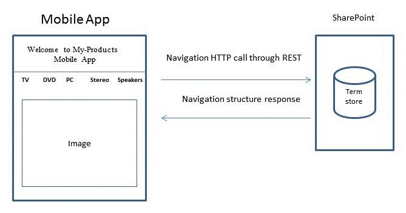
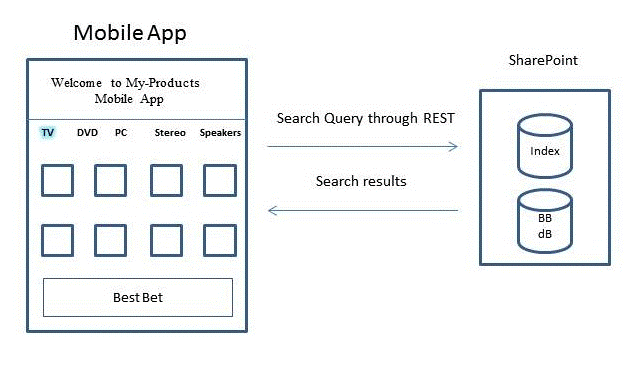
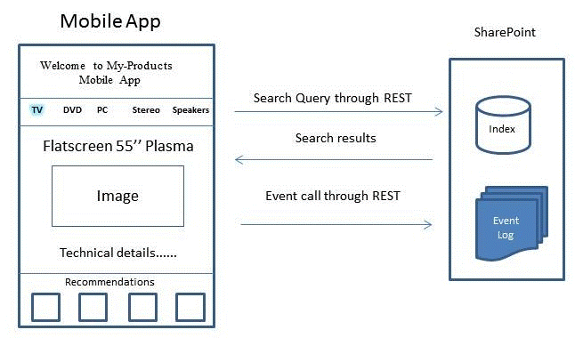

# How to: Build search-driven mobile apps with the Navigation and Event Logging REST interfaces
SharePoint Server 2013 introduces the Navigation and Event Logging REST interfaces, enabling you to create a search-driven mobile app for mobile devices such as phones and tablets that run on operating systems other than Windows—for example, Android and iOS.
## How apps work with the product catalog
<a name="mobile_app_and_product_catalog"> </a>

A product catalog can be displayed on a mobile device in different ways. Traditionally, you can configure a mobile channel for the product catalog within SharePoint. Creating a mobile channel enables you to tailor a look and feel that matches any screen size on a mobile device. The resulting page is viewed in .ASPX format using the web browser on the mobile device. The structure of the pages and its corresponding logic is handled by the server running SharePoint. In contrast, an app created with the Navigation and Event Logging REST interfaces is search-driven and acts as a front-end to navigate the product catalog structures.
  
    
    
An app is not a stand-alone program, but works with a product catalog set up in an existing SharePoint installation. The app can update the navigation structure dynamically if the product catalog has changed in that particular SharePoint installation. In addition, click events made by the user are sent back to the server running SharePoint to improve the overall quality of recommendations made by the product catalog.
  
    
    
The app constructs the pages needed by the user to view the product catalog without using a web browser. Master pages, page layouts, and logic to construct the pages to view the product catalog are downloaded onto devices as an app; these pages are reused whenever the user runs the app. While the user navigates the product catalog, the app simultaneously constructs a navigation structure and sets up the pages. To fill in relevant pages with item content, search queries are sent to the product catalog in SharePoint. The corresponding search results are then used to fill the pages.
  
    
    

## Example: Create a search-driven mobile app with home, category, and item detail pages
<a name="example_search_driven_mobile_app"> </a>

Suppose you have a mobile app with three types of pages: a home page, category pages, and item detail pages. The following sections describe how the Navigation, Event Logging, and Search REST interfaces are used to create the pages.
  
    
    

### Home page for a search-driven mobile app

Typically the **Home** page is displayed when the app starts up. The **Home** page contains the product catalog menu, some text, and a static image, as shown in Figure 1.
  
    
    

**Figure 1. Home page for a search-driven mobile app**

  
    
    

  
    
    

  
    
    
To construct this page, the app sends a Navigation REST call to the server running SharePoint requesting the navigation structure of the product catalog. Next, the app uses the response data to set up the correct taxonomy or menu structure and displays the correct term names for the product catalog. Additional content such as page layout, title text, and static images are stored in the app itself. If the taxonomy is modified at a later time, the app can be updated with the Navigation REST call when it is run.
  
    
    
The following is an example of a typical Navigation REST call.
  
    
    


```

GET http://server/_api/navigation/menustate?mapprovidername='GlobalNavigationSwitchableProvider'

```

A matching response is shown in  [Example response for a Navigation REST call for a mobile app](how-to-build-search-driven-mobile-apps-with-the-navigation-and-event-logging-res.md#response_navigation_rest).
  
    
    

### Category page for a search-driven mobile app

The **Category** page displays many items in a selected category. Each item listed in a category can typically be represented by some relevant item data, such as title, an image, and price. This data is collected from the product catalog by using a search query through the SharePoint Search REST service as shown in Figure 2.
  
    
    

**Figure 2. Category page for a search-driven mobile app**

  
    
    

  
    
    

  
    
    
If you choose one of the categories in the previous diagram, for example, **TV**, a **Category** page appears.
  
    
    
The following is an example of a typical Search REST query to obtain content for a particular category.
  
    
    


```

GET http://server/_api/search/query?querytext='owstaxidProductCatalogItemCategory:#0<TermGuid>'

```

A matching response is shown in  [Example response for a Search REST query for a mobile app](how-to-build-search-driven-mobile-apps-with-the-navigation-and-event-logging-res.md#response_search_rest).
  
    
    
The query processing component in SharePoint Server 2013 returns search results that contain data for a particular category, and the app presents the data in the **Category** page. If there is a Best Bet associated with the selected category, the query processing component detects this association and extracts the Best Bet data from the Best Bet database, labeled **BB** in the diagram. The search results are then mixed with results from the Best Bet database and sent back to the app in a result table. The app is responsible for extracting the different parts of the results from the table and displaying the Best Bet in a dedicated location.
  
    
    

### Item detail pages for a search-driven mobile app

If you select an item in a category, the **Item details** page appears. On this page, an item is described in detail with data such as title, product images, technical description, price, and delivery information. More recommendations or ratings, if available, are also displayed. To construct the **Item details** page, the app sends two queries: one query to retrieve item data and another query to receive recommendations related to that item, as shown in Figure 3.
  
    
    

**Figure 3. Item detail page for a search-driven mobile app**

  
    
    

  
    
    

  
    
    
The following is an example of a typical Search REST query to obtain content for a particular item.
  
    
    


```

GET http://server/_api/search/query?querytext='ProductCatalogItemNumberOWSTEXT:1234567'
```

Recommendations are calculated in SharePoint, not in the app itself. To create recommendations based on user events—not only in this particular app but all user events that are collected by the product catalog—the app constantly sends user events, as they occur, back to the product catalog in SharePoint via an Event call. These user events are stored in the event log and processed only like other user events associated with that particular item. No callback is sent to the app from the product catalog. The recommendations calculated are available for the app through the SharePoint Search REST service.
  
    
    
The following example shows a typical **POST** call for event logging.
  
    
    


```
POST http://server/_api/events/logevent
{
      "usageEntry": {
            "__metadata": {
                  "type": "Microsoft.SharePoint.Administration.UsageEntry"
            },
            "EventTypeId": 1,
            "ItemId": "an item fb7c-4196-8123-e54eee5f4787",
            "ScopeId": "61141c0e-fb7c ",
            "Site": "61141c0e- 
-4196-8123-e54eee5f4787",
            "User": "johndoe"
      }
}
```

The service follows standard HTTP return codes: an HTTP 200 response indicates a successful request. There are no responses from the product catalog for the Event Logging REST interface.
  
    
    

## Example response for a Navigation REST call for a mobile app
<a name="response_navigation_rest"> </a>


```

<?xml version="1.0" encoding="utf-8"?>
<d:MenuState xmlns:d="http://schemas.microsoft.com/ado/2007/08/dataservices" xmlns:m="http://schemas.microsoft.com/ado/2007/08/dataservices/metadata" xmlns:georss="http://www.georss.org/georss" xmlns:gml="http://www.opengis.net/gml" m:type="SP.MenuState">

  <d:FriendlyUrlPrefix>/sites/contoso/</d:FriendlyUrlPrefix>
  <d:Nodes>
    <d:element m:type="SP.MenuNode">
      <d:CustomProperties m:null="true" />
      <d:FriendlyUrlSegment>electronics</d:FriendlyUrlSegment>
      <d:Hidden m:type="Edm.Boolean">false</d:Hidden>
      <d:Key>16c4c3c8-0309-47f7-9d9b-17e699febce8</d:Key>
      <d:Nodes>
        <d:element m:type="SP.MenuNode">
          <d:CustomProperties m:null="true" />
          <d:FriendlyUrlSegment>audio</d:FriendlyUrlSegment>
          <d:Hidden m:type="Edm.Boolean">false</d:Hidden>
          <d:Key>3e2d5c67-3fad-4cfa-8e1c-8c74fdf3a34b</d:Key>
          <d:Nodes>
            <d:element m:type="SP.MenuNode">
              <d:CustomProperties m:null="true" />
              <d:FriendlyUrlSegment>car-audio</d:FriendlyUrlSegment>
              <d:Hidden m:type="Edm.Boolean">false</d:Hidden>
              <d:Key>e3d271a4-dcbf-464d-a557-23848ccaa54f</d:Key>
              <d:Nodes />
              <d:NodeType m:type="Edm.Int32">1</d:NodeType>
              <d:SimpleUrl></d:SimpleUrl>
              <d:Title>Car audio</d:Title>
            </d:element>
            <d:element m:type="SP.MenuNode">
              <d:CustomProperties m:null="true" />
              <d:FriendlyUrlSegment>headphones</d:FriendlyUrlSegment>
              <d:Hidden m:type="Edm.Boolean">false</d:Hidden>
              <d:Key>7ad146d0-61b5-4b55-9da0-db7eaaa20f4a</d:Key>
              <d:Nodes />
              <d:NodeType m:type="Edm.Int32">1</d:NodeType>
              <d:SimpleUrl></d:SimpleUrl>
              <d:Title>Headphones</d:Title>
            </d:element>
            <d:element m:type="SP.MenuNode">
              <d:CustomProperties m:null="true" />
              <d:FriendlyUrlSegment>mp3</d:FriendlyUrlSegment>
              <d:Hidden m:type="Edm.Boolean">false</d:Hidden>
              <d:Key>7387fe97-52fa-464b-878a-b05d04e7032e</d:Key>
              <d:Nodes />
              <d:NodeType m:type="Edm.Int32">1</d:NodeType>
              <d:SimpleUrl></d:SimpleUrl>
              <d:Title>MP3</d:Title>
            </d:element>
            <d:element m:type="SP.MenuNode">
              <d:CustomProperties m:null="true" />
              <d:FriendlyUrlSegment>speakers</d:FriendlyUrlSegment>
              <d:Hidden m:type="Edm.Boolean">false</d:Hidden>
              <d:Key>65da907c-9565-45f6-a278-cbce7f74ab3d</d:Key>
              <d:Nodes />
              <d:NodeType m:type="Edm.Int32">1</d:NodeType>
              <d:SimpleUrl></d:SimpleUrl>
              <d:Title>Speakers</d:Title>
            </d:element>
          </d:Nodes>
          <d:NodeType m:type="Edm.Int32">1</d:NodeType>
          <d:SimpleUrl></d:SimpleUrl>
          <d:Title>Audio</d:Title>
        </d:element>
      </d:Nodes>
      <d:NodeType m:type="Edm.Int32">1</d:NodeType>
      <d:SimpleUrl></d:SimpleUrl>
      <d:Title>Electronics</d:Title>
    </d:element>
  </d:Nodes>
  <d:SimpleUrl m:null="true" />
  <d:SPSitePrefix>/sites/contoso/</d:SPSitePrefix>
  <d:SPWebPrefix>/sites/contoso/</d:SPWebPrefix>
  <d:StartingNodeKey>2168423f-3fea-4324-a5cb-90be8f079750</d:StartingNodeKey>
  <d:StartingNodeTitle>contoso</d:StartingNodeTitle>
  <d:Version>2012-05-29T12:00:04.4747484Z</d:Version>
</d:MenuState>

```


## Example response for a Search REST query for a mobile app
<a name="response_search_rest"> </a>


```

<d:query xmlns:d="http://schemas.microsoft.com/ado/2007/08/dataservices" xmlns:m="http://schemas.microsoft.com/ado/2007/08/dataservices/metadata" xmlns:georss="http://www.georss.org/georss" xmlns:gml="http://www.opengis.net/gml" m:type="Microsoft.Office.Server.Search.REST.SearchResult">
  <d:ElapsedTime m:type="Edm.Int32">4640</d:ElapsedTime>
  <d:PrimaryQueryResult m:type="Microsoft.Office.Server.Search.REST.QueryResult">
    <d:CustomResults m:null="true"/>
    <d:QueryId>7fea4ced-5789-4067-beab-8f807410b29e</d:QueryId>
    <d:QueryRuleId m:type="Edm.Guid">00000000-0000-0000-0000-000000000000</d:QueryRuleId>
    <d:RefinementResults m:null="true"/>
    <d:RelevantResults m:type="Microsoft.Office.Server.Search.REST.RelevantResults">
      <d:GroupTemplateId m:null="true"/>
      <d:ItemTemplateId m:null="true"/>
      <d:Properties>
        ...
      </d:Properties>
      <d:ResultTitle m:null="true"/>
      <d:ResultTitleUrl m:null="true"/>
      <d:RowCount m:type="Edm.Int32">10</d:RowCount>
      <d:Table m:type="SP.SimpleDataTable">
        <d:Rows>
          ...
        </d:Rows>
      </d:Table>
      <d:TotalRows m:type="Edm.Int32">2048964</d:TotalRows>
      <d:TotalRowsIncludingDuplicates m:type="Edm.Int32">2048964</d:TotalRowsIncludingDuplicates>
    </d:RelevantResults>
    <d:SpecialTermResults m:null="true"/>
  </d:PrimaryQueryResult>
  <d:Properties>
    ...
  </d:Properties>
  <d:SecondaryQueryResults m:null="true"/>
  <d:SpellingSuggestion/>
  <d:TriggeredRules>
  </d:TriggeredRules>
</d:query>
```


## Additional resources
<a name="bk_addresources"> </a>


-  [Build Windows Phone apps that access SharePoint 2013](build-windows-phone-apps-that-access-sharepoint.md)
    
  
-  [Use OData query operations in SharePoint REST requests](http://msdn.microsoft.com/library/d4b5c277-ed50-420c-8a9b-860342284b72%28Office.15%29.aspx)
    
  

