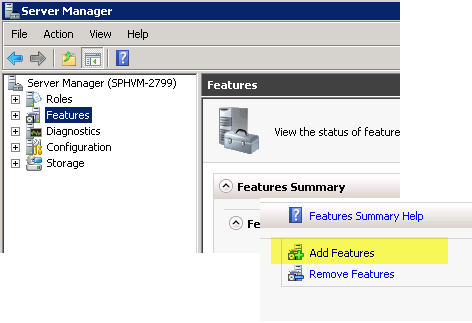
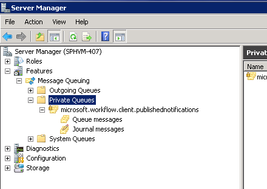

# Configure MSMQ for SharePoint workflows

Learn how to configure Microsoft Message Queuing (MSMQ) in SharePoint to support asynchronous event messaging in SharePoint workflows. 

## Enabling MSMQ

MSMQ is a Windows Server feature that you can enable on your SharePoint Server computer to allow asynchronous event messaging in SharePoint workflows. To support asynchronous event messaging, you must enable MSMQ on your SharePoint Server computer.
  
    
    
MSMQ is provided as a "Feature" in Windows Server. To enable MSMQ, do the following:
  
    
    

> **Important:**
> The screen shots included here are from Windows Server 2008 R2. The UI may change for enabling this feature in Windows Server 2012. 
  
    
    


1. On your SharePoint Server computer, open **Server Manager**.
    
  
2. Select the **Features** icon in the left pane, then select **Add Features**, as depicted in Figure 1.
    
   **Figure 1. Adding the Message Queuing feature.**

  

  
  

  

  
3. In the **Add Features Wizard** that appears, select **Message Queuing**. Accept the default selections and then click **Next**, then click **Install**.
    
  
4. You must now restart your computer.
    
  
5. Once restarted, open **Server Manager** and then open **Message Queuing** icon in the left pane. Notice that it now contains a **Message Queuing** folder and subdirectories, as depicted in Figure 2.
    
    > [!NOTE]
    > In Windows Server 2012 you will not find the queues in **Server Manager**. Instead, go to **Computer Management**, then select **Services and applications**. 

6. Select the subdirectory named **Private Queues**. This is the directory in which your workflow event messages are stored.
    
   **Figure 2. The Message Queuing feature added to Server Manager.**

    
  
    > [!NOTE]
    > When you first add the **Message Queuing** feature, the **Private Queues** folder is empty. However, after a workflow runs that fires an event (or a workflow triggered by a SharePoint content change event runs), the **Private Queues** folder is populated as shown in Figure 2.

7. To complete the installation, you must set the **SPWorkflowServiceApplicationProxy.AllowQueue** property to **true** using a Windows PowerShell script. In the **SharePoint Administration shell**, run the following:
    
```
  
$proxy = Get-SPWorkflowServiceApplicationProxy
$proxy.AllowQueue = $true;
$proxy.Update();

```


## Troubleshooting MSMQ

The Windows Developer Center provides extensive documentation of MSMQ. Following are some useful resources:
  
    
    

-  [About Message Queuing](http://msdn.microsoft.com/en-us/library/windows/desktop/ms706032%28v=vs.85%29.aspx)
    
  
-  [Message Queuing Reference](http://msdn.microsoft.com/en-us/library/windows/desktop/ms700112%28v=vs.85%29.aspx)
    
  
-  [Message Queuing Error and Information Codes](http://msdn.microsoft.com/en-us/library/windows/desktop/ms700106%28v=vs.85%29.aspx)
    
  

## See also
<a name="bk_addresources"> </a>


-  [Message Queuing (MSMQ)](http://msdn.microsoft.com/en-us/library/windows/desktop/ms711472%28v=vs.85%29.aspx)
    
  

  
    
    

