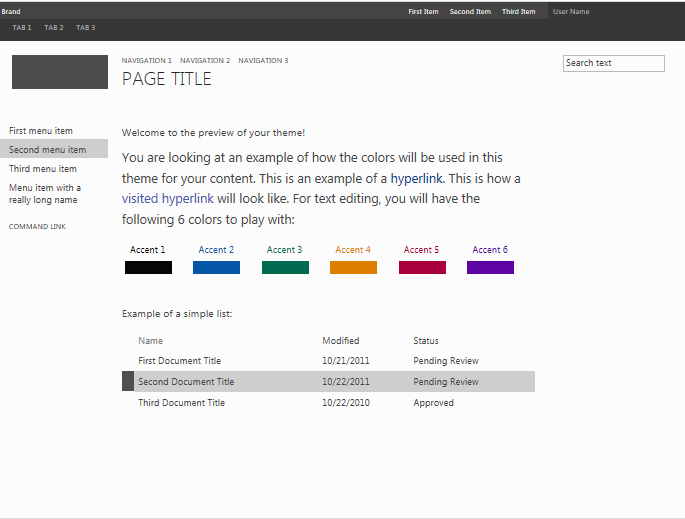

---
title: How to Create a master page preview file in SharePoint
ms.date: 09/25/2017
ms.prod: sharepoint
ms.assetid: 6825518d-eeb2-40b0-8a5b-897025f13796
---


# How to: Create a master page preview file in SharePoint
Learn how to create master page preview files that are used in the SharePoint theming experience to display a preview of selected theme components.
The **Change the look** wizard is the entry point to the SharePoint theming experience. The design gallery is the first page in the **Change the look** wizard and shows a thumbnail view of available designs. Users select a design for their site and then continue to the next page where they can customize the design. Users can then preview the site before applying the design to their site. The master page preview file is used to generate the thumbnail and preview images. If a master page does not have a corresponding preview file, it cannot be used in the theming experience.
  
    
    

For more information, see  [Themes overview for SharePoint](themes-overview-for-sharepoint.md).
## Core concepts to know for working with master page preview files
<a name="Introduction"> </a>

Table 1 lists articles that can help you understand the core concepts for working with master page preview files.
  
    
    

**Table 1. Core concepts for working with master page preview files**


|**Article Title**|**Description**|
|:-----|:-----|
| [Themes overview for SharePoint](themes-overview-for-sharepoint.md) <br/> |Learn about the theming experience in SharePoint.  <br/> |
| [Choose a theme for your publishing site](http://office.microsoft.com/en-us/office365-sharepoint-online-enterprise-help/choose-a-theme-for-your-publishing-site-HA102891580.aspx) <br/> |Learn how to change the look and feel of a SharePoint site by using the **Change the look** wizard. <br/> |
   

## What is a master page preview file?
<a name="section1"> </a>

Master page preview files (.preview files) are specially formatted files that have sections for default color palette, default font scheme, tokenized CSS, and tokenized HTML. The master page preview file must use the same name (excluding the extension) as the corresponding master page. For example, if you have a master page named article.master, the corresponding master page preview file is named article.preview. Master pages and master page previews are stored in the Master Page Gallery.
  
    
    
A master page preview file has the following structure:
  
    
    


```HTML
Default color palette
[SECTION]
Default font scheme
[SECTION]
CSS
[SECTION]
HTML
```

In the master page preview file:
  
    
    

-  _Default color palette_ is the .spcolor file in the Theme Gallery (http:// _SiteColltionName_/_catalogs/theme/15/) that you want to use as the default. The default color palette corresponds to the colors that are used in the master page in its default state. That is, before a user has selected a color palette in the **Change the look** wizard.
    
  
-  _Default font scheme_ is the .spfont file in the Theme Gallery (http:// _SiteCollectionName_/_catalogs/theme/15/) that you want to use as the default. The default font scheme corresponds to the fonts that are used in the master page in its default state. That is, before a user has selected a font scheme in the **Change the look** wizard.
    
  
-  _CSS_ is the section that contains cascading style sheets (CSS). All CSS classes must be prefixed with[ID]. The following example shows a portion of the CSS section in a master page preview file.
    
```
  
[ID] #dgp-pageContainer
{
    background-color: [T_THEME_COLOR_PAGEBACKGROUND];
    color: [T_THEME_COLOR_BODYTEXT];
    width: 100%;
    height:100%;     
    background-image: url('[T_IMAGE]');       
    background-size: cover;
    font-family: [T_BODY_FONT];   
}
```

-  _HTML_ is the HTML section that defines the HTML structure of the preview.
    
  

> **Note:**
> All dimension values should be specified as relative units in the master page preview file. For example, dimension values can be specified as a percent or as an em measurement. For more information about em measurements, see section  [5.1.1. Font-relative lengths: the 'em', 'ex', 'ch', 'rem' units](http://www.w3.org/TR/2012/WD-css3-values-20120308/#font-relative-lengths) in the W3C CSS Values and Units Module Level 3 Working Draft.
  
    
    

Tokens are used throughout the master page preview file. Tokens are string values that will be replaced with text, color values, or font values in the generated preview. The following sections describe the available tokens and how they are used.
  
    
    

### Miscellaneous tokens

The miscellaneous tokens are replaced with specified height and width values in the preview.
  
    
    

**Table 2. Miscellaneous tokens**


|**Token Name**|**Description**|
|:-----|:-----|
|[T_HEIGHT]  <br/> |The height of the preview.  <br/> |
|[T_WIDTH]  <br/> |The width of the preview.  <br/> |
|[T_IMAGE]  <br/> |The URL of an optional background image.  <br/> |
|[T_IMGHEIGHT]  <br/> |The height of the image, if needed.  <br/> |
|[T_IMGWIDTH]  <br/> |The width of the image, if needed.  <br/> |
   

### Color tokens

Color tokens are replaced with color values in the preview image. Table 3 describes two formats for color tokens. Replace  _ColorSlot_ with the annotation name of the color slot. The color tokens must be uppercase (for example, [T_THEME_COLOR_PAGEBACKGROUND]). To see the list of available color tokens, see the [Color slot mapping](color-palettes-and-fonts-in-sharepoint.md#colorSlots) section in [Color palettes and fonts in SharePoint](color-palettes-and-fonts-in-sharepoint.md).
  
    
    

**Table 3. Color tokens**


|**Token Name**|**Description**|
|:-----|:-----|
|[T_THEME_COLOR_ _ColorSlot_]  <br/> |Use this format if you want the color value of the color slot.  <br/> |
|[T_THEME_COLOR_ _ColorSlot__AA]  <br/> |Use this format if you want the 8-digit hexadecimal value of the color slot. This format is useful for filter values to enable opacity and gradients in Internet Explorer.  <br/> |
   

### Font tokens

The font tokens are replaced with font values in the preview image.
  
    
    

- [T_ _SlotName__FONT]
    
  
Replace  _SlotName_ with the name of the font slot. The font tokens must be uppercase (for example, [T_BODY_FONT]).To see the list of font slots and where they are used in a page, see the [Font slots](color-palettes-and-fonts-in-sharepoint.md#fontSlot) section in [Color palettes and fonts in SharePoint](color-palettes-and-fonts-in-sharepoint.md).
  
    
    

### Text content tokens

The tokens listed in Table 4 are used in the HTML section of the master page preview file. The tokens are replaced with sample text in the preview image in the design gallery. The sample text is shown in the same language as the rest of the site.
  
    
    

**Table 4. Text content tokens**


|**Token Name**|**Description**|
|:-----|:-----|
|[BRANDSTRING]  <br/> |The brand text that appears on the page. In the preinstalled themes, it appears on the top-left corner "Brand".  <br/> |
|[SUITELINK1]  <br/> [SUITELINK2]  <br/> [SUITELINK3]  <br/> |The suite links that appear in the suite bar. See "First Item", "Second Item", "Third Item" in Figure 1.  <br/> |
|[WELCOME]  <br/> |The user name text. See "User Name" in Figure 1.  <br/> |
|[RIBBONTAB1]  <br/> [RIBBONTAB2]  <br/> [RIBBONTAB3]  <br/> |The names of ribbon tabs. See "TAB 1", "TAB 2", "TAB 3" in Figure 1.  <br/> |
|[SEARCHBOX]  <br/> |The text inside the search box. See "Search text" in Figure 1.  <br/> |
|[TN1]  <br/> [TN2]  <br/> [TN3]  <br/> |The horizontal navigation items. "NAVIGATION 1", "NAVIGATION 2", "NAVIGATION 3".  <br/> |
|[TITLE]  <br/> |The page title. "Page Title".  <br/> |
|[QL1]  <br/> [QL2]  <br/> [QL3]  <br/> [QL4]  <br/> |The vertical navigation items. "First menu item", "Second menu item", "Third menu item".  <br/> |
|[QLADD]  <br/> |The link below the vertical navigation items. See "COMMAND LINK" in Figure 1.  <br/> |
|[CA TABLE HEADER]  <br/> |The heading above the page text. In Figure 1, "Welcome to the preview of your theme!".  <br/> |
|[CA TABLE DESCRIPTION]  <br/> |The description text. In Figure 1, "You are looking at an example of how the colors will be used in this theme for your content. This is an example of a…".  <br/> |
|[CA ACCENT COLORS]  <br/> |The list of accent colors and blocks.  <br/> |
|[CA LIST TITLE]  <br/> |The heading of the list. In Figure 1, "Example of a list".  <br/> |
|[CA TABLE]  <br/> |The sample list.  <br/> |
|[SITETITLE]  <br/> |The title of the site. See "Site Title" in Figure 1.  <br/> |
   

**Figure 1. Preinstalled theme with sample text**

  
    
    

  
    
    

  
    
    

  
    
    

  
    
    

## Create a master page preview file
<a name="section2"> </a>

To create a master page preview file, use an existing master page preview as a starting point.
  
    
    

### To create a master page preview


1. Make a copy of a master page preview. SharePoint includes oslo.preview and seattle.preview.
    
  
2. Rename the copy of the master page preview to match its corresponding master page. For example, if your master page is named article.master, rename the master page preview article.preview.
    
  
3. Use an HTML editor to edit the master page preview file. Update the file to reflect the layout and appearance of your master page.
    
    > **Tip:**
      > Dimension values are specified as percentages in the master page preview file. The following example shows one method for converting an absolute measurement (pixels) into a relative measurement (percentage). Assume you have a browser size of 1024x768. If the master page has an element height of 32 pixels and the parent element is the body of the page, you calculate the percentage by dividing the element height by the browser height. The relative measurement is 4%(32/768). 
4. Upload the master page preview file to the Master Page Gallery.
    
  
5. Use the **Change the look** wizard to test the master page preview with your site content.
    
    > **Note:**
      > You can also create a design that uses the new master page by adding an item to the Composed Looks list. The design will be available in the design gallery (the first page of the **Change the look** wizard). For more information, see the [Deploy a theme by using the user interface](how-to-deploy-a-custom-theme-in-sharepoint.md#section2) procedure in [How to: Deploy a custom theme in SharePoint](how-to-deploy-a-custom-theme-in-sharepoint.md). 
6. Repeat steps 3 to 5, as necessary.
    
  

## Additional resources
<a name="bk_addresources"> </a>


-  [Develop the site design in SharePoint](develop-the-site-design-in-sharepoint.md)
    
  
-  [How to: Deploy a custom theme in SharePoint](how-to-deploy-a-custom-theme-in-sharepoint.md)
    
  
-  [Color palettes and fonts in SharePoint](color-palettes-and-fonts-in-sharepoint.md)
    
  
-  [SharePoint Team Blog: Show off your style with SharePoint theming](http://blogs.office.com/b/sharepoint/archive/2012/10/29/show-off-your-style-with-sharepoint-theming.aspx)
    
  

