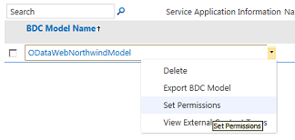
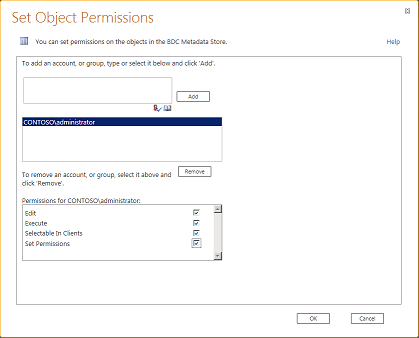
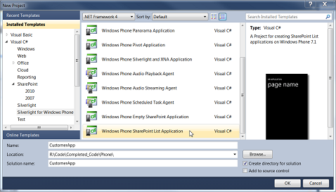
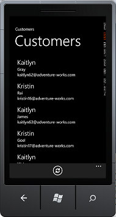

# Create a mobile app in SharePoint that contains data from an external data source

Learn how to create a simple mobile app in SharePoint that contains data from external data source by using Business Connectivity Services and connecting to an external list.
SharePoint enables you to build mobile applications that can access external data from databases, enterprise applications, and Web 2.0 services using Business Connectivity Services. You can also provide complete interaction with the external data including write-back capabilities from your mobile device. You do this by creating apps that connect to external lists, which are a special type of lists in SharePoint that are based on external content types and contain data from an external system. The new Windows Phone SharePoint List template in Visual Studio 2010 Express enables you to quickly and easily create apps for the Windows Phone that connects to external lists. For example, you can build a Windows phone app that brings the product catalog for an inventory list in SharePoint to the phone for the sales people. This topic shows how to create a Windows Phone app that displays external data from the Northwind sample database by connecting to an external list in SharePoint. Notice that in this example, the external list connects to the Northwind database using a custom OData service; however, it's possible to connect to databases directly as well as any external system that is supported by Business Connectivity Services, using external lists. With the new SharePoint List template in Visual Studio, you can create a mobile app that can access an external list on a SharePoint site. This article provides a step-by-step procedure that begins with uploading an external Business Data Connectivity (BDC) service model and ends with testing your new mobile app.
  
    
    

> **Important:**
> If you are developing an app for Windows Phone 8, you must use Visual Studio Express 2012 instead of Visual Studio 2010 Express. Except for the development environment, all information in this article applies to creating apps for both Windows Phone 8 and Windows Phone 7. > For more information, see  [How to: Set up an environment for developing mobile apps for SharePoint](how-to-set-up-an-environment-for-developing-mobile-apps-for-sharepoint.md). 
  
    
    

## Prerequisites for creating a mobile app that contains external data

- A SharePoint installation with administrative privileges to upload the BDC model for the Northwind database and a SharePoint site where you create the external list
    
  
- Microsoft Visual Studio Express with the new SharePoint phone templates from  [Microsoft SharePoint SDK for Windows Phone 7.1](http://www.microsoft.com/en-us/download/details.aspx?id=30476)
    
  
- The BDC model for our exampleNorthwind_oData.bdmc (download from  [SharePoint: Create a simple external list-based phone app](http://code.msdn.microsoft.com/sharepoint/SharePoint-Create-a-88800202))
    
  
- A SharePoint installation with administrative privileges to upload the BDC model for the Northwind database and a SharePoint site where you create the external list
    
  

## Step 1: Upload a BDC metadata model

A BDC model is the core of Business Connectivity Services. It's an XML file that uses data structures such as **Entity** (external content type) and **Method** to abstract out complex details about the external system. It's auto-generated when you create an external content type using SharePoint Designer and for some data source types such .NET and OData sources, you need to create the BDC model manually or by using Visual Studio. When you upload a BDC model to the BDC metadata store using SharePoint Central Administration, the external content types defined in the model can be used to create external lists in SharePoint which are lists that display data from the underlying external system. In this step, you'll upload the Northwind sample BDC model to the Metadata Store using SharePoint Central Administration.
  
    
    

1. Navigate to Central Administration.
    
  
2. Choose **Application Management**, and then choose **Manage Service Applications**.
    
  
3. On the Service Application page, choose **Business Data Connectivity Service**.
    
  
4. On the ribbon in the BDC Service application, choose **Import**.
    
  
5. On the Import BDC Model page, choose **Business Data Connectivity Service**.
    
  
6. On the ribbon in the BDC Service application, choose **Import**.
    
  
7. On the Import BDC Model page, choose **Browse**.
    
  
8. In the **Choose a File to upload** dialog box, browse to the Northwind_oData.bdcm file, and then choose **Open**.
    
  
9. After the file is imported, choose the **OK** button.
    
  

## Step 2: Grant permissions

Next you need to set permissions on the BDC model to specify who can execute the methods described in the model. This is a required step. We recommend that you give specific permissions to each user or group that needs them, in such a way that the credentials provide the least privilege necessary to perform the needed tasks. For more information about setting permissions, see Business Connectivity Service permissions overview in  [Business Connectivity Services security overview (SharePoint Server 2010)](http://technet.microsoft.com/en-us/library/ee661740.aspx). In this step, you give permission to yourself to execute the methods described in the Northwind sample BDC model.
  
    
    

1. Navigate to Central Administration.
    
  
2. Choose **Application Management**, and then choose **Manage Service Applications**.
    
  
3. On the Service Application page, choose **Business Data Connectivity Service**.
    
  
4. In the ribbon, choose **BDC Models** from the drop-down list in the **View** group.
    
  
5. In the list of BDC models, hover over Northwind_oData.bdcm and choose **Set Permissions**, as shown in Figure 1.
    
   **Figure 1. Choosing permissions for BDC model**

  

  
  

  

  
6. In the **Set Object Permissions** dialog box, choose the **Browse** button.
    
  
7. In the **Select People and Groups** dialog box, search for your account and choose the **OK** button.
    
  
8. Select the permissions for **Edit**, **Execute**, **Selectable In Clients**, and **Set Permissions**, as shown in Figure 2.
    
   **Figure 2. Setting object permissions**

  

  
  

  

  
9. Choose the **OK** button.
    
  
10. In the ribbon, select **External Content Types** from the drop-down list in the **View** group.
    
  
11. In the list of external content types, hover over **Customer**, and then choose **Set Permissions**.
    
  
12. In the **Set Object Permissions** dialog box, choose the **Browse** button and search for your account.
    
  
13. In the **Set Object Permissions** dialog box, choose **Add** and select the permissions for **Edit**, **Execute**, **Selectable In Clients**, and **Set Permissions**.
    
  
14. Ensure that the **Propagate Permissions** box is selected.
    
  
15. Choose the **OK** button.
    
  

## Step 3: Create an external list

Now that you've uploaded the BDC model and set permissions, you can create an external list based on the external content type defined in the BDC model. In this step, you will create an external list based on the Customer external content type defined in the Northwind BDC model you uploaded in  [Step 1: Upload a BDC metadata model](how-to-create-a-mobile-app-in-sharepoint-that-contains-data-from-an-externa.md#HowToCreateSimpleExternalListBasedPhoneApp_Step1).
  
    
    

1. Navigate to the SharePoint site where you want the new list.
    
  
2. On the home page of the site, choose **More**.
    
  
3. On the Apps page, choose **Add an App**.
    
  
4. On the Add an App page, hover over **External List** and choose **Add it**.
    
  
5. In the **Adding an External List** dialog box, enter a name such asCustomers in the **Name** field.
    
  
6. In the **External Content Type** box, specify the external data source that you uploaded in step 1.
    
  
7. Choose the **OK** button.
    
  
8. On the Apps page, choose **Customers List** to view the list.
    
  

## Step 4: Create a mobile app using the Windows Phone SharePoint List Application template

Your external list is ready and you can now create a Windows Phone 7 app that connects to the external list you created in  [Step 3: Create an external list](how-to-create-a-mobile-app-in-sharepoint-that-contains-data-from-an-externa.md#HowToCreateSimpleExternalListBasedPhoneApp_Step3) and display Customer data from the Northwind database.
  
    
    

1. Start Visual Studio 2010 Express.
    
  
2. On the menu bar, choose **File**, **New Project**. The **New Project** dialog box opens.
    
  
3. In the **New Project** dialog box, choose **Visual C#**, choose **Silverlight for Windows Phone**, and then choose **Windows Phone SharePoint List Application**.
    
  
4. Specify a name for the project. We use CustomerApp in this example, as shown in Figure 3.
    
   **Figure 3. Selecting the Windows Phone SharePoint List Application template in Visual Studio**

  

  
  

  

  
5. Choose the **OK** button.
    
  
6. In the **SharePoint Phone Application Wizard**, enter the URL of the SharePoint site in which you created the external list.
    
  
7. Choose the **Customers** list, and choose **Next**.
    
  
8. On the **Choose Views** screen, select **Customer Read List** and choose **Next**.
    
  
9. On the **Choose Operations** screen, choose **Display**, and then choose **Next**.
    
  
10. On the **Choose Fields** screen, select the fields you want to use or display in your mobile app, and then choose **Next**.
    
  
11. On the **Order Fields** screen, reorder the fields if needed, and then choose **Finish**.
    
  
12. You've now successfully created the app that connects to the external list.
    
  

## Run and test your app

Now that the app is ready to run, you can test it using phone emulator.
  
    
    

1. In Visual Studio, choose **Debug**, and then choose **Start Debugging**, or press F5.
    
  
2. When prompted, log in by using the same username and password that you used to log in to the SharePoint site. Ensure that you have admin rights.
    
  
3. Scroll through the resulting Customers list, as shown in Figure 4.
    
   **Figure 4. Mobile app displaying SharePoint external list**

  

  
  

  

  

> **Note:**
> When you use the SharePoint List Template wizard to create a mobile app for an external list that has read-only fields, the code that is generated by the wizard does not allow users to create or edit items. 
  
    
    

## Additional resources

  
    
    

-  [Build Windows Phone apps that access SharePoint](build-windows-phone-apps-that-access-sharepoint.md)
    
  
-  [Overview of Windows Phone SharePoint application templates in Visual Studio](overview-of-windows-phone-sharepoint-application-templates-in-visual-studio.md)
    
  
-  [How to: Create External Lists in SharePoint](http://msdn.microsoft.com/en-us/library/ee558778.aspx)
    
  
-  [How to: Create a Windows Phone SharePoint list app](how-to-create-a-windows-phone-sharepoint-list-app.md)
    
  
-  [How to: Set up an environment for developing mobile apps for SharePoint](how-to-set-up-an-environment-for-developing-mobile-apps-for-sharepoint.md)
    
  
-  [Windows Phone SDK 7.1](http://www.microsoft.com/en-us/download/details.aspx?id=27570)
    
  
-  [Microsoft SharePoint SDK for Windows Phone 7.1](http://www.microsoft.com/en-us/download/details.aspx?id=30476)
    
  

