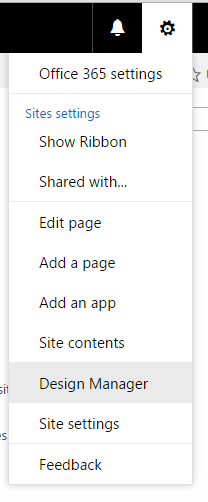

# Create a page layout in SharePoint

When you use Design Manager to create a page layout, two files are created: an .aspx file that SharePoint uses, and an HTML version of that page layout that you can edit in your HTML editor. The HTML file and page layout are associated, so that whenever you edit and save the HTML file, your changes are synced to the associated page layout.

## Introduction to page layouts
<a name="Introduction"> </a>

When you use Design Manager to create a page layout, two files are created: an .aspx file that SharePoint uses, and an HTML version of that page layout that you can edit in your HTML editor. The HTML file and page layout are associated, so that whenever you edit and save the HTML file, your changes are synced to the associated page layout.
  
    
    
When you create a master page, you upload and convert an HTML file directly into a master page. But, unlike a master page, you do not directly convert an HTML file into a page layout. This is because the primary purpose of a page layout is to contain page fields, and these page fields must get added when the page layout is created in Design Manager.
  
    
    
When you create a page layout:
  
    
    

- An .aspx file and an HTML file with the same name are created in the Master Page Gallery.
    
  
- All markup required by SharePoint is added to the .aspx file so that the page layout renders correctly.
    
  
- Other markup such as comments, **<div>** tags, snippets, and content placeholders are added to the HTML file.
    
  
- Page fields unique to the content type are added automatically to the page layout. Other page fields are available to be added from the ribbon in the Snippet Gallery.
    
  
- The HTML file and the .aspx file are associated, so that any later edits to the HTML file are synced to the .aspx file whenever the HTML file is saved. Other markup such as comments, **<div>** tags, snippets, and content placeholders are added to the HTML file.
    
> [!NOTE]
> The syncing goes in one direction only. Changes to the HTML page layout are synced to the associated .aspx file, but if you choose to edit the .aspx file directly, those changes are not synced to the HTML file. Every HTML page layout (and every HTML master page) has a property named **Associated File** that is set to **True** by default, which creates the association and syncing between files.
  
    
    

For example, if you have a pair of associated files (HTML and .aspx) and you edit the .aspx file without breaking the association,the .aspx file changesare saved, but you can't check in or publish the .aspx file, so those changes are not saved in a meaningful way. Any changes to the HTML file override the .aspx file. If you check in or publish the HTML file, the HTML file changes override any changes that were made to the .aspx file. The .aspx file changes are lost.
  
    
    
If you're a developer comfortable working with ASP.NET, you can choose to work only with the .aspx file by breaking the association between the files. To break the association between the HTML file and .aspx file, in Design Manager, choose **Edit Properties** for the HTML file, and then clear the **Associated File** check box. You can later re-associate the files by editing the properties and selecting this check box, in which case changes saved in the HTML file will again overwrite the .aspx file.
  
    
    

## Understanding the relationship between page fields and a content type
<a name="UnderstandingPageFields"> </a>

Every page layout is associated with a content type, typically one of the content types in the Page Layout group. For example, the Article Page content type that is associated with the Article Page page layout, both of which are included in a publishing site.
  
    
    
A content type is made of site columns, which together define a schema of allowed data types. You can tell that site columns are unique to the current content type because the Source column is blank—this means that these site columns are defined by the current content type, and are not inherited from a parent content type.
  
    
    
For any given page layout, the site columns that make up the content type correspond directly to the page fields that are available for that page layout. The first group of page fields on the ribbon is page fields that get automatically added to the page layout when you create it. SharePoint adds these fields automatically because they're unique to this content type, and so it's likely that these fields were created specifically to be used by the page layout, as opposed to being general SharePoint metadata.
  
    
    
Before you create a page layout in Design Manager, you may first have to create a content type that defines the page fields that you want for that page layout
  
    
    

## Understanding the relationship between content placeholders on a page layout and master page
<a name="UnderstandingContentPlaceholders"> </a>

A page layout and a master page must have the identical set of content placeholders for the page layout to render correctly. This is not a problem if you use Design Manager to create master pages and page layouts, because the correct set of content placeholders is added to every file when you create it. This ensures that every page layout works across every channel that uses a different master page. You don't have to know about or work with most of these content placeholders. They exist because they're required by SharePoint to render the page correctly.
  
    
    
But, if you edit an HTML page layout and manually add a content placeholder, you should add that same content placeholder to every master page that needs to work with that page layout. This is not a common scenario.
  
    
    
If you're using Design Manager to create page layouts and master pages, the most common scenario is that you're working with only the following content placeholders:
  
    
    

- **PlaceHolderMain** The master page contains a content placeholder with `ID="PlaceholderMain"`, which contains the **DefaultContentBlock** **<div>** tag with the yellow box that shows **This area will be filled in by content you create in your page layouts.** You should not put any content inside this placeholder on the master page. The page layout contains a content placeholder with the same ID. You should put markup only inside this placeholder, and put no markup outside this placeholder, on a page layout. The IDs for the two placeholders ( **PlaceholderMain**) should match.
    
  
- **PlaceHolderAdditionalPageHead** When you work with a page layout, you typically don't insert elements into the **<head>** tag of the page layout. Instead, you add elements to the content placeholder with `id="PlaceHolderAdditionalPageHead"`. When a content page is rendered in the browser, this additional page head gets merged into the end of the head of the master page. 
    
  

## Create a page layout
<a name="CreatePageLayout"> </a>

Before you begin, you need to know which content type and master page the page layout will be associated with.
  
    
    

### To create a page layout


1. Browse to your publishing site.
    
  
2. In the upper-right corner of the page, choose the gear icon, and then choose **Design Manager**.
    
   **Gear icon menu**

  

  
  

  

  
3. In Design Manager, in the left navigation pane, choose **Edit Page Layouts**.
    
  
4. Choose **Create a page layout**.
    
  
5. In the **Create a Page Layout** dialog box, enter a name for your page layout.
    
  
6. Select a master page.
    
    The master page that you choose here will be shown in the preview for this page layout. This master page also determines what content placeholders get added to the page layout.
    
    > [!NOTE]
    > After you choose this master page, you cannot preview the page layout with a different master page, even after you apply a different master page to the live site. 

7. Select a content type. The content type for this page layout determines what page fields will be available for this page layout in the Snippet Gallery.
    
  
8. Choose **OK**.
    
    At this point, SharePoint creates an HTML file and an .aspx file with the same name.
    
    In Design Manager, your HTML file now appears with a Status column that shows one of two possible statuses:
    
  - **Warnings and Errors**
    
  
  - **Conversion successful**
    
  
9. Click the link in the Status column to preview the file and to view any errors or warnings about the master page.
    
    The preview page is a live server-side preview of your page layout. The top of the preview displays any warnings or errors that you may have to resolve by editing the HTML file in an HTML editor. Errors must be fixed before the preview will display the page layout correctly.
    
    For more information about resolving errors and warnings, see  [How to: Resolve errors and warnings when previewing a page in SharePoint](how-to-resolve-errors-and-warnings-when-previewing-a-page-in-sharepoint.md).
    
    For more information about previewing the page layout, see  [How to: Change the preview page in SharePoint Design Manager](how-to-change-the-preview-page-in-sharepoint-design-manager.md).
    
    The preview page also contains a **Snippets** link in the upper-right corner. This link opens the Snippet Gallery, where you can begin replacing mockup controls in your design with dynamic SharePoint controls. For more information, see [SharePoint Design Manager snippets](sharepoint-design-manager-snippets.md).
    
  
10. To fix any errors, edit the HTML file that resides directly on the server by using an HTML editor to open and edit the HTML file in the mapped drive. Each time you save the HTML file, any changes are synced to the associated .aspx file.
    
  
11. The preview of the page layout shows the page fields that were added automatically to the page layout. These page fields are site columns that are unique to the current content type. Now you are ready to style the page layout according to your original HTML mockups.
    
  

## Determine where the styles for a page layout should go
<a name="WhereStyles"> </a>

When you create HTML mockups for your site, you may have HTML files that represent different classes of pages, such as an article page or an item details page that contains a web part to display the details of a single item from a catalog. After you create the page layout that represents that class of pages, you're ready to transfer the styles from your HTML mockup to the HTML version of your page layout.
  
    
    
You can simply put the styles for one or more page layouts into the same style sheet that the master page links to. But, if you want to minimize the weight of the CSS that is loaded per page, you can also use different style sheets for different page layouts. When you do this, it's important to know that a link to a style sheet cannot go in the **<head>** tag of a page layout. Instead, the link must go in the content placeholder named **PlaceHolderAdditionalPageHead**. 
  
> [!NOTE]
> In this markup, the attribute  `ms-design-css-conversion="no"` excludes the style sheet from theming. Also, the link to the style sheet should appear after the lines commented **<!--SPM**. 
  
    
    


```HTML

<!--MS:<asp:ContentPlaceHolder id="PlaceHolderAdditionalPageHead" runat="server">-->
            <!--SPM:<%@Register Tagprefix="SharePoint" Namespace="Microsoft.SharePoint.WebControls" Assembly="Microsoft.SharePoint, Version=15.0.0.0, Culture=neutral, PublicKeyToken=71e9bce111e9429c"%>-->
            <!--SPM:<%@Register Tagprefix="Publishing" Namespace="Microsoft.SharePoint.Publishing.WebControls" Assembly="Microsoft.SharePoint.Publishing, Version=15.0.0.0, Culture=neutral, PublicKeyToken=71e9bce111e9429c"%>-->
<link href="MyPageLayout.css" rel="stylesheet" type="text/css" ms-design-css-conversion="no" />
        <!--ME:</asp:ContentPlaceHolder>-->

```

When a site visitor browses a page that uses this page layout, this additional page head gets merged into the end of the head of the master page—so, styles for the page layout are applied after styles for the master page.
  
    
    
In this way, each page layout can have its own style sheet. For example, you can have a **<div>** with `id="xyz"` in one page layout that appears on the left, and in another page layout appears on the right.
  
    
    
Each page layout can also have one or more device channel-specific style sheets. For example, you might want a page layout to have a layout for phones that is different from the desktop layout. To do this, you can include one or more device channel panels inside **PlaceHolderAdditionalPageHead**, where each channel panel includes a link to a style sheet with channel-specific styles. This way, for example, a **<div>** with `id="abc"` can display large text in one channel and small text in a different channel.
  
    
    
The following are some common scenarios for where to put the style sheet links for page layouts.
  
    
    

### Link to styles from a master page

The simplest scenario is to include styles for one or more page layouts in the same style sheet that the master page links to. In the master page, place the link to the .css file just before the closing **</head>** tag, so that it overrides the default SharePoint style sheets such as corev15.css.
  
    
    

```HTML

<head>
…
<link rel="stylesheet" type="text/css" href="MyStyleSheet.css" />
</head>

```


### Link to styles from a page layout

If you want to minimize the weight of CSS that gets loaded with each page, you can have separate CSS files for each page layout. In this scenario, the styles for a page layout go in the content placeholder named **PlaceHolderAdditionalPageHead**.
  
    
    

```HTML

<!--MS:<asp:ContentPlaceHolder id="PlaceHolderAdditionalPageHead" runat="server">-->
            <!--SPM:<%@Register Tagprefix="SharePoint" Namespace="Microsoft.SharePoint.WebControls" Assembly="Microsoft.SharePoint, Version=15.0.0.0, Culture=neutral, PublicKeyToken=71e9bce111e9429c"%>-->
            <!--SPM:<%@Register Tagprefix="Publishing" Namespace="Microsoft.SharePoint.Publishing.WebControls" Assembly="Microsoft.SharePoint.Publishing, Version=15.0.0.0, Culture=neutral, PublicKeyToken=71e9bce111e9429c"%>-->
<link href="MyPageLayout.css" rel="stylesheet" type="text/css" ms-design-css-conversion="no" />
        <!--ME:</asp:ContentPlaceHolder>-->

```


### Link to styles in the page layout per device channel

If you have different device channels, you likely want your page layouts to render differently for different channels. In this scenario, you include one or more device channel panels inside **PlaceHolderAdditionalPageHead**, and then include a link to channel-specific CSS files inside each channel panel.
  
    
    

```HTML

<!--MS:<asp:ContentPlaceHolder id="PlaceHolderAdditionalPageHead" runat="server">-->
<div data-name="DeviceChannelPanel">
    <!--CS: Start Device Channel Panel Snippet-->
    <!--SPM:<%@Register Tagprefix="Publishing" Namespace="Microsoft.SharePoint.Publishing.WebControls" Assembly="Microsoft.SharePoint.Publishing, Version=15.0.0.0, Culture=neutral, PublicKeyToken=71e9bce111e9429c"%>-->
    <!--MS:<Publishing:DeviceChannelPanel runat="server" IncludedChannels="Channel1">-->
…..
<link rel="stylesheet" type="text/css" href="MyStyleSheet.css" ms-design-css-conversion="no" />
    <!--ME:</Publishing:DeviceChannelPanel>-->
    <!--CE: End Device Channel Panel Snippet-->
</div><div data-name="DeviceChannelPanel">
    <!--CS: Start Device Channel Panel Snippet-->
    <!--SPM:<%@Register Tagprefix="Publishing" Namespace="Microsoft.SharePoint.Publishing.WebControls" Assembly="Microsoft.SharePoint.Publishing, Version=15.0.0.0, Culture=neutral, PublicKeyToken=71e9bce111e9429c"%>-->
    <!--MS:<Publishing:DeviceChannelPanel runat="server" IncludedChannels="Channel2">-->
…..
<link rel="stylesheet" type="text/css" href="CSS5.css" />
    <!--ME:</Publishing:DeviceChannelPanel>-->
    <!--CE: End Device Channel Panel Snippet-->
</div>

```


## Understanding the markup in the HTML page layout
<a name="UnderstandMarkup"> </a>

When you create a page layout, an .aspx file gets created that SharePoint uses, and some HTML markup gets added to the HTML version of the page layout. When you edit the HTML page layout in your HTML editor, it might be helpful to understand the purpose of some of this markup. Most of it is similar to the markup that gets added to an HTML master page. For more information, see  [How to: Convert an HTML file into a master page in SharePoint](how-to-convert-an-html-file-into-a-master-page-in-sharepoint.md).
  
    
    
The markup that is unique to page layouts is page fields that are added to the page layout based on the content type that the page layout is associated with. Page fields appear inside the content placeholder with  `id="PlaceHolderMain"`. For example, the following markup for **PlaceHolderMain** contains two page fields that represent the **Title** and **Page Image** fields from the associated content type.
  
    
    


```HTML

<!--MS:<asp:ContentPlaceHolder ID="PlaceHolderMain" runat="server">-->
            <div>
                <!--CS: Start Page Field: Title Snippet-->
                <!--SPM:<%@Register Tagprefix="PageFieldTextField" Namespace="Microsoft.SharePoint.WebControls" Assembly="Microsoft.SharePoint, Version=15.0.0.0, Culture=neutral, PublicKeyToken=71e9bce111e9429c"%>-->
                <!--SPM:<%@Register Tagprefix="Publishing" Namespace="Microsoft.SharePoint.Publishing.WebControls" Assembly="Microsoft.SharePoint.Publishing, Version=15.0.0.0, Culture=neutral, PublicKeyToken=71e9bce111e9429c"%>-->
                <!--MS:<Publishing:EditModePanel runat="server" CssClass="edit-mode-panel">-->
                    <!--MS:<PageFieldTextField:TextField FieldName="fa564e0f-0c70-4ab9-b863-0177e6ddd247" runat="server">-->
                    <!--ME:</PageFieldTextField:TextField>-->
                <!--ME:</Publishing:EditModePanel>-->
                <!--CE: End Page Field: Title Snippet-->
            </div>
            <div>
                <!--CS: Start Page Field: Page Image Snippet-->
                <!--SPM:<%@Register Tagprefix="PageFieldRichImageField" Namespace="Microsoft.SharePoint.Publishing.WebControls" Assembly="Microsoft.SharePoint.Publishing, Version=15.0.0.0, Culture=neutral, PublicKeyToken=71e9bce111e9429c"%>-->
                <!--MS:<PageFieldRichImageField:RichImageField FieldName="3de94b06-4120-41a5-b907-88773e493458" runat="server">-->
                    <!--PS: Start of READ-ONLY PREVIEW (do not modify)--><div id="ctl02_label" style="display:none">Page Image</div><div id="ctl02__ControlWrapper_RichImageField" class="ms-rtestate-field" style="display:inline" aria-labelledby="ctl02_label"><div align="left" class="ms-formfieldcontainer"><div class="ms-formfieldlabelcontainer" nowrap="nowrap"><span class="ms-formfieldlabel" nowrap="nowrap">Page Image</span></div><div class="ms-formfieldvaluecontainer"><div class="ms-rtestate-field"></div></div></div></div><!--PE: End of READ-ONLY PREVIEW-->
                <!--ME:</PageFieldRichImageField:RichImageField>-->
                <!--CE: End Page Field: Page Image Snippet-->
            </div>
        <!--ME:</asp:ContentPlaceHolder>-->

```


## See also
<a name="AdditionalResources"> </a>


-  [Overview of Design Manager in SharePoint](overview-of-design-manager-in-sharepoint.md)
    
  
-  [How to: Convert an HTML file into a master page in SharePoint](how-to-convert-an-html-file-into-a-master-page-in-sharepoint.md)
    
  
-  [SharePoint Design Manager snippets](sharepoint-design-manager-snippets.md)
    
  

