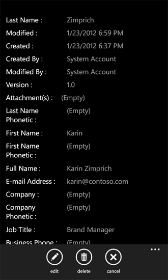

# How to: Create a Windows Phone SharePoint 2013 list app
Create a Windows Phone app in Visual Studio based on the Windows Phone SharePoint List Application template.
Installing the Windows Phone SharePoint SDK makes two Windows Phone SharePoint Application templates available to you in Visual Studio 2010 or Visual Studio 2010 Express for Windows Phone. (See  [How to: Set up an environment for developing mobile apps for SharePoint](how-to-set-up-an-environment-for-developing-mobile-apps-for-sharepoint.md).) Using the Windows Phone SharePoint List Application template, you can follow the steps of a wizard to create a functional Windows Phone app that can access and manipulate data in a SharePoint list.
  
    
    

> [!IMPORTANT]
> If you are developing an app for Windows Phone 8, you must use Visual Studio Express 2012 instead of Visual Studio 2010 Express. Except for the development environment, all information in this article applies to creating apps for both Windows Phone 8 and Windows Phone 7. > For more information, see  [How to: Set up an environment for developing mobile apps for SharePoint](how-to-set-up-an-environment-for-developing-mobile-apps-for-sharepoint.md). 
  
    
    

If you'd like to see a demo of creating a mobile app before you start this how-to article, watch the following video.
  
    
    

**Creating mobile apps with SharePoint 2013 demo**

  
    
    

  
    
    

  
    
    

  
    
    

  
    
    

## Create the Windows Phone SharePoint list application

In your Windows Phone SharePoint list app, you can access most of the lists that are available in SharePoint Add-ins. For the purposes of this sample Windows Phone app, we use SharePoint lists with sample data from a fictitious company named Contoso, Ltd. For the steps to create the first iteration of this SharePoint list app, we use a SharePoint Contacts list that contains information about members of a marketing team at Contoso, as shown in Figure 1.
  
    
    

**Figure 1. Contacts list for Contoso marketing team**

  
    
    

  
    
    

  
    
    

### To create a Windows Phone SharePoint list app

1. Start Visual Studio 2010 by using the **Run as Administrator** option.
    
  
2. Choose **File**, **New**, **Project**. 
    
    The **New Project** dialog box appears.
    
  
3. In the **New Project** dialog box, expand the **Visual C#** node, and then choose the **Silverlight for Window Phone** node. (Ensure that the target .NET Framework version is set to 4.)
    
    > [!NOTE]
      > The templates installed by the Windows Phone SharePoint SDK work only in C# projects. The templates are not available for Visual Basic projects. 
4. In the **Templates** pane, choose the **Windows Phone SharePoint List Application** template and give the project a name, such asContosoSPListApp.
    
  
5. While running the **SharePoint Phone Application Wizard**, the error shown in Figure 2 can occur. This error occurs because the account the developer is using while running the **SharePoint Phone Application Wizard** has insufficient permissions.
    
   **Figure 2. SPList wizard error message**

  

     
  

    You can resolve this error by giving sufficient privileges to the account with which the developer is running the SPList wizard. Rerun **Splist wizard** after sufficient rights are given.
    
  
6. Choose the **OK** button. The **SharePoint Phone Application Wizard** appears. You use this wizard to choose a SharePoint list and configure properties of that list to determine how it appears in your Windows Phone app.
    
  
7. Specify the URL of a target SharePoint site on your network (that is, an on-premises installation of SharePoint Server).
    
  
8. Choose **Find Lists**. If the account under which you are running Visual Studio has access to the specified target site, the **SharePoint Phone Application Wizard** displays the lists that are available on that site.
    
  
9. Select one of the available lists, such as a Contacts list (shown with sample data in a customized view in Figure 1).
    
  
10. Choose **Next**. The wizard displays the available views associated with the selected list.
    
    The views displayed by the wizard are those views that have been created by users (or provisioned by SharePoint Server) and associated with a given list on the server. Some SharePoint lists have only one view associated with them by default. A Contacts list, by default, is associated with an All Contacts view. An Announcements list, by default, is associated with an All Items view. A Tasks lists, by default, is associated with six views, including an All Tasks view and an Active Tasks view. For each view that you select at this stage in the wizard, a **PivotItem** control is created and added to the **Pivot** control in the XAML that defines the UI of the Windows Phone app.
    
  
11. Select the check box next to each view you want to include in your Windows Phone app.
    
  
12. Choose **Next**. The wizard displays the available actions for the selected list in your Windows Phone app.
    
    The choices are **New**, **Display**, **Edit**, and **Delete**. If you want to be able to edit or delete list items in your app, you must choose the **Display** operation at this stage in the wizard. (The check boxes for the **Edit** and **Delete** operations are disabled unless the **Display** operation is selected.)
    
  
13. Select the check box next to each action you want to have available for the selected list in your Windows Phone app.
    
  
14. Choose **Next**. The wizard displays the fields associated with the selected list on the SharePoint site.
    
    > [!NOTE]
      > A custom field will not be available to select from the SharePoint List wizard for mobile devices. However, you can write custom code to access any custom field. A field cannot be associated with its content type. However if multiple content types are enabled for the list, all the fields will be available for developers to consume in their phone apps. 
15. Select the check box next to each field you want to include in the list as it will appear in your Windows Phone app.
    
    > [!NOTE]
      > List fields that are designated in SharePoint Server as requiring information are selected already; they can't be cleared in the wizard. 
16. Choose **Next**. The wizard gives you the opportunity to order the fields you selected in the previous step.
    
  
17. Order the fields according to your needs by selecting individual fields and moving them higher or lower in the order by choosing the up or down arrows.
    
  
18. Choose **Finish**. Visual Studio creates the necessary files for the project and opens the List.xaml file for editing.
    
  

## Run the Windows Phone app generated by the SharePoint Phone Application Wizard

The project generated by the **SharePoint Phone Application Wizard** can be built as it is to create a simple but functional Windows Phone SharePoint list app. We can modify and develop the app further, but, for now, a user can tap (or, in the Windows Phone Emulator, click) a given list item and the app displays all the fields associated with that item (those fields that you selected in the wizard to include in the app). A user can also add new list items, delete list items, and edit the field values for list items. Multiple-user logon in a single app is not supported. However, a developer can write code that logs off the current user when another user tries to log on to the same mobile app.
  
    
    
The deployment target for the solution is set to Windows Phone Emulator by default. You can run the project in Visual Studio as it is (either by pressing F5 to start the project in the context of the debugger or by pressing CTRL+F5 to start the project without debugging). The Windows Phone Emulator is launched, the Windows Phone operating system is loaded, and your app is deployed to the emulator and started. If you start with the code as it is generated by the wizard, when your SharePoint list app runs in the emulator, you're asked for credentials for the specified SharePoint list on the target site. Provide the credentials for an account that has sufficient permissions to access the list and choose **Log On** in the emulator. The main page of the Windows Phone app (defined by the List.xaml file in the project) is displayed in the emulator. Depending on the fields you chose and the order you specified for those fields in the previous steps, you should see items from the specified list. Based on the data in the list represented by Figure 1, you would see a list of items in the emulator as shown in Figure 3.
  
    
    

**Figure 3. SharePoint list items in a Windows Phone app**

  
    
    

  
    
    

  
    
    
While running a Windows Phone app, the authentication error shown in Figure 4 can occur. This happens because the SharePoint mobile app requires **Basic Form Authentication**; this isn't enabled by default.
  
    
    

**Figure 4. Windows Phone app authentication error**

  
    
    

  
    
    

  
    
    
You can resolve this error by choosing **Basic form authentication** from Central Administration.
  
    
    

### To enable Basic form authentication

1. Navigate to **Central Administration**; ensure you have admin rights on server.
    
  
2. Choose **Manage Web Applications** under **Application Management**.
    
  
3. Choose your web application (on which you have your SharePoint site, which you are accessing from your mobile app).
    
  
4. Choose **Authentication Providers** from the ribbon.
    
  
5. Choose **Authentication Providers** from the ribbon.
    
  
6. In the **Authentication Provider** dialog box, choose **Default** to Edit Authentication.
    
  
7. In the **Edit Authentication** model window, choose **Basic Authentication** under **Claims Authentication** types.
    
  
If you based your Windows Phone app on the data from a Contacts list, as shown in Figure 1, you can choose a particular list item and the app presents a page with a view of the item (defined by DisplayForm.xaml in the project) showing all the fields available for the item in the app, as in Figure 5. (For this example, all the fields associated with a SharePoint Contacts list were selected in the SharePoint Phone Application Wizard and the default order of those fields was retained.)
  
    
    

**Figure 5. DisplayForm view of a Contacts list item**

  
    
    

  
    
    

  
    
    
Notice the **Edit** and **Delete** buttons on the Application Bar in this page of the app. These operations are implemented for you by methods in Microsoft.SharePoint.Phone.Application.dll (which is one of the libraries installed by the Windows Phone SharePoint SDK). If you choose the **Edit** button, a Windows Phone **Page** control (that is, an object instantiated from a class that inherits from the **Microsoft.Phone.Controls.PhoneApplicationPage** class) is displayed. If you edit any of the fields and choose the **Submit** button on that page in the app, the underlying **UpdateItem** method of the **EditItemViewModelBase** class is executed (which, ultimately, executes the **Update** method of a **ListItem** object from the SharePoint Silverlight client object model) to save your changes to the SharePoint list.
  
    
    

## Additional resources

-  [Build Windows Phone apps that access SharePoint 2013](build-windows-phone-apps-that-access-sharepoint.md)
    
  
-  [How to: Set up an environment for developing mobile apps for SharePoint](how-to-set-up-an-environment-for-developing-mobile-apps-for-sharepoint.md)
    
  
-  [Windows Phone SDK 8.0](http://www.microsoft.com/en-us/download/details.aspx?id=35471)
    
  
-  [Microsoft SharePoint SDK for Windows Phone 8](http://www.microsoft.com/en-us/download/details.aspx?id=36818)
    
  
-  [Windows Phone SDK 7.1](http://www.microsoft.com/en-us/download/details.aspx?id=27570)
    
  
-  [Microsoft SharePoint SDK for Windows Phone 7.1](http://www.microsoft.com/en-us/download/details.aspx?id=30476)
    
  

