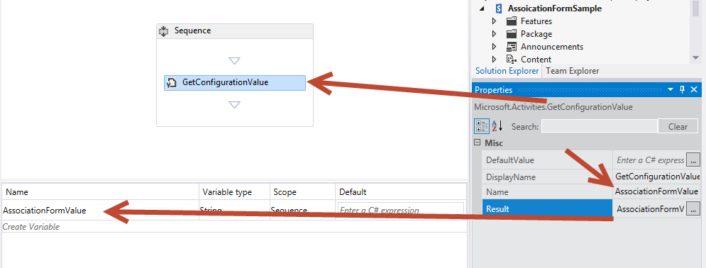

# Create custom SharePoint workflow forms with Visual Studio 2012

Presents workflow forms in SharePoint. This article uses SharePoint with the March 2013 Public Update applied and Office Developer tools for Visual Studio 2012. Everything in this article applies to both SharePoint on-premises deployments as well as Office 365.

**Provided by:** [Andrew Connell](http://social.msdn.microsoft.com/profile/andrew%20connell%20%5bmvp%5d/),  [www.AndrewConnell.com](http://www.andrewconnell.com)

Since the release of Microsoft SharePoint 2007, the SharePoint platform has supported using workflows to automate business processes. The SharePoint workflow platform is built on the Windows Workflow Foundation, which is part of the .NET Framework. While the Workflow Foundation provides many capabilities for authoring custom workflows and managing automated business processes, SharePoint also adds end-user integration. This integration is implemented in two parts: 
- **Tasks** assigned to users and groups that can be created and monitored by the workflows.

- **Forms** that collect information from users when workflows are associated with a type of content (for example, a site, list, or library) or when a workflow is started.
    
  

## Workflow forms in SharePoint 2007 and SharePoint 2010
<a name="sec1"> </a>

The implementation of workflows in SharePoint 2007 and SharePoint 2010 provided steady improvements from version to version. In particular, Microsoft added new functionality in SharePoint 2010, such as the ability to associate workflows with sites. It also improved the workflow authoring tools, SharePoint Designer 2010 and Visual Studio 2010, over their predecessors. However, in SharePoint, the implementation of workflow tasks and workflow forms remained largely unchanged.
  
    
    
Prior to SharePoint, developers were presented with two options for creating workflow forms. In SharePoint 2007, InfoPath forms and ASP.NET Web Forms were both recommended equally. Each had advantages and disadvantages. In SharePoint 2010, developers were encouraged to use ASP.NET Web Forms as that is what the SharePoint developer tools in Visual Studio 2010 created using the association and initiation workflow form project item templates, but the implementation was very similar to that in SharePoint 2007.
  
    
    

## Changes to workflow forms in SharePoint
<a name="sec2"> </a>

SharePoint introduced a new workflow architecture and platform that reflects some fundamental shifts in the thinking about SharePoint. The primary change is that workflows in SharePoint are no longer managed and executed by the SharePoint runtime engine. Instead, SharePoint utilizes a new component called Workflow Manager, which hosts the Windows Workflow Foundation runtime and necessary services required by Workflow Foundation. The important point is that Workflow Manager runs outside of SharePoint. When a workflow is published, or a new instance of a published workflow is started, SharePoint notifies Workflow Manager, which in turn processes the workflow episodes. When the workflow needs to access information in SharePoint, such as list item properties or user properties, it authenticates the user with the OAuth authorization model and communicates over the REST APIs that were introduced in the SharePoint release.
  
    
    
The overall direction for doing customizations on the SharePoint platform also changed in the SharePoint release, although this change actually started with SharePoint 2010 and sandboxed solutions. In SharePoint, Microsoft introduced features that moved customizations away from SharePoint server and moved them to the client browser or to other external resources. These features include the new SharePoint App Model, support for assigning apps an identity, authentication using the OAuth authorization model, and improvements to the client-side object model (CSOM) and REST APIs.
  
    
    
How does this affect workflow forms? Recall that starting in SharePoint 2010 Microsoft began encouraging developers to use ASP.NET Web Forms when creating forms in workflows authored using Visual Studio. Of course, this approach requires server-side code to process the form and handled communication between the form and the workflow engine. However, in SharePoint, this is only possible in the solution-style development (that is, deployment of *.WSP packages). The new SharePoint App Model introduced in SharePoint does not allow server-side code to run in the SharePoint process.
  
    
    
To alleviate this limitation, Microsoft extended CSOM to include an API for interacting with the workflow engine. To connect a SharePoint farm to the Workflow Manager farm, you must install the Workflow Manager Client on the SharePoint servers. This component serves as a proxy that SharePoint uses to communicate with the Workflow Manager farm. The Workflow Services CSOM API is effectively the client-side component that you use to interact with the new workflow engine. For more information about SharePoint Workflow Services CSOM, see  [Working with the SharePoint Workflow Services Client Side Object Model](working-with-the-sharepoint-workflow-services-client-side-object-model.md).
  
    
    
How, then, does this benefit SharePoint workflow forms? Well, when authoring SharePoint workflows using Visual Studio 2012, you create workflow forms using ASP.NET Web Forms. You can deploy these forms as a SharePoint solution or (and this is the important part) within . This gives you access to all the server controls that are already deployed to the server, such as the ASP.NET Web Controls and other useful (and required at times) SharePoint controls. You can also use the new Workflow Services CSOM to perform all necessary tasks from association and initiation forms including, but not limited to, the following:
  
    
    

- Creating workflow task and history lists
    
  
- Creating a new workflow association on a site, list, or document library
    
  
- Starting a new instance of an existing workflow association
    
  
The Workflow Services CSOM is very robust and gives you a lot of room for innovation in workflows—all from the browser or a remote machine.
  
    
    

## Workflow forms available in SharePoint Sever 2013
<a name="sec3"> </a>

Prior the release of SharePoint, there were three types of custom workflow forms you could create: **Initiation**, **Association**, and **Task Edit** forms. Of these three types of forms, task edit forms have been de-emphasized as a custom forms solution. The de-emphasis of Task Edit forms started with SharePoint 2010 because the Visual Studio 2010 SharePoint development tools lacked a project item for task forms, relying instead on the standard list display and edit forms to render tasks.
  
    
    
SharePoint improves how you work with workflow tasks in that you can create custom outcome buttons for specific scenarios. You can also customize the rendering and behavior of specific columns in task items using the new Client Side Rendering (CSR), which was introduced in SharePoint. Note that CSR uses JavaScript executed in the client. These topics are covered in the article  [Working with Tasks in SharePoint Workflows using Visual Studio 2012](working-with-tasks-in-sharepoint-workflows-using-visual-studio-2012.md). You can also get more information in the article  [Customize a list view in SharePoint Add-ins using client-side rendering](http://msdn.microsoft.com/library/8d5cabb2-70d0-46a0-bfe0-9e21f8d67d86%28Office.15%29.aspx).
  
    
    

### Understanding workflow initiation forms

An initiation form is opened when a user manually launches a workflow whose workflow definition is associated with the form. When the workflow kicks off, the user is presented with the initiation form and is prompted to enter information that the workflow will need. For example, the user could enter a justification for a workflow initiating an approval for a new business expense.
  
    
    
An important point about initiation forms is that they are only shown when a workflow is started manually. Workflows that are configured to start automatically will not launch the initiation form when they are started. This condition can create complications for workflows that expect data to be passed in from the form. You should remember, then, that if your workflows are configured to start automatically, and the workflow requires user inputs, you should use an association form, not an initiation form.
  
    
    

### Understanding workflow association forms

Association forms are displayed to administrators when they first decide to add—or associate—a workflow to a particular list or document library. Use the association forms to let an administrator specify parameters, default values, and other information for the workflow as it applies to items on the list or library.
  
    
    
This default association form lets the administrator select the workflow definition, provide a display name for the association, specify the lists that will be the containers for any tasks and history list items created by the workflow selected in the association, and specify the conditions under which the workflow can start, such as manually or automatically, when list or library items are created or updated.
  
    
    
You can also create custom association forms. If you have a custom association form on a workflow definition, SharePoint redirects the user to the custom form once the default form is completed. Use the custom form to collect configuration information the workflow may need, such as calling an external web service that requires the caller to either authenticate with or pass in a unique API key for access. This is the sort of information that a developer will not want to hard-code into the workflow. You would see this scenario if a workflow is included in an app sold through the SharePoint Store. In this case, each customer needs their own account with the remote service. This is the sort of information you would collect from the user when they create the workflow association.
  
    
    
Another common scenario is when you need to collect information that the initiator of the workflow would normally submit for workflows that are started automatically. As explained previously, initiation forms are presented only when workflows are started manually. When workflows are configured to start automatically, on the other hand, and if the workflow is expects data in some fields in the form, the preferred solution is using a custom association form. 
  
    
    
Then, in the initiation form, these default values would be present when starting the workflow manually. When started automatically, the workflow could detect that no data was passed in from the initiation form and instead revert back to the values specified in the association form.
  
    
    

## Walkthrough: Create and deploy a custom association form
<a name="sec4"> </a>

In this walkthrough we demonstrate how to create a custom association form and use it to collect information that is then passed to the workflow. Before you begin, ensure that you have access to a SharePoint developer site.
  
    
    

### Create the custom association form


1. Create a custom workflow using Visual Studio 2012. 
    
  
2. In Visual Studio, create a new SharePoint app project and configure it as a SharePoint-hosted app.
    
  
3. Add a new **Announcement** list to the project. This list will be associated with the workflow and events on this list will trigger the workflow.
    
  
4. Add a workflow item the project by right-clicking the project in the **Solution Explorer** and selecting **Add**, followed by **New Item**. In the **Add New Item** dialog box, select the **Workflow** project item from the **Office/SharePoint** category. Enter "SampleWorkflow" as the name and then click **Next**. When prompted by the SharePoint Customization Wizard, set the new item to be a **List Workflow**.
    
  
5. The next page of the **SharePoint Customization Wizard**, shown in Figure 1., allows you to automatically create a workflow association. However, when you're creating a custom association forms, you do **not** want to exercise this option. Instead, deselect this check box and click **Finish**.
    
   **Figure 1. Deselect the option to automatically associate the workflow.**

  

  
  

  

  
6. Next, add the form to the Visual Studio project by right-clicking the workflow item in **Solution Explorer**, then selecting **Add**, **New Item**. 
    
    This last step is important because it tells the **Add New Item** dialog that the context is a workflow item. This then causes the **Add New Item** dialog to display the two form project item templates (Initiation form and Association form) as options, as shown in Figure 2.
    

   **Figure 2. Selecting the Association Form template.**

  

  
  

  

  
7. Select the **Workflow Association Form** item and remove the "1" from the field name. Click Add to complete the process.
    
  

### Update HTML and JavaScript in the default association form

Once the new form is added to the project, Visual Studio automatically opens it. At this point, you only need to do two things to the form to make it compatible with your workflow:
  
    
    

- Update the HTML form to reflect the data elements that you need to collect from the user, as well as indicate how the form should be rendered.
    
  
- Update the default JavaScript to pull the values from the updated form and match the property names to the names of the arguments that you created in the workflow.
    
  

1. Open the form to view the code.
    
  
2. Locate the server control shown in the following code snipped:
    
```
  
<WorkflowServices:WorkflowAssociationFormContextControl ID="WorkflowAssociationFormContextControl1" runat="server" />
```


    This server control performs two important tasks. First, it adds the JavaScript libraries needed by the association form. Second, it takes the form values that were submitted by the preceding form and writes them to the page as hidden HTML input controls. The preceding page was the default SharePoint association form, the one where the user specified the workflow definition, association name, workflow task and history list, and the start options. This form used an HTTP POST to move to the custom association form that has been added to the workflow. Because it is an HTTP POST, the values are not accessible in the form, since all custom logic must be implemented without server-side code. Therefore SharePoint provides this server control to extract those values from the HTTP request pipeline and add them to this page.
    
  
3. Scroll down in the source file until you locate the sample HTML table and replace it with the following:
    
```XML
  <table>
    <tr>
      <td colspan="2">
        String:<br /><textarea id="strInput" rows="1" columns="50"/>
      </td>
    </tr>
    <tr>
        <td><button id="Save" onclick="return runAssocWFTask()">Save</button></td>
        <td><button id="Cancel" onclick="location.href = cancelRedirectUrl; return false;">Cancel</button></td>
    </tr>
</table>

```


    This table displays a simple HTML textbox which is used to pass information into the workflow association. Note that the form has two buttons These buttons are used to save or cancel the workflow. When you click the **Save** button, the workflow calls the JavaScript function, **runAssocWfTask()**, which is located a few lines farther down in the source file. We need to modify that next.
    
  

### Update the Workflow Services JSOM to create the workflow association

Immediately following the HTML form section in the source file there is a  _ecmascriptshort_ block of code that is about 200 lines long. This code block illustrates the new Workflow Services JavaScript Client Side Object Model (JSOM) API implementation in SharePoint. For the most part, this JavaScript code should be left unchanged because it does some important things:
  
    
    

- Determines whether a new associated workflow task list should be created and, if so, creates it.
    
  
- Determines whether a new associated workflow history list should be created and, if so, creates it.
    
  
- Creates a new workflow association with the specified name, workflow definition, startup options, and associated lists.
    
  
The critical part that you need to be concerned with when creating the custom association forms is where the values from the form are collected and passed into the new association. We cover this in the following procedure.
  
    
    

1. In the workflow association JSOM script block, locate the JavaScript function **associateWF()**.
    
  
2. Inside the script block for this function, locate the line that defines a new array named **metadata**: 
  
    
    
 `var metadata = new Object();`
    
  
3. Next, add a collection of name-value pairs representing your form fields that you wish to pass into SharePoint. For the custom form in this walkthrough, all you need is the following JavaScript, so update the block that sets the **metadata** variable as follows:
    
```XML
  
var strInputValue = document.getElementById("strInput").value;
if (strInputValue) {
  metadata['AssociationFormValue'] = strInputValue;
}
```

4. At this point the custom association form is complete.
    
  

### Consume the association form values in the workflow

With the form complete, the next step is to configure the workflow to use the values being passed in from the association form. When a value is passed in from the association form, it is passed in as a configuration value. To obtain this, use a special activity to extract the configuration value from the workflow's association metadata and store it in a variable for later use.
  
    
    

1. Open the workflow in Visual Studio, go to the **Variables** tab, and create a new string variable called **AssociationFormValue**, as shown in Figure 3.
    
   **Figure 3. Creating the AssociationFormValue variable.**

  

  
  

  

  
2. Drag and drop a **GetConfigurationValue** activity on the workflow designer surface and set the **Name** property to the name of the metadata property used in the form, as shown in Figure 4.
    
   **Figure 4.**

  

  
  

  

  
3. Set the **Result** property to the name of the variable, as shown in Figure 4.
    
    This activity pulls the **AssociationFormValue** property value out of the workflow's metadata and stores it in the local variable. To see the contents of the variable, add a **WriteToHistory** activity to the workflow and set its **Message** property to write the value of the variable to the history list.
    
  
4. You have completed the steps necessary to associate the form values with the workflow. Save your work and test the form.
    
  

### Test the custom association form


1. To test the workflow, press **F5**, or click the **Start** button in Visual Studio. This walkthrough presumes an on-premises, local installation of SharePoint, so Visual Studio launches the Workflow Manager Test Service Host utility and deploys the workflow to the developer site.
    
  
2. Create the association by navigating to the **Announcements** list, then on the ribbon select the **List** tab and click the **Workflow Settings**, **Workflow Settings** button, then click the **Add a workflow** link. At this point you are presented with the SharePoint association form.
    
  
3. In the association form, select the workflow you wish to test and give it a name.
    
  
4. Opt to create new task and history lists, set the workflow to start manually, and then click **Next**.
    
  
5. Because you have specified a custom association form in the workflow definition, the custom association form shown in Figure 5 opens.
    
   **Figure 5. The custom workflow association form.**

  

  
  

  

  
6. Enter a value in the form field and click **Save**. This creates the association and stores the custom value in the metadata for the workflow association.
    
  
7. To verify the workflow can extract the value from the configuration settings, navigate back to the **Announcements** list and create a new item. After creating the item, start the custom workflow manually. Once the workflow has started, navigate to the item's workflow instance status page and confirm that the value that has been written to the history list, as illustrated in Figure 6.
    
   **Figure 6. Workflow status page.**

  

  
  

  

  

## Walkthrough: Creating a custom initiation form
<a name="sec4"> </a>

This walkthrough demonstrates creating a custom association form and using it to collect information from the user when the workflow is started manually.
  
    
    

### Create a new workflow project


1. Start by creating a custom workflow using Visual Studio 2012, ensuring you have access to a SharePoint developer site.
    
  
2. Create a new SharePoint project that is configured as a SharePoint-hosted app.
    
  
3. Add a new **Announcement** list to the project. We'll use this list as the container for items that we use to trigger the workflow.
    
  
4. Next, add a workflow item to the project by right-clicking on the project icon in **Solution Explorer** and selecting **Add**, **New Item**, and then, in the **Add New Item** dialog box, selecting the **Workflow** project item. and
    
  
5. Name the new workflow "SampleInitFormWorkflow", then click **Next**.
    
  
6. When prompted, set the new workflow item to be a **List Workflow** associated with the **Announcements** list; set the workflow to start manually. (Note that the initiation form will not be displayed if the workflow starts automatically.)
    
  
7. At this point, the project appears in **Solution Explorer** as shown in Figure 7. Note that some elements, like the **WorkflowHistoryList** and **WorkflowTaskList**, were added automatically when the association was created.
    
   **Figure 7. Appearance of the project in Solution Explorer.**

  

  
  

  

  

### Add arguments to collect initiation form values

The workflow initiation form prompts users for two pieces of information that it needs for the workflow to start: a random string, plus a user that is selected using the people picker control. To enable this, you configure two arguments whose values the Workflow Services CSOM API will take from the form when it is submitted.
  
    
    

1. In the workflow designer, click the **Arguments** tab at the bottom of the screen and create two arguments, as shown in Figure 8. Name them **UserLoginName** and **SomeRandomString**. 
    
   **Figure 8. Configuring the initiation form arguments.**

  

  
  

  

  
2. Set the **Argument type** to **String** for both; also for both, set the **Direction** to **In**, as shown in Figure 8.
    
    You can think of the **Direction** property as if it were a property on a .NET class. When the direction is set to **In**, the property would have a public **Set** method, but a private **Get** method. When the direction is set to **Out**, the property would have a public **Get** but a private **Set**. Finally, when set to **In/Out**, both the **Get** and **Set** methods would be public.
    
  
3. To view the contents of these two arguments, add a pair of **WriteToHistory** activities to the workflow and configure each one to write the contents of the arguments to the history list.
    
    You can use these arguments the same way you use variables, but keep in mind when setting **Direction** that you are dictating their read/write capability. Figure 9 shows what one of these activities might look like when configured:
    

   **Figure 9. Configuring a WriteToHistory activity to test arguments**

  

  
  

  

  

### Add the initiation form project item

With the workflow configured to accept two input arguments from the form, the next step is to add the form to the project.
  
    
    

1. Right-click the workflow item in **Solution Explorer** and select **Add**, then select **New Item**.
    
  
2. Select the **Workflow Initiation Form** project item and remove the number "1" from the name so the form is called "InitForm.aspx", then click **Add**. This causes Visual Studio to add the new ASPX page to the **Pages** module that is already present in the project tree. This ensures that the form will be provisioned to the **Pages** subfolder in the app. Visual Studio also modified properties on the workflow item.
    
  
3. Select the workflow item **SimpleInitFormWorkflow** in **Solution Explorer** and in the **Properties** grid, notice which properties on the initiation form have been set. One of them is actually pointing to the site relative path of the form that was just added to the **Pages** module.
    
  

### Review and update the default initiation form

When you added the new initiation form to the project, Visual Studio 2012 automatically. As was the case with the association form, this new initiation form needs two tasks performed:
  
    
    

- Update the HTML form to specify data elements that should be collected from the user, as well as specifying how the form should be presented.
    
  
- Update the default JavaScript block to pull the user-input values from the form and match the property names to the names of the arguments that we created in the workflow.
    
  

> **Note:**
> In the source file, note that first ASP.NET content placeholder, **PlaceHolderAdditionalPageHead**, contains references to the Workflow Services CSOM library ( **sp.workflowservices.js** ) and the core SharePoint CSOM libraries ( **sp.js** and **sp.runtime.js** ). Immediately following this section of code, there is a server-side comment that contains a commented note. Be mindful that this note, shown in Figure 10, is irrelevant and should be ignored.
  
    
    


**Figure 10. Code comment to disregard.**

  
    
    

  
    
    

  
    
    

### Update the HTML form


1. Scroll down in the form's code file until you reach the ASP.NET content placeholder named  `PlaceHolderMain`. Notice that the first part of this section contains an HTML table that contains three form fields. We only need two.
    
  
2. Update this HTML table by replacing it with the following:
    
```
  
<table>
  <tr>
    <td>
      String:<br />
      <input type="text" id="strInput" />
    </td>
  </tr>
  <tr>
    <td>
      User Picker:<br />
      <SharePoint:PeopleEditor AllowEmpty="false" ValidatorEnabled="true" MultiSelect="false" ID="peoplePicker" runat="server" />
    </td>
  </tr>
  <tr>
    <td>
      <input type="button" name="startWorkflowButton" value="Start" onclick="StartWorkflow()" />
      <input type="button" name="cancelButton" value="Cancel" onclick="RedirFromInitForm()" />
      <br />
    </td>
  </tr>
</table>

```

The table now contains two input controls. The first is a standard HTML text box whose ID is **strInput**. The second is a SharePoint people picker control whose ID is **peoplePicker**. This latter is a server-side control; however, it is allowed on the page because it has been deployed to every SharePoint computer. Further, the control is referenced at the top of the initiation form.
  
    
    
Now notice the two buttons on the form, **Start** ("startWorkflowButton") and **Cancel** ("cancelButton"). Clicking the Start button calls the **StartWorkflow()**JavaScript function. The function itself is located in a script block farther down in the form file and is the subject of the next change that we need to make.
  
    
    

### Update the JSOM code block to start the workflow


1. Locate the JavaScript code block that immediately follows the HTML table that we just modified. We'll leave the code in the script block largely unchanged.
    
    This code demonstrates enormous power and flexibility available in the Workflow Services JavaScript Client Side Object Model (JSOM) API that has been implemented in SharePoint. From a high level, the code performs the following steps.
    
  
2. Locate the following line of code:  `var wfParams = new Object();`
    
  
3. Immediately following this line, replace the existing code with your own code to pull values from the two HTML form fields that we created a few moments ago: **strInput** and **peoplePicker**. To do this, add the following reference to the jQuery library to the **PlaceHolderAdditionalPageHead** element in the HTML markup. This makes it easier to grab values from the form.
    
```
  
<script type="text/javascript" src="../Scripts/jquery-1.8.2.min.js"></script>
```

4. Now, return to the portion of the JSOM script block where the parameters are collected from the form. Replace the existing JavaScript with the following code:
    
```
  var wfParams = new Object();
// get people picker value
var html = $("ctl00_PlaceHolderMain_peoplePicker_upLevelDiv");
wfParams['UserLoginName'] = $("#divEntityData", html).attr("key");

// get string input
var strInputValue = $("strInput").value;
wfParams['SomeRandomString'] = strInputValue

```

5. Save your changes.
    
  
The code that we've modified in the preceding procedure does a large amount of work:
  
    
    

- Obtains these three parameters from the query string in the URL:
    
  - The item ID that the new workflow instance will be associated with, saved in the JavaScript variable **[itemId]**.
    
  
  - The ID of the workflow association on the current site, list, or document library, saved in the JavaScript variable **[subscriptionId]**.
    
  
  - The URL that the user came from, saved in the JavaScript **[redirectUrl]** variable. This is where the user will be taken to when they complete the form and the workflow has been started.
    
  
- Creates an array of properties to be sent to the workflow, saved in the JavaScript variable **[wfParams]**. These are the values that you will need to collect from the form and the second of the two minimal steps required for editing the custom initiation form.
    
  
- Obtains references to a SharePoint CSOM client context as well as the necessary workflow services.
    
  
- Once the script is connected to the Workflow Services Subscription Service (referenced in the variable **[subscriptionService]** ), it performs one of the following tasks:
    
  
- 
  - If the script obtained an item ID from the query string in the first step, then it starts a new instance of the workflow on the specified list item by calling the function **[startWorkflowOnListItem()]** from the Workflow Services instance service.
    
  
  - If no ID was found, it starts a new instance of the workflow on the current site by calling the function **[startWorkflow()]** from the Workflow Services instance service.
    
  

### Test the custom initiation form

Test the workflow by pressing F5 or by clicking the **Start** button in Visual Studio 2012. If you are testing in an on-premises local installation of SharePoint, Visual Studio 2012 will start the Workflow Manager Test Service Host utility and deploy the workflow to the developer site. After a moment, the developer site will open.
  
    
    
Navigate to the **Announcements** list and create a new item. After creating the item, start the custom workflow.
  
    
    
Because the workflow definition contains a reference to an initiation form, the user is taken to that form first. Fill in the requested values, then click the **Start** button. This triggers the JavaScript on the page, which starts the workflow instance, as shown in Figure 11.
  
    
    

**Figure 11. Triggering the workflow.**

  
    
    

  
    
    

  
    
    
After starting the workflow, the page redirects the user back to the originating page. Give the workflow a few moments to start, then go back to the item and view the workflow instance's status page. Notice that the history list contains the values that were submitted in the form and then sent to SharePoint once the workflow instance was created using the Workflow Services JSOM.
  
    
    

**Figure 12. On completing the workflow.**

  
    
    

  
    
    

  
    
    

  
    
    

  
    
    

## Conclusion
<a name="sec6"> </a>

SharePoint introduced several improvements to workflows. This article detailed the changes related to workflow forms that were driven from changes to the workflow architecture in SharePoint. This article also demonstrated how to create both custom association forms and initiation forms that can be used to meet the demanding requirements in automating today's business process using Visual Studio 2012.
  
    
    

## Additional Resources
<a name="sec7"> </a>


-  [Workflow Association and Initiation Forms (SharePoint Foundation)](http://msdn.microsoft.com/en-us/library/office/ms481192%28v=office.14%29.aspx)
    
  
-  [Working with the SharePoint Workflow Services Client Side Object Model](working-with-the-sharepoint-workflow-services-client-side-object-model.md)
    
  
-  [Customize a list view in SharePoint Add-ins using client-side rendering](http://msdn.microsoft.com/library/8d5cabb2-70d0-46a0-bfe0-9e21f8d67d86%28Office.15%29.aspx)
    
  

