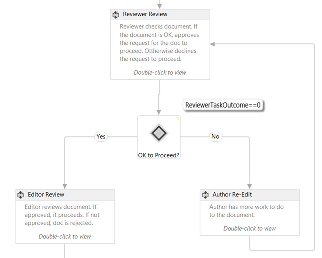
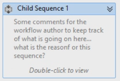

# Create SharePoint workflows using Visual Studio

Learn the basics of creating a SharePoint workflow in the new SharePoint workflow platform.

**Provided by:** [Andrew Connell](http://social.msdn.microsoft.com/profile/andrew%20connell%20%5bmvp%5d/),  [AndrewConnell.com](http://www.andrewconnell.com)

> [!NOTE]
> This article is accompanied by an end-to-end code sample that you can use to follow the article, or as a starter for your own SharePoint workflow projects. You can find the downloadable code here: LINK. 
    
Microsoft has taken a very different approach to workflows in SharePoint than in previous versions. SharePoint workflows are now based on Windows Workflow Foundation 4, and their execution is driven by a new component called Workflow Manager, which runs externally to SharePoint.Workflow Manager serves the role as host for the Windows Workflow Foundation runtime and all the necessary services in a highly available and scalable way. It leverages Service Bus for performance and scalability, and when deployed it runs exactly the same in an on-premises deployment as when deployed to a cloud-based service, such as Office 365, because it is configured to hand off all workflow execution and related tasks to the Workflow Manager farm.The dramatic change in the workflow architecture required some changes to the two primary workflow authoring tools for creating custom workflows - Visual Studio and SharePoint Designer. This article will explore using Visual Studio 2012 as your workflow authoring tool to create custom workflows for use in **sp15allshort** deployments - either on-premises or Office 365 deployments

## Types of workflows in Visual Studio 2012

While SharePoint Designer 2013 can only create workflows comprised of stages, Visual Studio supports another powerful type of workflow: the state machine workflow. Effectively, then, the Visual Studio 2012 (and Visual Studio 2013) workflow development environments support three types of workflow authoring: sequential, flowchart, and state machine.
  
    
    

### Sequential

A sequential workflow is one that follows a specific path. There may be decision branches, loops, and the workflow may not have a termination point, but it is easy to follow the predictable path in the design process. In fact, is how all workflows start out when you are using the **Workflow** project template in Visual Studio.
  
    
    
A sequential workflow contains a single **Sequence** activity and then any number of activities within it. Some of these could be other **Sequence** activities that you use to group together a series of smaller steps.
  
    
    

### Flowchart

In flowchart workflow, the execution pathway can transition to different sections of the workflow according to conditions that you specify, as shown in the Figure 1. The flowchart activity, along with the associated FlowDescision and FlowSwitch activity, are typically placed within a Sequence activity and act like either a traditional **if** statement, or like **switch** statement in common programming languages.
  
    
    
The stage construct within a SharePoint Designer 2013 based workflow is based on the principles of a flowchart. These types of workflows, unlike a sequential workflow, do not have a prescribed path in which they follow. Rather the things that happen during the workflow dictate the path the workflow follows.
  
    
    

**Figure 1. Flowchart workflow in Visual Studio 2012**

  
    
    

  
    
    

  
> [!NOTE]
> You can find the workflow depicted in Figure 1 as a workflow sample on MSDN here:  [SharePoint: Approval workflow that uses a custom initiation form](http://code.msdn.microsoft.com/officeapps/SharePoint-Approval-f5ac5eb2). 
  
    
    

### State machine

State machine workflows, like flowchart workflows, do not typically follow a specific path of execution. Rather, they consist of two or more states as shown in Figure 2. 
  
    
    

**Figure 2. State machine workflow in Visual Studio 2012**

  
    
    

  
    
    

  
> [!NOTE]
> You can find the workflow depicted in Figure 1 as a workflow sample on MSDN here:  [SharePoint: Route workflows to states depending on actions and events](http://code.msdn.microsoft.com/officeapps/SharePoint-Route-25a25d87). 
  
    
    

Think of each state as a smaller workflow that contains multiple workflow activities. You can set specific activities to start when the workflow enters or exits a given state. What really makes state machines interesting is the transitions that you can define. Each state can have one or more transitions that tell the workflow engine how to move from one state to another state. 
  
    
    
The workflow is always going to be in one of the states in a state machine workflow. A transition will dictate the trigger for the workflow to move from one state to another. Many people favor state machine workflows over the other types of workflows because they can be made to more closely mirror real world business processes. However these types of workflows can get complicated quickly.
  
    
    

## Visual Studio 2012 workflow development interface

When adding a new workflow to a SharePoint project, the template adds a single Sequence activity which serves as the main container. If you want to create a flowchart or state machine workflow simply delete this default activity and drag either a StateMachine or Flowchart activity onto the design surface.
  
    
    
Before building a custom workflow, developers should have a good understanding on the tool windows and design surface that Visual Studio 2012 provides. Many of the elements are quite common, as shown in Figure 3:
  
    
    

**Figure 3. Visual Studio 2012 workflow authoring interface**

  
    
    

  
    
    

  
    
    
The workflow development interface - that is, the workflow designer - has the following key elements:
  
    
    

  
    
    

1. **Solution Explorer** displays your project as a file tree.
    
  
2. **Workflow toolbox** contains all of the activities that you can use to assemble a workflow. You drag and drop from the toolbox to the designer surface.
    
  
3. **Workflow designer surface** is where you assemble and link the workflow elements.
    
  
4. **Property grid** displays properties of a selected activity or item in **Solution Explorer**. Use this to set or change property values.
    
  
5. **Output pane** displays information about workflow activity elements - variables, arguments, and import.
    
  
6. **Breadcrumb navigation tabs** allows you to zoom in and out on various portions of a workflow under development.
    
  
The **Output pane** (#5 in Figure 3) is important because it allows you to see all of the variables in your workflow at the current scope. Scoping works the same way as it does in standard programming object oriented design: a variable scoped at the root is accessible to all lower scopes (such as methods within a class), but a variable within a lower scope (such as a method in a class) is only accessible within that scope and its children, but not parallel or parent scopes.
  
    
    
Click on the **Arguments** tab to see a list of the arguments that are used to pass values into the workflow, such as those passed from an initiation form.
  
    
    

## How to create a custom workflow

To create a custom workflow using Visual Studio 2012 or later, ensure that you have access to a SharePoint developer site. For this walkthrough, it is recommended that you use a local SharePoint installation. This is because workflows tested locally can write debugging information to the Test Service Host console utility using the **WriteLine** activity. This utility is included with the Office Developer Tools for Visual Studio 2013, which are part of the default installation of Visual Studio 2012 and later in the Professional, Premium, and Ultimate editions.
  
    
    

### Create a new app project

1. In Visual Studio, create a new SharePoint Add-ins project and configure it to be a SharePoint-hosted app.
    
  
2. In this project, add a new **Announcement** list instance. We use this list as a container for items that we are going to use to test the workflow.
    
  
3. Add a workflow item to the project by right-clicking the project icon in **Solution Explorer** and selecting **Add**, then **New Item**.
    
  
4. In the **Add New Item** dialog box, select the **Workflow** project item from the **Office/SharePoint** category and name it "My First Workflow". Click **Next**.
    
  
5. When prompted by the **SharePoint Customization Wizard** for a name, leave the default, then set it to be a **List Workflow**. Click **Next**.
    
  
6. On the next page of the wizard, check the box to create an association, then select the **Announcements** list that we just created; select **<Create New>** for the required workflow history and task lists and then click **Next**.
    
  
7. On the final page of the wizard, check the box to start the workflow manually, leaving the two automatic start options unchecked; then click **Finish**. Visual Studio automatically adds the required elements to the project and loads the Workflow.xaml file into the designer, as shown in Figure 4.
    
   **Figure 4. Default designer surface after adding the workflow item**

  

  
  

  

  

### Organize workflow steps

To automate a given business process, workflows can contain any number of activities that you group together into a step, or **Sequence**. However, if you group too many of these activities in a single **Sequence**, the workflow becomes cluttered and difficult to follow and debug. This is similar to how in a common programming language it is ill-advised to create extremely long and complex methods. Instead, you should group activities that work together to perform a specific task in a common sequence.
  
    
    
This workflow sample will illustrate this practice of segmenting your workflows. In your new project, on the designer surface, to the existing default Sequence activity, add two new Sequence activities and rename them "Child Sequence 1" and Child Sequence 2", as depicted in Figure 5. Also (though not shown in Figure 5), change the name of the original Sequence activity to "Root".
  
    
    

**Figure 5. Adding child sequences to the default, or root, sequence**

  
    
    

  
    
    

  
    
    

  
    
    

  
    
    

### Comment your workflow using annotations

When using a common programming language like C#, VB.NET, or C++, you can comment your code by using appropriate comment specifiers. Commenting code is important for testing and maintaining a code base. Well, Visual Studio allows you also comment your workflow development by providing a feature called **annotations**.
  
    
    
You can comment a given workflow activity by selecting the activity, the selecting **Annotations**, then **Add Annotation**. A small icon of inverted chevrons on the right side of the activity's title bar signals that it has an annotation. Hover over or click on the icon to see the message (shown in Figure 6). You have the option to pin the annotation to the activity so it is always visible, as shown in Figure 6. 
  
    
    

**Figure 6. Annotation on an activity**

  
    
    

  
    
    

  
    
    

  
    
    

  
    
    

### Obtain values from list items

A common task you will encounter when creating workflows is getting properties of a list item. To accomplish this task, use the **LookupSPListItem** activity. What this activity does is make a web service call using the SharePoint REST API to lookup information on the list item. The following procedure shows how to do this:
  
    
    
First, drag a **LookupSPListItem** activity from the toolbox and drop it in the **Child Sequence 1** activity.
  
    
    
After adding the activity to the designer, you have to set a couple of properties: **ListId** and **ItemId**. These properties can be set to lookup information in any list, but using the shortcuts for **current list** and **current item** tell Workflow Manager to figure these values out automatically.
  
    
    
Because we are making a web service call, the return value from this activity, reflected in the **Result** property, is of type **DynamicValue**. Therefore, we need a variable of that data type in which to store the output output of the web service call. This is actually pretty easy to do because clicking the **Get Properties** link in the **LookupSPListItem** activity much of this automatically:
  
    
    

- First, it creates a new variable of type **DynamicValue**.
    
  
- Next, it sets this new variable to be the source for the **Result** property on the **LookupSPListItem** activity.
    
  
- It then adds a **GetDynamicValueProperties** activity to the workflow so that we can retrieve the value from the variable.
    
  
- Finally, it binds the variable to the **Source** property on the **GetDynamicValueProperties** activity.
    
  
Of course, you could have done all of this manually, but the tools simplify the process. If necessary, you can change the names of the variables.
  
    
    
The point, of course, is to get some values from the list item that triggered the workflow: Now the Assigned To column is where the values of these properties are bound to variables previously created or use the Populate Variables link that will create the variables automatically.
  
    
    

1. On the **Properties** property on the **GetDynamicValueProperties** activity, click on the ellipses button [ **???**] to open the **Properties** dialog box, shown in Figure 7.
    
   **Figure 7. Extract values using the Properties dialog box**

  

  
  

  

  
2. Next change the **Entity Type** to match the type of the item; in this case it is the **List Item of Announcements** list item.
    
  
3. Select the two properties to retrieve: the **Title** and **Created By** fields.
    
  
4. The **Assign To** column is where you bind these properties to the variables that we created. Alternatively, you can use the **Populate Variables** link, which assigns the variables automatically.
    
  
Notice in Figure 7 how the tool created the variables and even matched the data types correctly. Also notice how the **Created By** field is an integer. It is not really useful to show the user a number for the author is it? This will be addressed later in the workflow.
  
    
    

### Get user properties

Another common task in custom workflow development is looking up users. For instance, our workflow currently knows who created the announcement item, but only knows them by their ID. This ID is the ID of the user that has been added to the site's **User Information List**, which is a cached copy of their profile information. What is really desired is their name or login name.
  
    
    
To get user information, do the following:
  
    
    

1. Rename our first sequence ( **Child Sequence 1**) to "Get Item Properties" and name the second sequence to "Get Author Properties".
    
    > [!NOTE]
    > Make certain the variable that contains the user ID is scoped to the whole workflow and not just to the sequence we were working on. Let's change the scope of the variable now, as shown in Figure 8. 

   **Figure 8. Changing the scope of variables**

  

  
  

  

  
2. Now, to get the user information, drag-and-drop a **LookupSpUser** activity in the workflow and rename it to "Get Announcement Author". This activity will call the SharePoint REST API and pass in a specific ID. Verify what the REST service looks like by using the browser and navigating to `http://../_api/web/SiteUsers`. Take notice of the properties returned, too, as we will need these in a moment.
    
  
3. Notice that each user has a specific URL that includes their ID to get the user information. Also notice that the activity is likely calling the **GetUserById** service operator and passing in the ID of the user to lookup. Pass this in by specifying the **PrincipalId** property of the **LookupSPUser** activity to be the **CreatedBy** variable, which is the integer of the author of the announcement item.
    
  
4. Just like the **LookupSPListItem** activity, the **LookupSPUser** activity returns a value of type **DynamicValue**, so create a variable of that type to associate with our response and then bind this variable to the **Result** properties of the **LookupSPUser** activity, as shown in Figure 9.
    
   **Figure 9. Updating the output of the LookupSPUser activity**

  

  
  

  

  
5. As we did earlier, use a **GetDynamicValueProperties** activity to pull the results out of the **AuthorProperties** value. However, notice this time around that the **Entity Type** does not have an option that we can set. This is not a problem, because the actual web service response the **LookupSPUser** can be seen in the browser. To see it, enter the path to the property you are looking for, which, in this case is `d/results/(0)/LoginName`; then, enter another to get the display name of the author, as shown in Figure 10.
    
   **Figure 10. Retrieving values from the LookupSPUser activity**

  

  
  

  

  

### Test the workflow

Finally, let's test the workflow. Start by adding two **WriteLine** activities. These allow us to show the contents of our two variables. When testing the workflow, the Test Service Host console utility will write out the two values as shown in Figure 11.
  
    
    

**Figure 11. Test using Test Service Host Console**

  
    
    

  
    
    

  
    
    

  
    
    

  
    
    

## Conclusion

This article first explained the different types of workflows that can be created using Visual Studio 2012 and later for SharePoint when it has been connected to a Workflow Manager farm. Next it demonstrated how to create a workflow that not only collected values from the list item that triggered the workflow, but it also demonstrated how to perform a common task such as obtaining a user's login name and display name using the **LookupSPUser** activity. In addition, the article touched on a few good practices for keeping workflows organized and adding comments using annotations.
  
    
    

## Additional resources

-  [Workflows in SharePoint](workflows-in-sharepoint.md)
    
  
-  [SharePoint workflow development best practices](sharepoint-workflow-development-best-practices.md)
    
  
-  [SharePoint workflow samples](sharepoint-workflow-samples.md)
    
  

  
    
    

