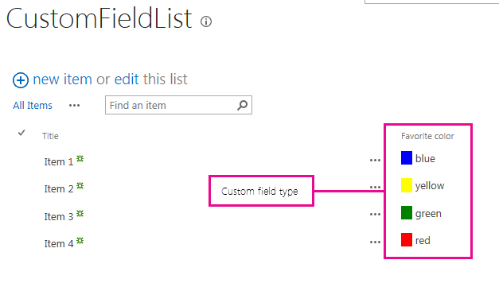
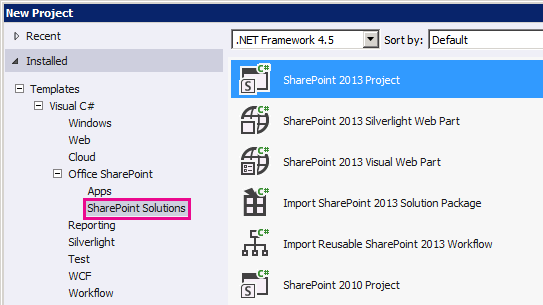
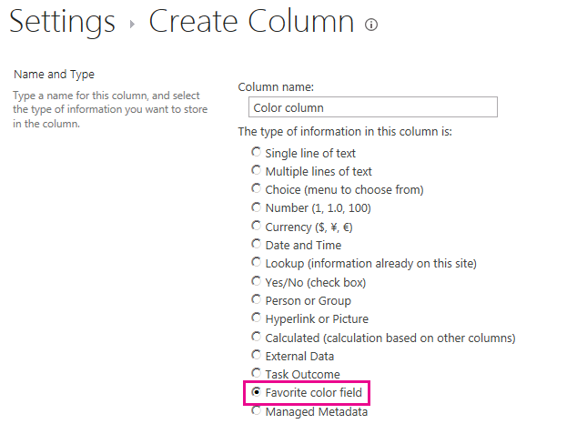

# Customize a field type using client-side rendering

Learn how to customize a field type by using the client-side rendering technology in SharePoint.

Client-side rendering provides a mechanism that you can use to produce your own output for a set of controls that are hosted in a SharePoint page. This mechanism enables you to use well-known technologies, such as HTML and JavaScript, to define the rendering logic of custom field types. In client-side rendering you can specify your own JavaScript resources and host them in the data storage options available to your farm solution, such as the _layouts folder.

> [!IMPORTANT]
> Client-Side Rendering (CSR) and JSLink are deprecated and not supported in modern SharePoint experiences.
> Use SharePoint Framework (SPFx) Field Customizer extensions instead for modern SharePoint Online and supported on-premises environments.

## Prerequisites for using the examples in this article

To follow the steps in this example, you need the following:

- Microsoft Visual Studio 2012
- Office Developer Tools for Visual Studio 2012
- A SharePoint development environment

For information about setting up your SharePoint development environment, see  [Set up a general development environment for SharePoint](set-up-a-general-development-environment-for-sharepoint.md).

### Core concepts to help you understand client-side rendering for field types

The following table lists useful articles that can help you understand the concepts and steps that are involved in a custom action scenario.

**Table 1. Core concepts for client-side rendering for field types**

|**Article title**|**Description**|
|:-----|:-----|
| [Build farm solutions in SharePoint](build-farm-solutions-in-sharepoint.md) <br/> |Learn about developing, packaging, and deploying administrative extensions to SharePoint using farm solutions.  <br/> |
| [Custom Field Types](/previous-versions/office/developer/sharepoint-2010/ms446361(v=office.14)) <br/> |Learn about creating custom field types. As you store your business information in SharePoint, there may be times when your data doesn't conform to the field types that are available in SharePoint FoundationOr, you might just want to customize those field types. Custom fields can include custom data validation and custom field rendering.  <br/> |

## Code example: Customize the rendering process for a custom field type in a view form

Follow these steps to customize the rendering process for a custom field type:

1. Create the farm solution project.
1. Add a class for the custom field type.
1. Add an XML definition for the custom field type.
1. Add a JavaScript file for the rendering logic of the custom field type.

    **Figure 1. Custom client-side rendered field in a view form**
    

### To create the farm solution project

1. Open Visual Studio 2012 as administrator (right-click the Visual Studio 2012 icon in the **Start** menu, and then choose **Run as administrator** ).
1. Create a new project using the **SharePoint Project** template

    Figure 2 shows the location of the **SharePoint Project** template in Visual Studio 2012, under **Templates**, **Visual C#**, **Office SharePoint**, **SharePoint Solutions**.

    **Figure 2. SharePoint project Visual Studio template**

    

1. Provide the URL of the SharePoint website that you want to use for debugging.
1. Select the **Deploy as a farm solution** option.

### To add a class for the custom field type

1. Right-click the farm solution project and add a new class. Name the class file FavoriteColorFieldType.cs.
1. Copy the following code and paste it in the FavoriteColorFieldType.cs file. The code performs the following tasks:

    - Declares a **FavoriteColorField** class that inherits from **SPFieldText**.
    - Provides two constructors for the **FavoriteColorField** class.
    - Overrides the **JSLink** property.

        > [!NOTE]
        > The JSLink property isn't supported on Survey or Events lists. A SharePoint calendar is an Events list.

```csharp
using System;
using System.Collections.Generic;
using System.Linq;
using System.Text;
using System.Threading.Tasks;

// Additional references for this sample.
using Microsoft.SharePoint;
using Microsoft.SharePoint.WebControls;

namespace Microsoft.SDK.SharePoint.Samples.WebControls
{
    /// <summary>
    /// The FavoriteColorField custom field type
    /// inherits from SPFieldText.
    /// Users can input the color in the field
    /// just like in any other text field.
    /// But the field will provide additional
    /// rendering logic when displaying
    /// the field in a view form.
    /// </summary>
    public class FavoriteColorField : SPFieldText
    {
        // The solution deploys the JavaScript
        // file to the CSRAssets folder
        // in the WFE's layouts folder.
        private const string JSLinkUrl =
            "~site/_layouts/15/CSRAssets/CSRFieldType.js";

        // You have to provide constructors for SPFieldText.
        public FavoriteColorField(
            SPFieldCollection fields,
            string name) :
            base(fields, name)
        {

        }
        public FavoriteColorField(
            SPFieldCollection fields,
            string typename,
            string name) :
            base(fields, typename, name)
        {

        }

        /// <summary>
        /// Override the JSLink property to return the
        /// value of our custom JavaScript file.
        /// </summary>
        public override string JSLink
        {
            get
            {
              return JSLinkUrl;
            }
            set
            {
              base.JSLink = value;
            }
        }
    }
}
```

### To add an XML definition for the custom field type

1. Right-click the farm solution project, and add a SharePoint mapped folder. In the dialog box, select the **{SharePointRoot}\\Template\\XML** folder.
1. Right-click the XML folder created in the last step, and add a new XML file. Name the XML file fldtypes_FavoriteColorFieldType.xml.
1. Copy the following markup, and paste it in the XML file. The markup does the following tasks:

    - Provides type name for the field type.
    - Specifies the full class name for the field type. This is the class you created in the previous procedure.
    - Provides additional attributes for the field type.

```XML
<?xml version="1.0" encoding="utf-8" ?>
<FieldTypes>
  <FieldType>
    <Field Name="TypeName">FavoriteColorField</Field>
    <Field Name="TypeDisplayName">Favorite color field</Field>
    <Field Name="TypeShortDescription">Favorite color field</Field>
    <Field Name="FieldTypeClass">Microsoft.SDK.SharePoint.Samples.WebControls.FavoriteColorField, $SharePoint.Project.AssemblyFullName$</Field>
    <Field Name="ParentType">Text</Field>
    <Field Name="Sortable">TRUE</Field>
    <Field Name="Filterable">TRUE</Field>
    <Field Name="UserCreatable">TRUE</Field>
    <Field Name="ShowOnListCreate">TRUE</Field>
    <Field Name="ShowOnSurveyCreate">TRUE</Field>
    <Field Name="ShowOnDocumentLibrary">TRUE</Field>
    <Field Name="ShowOnColumnTemplateCreate">TRUE</Field>
  </FieldType>
</FieldTypes>
```

### To add a JavaScript file for the rendering logic of the custom field type

1. Right-click the farm solution project, and add the SharePoint Layouts mapped folder. Add a new CSRAssets folder to the recently added Layouts folder.
1. Right-click the CSRAssets folder that you created in the last step, and add a new JavaScript file. Name the JavaScript file CSRFieldType.js.
1. Copy the following code and paste it in the JavaScript file. The code performs the following tasks:

    - Creates a template for the field when it's displayed in a view form.
    - Registers the template.
    - Provides the rendering logic for the field type when used displayed in a view form.

```javascript
(function () {
  var favoriteColorContext = {};

  // You can provide templates for:
  // View, DisplayForm, EditForm and NewForm
  favoriteColorContext.Templates = {};
  favoriteColorContext.Templates.Fields = {
    "FavoriteColorField": {
      "View": favoriteColorViewTemplate
    }
  };

  SPClientTemplates.TemplateManager.RegisterTemplateOverrides(favoriteColorContext);
})();

// The favoriteColorViewTemplate provides the rendering logic
// the custom field type when it is displayed in the view form.
function favoriteColorViewTemplate(ctx) {
  var color = ctx.CurrentItem[ctx.CurrentFieldSchema.Name];
  return "<span style='background-color : " + color +
         "' >&amp;nbsp;&amp;nbsp;&amp;nbsp;&amp;nbsp;</span>&amp;nbsp;" + color;
}
```

### To build and run the solution

1. Press the F5 key.

    > [!NOTE]
    > When you press F5, Visual Studio builds the solution, deploys the solution, and opens the SharePoint website where the solution is deployed.

1. Create a custom list and add a new Favorite color field column.
1. Add one item to the list, and provide a value for the favorite color column.
1. Figure 3 shows the create column page with the new custom field type.

    **Figure 3. Creating a new custom field type column**

    

|**Problem**|**Solution**|
|:-----|:-----|
|Field type **FavoriteColorField** isn't installed properly. Go to the list settings page to delete this field. <br/> |Execute the following command from an elevated command prompt: **iisreset /noforce**. <br/> **Caution:** If you're deploying the solution to a production environment, wait for an appropriate time to reset the web server using **iisreset /noforce**.          |

## Next steps

This article demonstrated how to customize the rendering process for a custom field type. As a next step, you can learn more details about custom field types. To learn more, see the following:

- [How to: Create a Custom Field Type](/previous-versions/office/developer/sharepoint-2010/bb862248(v=office.14))
- [Walkthrough: Creating a Custom Field Type](/previous-versions/office/developer/sharepoint-2010/bb861799(v=office.14)).
- [Customize a list view in SharePoint Add-ins using client-side rendering](../sp-add-ins/customize-a-list-view-in-sharepoint-add-ins-using-client-side-rendering.md)

## See also

- [Set up a general development environment for SharePoint](set-up-a-general-development-environment-for-sharepoint.md)
- [Build sites for SharePoint](build-sites-for-sharepoint.md)
- [Add SharePoint capabilities](add-sharepoint-capabilities.md)
- [Build farm solutions in SharePoint](build-farm-solutions-in-sharepoint.md)
