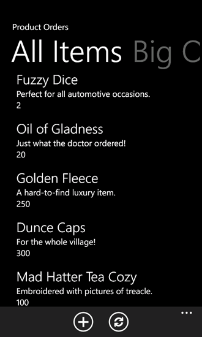
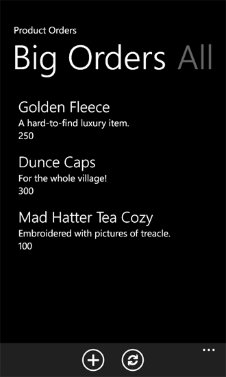

# How to: Customize list item queries and filter data for Windows Phone apps
Customize the data queries on which the views in a Windows Phone app are based.
With projects created from the Windows Phone SharePoint List Application template, developers can take advantage of a design pattern implemented in the template that allows them to customize parts of the data layer for a Windows Phone app. A view of a SharePoint list in a Windows Phone app can be configured in Microsoft SharePoint Server and included as is in the app on the phone, or a custom view can be created for the app.
  
    
    


> **Important:**
> If you are developing an app for Windows Phone 8, you must use Visual Studio Express 2012 instead of Visual Studio 2010 Express. Except for the development environment, all information in this article applies to creating apps for both Windows Phone 8 and Windows Phone 7. > For more information, see  [How to: Set up an environment for developing mobile apps for SharePoint](how-to-set-up-an-environment-for-developing-mobile-apps-for-sharepoint.md). 
  
    
    


## Configure list views on the server for use in Windows Phone apps
<a name="BKMK_ConfiguringLists"> </a>

When you create a SharePoint list app for a Windows Phone by using the Windows Phone SharePoint List Application template, you can choose to include in your app any existing views that are associated with the target SharePoint list. One of the ways to filter items in a SharePoint list as the list appears on the phone, then, is to configure a filtered view for the list on the server and then to select that view to be included in your Windows Phone app. The Windows Phone SharePoint List Application template wizard generates a Collaborative Application Markup Language (CAML) query for the selected view that includes the filtering conditions configured for the view on the server. You might, for example, have a list on the server that is based on the Tasks list template. You can create a view for the list named "Holiday Party" that includes only items related to, for example, planning a company holiday party by adding a filter condition to show list items only when the Description field contains the words "holiday" or "party". In the Windows Phone app, the CAML markup generated for the view would resemble the following (depending on the fields chosen to be included in your app).
  
    
    

```XML

<View>
    <Query>
        <Where>
            <Or>
                <Contains>
                    <FieldRef Name='Body' />
                    <Value Type='Note'>holiday</Value>
                </Contains>
                <Contains>
                    <FieldRef Name='Body' />
                    <Value Type='Note'>party</Value>
                </Contains>
            </Or>
        </Where>
    </Query>
    <RowLimit>30</RowLimit>
    <ViewFields>
        <FieldRef Name='Title'/>
        <FieldRef Name='Body'/>
        <FieldRef Name='AssignedTo'/>
        <FieldRef Name='Status'/>
        <FieldRef Name='PercentComplete'/>
        <FieldRef Name='StartDate'/>
        <FieldRef Name='DueDate'/>
        <FieldRef Name='Checkmark'/>
    </ViewFields>
</View>
```

As with other existing views for the Tasks list that you choose to include in your Windows Phone app when you create your project, a **PivotItem** control corresponding to the chosen view is added to the **Pivot** control that constitutes the main user interface (UI) element in the app.
  
    
    

## Customize list view queries in the Windows Phone app
<a name="BKMK_CustomizingLists"> </a>

For one reason or another, it may not be possible or reasonable to configure views that meet all of your design needs for a given list on the server. In a Microsoft Visual Studio project created from the Windows Phone SharePoint List Application template, aspects of what may be called the data layer are made available to developers, primarily through the ListDataProvider.cs file in the project. You can modify the CAML defined for an existing view, or you can add CAML queries for new views in the ListDataProvider.cs file.
  
    
    

### The ListDataProvider.cs file

In a project based on the Windows Phone SharePoint List Application template, the ListDataProvider.cs file defines objects that provide for accessing and configuring a SharePoint list as a data source for the views in the Windows Phone app. In the List.xaml file, which defines the main application page for the app, a **Pivot** control (itself containing the child **PivotItem** controls) is declared with an event handler assigned to its **LoadedPivotItem** event. The **LoadDataFromServer** method in the ListDataProvider.cs file is ultimately called when a **PivotItem** control (which is used as the rendering container for list items in the Windows Phone app) is loaded on the main application page of the app.
  
    
    

1. The **PivotItem** associated with a given list view is loaded in the UI.
    
  
2. In the List.xaml.cs file, the handler for the **LoadedPivotItem** event calls the **LoadData** method implemented in the ListViewModel.cs file, passing the name of the **PivotItem** control that has finished loading. (In the design of projects based on the Windows Phone SharePoint List Application template, the name of a given **PivotItem** control is set to be the same as the key value for the CAML query string for the view associated with that control in the **ViewXmls** **Dictionary** type defined in the **CamlQueryBuilder** class in ListViewModel.cs.)
    
  
3. The **LoadData** method in ListViewModel.cs calls the **LoadData** method implemented in the ListDataProvider.cs file.
    
  
4. The **LoadData** method in ListDataProvider.cs calls the **LoadDataFromServer** method also implemented in that same file. The **LoadDataFromServer** method then does the following:
    
1. Gets the CAML query string associated with a given view.
    
  ```cs
  
CamlQuery query = CamlQueryBuilder.GetCamlQuery(ViewName);
  ```

2. Registers with the client object model the list to be retrieved.
    
  ```cs
  ListItemCollection items = Context.Web.Lists.GetByTitle(ListTitle).GetItems(query);
  ```

3. Indicates to the client object model that it should return the list items and the fields of those list items (as text values).
    
  ```cs
  Context.Load(items);
Context.Load(items, listItems => listItems.Include(item => item.FieldValuesAsText));
  ```

4. Calls **ExecuteQueryAsync** to send the requests to SharePoint Server and retrieve the data (asynchronously).
    
  

  
    
    

## Add a custom list view query and corresponding UI elements
<a name="BKMK_AddingCustomizations"> </a>

In your own projects, you can take advantage of the way the data layer is designed to add your own custom CAML query strings and list views.
  
    
    
For the following code sample, assume again that the target installation of SharePoint Server has a Product Orders list created from the Custom List template, configured with the fields and types indicated in Table 1 in the topic  [How to: Implement business logic and data validation in a Windows Phone app for SharePoint 2013](how-to-implement-business-logic-and-data-validation-in-a-windows-phone-app-for-s.md). Create a project based on the Windows Phone SharePoint List Application template that uses a list like the Product Orders list as a source (as described in  [How to: Create a Windows Phone SharePoint 2013 list app](how-to-create-a-windows-phone-sharepoint-list-app.md)). For the purposes of this example, we add a custom view to the Windows Phone app (not to the list on the server) that is filtered to display only those product orders in which the quantity ordered is 100 or more.
  
    
    

### To add a custom query and view


1. In **Solution Explorer**, double-click the ListDataProvider.cs file (or choose the file and press F7) to open the file for editing.
    
  
2. Update the definition of the **ViewXmls** **Dictionary** type in the static **CamlQueryBuilder** class to include an additional CAML query, with a WHERE clause stipulating the appropriate filtering condition.
    
  ```cs
  
static Dictionary<string, string> ViewXmls = new Dictionary<string, string>()
{   
    {"View1",   @"<View><Query><OrderBy><FieldRef Name='ID'/>
        </OrderBy></Query><RowLimit>30</RowLimit><ViewFields>{0}</ViewFields></View>"},
    {"View2",   @"<View><Query><OrderBy><FieldRef Name='ID' /></OrderBy>
     <Where><Geq><FieldRef Name='Quantity' />
          <ValueType='Number'>100</Value>
                </Geq></Where>
             </Query><RowLimit>30</RowLimit>
               <ViewFields>{0}</ViewFields></View>"}
};
  ```

3. Double-click the List.xaml file to open the file for editing.
    
  
4. Add markup to define an additional child **PivotItem** control within the main **Pivot** control. The **Grid** element in which the UI elements that define the main application page are declared should resemble the following code.
    
  ```XML
  
<Grid x:Name="LayoutRoot" Background="Transparent"
 xmlns:x="http://schemas.microsoft.com/winfx/2006/xaml" 
 xmlns:controls="clr-namespace:Microsoft.Phone.Controls;assembly=Microsoft.Phone.Controls">
    <!--Pivot Control-->
    <ProgressBar x:Name="progressBar" Opacity="1" HorizontalAlignment="Center" 
     VerticalAlignment="Top" Height="30" Width="470" IsIndeterminate="{Binding IsBusy}" 
     Visibility="{Binding ShowIfBusy}" />
    <Grid x:Name="ContentPanel" Grid.Row="0" Width="470">
        <controls:Pivot Name="Views" Title="Product Orders" LoadedPivotItem="OnPivotItemLoaded">
            <!--Pivot item-->
            <controls:PivotItem Name="View1" Header="All Items">
                <!--Double line list with text wrapping-->
                <ListBox x:Name="lstBox1" Margin="0,0,-12,0" SelectionChanged="OnSelectionChanged" 
                 ItemsSource="{Binding [View1]}">
                    <ListBox.ItemTemplate>
                        <DataTemplate>
                            <StackPanel Orientation="Vertical" Margin="10">
                                <TextBlock Name="txtTitle" Text="{Binding [Title]}" 
                                 TextWrapping="NoWrap" Style="{StaticResource PhoneTextTitle2Style}" />
                                <TextBlock Name="txtDescription" Text="{Binding [Description]}" 
                                 TextWrapping="NoWrap" Style="{StaticResource PhoneTextNormalStyle}" />
                                <TextBlock Name="txtQuantity" Text="{Binding [Quantity]}" 
                                 TextWrapping="NoWrap" Style="{StaticResource PhoneTextNormalStyle}" />
                            </StackPanel>
                        </DataTemplate>
                    </ListBox.ItemTemplate>
                </ListBox>                    
            </controls:PivotItem>
            
            <!--Added PivotItem control for customized view--><controls:PivotItem Name="View2" Header="Big Orders"><!--Double line list with text wrapping--><ListBox x:Name="lstBox2" Margin="0,0,-12,0" 
                 SelectionChanged="OnSelectionChanged" ItemsSource="{Binding [View2]}"><ListBox.ItemTemplate><DataTemplate><StackPanel Orientation="Vertical" Margin="10"><TextBlock Name="txtTitle" Text="{Binding [Title]}" 
                                 TextWrapping="NoWrap" Style="{StaticResource PhoneTextTitle2Style}" /><TextBlock Name="txtDescription" Text="{Binding [Description]}" 
                                 TextWrapping="NoWrap" Style="{StaticResource PhoneTextNormalStyle}" /><TextBlock Name="txtQuantity" Text="{Binding [Quantity]}" 
                                 TextWrapping="NoWrap" Style="{StaticResource PhoneTextNormalStyle}" /></StackPanel></DataTemplate></ListBox.ItemTemplate></ListBox></controls:PivotItem>

        </controls:Pivot>
    </Grid>
</Grid>
  ```


    > **Note:**
      >  In particular that the value of the **Name** attribute ("View2") of the **PivotItem** control is the same as the key value of the entry added to the **Dictionary** type defined in step 2. This value is used to identify the appropriate CAML query to use to retrieve the data to be displayed in the **PivotItem**. Also note that the **ListBox** declared here (named "lstBox2" simply to distinguish it from the **ListBox** for the default view) is also bound to the view.

    
    
  
When you start your project (by pressing F5), the **Pivot** control for the app includes the two **PivotItem** controls and the data retrieved by the CAML queries associated with their respective views. The default All Items view displays all the orders, as shown in Figure 1 (with sample data).
  
    
    

**Figure 1. All orders (list items) in a sample list**

  
    
    

  
    
    

  
    
    
And the custom view, as defined in the preceding procedure, displays a filtered list of items that includes only those orders for which a quantity of 100 or more is specified, as shown in Figure 2.
  
    
    

**Figure 2. Only the big orders**

  
    
    

  
    
    

  
    
    
You can make many other customizations both to the CAML queries on which views are based and to the UI elements associated with views.
  
    
    

## Additional resources
<a name="SP15Custlistitem_addlresources"> </a>


-  [Build Windows Phone apps that access SharePoint 2013](build-windows-phone-apps-that-access-sharepoint.md)
    
  
-  [Introduction to Collaborative Application Markup Language (CAML)](http://msdn.microsoft.com/en-us/library/ms426449.aspx)
    
  
-  [How to: Set up an environment for developing mobile apps for SharePoint](how-to-set-up-an-environment-for-developing-mobile-apps-for-sharepoint.md)
    
  
-  [Windows Phone SDK 8.0](http://www.microsoft.com/en-us/download/details.aspx?id=35471)
    
  
-  [Microsoft SharePoint SDK for Windows Phone 8](http://www.microsoft.com/en-us/download/details.aspx?id=36818)
    
  
-  [Windows Phone SDK 7.1](http://www.microsoft.com/en-us/download/details.aspx?id=27570)
    
  
-  [Microsoft SharePoint SDK for Windows Phone 7.1](http://www.microsoft.com/en-us/download/details.aspx?id=30476)
    
  

