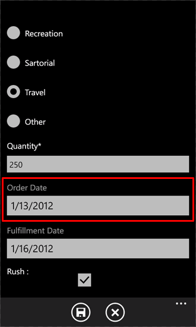
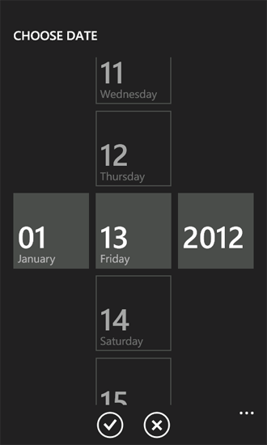

# Customize the user interface of a SharePoint list app for Windows Phone
Customize the Windows Phone user interface generated by the Windows Phone SharePoint List Application template.
SharePoint list apps created from the Windows Phone SharePoint List Application template are based on the Silverlight for Windows Phone framework. All of the capabilities provided by the Silverlight platform on a Windows Phone are available to developers for customizing the user interface (UI) of a SharePoint list app designed for a Windows Phone.
  
    
    


> **Important:**
> If you are developing an app for Windows Phone 8, you must use Visual Studio Express 2012 instead of Visual Studio 2010 Express. Except for the development environment, all information in this article applies to creating apps for both Windows Phone 8 and Windows Phone 7. > For more information, see  [How to: Set up an environment for developing mobile apps for SharePoint](how-to-set-up-an-environment-for-developing-mobile-apps-for-sharepoint.md). 
  
    
    


## Create a SharePoint list app for user interface customizations
<a name="BKMK_CreatingSPListApp"> </a>

For the following procedures, assume a server running SharePoint Server has a Product Orders list created from the Custom List template, similar to the sample Product Orders list used in  [How to: Implement business logic and data validation in a Windows Phone app for SharePoint](how-to-implement-business-logic-and-data-validation-in-a-windows-phone-app-for-s.md). For the sample Windows Phone app used in this topic, the Product Orders list on which the app is based has been modified to include additional fields. The modified Product Orders list used for the purposes of the examples in this topic has been created with the columns and field types shown in Table 1.
  
    
    

**Table 1. Modified Product Orders list**


|**Column**|**Type**|**Required**|
|:-----|:-----|:-----|
|Product (i.e., Title)  <br/> |Single line of text (Text)  <br/> |Yes  <br/> |
|Description  <br/> |Single line of text (Text)  <br/> |No  <br/> |
|Product Category  <br/> |Choice  <br/> |No  <br/> |
|Quantity  <br/> |Number  <br/> |Yes  <br/> |
|Order Date  <br/> |Date and Time (DateTime)  <br/> |No  <br/> |
|Fulfillment Date  <br/> |Date and Time (DateTime)  <br/> |No  <br/> |
|Rush  <br/> |Boolean  <br/> |No  <br/> |
|Contact Number  <br/> |Single line of text (Text)  <br/> |No  <br/> |
   
Follow the procedures in  [How to: Create a Windows Phone SharePoint list app](how-to-create-a-windows-phone-sharepoint-list-app.md) to use the Windows Phone SharePoint List Application template to generate a SharePoint list app as a starting point for the following UI customizations. Specify as the target SharePoint list for the app a list that has a schema similar to what is represented in Table 1.
  
    
    

## Replace TextBox controls with DatePicker controls
<a name="BKMK_ReplacingControls"> </a>

Based on the project as generated by the template, fields in the list designated as **DateTime** fields (as, for example, the **Order Date** field in the sample Product Orders list) are bound by default to **TextBox** controls in the Edit form (EditForm.xaml) and the New form (NewForm.xaml) in the app. The first improvement you will make to the user interface is to facilitate entering date values for such fields by replacing their associated **TextBox** controls with **DatePicker** controls from the [Silverlight for Windows Phone Toolkit](http://silverlight.codeplex.com/releases/view/75888). You can install Silverlight for Windows Phone Toolkit from the  [CodePlex Website](http://www.codeplex.com/), a hosting site for open-source software projects.
  
    
    

### To replace TextBox controls with DatePicker controls


1. In Microsoft Visual Studio 2010, if the project is not opened already, open the project you created in the preceding section, based on the Windows Phone SharePoint List Application template and using a SharePoint list like the Product Orders list represented in Table 1.
    
  
2. On the **Project** menu in Visual Studio, click **Add Reference**. The **Add Reference** dialog box appears.
    
  
3. On the **Browse** tab, navigate to the Microsoft.Phone.Controls.Toolkit.dll assembly installed by the Silverlight for Windows Phone Toolkit.
    
    > [!NOTE]
    > The Microsoft.Phone.Controls.Toolkit.dll assembly can be found in %PROGRAMFILES%(x86)\\Microsoft SDKs\\Windows Phone\\v7.1\\Toolkit\\< *MonthYear*  >\\Bin in a standard installation of the Toolkit, where < *MonthYear*  > may be something like "Oct11", depending on the version of the Toolkit installed. (Or you can find the assemblies installed by the Toolkit on your system by clicking the **Start** button, pointing to **All Programs**, expanding the **Microsoft Silverlight for Windows Phone Toolkit** item in the Programs menu, and clicking **Binaries**.) 

4. In **Solution Explorer**, select the EditForm.xaml file under the **Views** node.
    
  
5. Press SHIFT + F7 (or double-click the file) to open the file in the designer.
    
  
6. In the XAML pane of the designer, add a namespace declaration for distinguishing the controls in the Toolkit assembly to the  `<phone:PhoneApplicationPage>` tag.
    
```
  
<phone:PhoneApplicationPage
    x:Class="ContosoSPListApp.EditForm"
    xmlns="http://schemas.microsoft.com/winfx/2006/xaml/presentation"
    xmlns:x="http://schemas.microsoft.com/winfx/2006/xaml"
    xmlns:phone="clr-namespace:Microsoft.Phone.Controls;assembly=Microsoft.Phone"
    xmlns:toolkit="clr-namespace:Microsoft.Phone.Controls;assembly=Microsoft.Phone.Controls.Toolkit"
    xmlns:shell="clr-namespace:Microsoft.Phone.Shell;assembly=Microsoft.Phone"
    xmlns:d="http://schemas.microsoft.com/expression/blend/2008"
    xmlns:mc="http://schemas.openxmlformats.org/markup-compatibility/2006"
    mc:Ignorable="d" d:DesignWidth="480" d:DesignHeight="696"
    FontFamily="{StaticResource PhoneFontFamilyNormal}"
    FontSize="{StaticResource PhoneFontSizeNormal}"
    Foreground="{StaticResource PhoneForegroundBrush}"
    SupportedOrientations="Portrait" Orientation="Portrait"
    shell:SystemTray.IsVisible="True" x:Name = "EditPage">
```


    The only change to the default markup generated by the template is the addition of the "xmlns:toolkit" namespace designation. Also note that the value of the **Class** attribute here is based on the name of your project. "ContosoSPListApp" is the name of this sample project. The value of this attribute in your project will differ from the value here depending on the name of your project.
    
  
7. In the EditForm.xaml file, locate the **StackPanel** control in the markup that contains the controls associated with the **Order Date** field (designated as "Order_x0020_Date" in the XML schema for the field). By default, the template generates a **TextBox** control and two **TextBlock** controls for **DateTime** fields. The markup for the **StackPanel** control and the controls it contains should resemble the following markup.
    
```
  
<StackPanel Orientation="Vertical" Margin="0,5,0,5">
    <TextBlock TextWrapping="Wrap" HorizontalAlignment="Left" 
             Style="{StaticResource PhoneTextNormalStyle}">Order Date</TextBlock>
    <TextBox Height="Auto" Style="{StaticResource TextValidationTemplate}" 
                FontSize="{StaticResource PhoneFontSizeNormal}" Width="470" 
                HorizontalAlignment="Left" Name="txtOrder_x0020_Date" 
                Text="{Binding [Order_x0020_Date], Mode=TwoWay, ValidatesOnNotifyDataErrors=True,
                NotifyOnValidationError=True}" TextWrapping="Wrap" />
    <TextBlock FontSize="16" TextWrapping="Wrap" HorizontalAlignment="Left" Style="{StaticResource PhoneTextSubtleStyle}" Text="{Binding DateTimeFormat}" />
</StackPanel>
```

8. Replace that **StackPanel** control and the controls it contains with the following markup.
    
```
  
<StackPanel Orientation="Vertical" Margin="0,5,0,5">
    <toolkit:DatePicker Header="Order Date" Value="{Binding [Order_x0020_Date], Mode=TwoWay}">
              </toolkit:DatePicker>
</StackPanel>
```

9. Next, locate (also in EditForm.xaml) the **StackPanel** control in the markup that contains the controls associated with the Fulfillment Date field (designated as "Fulfillment_x0020_Date" in the schema for the field). The markup for the **StackPanel** and the controls it contains should resemble the following markup.
    
```
  
<StackPanel Orientation="Vertical" Margin="0,5,0,5">
    <TextBlock TextWrapping="Wrap" HorizontalAlignment="Left" Style="{StaticResource PhoneTextNormalStyle}">Fulfillment Date</TextBlock>
    <TextBox Height="Auto" Style="{StaticResource TextValidationTemplate}" 
           FontSize="{StaticResource PhoneFontSizeNormal}" Width="470" HorizontalAlignment="Left"
           Name="txtFulfillment_x0020_Date" Text="{Binding [Fulfillment_x0020_Date], 
           Mode=TwoWay, ValidatesOnNotifyDataErrors=True, NotifyOnValidationError=True}" 
           TextWrapping="Wrap" />
    <TextBlock FontSize="16" TextWrapping="Wrap" HorizontalAlignment="Left" 
          Style="{StaticResource PhoneTextSubtleStyle}" Text="{Binding DateTimeFormat}" />
</StackPanel>
```

10. Replace that **StackPanel** control and the controls it contains with the following markup.
    
```
  
<StackPanel Orientation="Vertical" Margin="0,5,0,5">
    <toolkit:DatePicker Header="Fulfillment Date" Value="{Binding [Fulfillment_x0020_Date], Mode=TwoWay}"></toolkit:DatePicker>
</StackPanel>
```

11. Finally, you can add user interface icon images from the Silverlight for Windows Phone Toolkit to your project. In **Solution Explorer**, select the node representing the project (named, for example, "ContosoSPListApp").
    
  
12. On the **Project** menu in Visual Studio, click **New Folder**. A new folder is added under the project node. Name the folder "Toolkit.Content".
    
  
13. In **Solution Explorer**, select the folder you created in the preceding step.
    
  
14. On the **Project** menu, click **Add Existing Item**. A **File Browser** window opens.
    
  
15. Navigate to the folder where the supporting icon images, ApplicationBar.Cancel.png and ApplicationBar.Check.png, were installed by the Silverlight for Windows Phone Toolkit.
    
    > [!NOTE]
    > The images are in %PROGRAMFILES%(x86)\\Microsoft SDKs\\Windows Phone\\v7.1\\Toolkit\\< *MonthYear*  >\\Bin\\Icons in a standard installation of the Toolkit, where < *MonthYear*  > may be something like "Oct11", depending on the version of the Toolkit installed.

16. Select both images and click **Add**. The image files are added to the project under the **Toolkit.Content** folder node.
    
    > **Important:**
      > For the components of the Silverlight for Windows Phone Toolkit to be able to use the icon images, they must be placed in the location in your projected as specified in the preceding steps. 
17. In **Solution Explorer**, select both image files under the **Toolkit.Content** folder.
    
  
18. In the **Properties Window**, set the **Build Action** property for the images to "Content" and set the **Copy to Output Directory** property to "Copy if newer".
    
    > [!NOTE]
    > If the **Properties Window** is not visible, press CTRL + W and then P to display the window in Visual Studio.

    If you start the project (by pressing F5) to deploy it to the Windows Phone Emulator, you can navigate to the **Edit** form for an item (by clicking an item in the main List View page and then clicking the **Edit** button on the **Application Bar** in the app). The **DateTime** fields in the form are now associated with the **DatePicker** control, as shown in Figure 1.
 
    **Figure 1. Edit form with DatePicker control**

    
  
    
    
The **DatePicker** control (highlighted for the **Order Date** field in Figure 1) looks very much like a **TextBox** control with an associated **TextBlock** as a label, except that when you click the **DatePicker** control (or tap it on a Windows Phone device), the control displays a separate page with controls for selecting dates using gestures, as shown in Figure 2.
  
    
    

**Figure 2. Date chooser page**

  
    
    

  
    
    

  
    
    
Clicking the **Done** button transfers the chosen date to the **DatePicker** control on the **Edit** form. If you then click the **Save** button on that form, the values of the **DateTime** fields associated with the **DatePicker** controls are updated in the SharePoint list on the server, because the **Value** properties of the controls were bound to the appropriate fields in the EditForm.xaml file in the procedure above. If you wanted to replace **TextBox** controls with **DatePicker** controls in the New form as well, you would repeat Steps 4 through 10 of the procedure for the NewForm.xaml file in the project.
  
    
    

## Add controls to support custom fill-in options for Choice fields
<a name="BKMK_AddingControlsForChoiceFields"> </a>

Fields designated with the Choice field type in a SharePoint list can be configured on a SharePoint Server to allow users to specify custom (or "fill-in") choice values for a field, in addition to any declared choice values that may be assigned to a Choice field when it is defined on the server. In projects created from the Windows Phone SharePoint List Application template, Choice fields are not rendered by default to include UI support for entering "fill-in" options. In the procedures in this section, you will add UI controls and code to your app to support entering custom choice values for the Product Category field.
  
    
    
In the following procedures, you will:
  
    
    

- Add a class ( **ContosoConverter**) with conversion logic to process data to be saved to the Product Category Choice field.
    
  
- Add a property member ( **OtherCategoryValue**) to the **EditItemViewModel** class that provides access to a string representing the "fill-in" value for the Choice field. This property member will serve as the source in a Binding declaration for an added **TextBox** control on the Edit form.
    
  
- Add a **RadioButton** control and a **TextBox** control to the Edit form for users to be able to specify a "fill-in" choice value for the Product Category field.
    
  
- Modify the code-behind file, EditForm.xaml.cs, associated with the Edit form to register an edit field value converter **set** function for Choice fields and implement event handlers for the controls added to the Edit form.
    
> [!NOTE]
> For more information about field value converters, see  [How to: Support and convert SharePoint field types for Windows Phone apps](how-to-support-and-convert-sharepoint-field-types-for-windows-phone-apps.md). 
  
    
    


  
    
    

### To add a class to support data conversion for Choice fields


1. In **Solution Explorer**, select the node representing the project (named, for example, ContosoSPListApp).
    
  
2. On the **Project** menu in Visual Studio (or Visual Studio Express for Windows Phone), click **Add Class**. The **Add New Item** dialog box opens with the C# **Class** template already selected.
    
  
3. Specify a name for the class file (as, for example, ContosoConverter.cs) and click **Add**. The class file is added to the project and opened for editing.
    
  
4. Replace the contents of the file with the following code.
    
```cs
  
using System;
using System.Net;
using System.Windows;
using System.Collections.ObjectModel;
using Microsoft.SharePoint.Phone.Application;
using Microsoft.SharePoint.Client;

namespace SPListAppUICustomization
{
    public class ContosoConverter
    {
        // Edit Field Value Converter SET function for Choice fields.
        public static void SetConvertedChoiceEditFieldValue(string fieldName, object fieldValue, 
                                        ListItem item, ConversionContext context, string customCategory)
        {
            ObservableCollection<ChoiceFieldViewModel> choices = fieldValue as
                                                   ObservableCollection<ChoiceFieldViewModel>;
               bool isCustomValue = true;

            string specifiedChoice = string.Empty;

            if (choices != null)
            {
                foreach (ChoiceFieldViewModel choiceItem in choices)
                {
                    if ((choiceItem.IsChecked == true) || (choiceItem.Name.Equals(customCategory, 
                                                             StringComparison.CurrentCultureIgnoreCase)))
                    {
                        specifiedChoice = choiceItem.Name;
                        isCustomValue = false;
                        break;
                    }
                }

                if (isCustomValue == true)
                {
                    specifiedChoice = customCategory;
                }
            }
            else
            {
                specifiedChoice = customCategory;
            }

            item[fieldName] = specifiedChoice;
        }
    }
}
```

5. Save the file.
    
  
The **SetConvertedChoiceEditFieldValue** function here is used for the implementation of the edit field value converter **set** function delegate registered for Choice fields in the app. The function iterates through the collection of **ChoiceFieldViewModel** objects passed as the **fieldValue** argument. **ChoiceFieldViewModel** objects are used to represent individual values for Choice fields in projects based on the Windows Phone SharePoint List Application template. Each object has a **Name** property that represents a given choice and a Boolean property ( **IsChecked**) indicating whether a given choice value (of those values available for a field as was defined) is the value specified for the field. The **SetConvertedChoiceEditFieldValue** function determines whether a **ChoiceFieldViewModel** object in the collection is checked or whether the **Name** property of an object matches a specified custom value for the Product Category field. If so, the **Name** property of that **ChoiceFieldViewModel** object is used to set the value of the field. Otherwise, a specified custom value (from the **customCategory** argument) is set as the value of the field.
  
    
    
Next you will add a property member to the **EditItemViewModel** class that provides access to the "fill-in" value for a Choice field (or an empty string if the specified value of the Choice field is one of the available choices defined for the field on the server).
  
    
    

### To add a property member to the EditItemViewModel class


1. In **Solution Explorer**, under the **ViewModels** folder node, select the EditItemViewModel.cs file.
    
  
2. Press F7 (or double-click the file) to open the file for editing.
    
  
3. After the default **using** directives in the file, add the following directive.
    
```cs
  
using System.Collections.ObjectModel;
```

4. Add the following implementation of a property member (named **OtherCategoryValue**) to the file, within the code block (demarcated by opening and closing braces) that implements the **EditItemViewModel** class.
    
```cs
  public string OtherCategoryValue
{
    get
    {
        string specifiedCategory = string.Empty;

        // See if specified Choice field value is one of the available values
        // from the List ViewModel. If it is, return an empty string.
        ObservableCollection<ChoiceFieldViewModel> choicesCollection = this["Product_x0020_Category"] as
                                               ObservableCollection<ChoiceFieldViewModel>;
        if (choicesCollection != null &amp;&amp; choicesCollection.Any(choice => choice.IsChecked))
        {
            return specifiedCategory;
        }

        // If Choice field value is not one of the values from the List ViewModel,
        // get the value from the underlying list item and return value as string.
        specifiedCategory = SharePointListItem.FieldValuesAsText["Product_x0020_Category"];
        return specifiedCategory;
    }
}
```

5. Save the file.
    
  
Next, you will add controls to the Edit form and configure those controls to support entering custom values for the Product Category field.
  
    
    

### To add and configure UI controls for entering custom Choice field values


1. In **Solution Explorer**, select the EditForm.xaml file under the **Views** folder node.
    
  
2. Press SHIFT + F7 (or double-click the file) to open the file in the designer.
    
  
3. Locate the **StackPanel** control that contains the controls (a **TextBlock** control and a **ListBox** control) for rendering the **Product Category** field from the Product Orders SharePoint list. Add and configure a **RadioButton** control and another **TextBox** control to the **StackPanel** container, as shown in the following code.
    
```
  
<StackPanel Orientation="Vertical" Margin="0,5,0,5">
    <TextBlock TextWrapping="Wrap" HorizontalAlignment="Left" Style="{StaticResource PhoneTextNormalStyle}">
                                                                    Product Category</TextBlock>
    <ListBox MaxHeight="400" Width="Auto" x:Name="lstBoxProduct_x0020_Category" 
                                             ItemsSource="{Binding [Product_x0020_Category]}">
        <ListBox.ItemTemplate>
            <DataTemplate>
                <RadioButton FontSize="{StaticResource PhoneFontSizeNormal}" HorizontalAlignment="Left" 
                               GroupName="Product_x0020_Category" Content="{Binding Name}" 
                                  IsChecked="{Binding IsChecked, Mode=TwoWay}" />
            </DataTemplate>
        </ListBox.ItemTemplate>
    </ListBox>
    <!-- The following two controls added to support UI Customization for Choice field. -->
    <RadioButton x:Name="rbOtherCategory" FontSize="{StaticResource PhoneFontSizeNormal}" HorizontalAlignment="Left" GroupName="Product_x0020_Category" Content="Other:" IsChecked ="True" /><TextBox x:Name="txtOtherCategory" Text="{Binding OtherCategoryValue}" FontSize="{StaticResource PhoneFontSizeNormal}" Width="470" HorizontalAlignment="Left" TextWrapping="Wrap" Visibility="Visible" />
</StackPanel>
```

4. With the EditForm.xaml file selected in **Solution Explorer**, press F7 to open its associated code-behind file, EditForm.xaml.cs, for editing.
    
  
5. Modify the constructor in the file to add a handler, **EditForm_Loaded**, for the **Loaded** event. The modified constructor should match the constructor in the following code.
    
```cs
  
public EditForm()
{
    InitializeComponent();

    viewModel = App.MainViewModel.SelectedItemEditViewModelInstance;
    if (!viewModel.IsInitialized)
    {
        viewModel.InitializationCompleted += new
                       EventHandler<InitializationCompletedEventArgs>(OnViewModelInitialization);
        viewModel.Initialize();
    }
    else
    {
        this.DataContext = viewModel;
    }

    // Adding handler for Loaded event.
    this.Loaded += new RoutedEventHandler(EditForm_Loaded);
}
```

6. Add the following implementation for the **EditForm_Loaded** event handler to the file, within the code block (demarcated by opening and closing braces) that implements the **EditForm** partial class.
    
```cs
  
private void EditForm_Loaded(object sender, RoutedEventArgs e)
{
    // Register EditFieldValueConverter SET function on Choice fields.
    Converter.RegisterEditFieldValueConverter(FieldType.Choice, 
                            (string fieldName, object fieldValue, ListItem item, 
                                               ConversionContext context) =>
    {
        string otherCategoryValue = string.Empty;
        if (this.rbOtherCategory.IsChecked == true)
        {                    
            otherCategoryValue = this.txtOtherCategory.Text.Trim();
            if (string.IsNullOrWhiteSpace(OtherCategoryValue))
            {
                otherCategoryValue = "(Unspecified)";
            }
        }

        ContosoConverter.SetConvertedChoiceEditFieldValue(fieldName, 
                                         fieldValue, item, context, otherCategoryValue);
    });

    // Adding RadioButton event handlers here because the
    // txtOtherCategory TextBox will be loaded and available at this point.
    this.rbOtherCategory.Checked += new RoutedEventHandler(rbOtherCategory_Checked);
    this.rbOtherCategory.Unchecked += new RoutedEventHandler(rbOtherCategory_Unchecked);
}
```


    In this code, the lambda statement used in the call to the **RegisterEditFieldValueConverter** method of the **Converter** class determines whether the **rbOtherCategory** **RadioButton** control (added in Step 3) is checked. If so, the value in the **Text** property of **txtOtherCategory** **TextBox** control is passed to the **SetConvertedChoiceEditFieldValue** function. If **rbOtherCategory** is not checked, an empty string is passed. If **rbOtherCategory** is checked, but nothing is actually specified by the user in the **txtOtherCategory** text box, a value of "(Unspecified)" is passed.
    
  
7. Finally, add handlers for the **Checked** and **Unchecked** events of the **rbOtherCategory** **RadioButton** to show or hide the **TextBox** control used to provide custom Product Category values. Include the following implementations for these handlers in the EditForm.xaml.cs file, again within the code block that implements the **EditForm** partial class.
    
```cs
  
private void rbOtherCategory_Checked(object sender, RoutedEventArgs e)
{
    this.txtOtherCategory.Visibility = System.Windows.Visibility.Visible;
    this.txtOtherCategory.Focus();
}

private void rbOtherCategory_Unchecked(object sender, RoutedEventArgs e)
{
    this.txtOtherCategory.Visibility = System.Windows.Visibility.Collapsed;
}
```

8. Save the file.
    
  
If you build the project and deploy it to a Windows Phone Emulator (by pressing F5), you can see that in the Edit form, a **RadioButton** control is added for each choice value designated in the Product Category field definition, based on the default UI rendering logic for Choice fields. In addition, another **RadioButton** control (labeled as "Other:" in the UI) is included for users to be able to specify custom choice values. If the additional **RadioButton** control is checked, a **TextBox** control is displayed for entering the intended value.
  
    
    
For items in the Product Orders list that are already associated with a custom Product Category value and then edited in the app, the Edit form is rendered with the additional **RadioButton** control already checked and the **TextBox** control displaying the custom value already visible.
  
    
    

## See also
<a name="BKMK_AddingControlsForChoiceFields"> </a>


-  [Build Windows Phone apps that access SharePoint](build-windows-phone-apps-that-access-sharepoint.md)
    
  
-  [How to: Set up an environment for developing mobile apps for SharePoint](how-to-set-up-an-environment-for-developing-mobile-apps-for-sharepoint.md)
    
  
-  [Windows Phone SDK 8.0](http://www.microsoft.com/en-us/download/details.aspx?id=35471)
    
  
-  [Microsoft SharePoint SDK for Windows Phone 8](http://www.microsoft.com/en-us/download/details.aspx?id=36818)
    
  
-  [Windows Phone SDK 7.1](http://www.microsoft.com/en-us/download/details.aspx?id=27570)
    
  
-  [Microsoft SharePoint SDK for Windows Phone 7.1](http://www.microsoft.com/en-us/download/details.aspx?id=30476)
    
  

