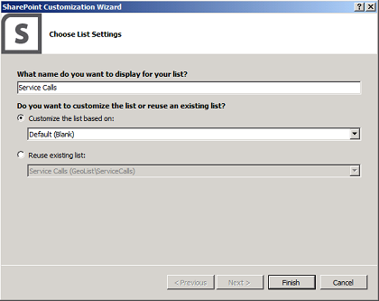
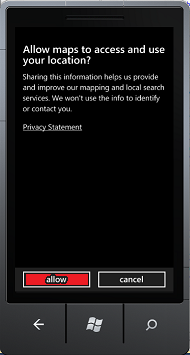
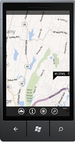

# How to: Integrate maps with Windows Phone apps and SharePoint lists
Learn how to integrate location information and maps in SharePoint lists and location-based web and mobile SharePoint Add-ins, by using the new Geolocation field, and by creating your own geolocation-based field types.
SharePoint introduces a new field type named Geolocation that enables you to annotate SharePoint lists with location information. In columns of type Geolocation, you can enter location information as a pair of latitude and longitude coordinates in decimal degrees or retrieve the coordinates of the user's current location from the browser, if the browser implements the W3C Geolocation API. In the list, SharePoint displays the location on a map powered by Bing Maps. Together, the Geolocation field and the Map View enable you to give a spatial context to any information by integrating data from SharePoint into a mapping experience, and let your users engage in new ways in your web and mobile apps and solutions. We'll help you create a simple Windows 7 mobile app which uses the SharePoint Geolocation field type feature to use mapping capabilities so you can display maps on mobile SharePoint Add-in list items.
  
    
    


> **Important:**
> If you are developing an app for Windows Phone 8, you must use Visual Studio Express 2012 instead of Visual Studio 2010 Express. Except for the development environment, all information in this article applies to creating apps for both Windows Phone 8 and Windows Phone 7. > For more information, see  [How to: Set up an environment for developing mobile apps for SharePoint](how-to-set-up-an-environment-for-developing-mobile-apps-for-sharepoint.md). 
  
    
    


## Prerequisites for creating a map-based Windows phone app
<a name="SP15Integratemaps_prereeq"> </a>

Ensure that you have the following installed:
  
    
    

- SharePoint
    
  
- Visual Studio 2012
    
  
- Visual Studio Express 2010 with new the SharePoint phone templates from  [Microsoft SharePoint SDK for Windows Phone 7.1](http://www.microsoft.com/en-us/download/details.aspx?id=30476)
    
  
- Access to a SharePoint list, with sufficient privileges to add a column
    
  
- The Bing Maps key deployed to your server; see  [How to: Set the Bing Maps key at the web and farm level in SharePoint](how-to-set-the-bing-maps-key-at-the-web-and-farm-level-in-sharepoint.md)
    
  

## Step 1: Create a SharePoint field by using the Geolocation feature
<a name="HowToCreateMapBasedPhoneApp_Step1"> </a>

The Geolocation column is not available by default in SharePoint lists. You have to write code to add the column to a SharePoint list. We'll show you how to add the Geolocation field to a list programmatically by using the SharePoint client object model. After you add the field to the list, you can add Geolocation field as a feature to the list.
  
    
    

### To create the Visual Studio project


1. Log on as an administrator to the server running SharePoint.
    
  
2. Start **Visual Studio** and choose **File**, **New Project**. The **New Project** dialog box opens.
    
  
3. In the **New Project** dialog box, choose **Visual C#**, choose **SharePoint**, and then choose the **SharePoint** Project type.
    
  
4. Name the project. In this example, we use **GeoList**. Choose the **OK** button.
    
  
5. In the **SharePoint Customization Wizard**, enter the URL for the site collection that uses the same SharePoint list that you want to access for phone development.
    
  
6. In **Solution Explorer**, open the shortcut menu for the **GeoList** project, and then choose **Add**, **New Item**.
    
  
7. In the **Add New Item** dialog box, choose **List**. Name the list. In this example, we use **ServiceCalls**.
    
  
8. In the **Choose List Settings** dialog box, add a display name. In this example, we use **Service Calls**. For **Choose to customize the list based on**, choose **Default (Blank)**, as shown in Figure 1.
    
    Then, choose **Finish**.
    

   **Figure 1. Adding the SharePoint list by using the SharePoint List wizard**

  

  
  

  

  

### To add a Feature to the SharePoint list


1. In **Solution Explorer**, and then expand the **Features** node.
    
  
2. Open the shortcut menu for the **Feature1** node, and then choose **Add**, **Add Event Receiver**.
    
  
3. Uncomment the **FeatureActivated** method and **FeatureDeactivating** method, and then add the following code.
    
```cs
  
public override void FeatureActivated(SPFeatureReceiverProperties properties)
{
    SPWeb site = properties.Feature.Parent as SPWeb;
    SPList list = site.Lists.TryGetList("Service Calls");
    if (list != null)
    {
        list.Fields.AddFieldAsXml(
            "<Field Type='Geolocation' DisplayName='Location'/>", 
            true, 
            SPAddFieldOptions.Default);
        list.Update();
    }
}
public override void FeatureDeactivating(
                     SPFeatureReceiverProperties properties)
{
    SPWeb site = properties.Feature.Parent as SPWeb;
    SPList list = site.Lists.TryGetList("Service Calls");
    if (list != null)
    {
        list.Delete();
    }
}
```

4. Build the solution by choosing the F6 key.
    
  

## Step 2: Deploy the list and enter data into the location-based SharePoint list
<a name="HowToCreateMapBasedPhoneApp_Step2"> </a>

In this step, you deploy the newly created list from Visual Studio and use the new Location field in SharePoint. 
  
    
    

### To deploy the SharePoint list


- In **Solution Explorer**, open the shortcut menu for the **GeoList** project, and then choose **Deploy**.
    
  

### To enter data in the new SharePoint list with the Geolocation field


1. After the list successfully deploys, open the site you are using for phone development.
    
  
2. Choose **More**, and then choose the **Service Calls** list.
    
  
3. Choose **Add New Item**.
    
  
4. Provide a title for the **Title** field. For this example, use **New Geolocation Item**.
    
  
5. Choose **Use Current Location** in the **Location** field, or you can choose **Specify Location**, and then enter values for **Longitude** and **Latitude**.
    
  
6. Choose **Save**.
    
  

## Step 3: Build a phone app for the location-based List
<a name="HowToCreateMapBasedPhoneApp_Step3"> </a>

In this step, you create a phone app that uses the SharePoint list you created previously in step 1 and step 2. 
  
    
    

1. Log on to the Phone Development environment on the client side.
    
  
2. Start Visual Studio 2010 Express with the new SharePoint templates.
    
  
3. On the menu bar, choose **File**, **New Project**.
    
    The **New Project** dialog box opens.
    
  
4. In the **New Project** dialog box, choose **Visual C#**, **Silverlight for Windows Phone**, **Windows Phone SharePoint List Application**.
    
  
5. Name the project. In this example, we use GeoApp. Choose the **OK** button.
    
  
6. In the **SharePoint Phone Application Wizard**, enter the URL of the SharePoint site where you have deployed the list in **Step 2. Deploy the list and enter data into the location-based SharePoint list**, and then choose **Find Lists**.
    
  
7. Choose the **Service Calls** list, and then choose **Next**.
    
  
8. On the **Choose Views** page, choose **All Items**, and then choose **Next**.
    
  
9. On the **Choose Operations** page, choose **Display**, and then choose **Next**.
    
  
10. On the **Choose Fields** page, choose the field you want to see on your phone app, and then choose **Next**.
    
  
11. On the **Order Fields** page, reorder the fields as you need, and then choose **Finish**.
    
  

## Step 4: Test and validate your app
<a name="HowToCreateMapBasedPhoneApp_Step4"> </a>

In this step, you can run your app and validate it.
  
    
    

1. In Visual Studio, choose **Debug**, **Start Debugging**.
    
  
2. When prompted, log on, using credentials that have admin rights on the server running SharePoint.
    
  
3. For this example, choose the first entry, **Brian Cox**.
    
  
4. Choose the **Map It** link found in the **Location** field.
    
  
5. On the **Allow maps to access and use your location** privacy policy screen, choose **Allow**, as shown in Figure 2.
    
   **Figure 2. Mobile app request to have access to your current location**

  

  
  

    The map view is displayed, as shown in Figure 3.
    

   **Figure 3.Mobile App display location in Bing map**

  

  
  

  

  

> **Note:**
> The user's experience of the Geolocation field can be different on mobile devices than in browsers. The **Use Specific Location** option, available in the browser, is not available for mobile devices. For mobile devices, only one option is available: **Use my location**. 
  
    
    


## Additional resources
<a name="SP15Integmaps_addlresources"> </a>


-  [Build Windows Phone apps that access SharePoint](build-windows-phone-apps-that-access-sharepoint.md)
    
  
-  [Integrating location and map functionality in SharePoint](integrating-location-and-map-functionality-in-sharepoint.md)
    
  
-  [How to: Extend the Geolocation field type using client-side rendering](how-to-extend-the-geolocation-field-type-using-client-side-rendering.md)
    
  
-  [How to: Add a Geolocation column to a list programmatically in SharePoint](how-to-add-a-geolocation-column-to-a-list-programmatically-in-sharepoint.md)
    
  
-  [How to: Set up an environment for developing mobile apps for SharePoint](how-to-set-up-an-environment-for-developing-mobile-apps-for-sharepoint.md)
    
  
-  [Windows Phone SDK 7.1](http://www.microsoft.com/en-us/download/details.aspx?id=27570)
    
  
-  [Microsoft SharePoint SDK for Windows Phone 7.1](http://www.microsoft.com/en-us/download/details.aspx?id=30476)
    
  

