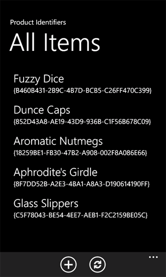

# How to: Support and convert SharePoint field types for Windows Phone apps
Implement data-conversion logic to support SharePoint field types in Windows Phone apps.
In projects based on the Windows Phone SharePoint List Application template, the data of many SharePoint field types is processed and coordinated by default conversion logic to be suitable for display and manipulation in the Silverlight user interface of a Windows Phone, but developers can also implement their own custom data handling routines.
  
    
    


> **Important:**
> If you are developing an app for Windows Phone 8, you must use Visual Studio Express 2012 instead of Visual Studio 2010 Express. Except for the development environment, all information in this article applies to creating apps for both Windows Phone 8 and Windows Phone 7. > For more information, see  [How to: Set up an environment for developing mobile apps for SharePoint](how-to-set-up-an-environment-for-developing-mobile-apps-for-sharepoint.md). 
  
    
    


## SharePoint field types in Windows Phone apps
<a name="BKMK_SharePointFieldTypes"> </a>

SharePoint lists are constituted by fields of data (arranged in columns), and a given field is designated to contain data of a certain type (that is, data structured in a certain way). These types are called field types. (Such types may also be called column types, because when you add a column to a SharePoint list, you are adding a column of fields associated with a certain type of data.) These fields are defined by an XML schema. The schema for a field called "Order Date" with a **DateTime** data type (represented as a Date and Time field in the user interface of a Microsoft SharePoint Server) might look like the following.
  
    
    

```XML

<Field Type="DateTime" DisplayName="Order Date" Required="FALSE"
 EnforceUniqueValues="FALSE" Indexed="FALSE" Format="DateOnly"
 FriendlyDisplayFormat="Disabled" Name="Order_x0020_Date">
  <Default>[today]</Default>
  <DefaultFormulaValue>2012-01-10T00:00:00Z</DefaultFormulaValue>
</Field>
```

Notice in particular the value of the **Type** attribute of the **Field** element in this schema, specified here as "DateTime". List fields created to contain data structured in other ways might be designated with a **Type** value of, say, "Choice" or "Text" or "Boolean".
  
    
    
SharePoint field types cannot be bound directly to Silverlight controls in a Windows Phone app. The data as it is in the SharePoint list must be prepared or processed in a certain way (or, in the standard terminology of Silverlight data binding, converted) in order to be bound to the controls in the app and this preparation and coordination is handled by the ViewModels in projects created from the Windows Phone SharePoint List Application template. Projects based on this template are designed to include default conversion logic to support the binding and display of SharePoint data in a Windows Phone app for a number of standard SharePoint field types (or for custom fields created based on one of these standard types). The field types supported with default conversion logic are listed in Table 1.
  
    
    

**Table 1. Field types with provisions for default conversion**


|**SharePoint field type**|**Silverlight data type**|
|:-----|:-----|
|Attachments  <br/> |File  <br/> |
|Boolean  <br/> |Boolean  <br/> |
|Calculated (for display only)  <br/> |String  <br/> |
|Choice  <br/> |String  <br/> |
|Currency  <br/> |Numeric  <br/> |
|DateTime  <br/> |Date (represented according to locale on the phone)  <br/> |
|URL  <br/> |Link  <br/> |
|Integer  <br/> |Numeric  <br/> |
|Location  <br/> |GeoCoordinate  <br/> |
|Lookup  <br/> |String  <br/> |
|MultiChoice  <br/> |String  <br/> |
|Note  <br/> |String  <br/> |
|Number  <br/> |Numeric  <br/> |
|OutcomeChoice  <br/> |String  <br/> |
|Picture  <br/> |Link  <br/> |
|Text  <br/> |String  <br/> |
|User  <br/> |String  <br/> |
   
Other SharePoint field types, such as **Guid** fields, can be used in Windows Phone apps, but developers need to provide custom conversion logic to support binding and displaying values for those field types for which no default conversion logic has been provided. (See [Custom conversion logic to provision unsupported field types](#BKMK_ConversionForUnsupportedFields) in this article.)
  
    
    
For the purpose of illustrating how the template provides default conversion and support for certain field types, assume a SharePoint list includes a column of fields named "Product Category" designated with a type of **Choice** and associated with several options, such as "Recreation" and "Culinary". The schema for such a field on the server might resemble the following markup.
  
    
    


```XML

<Field Type="Choice" DisplayName="Product Category" Required="FALSE"
 EnforceUniqueValues="FALSE" Indexed="FALSE" Format="Dropdown"
 FillInChoice="TRUE" 
 Name="Product_x0020_Category">
  <Default>Recreation</Default>
  <CHOICES>
    <CHOICE>Culinary</CHOICE>
    <CHOICE>Recreation</CHOICE>
    <CHOICE>Sartorial</CHOICE>
    <CHOICE>Travel</CHOICE>
    <CHOICE>Other</CHOICE>
  </CHOICES>
</Field>
```

This **Choice** field has to be processed in order to be suitable for display in the Windows Phone interface. In this case, the data in the field is represented as a string (for example, "Recreation") within a collection of string values (specifically, as one of the values of the **FieldValuesAsText** property of a **ListItem** object). The conversion logic for **Choice** fields extracts this string to display it in the phone's user interface. The string might be bound to and displayed in a **TextBlock** control in a form. If the value is presented for editing, the default conversion logic for **Choice** fields extracts the available options for the field ("Culinary", "Recreation", "Sartorial", etc.) from the XML schema that defines the field and represents those available options a collection (specifically, as a kind of collection based on the **ObservableCollection(T)** class) of objects that themselves include the specific option (for example, "Culinary") and whether that option has been selected. These operations are all handled in the ViewModel layer of the app. In the View (or Presentation) layer (that is, in the XAML file generated for the Edit form by the Windows Phone SharePoint List Application template), these options are rendered by default as Silverlight **RadioButton** controls within a **ListBox** control.
  
    
    

## Custom conversion for SharePoint field types
<a name="BKMK_CustomConversion"> </a>

In Visual Studio projects that are based on the Windows Phone SharePoint List Application template, the mechanism for handling the coordination and conversion of data between SharePoint and the Windows Phone Silverlight user interface has been designed to be flexible and extensible.
  
    
    
Depending on the design intentions for your particular application, you may want to provide conversion logic to support binding and displaying SharePoint field types that are not provided with conversion logic by default, or you may want to display data for a supported field in a way that differs from the default implementation.
  
    
    
Projects based on the Windows Phone SharePoint List Application template implement a static **Converter** class that includes routines for registering methods for handling data conversion operations specific to given data types. The project includes and registers data conversion routines for certain data types by default. The registration mechanism uses delegates to allow for extensibility. Developers can therefore write their own functions to provide the logic for data conversions and these custom functions can be called when the delegates are invoked instead of the default functions. In order to arrange for custom functions to be called for data conversion operations, register your functions with the **Converter** class using the registration methods of the class. The registration methods are specific to each ViewModel, to accommodate the possibility that you may want to implement and register different functions to process data differently depending on, for example, whether the data will presented for editing or for viewing only (without editing).
  
    
    

> **Tip:**
> The currency symbol shown in the display form is from SharePoint locale, even if the Windows Phone locale is different. Developers can customize this behavior by using **Converter** objects.
  
    
    

To register data conversion functions for the Display form (DisplayForm.xaml), use the **RegisterDisplayFieldValueConverter** method of the **Converter** class. To register functions for the Edit form (EditForm.xaml), use the **RegisterEditFieldValueConverter** method, and for the New form (NewForm.xaml), use the **RegisterNewFieldValueConverter** method.
  
    
    
You can register conversion functions that process data as it comes from the list to be presented in the user interface (that is, functions that determine how to **get** data) and you can register functions that process data from the user interface as its saved to the list on the server (functions that determine how to **set** data).
  
    
    
The **get** functions must match the signature of the following delegate declaration in the **Converter** class.
  
    
    


```cs

public delegate object GetConvertedFieldValue(string fieldName,
  ListItem item, ConversionContext context);
```

The **set** functions must match the signature of the following delegate declaration.
  
    
    


```cs

public delegate void SetConvertedFieldValue(string fieldName,
  object fieldValue, ListItem item, ConversionContext context);
```

The **RegisterDisplayFieldValueConverter** method accepts a **get** function only, because the **DisplayItemViewModel** class, as designed, is intended to display but not edit data. The **RegisterEditFieldValueConverter** and the **RegisterNewFieldValueConverter** methods are overloaded to accept a **get** function, a **set** function, or both.
  
    
    
In  [How to: Implement business logic and data validation in a Windows Phone app for SharePoint](how-to-implement-business-logic-and-data-validation-in-a-windows-phone-app-for-s.md), a validation routine was developed to verify the format or phone numbers provided by the user of a Windows Phone app. To demonstrate custom data conversion, in the following code sample, we'll implement **get** and **set** functions to handle phone number data in a particular way and register those functions to be used in the Edit and New forms with the **Converter** class.
  
    
    
Assume for the purposes of the following code example that you have created a Windows Phone SharePoint list app based on a Product Orders list created using the Custom List template on the server. Assume that the list has a field named "Contact Number" and that this field is designated as a **Text** field in the list. In the default configuration of a list field designated as a **Text** type on a SharePoint Server, a user can enter any text characters (up to 255 characters). The template provides default conversion logic for displaying and editing data from **Text** fields in SharePoint, but a **Text** field (by default) is not structured to impose or display any specific formatting, such as might be conventionally applied to phone numbers. In your Windows Phone app, you may want phone numbers to be displayed to users in a consistent way and, when saved to the list on the server, formatted in a particular way, even though the underlying field type ( **Text**) is not associated with specific formatting rules. To apply your particular formatting rules, you can implement your own custom data conversion logic in place of the default logic for a supported field type.
  
    
    

### To implement custom data conversion


1. Assuming you have created a list on a SharePoint Server that includes a **Text** field named "Contact Number" (like the Product Orders sample list used in [How to: Implement business logic and data validation in a Windows Phone app for SharePoint](how-to-implement-business-logic-and-data-validation-in-a-windows-phone-app-for-s.md)), create a Windows Phone app using the Windows Phone SharePoint List Application template in Visual Studio by following the steps detailed in  [How to: Create a Windows Phone SharePoint list app](how-to-create-a-windows-phone-sharepoint-list-app.md).
    
  
2. In **Solution Explorer**, choose the node representing the project (named, for example, ContosoSPListApp).
    
  
3. On the **Project** menu in Visual Studio (or Visual Studio Express for Windows Phone), choose **Add Class**. The **Add New Item** dialog box opens with the C# **Class** template already chosen.
    
  
4. Specify a name for the class file (such as ContosoConverter.cs) and choose **Add**. The class file is added to the project and opened for editing.
    
  
5. Replace the contents of the file with the following code.
    
```cs
  
using System;
using Microsoft.SharePoint.Client;  // Added for ListItem.
using Microsoft.SharePoint.Phone.Application; // Added for ConversionContext.
using System.Text.RegularExpressions;

// Specify a namespace appropriate for your particular project.
namespace ContosoSPListApp
{
    public static class ContosoConverter
    {
        static Regex StandardNumberFormat = 
          new Regex(@"^\\(?([0-9]{3})\\)?[-. ]?([0-9]{3})[-. ]?([0-9]{4})$", RegexOptions.Compiled);

        public static object GetConvertedTextFieldValue(string fieldName, 
          ListItem item, ConversionContext context)
        {
            if (item == null) return null;

            if (fieldName == "Contact_x0020_Number")
            {
                string contactNumber = string.Empty;
                try
                {
                    contactNumber = item.FieldValuesAsText[fieldName];
                }
                catch (PropertyOrFieldNotInitializedException)
                {
                    object itemValue = item[fieldName];
                    if (itemValue != null)
                    {
                        contactNumber = itemValue.ToString();
                    }
                }

                // Regularize the formatting of phone number for display in UI.
                if (StandardNumberFormat.IsMatch(contactNumber))
                {
                    // Phone number is in an acceptable format, but formatting it
                    // in a specific way for visual consistency in the UI.
                    string properlyFormattedNumber = 
                      StandardNumberFormat.Replace(contactNumber, "($1) $2-$3");
                    return properlyFormattedNumber;
                }
                else
                {
                    // Return a representation of the data adorned in such a way 
                    // as to designate its invalidity.
                    if (!contactNumber.Contains("Invalid Number"))
                    {
                        return string.Format("Invalid Number: {0}", contactNumber);
                    }
                    else
                    {
                        // Assume data is already adorned with an invalidity designation.
                        return contactNumber;
                    }
                }
            }
            else
            {
                return item[fieldName];
            }
        }

        public static void SetConvertedTextFieldValue(string fieldName, 
                             object fieldValue, ListItem item, ConversionContext context)
        {
            if (fieldValue == null) return;

            if (fieldName == "Contact_x0020_Number")
            {
                // Conventional formats (e.g., 555-555-5555) are acceptable,
                // but formatting phone numbers consistently here for storage in list on Server.
                string contactNumber = (string)fieldValue;

                if (StandardNumberFormat.IsMatch(contactNumber))
                {
                    string properlyFormattedNumber = StandardNumberFormat.Replace
                                                               (contactNumber, "($1) $2-$3");
                    item[fieldName] = properlyFormattedNumber;
                }
                else
                {
                    if (!contactNumber.Contains("Invalid Number"))
                    {
                        item[fieldName] = string.Format("Invalid Number: {0}", contactNumber);
                    }
                    else
                    {
                        // Assume data is already adorned with an invalidity designation.
                        item[fieldName] = contactNumber;
                    }                    
                }
            }
            else
            {
                // Allow values for other Text fields to be passed on to list without modification.
                item[fieldName] = fieldValue;                
            }
        }
    }
}
```

6. Save the file.
    
  
The **GetConvertedTextFieldValue** function here determines whether string data from a field intended to contain a phone number (named "Contact Number" in this example) is formatted according to standard conventions for phone numbers (in North America) and, if so, converts the number into a specific format for display, "(XXX) XXX-XXXX". If the data is not formatted as a standard phone number, it is prefixed with a designator. This function doesn't actually change the data in the list. The **SetConvertedTextFieldValue** function, on the other hand, proceeds in the opposite direction. It checks the value of data supplied for a field by a user to determine whether the supplied data matches the pattern for standard phone numbers or not. If so, the supplied value is converted into a specific format to be saved to the list on the server. If the supplied value is not in a standard format, the value is prefixed with a designator and that prefixed value is then saved to the server.
  
    
    
It remains now to register these data-conversion functions with the **Converter** class for use on the Edit and New forms. You can register the converters in several places. In the following procedure, the converters are registered in the **OnNavigatedTo** event of the List form (List.xaml). The List form is created and navigated to before the Edit and New forms are instantiated in the app, so the converters registered in this event in the List form will take effect for text fields in all the forms.
  
    
    

### To register the data-conversion functions


1. In **Solution Explorer** for the same project in which you created the class in the previous procedure, choose the List.xaml file under the **Views** node.
    
  
2. Press F7 to open the associated code-behind file, List.xaml.cs, for editing.
    
  
3. Add the following private variable declaration to the top of the code block that implements the **ListForm** partial class, after the opening brace in the code block and before the `ListForm()` constructor.
    
```cs
  
private bool _isConversionRegistered;
```

4. Add the following method, **RegisterTextFieldValueConverters**, to the file, within the code block (demarcated by opening and closing braces) that implements the **ListForm** partial class.
    
```cs
  private void RegisterTextFieldValueConverters()
{
    Converter.RegisterEditFieldValueConverter(FieldType.Text, 
                      ContosoConverter.GetConvertedTextFieldValue, 
                        ContosoConverter.SetConvertedTextFieldValue);

    Converter.RegisterNewFieldValueConverter(FieldType.Text, 
                          ContosoConverter.GetConvertedTextFieldValue, 
                          ContosoConverter.SetConvertedTextFieldValue);
}
```


    This method simply calls the appropriate registration methods of the **Converter** class. It is assumed for this code that the custom class containing the **get** and **set** functions created in the preceding procedure is named "ContosoConverter". If you specified a different name for your class, change the code here accordingly.
    
  
5. Modify the implementation of the **OnNavigatedTo** event handler in the file by adding a check for the value of the **_isConversionRegistered** flag and a call to the **RegisterTextFieldValueConverters** function added in the previous step. The modified handler should be as follows.
    
```cs
  
protected override void OnNavigatedTo(System.Windows.Navigation.NavigationEventArgs e)
{
    base.OnNavigatedTo(e);

    App.MainViewModel.ViewDataLoaded += 
      new EventHandler<ViewDataLoadedEventArgs>(OnViewDataLoaded);
    App.MainViewModel.InitializationCompleted += 
      new EventHandler<InitializationCompletedEventArgs>(OnViewModelInitialization);

    // The OnNavigatedTo event can fire more than once, but the converters only need
    // to be registered once, so checking the conversion flag first.
    if (_isConversionRegistered == false)
    {
        // Register converters.
        RegisterTextFieldValueConverters();
        _isConversionRegistered = true;
    }
}
```

6. Save the file.
    
  
Note that the data conversion functions are registered for all fields associated with a **Text** data type in the Edit and New forms. It is for this reason that the **get** and **set** functions implemented for the **ContosoConverter** class created in the preceding procedure include conditional checks to process the data for a particular field only (named, in this case, "Contact_x0020_Number"), allowing the data to "pass through" for other **Text** fields.
  
    
    

## Custom conversion logic to provision unsupported field types
<a name="BKMK_ConversionForUnsupportedFields"> </a>

Even if you don't provide conversion logic in your app for **Text** fields, such fields can still be displayed and edited. Providing your own conversion logic for fields that are already provided with default conversion logic gives you a greater degree of control over the format or the structure of the data in those fields if the default logic is not suited to your design intentions. For fields with certain other data types, like **Guid** fields, conversion logic is not provided by default, but if you understand the mechanism (described in the preceding section) by which conversion logic is provided for fields, it may be fairly simple to provide your own conversion logic to support field types in your app that are not supported with default logic by the Windows Phone SharePoint List Application template.
  
    
    
Assume you are creating a Windows Phone app based on a SharePoint list named Product Identifiers, which includes a field with a **Guid** data type. For the purpose of the following code sample, assume the list has a Product (or Title) field (of type **Text**) and an Identifier field (of type **Guid**).
  
    
    

> **Note:**
> SharePoint lists with **Guid** fields must be created programmatically or from a list template that includes **Guid** fields.
  
    
    

In a Windows Phone app created using the template and based on this simple list, the data in **Guid** fields is not displayed by default. (In place of that data, a message like the following will be displayed: "No Converter for field type 'Guid' is registered.") In the following procedure, you will include conversion logic to support **Guid** fields for a Windows Phone app. You add a class that contains methods to register field value converters to display GUIDs and to generate new GUID values for added list items.
  
    
    

### To provide conversion logic for an unsupported field type


1. In a project (named, for instance, SPListAppGuidConversion) created from the Windows Phone SharePoint List Application and based on the Product Identifiers list mentioned above, choose the node representing the project in **Solution Explorer**.
    
  
2. On the **Project** menu, choose **Add Class**. The **Add New Item** dialog box appears with the C# **Class** template already selected.
    
  
3. Specify GuidConversion.cs as the name of the file and choose **Add**. The class file is added to the solution and opened for editing
    
  
4. Replace the contents of the file with the following code.
    
```cs
  
using System;
using Microsoft.SharePoint.Phone.Application;
using Microsoft.SharePoint.Client;

namespace SPListAppGuidConversion
{
    public class GuidConversion
    {
        /// <summary>
        /// Registers a GET converter to prepare GUID values for display.
        /// </summary>
        static public void RegisterDisplayFieldGuidConverter()
        {
            // Register GET converter to display GUID values.
            Converter.RegisterDisplayFieldValueConverter(FieldType.Guid,
            getConvertedFieldValue: (string fieldName, ListItem item, ConversionContext context) =>
            {
                string guidValue = string.Empty;

                try
                {
                    guidValue = item.FieldValuesAsText[fieldName];
                }
                catch (PropertyOrFieldNotInitializedException)
                {
                    object itemValue = item[fieldName];
                    if (itemValue != null)
                    {
                        guidValue = itemValue.ToString();
                    }
                }

                if (string.IsNullOrWhiteSpace(guidValue))
                {
                    return string.Format("{{{0}}}", Guid.Empty);
                }
                else
                {
                    Guid g = new Guid();

                    if (Guid.TryParse(guidValue, out g))
                    {
                        guidValue = string.Format("{{{0}}}", g.ToString().ToUpper());
                        return guidValue;
                    }
                    else
                    {
                        return "Invalid Identifier (GUID)";
                    }
                }
            });
        }

        /// <summary>
        /// Registers GET and SET converters for GUID value of new (i.e., added) list items.
        /// </summary>
        public static void RegisterNewFieldGuidConverter()
        {
            Converter.RegisterNewFieldValueConverter(FieldType.Guid,
                getConvertedFieldValue: (string fieldName, ListItem item, 
                                 ConversionContext context) => Guid.NewGuid().ToString(),
                setConvertedFieldValue: (string fieldName, object fieldValue, 
                                ListItem item, ConversionContext context) =>
                {
                    if (fieldValue == null)
                    {
                        item[fieldName] = Guid.Empty.ToString();
                    }
                    else
                    {
                        item[fieldName] = fieldValue;
                    }
                });
        }
    }
}
```


    In this custom class, the **RegisterDisplayFieldValueConverter** and the **RegisterNewFieldValueConverter** methods of the **Converter** class are called using anonymous functions (defined by a statement lambda) to implement the **get** and **set** routines for the delegates required by the registration methods. The optional argument labels here (for example, "getConvertedFieldValue:") are included in this code only to clarify which delegates are defined.)
    
    This approach, involving lambda expressions, is an alternative to passing named functions as parameters to the converter registration functions, which was demonstrated in an earlier procedure described in this topic (in the section  [To register the data conversion functions](#BKMK_RegisterFunctions)).
    
  
5. Save the file.
    
  
6. In **Solution Explorer**, choose the App.xaml file.
    
  
7. Press F7 to open the associated code-behind file, App.xaml.cs, for editing.
    
  
8. Locate the implementation of the **Application_Launching** event handler (which is empty in a new project created from the Windows Phone SharePoint List Application template) and replace it with the following code.
    
```cs
  
private void Application_Launching(object sender, LaunchingEventArgs e)
{
    // Register converters for GUID fields. Converters can be
    // registered just once for the app.
    GuidConversion.RegisterDisplayFieldGuidConverter();
    GuidConversion.RegisterNewFieldGuidConverter();
}
```

9. For the converter logic to work for new list items (that is, to generate GUID values when items are added to the list), you need to ensure that the Identifier field of the **NewItemViewModel** is bound to the New form. One way of doing this is by adding a hidden **TextBlock** control to NewForm.xaml with a **Binding** declaration for its **Text** property set to the Identifier field. You can add the **TextBlock** control to the **StackPanel** container control that includes the **TextBox** control for the Title field, as in the following section of the markup in the NewForm.xaml file.
    
```
  
...
    <Grid x:Name="LayoutRoot" Background="Transparent" 
         xmlns:x="http://schemas.microsoft.com/winfx/2006/xaml" 
                 xmlns:controls="clr-namespace:Microsoft.Phone.Controls;
                                      assembly=Microsoft.Phone.Controls">
        <StackPanel>
            <ProgressBar Background="Red" x:Name="progressBar" 
                  Opacity="1" HorizontalAlignment="Center" VerticalAlignment="Top" 
                                    Height="15" Width="470" IsIndeterminate="{Binding IsBusy}"
                                       Visibility="{Binding ShowIfBusy}" />
            <ScrollViewer HorizontalScrollBarVisibility="Auto" Height="700">
                <Grid x:Name="ContentPanel" Width="470">
                    <StackPanel Margin="0,5,0,5">
                        <StackPanel Orientation="Vertical" Margin="0,5,0,5">
                            <TextBlock TextWrapping="Wrap" 
                           HorizontalAlignment="Left" Style="{StaticResource PhoneTextNormalStyle}">
                                        Title*</TextBlock>
                            <TextBox Style="{StaticResource TextValidationTemplate}" 
                              FontSize="{StaticResource PhoneFontSizeNormal}" Width="470" 
                                   HorizontalAlignment="Left" Name="txtTitle" Text="{Binding [Title], 
                                    Mode=TwoWay, ValidatesOnNotifyDataErrors=True, 
                                      NotifyOnValidationError=True}" TextWrapping="Wrap" />
                            <TextBlock Name="txtIdentifier" Text="{Binding [Identifier]}" Visibility="Collapsed"/>
                        </StackPanel>
                    </StackPanel>
                </Grid>
            </ScrollViewer>
        </StackPanel>
    </Grid>
...
```


    Save the file.
    
  
If you start the project and deploy the app to the Windows Phone Emulator to run it, data in the Identifier field is displayed in the List form (List.xaml) if the corresponding field in the SharePoint list contains a GUID value. (See Figure 1.)
  
    
    

**Figure 1. Displaying Guid fields**

  
    
    

  
    
    

  
    
    
In projects based on the Windows Phone SharePoint List Application template, Silverlight controls may not be added to forms and bound to field types that are not supported with default conversion logic in the template. For the Identifiers field of the Product Identifiers list used in the preceding procedure, you could add markup to the DisplayForm.xaml file to define additional controls to display GUID values, such as a **TextBlock** control and a **TextBox** control in a **StackPanel** control, which is itself contained within the **Grid** control of the user interface. The markup for the added **StackPanel** control could resemble the following.
  
    
    


```

<StackPanel HorizontalAlignment="Left" Orientation="Horizontal"
                                             Margin="0,5,0,5">
    <TextBlock TextWrapping="Wrap" Width="150" HorizontalAlignment="Left" 
                      Style="{StaticResource PhoneTextNormalStyle}">Identifier:</TextBlock>
    <TextBlock Width="310" HorizontalAlignment="Left" Name="txtIdentifier" 
                 Text="{Binding [Identifier]}" TextWrapping="Wrap" Style="
                                           {StaticResource PhoneTextSubtleStyle}" />
</StackPanel>
```

Now the Identifier field is shown on the Display form as well as on the List form.
  
    
    

## Additional resources
<a name="SP15Supportwinphone_addlresources"> </a>


-  [Build Windows Phone apps that access SharePoint](build-windows-phone-apps-that-access-sharepoint.md)
    
  
-  [How to: Set up an environment for developing mobile apps for SharePoint](how-to-set-up-an-environment-for-developing-mobile-apps-for-sharepoint.md)
    
  
-  [Windows Phone SDK 8.0](http://www.microsoft.com/en-us/download/details.aspx?id=35471)
    
  
-  [Microsoft SharePoint SDK for Windows Phone 8](http://www.microsoft.com/en-us/download/details.aspx?id=36818)
    
  
-  [Windows Phone SDK 7.1](http://www.microsoft.com/en-us/download/details.aspx?id=27570)
    
  
-  [Microsoft SharePoint SDK for Windows Phone 7.1](http://www.microsoft.com/en-us/download/details.aspx?id=30476)
    
  

