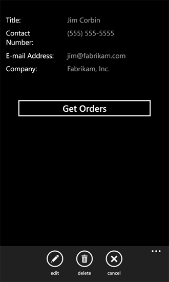
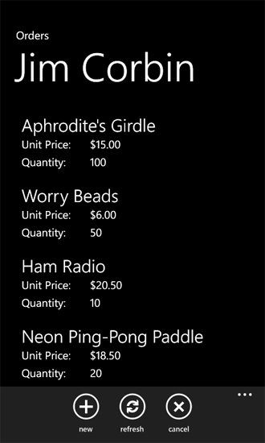

# How to: Use multiple SharePoint 2013 lists in a Windows Phone app
Create Windows Phone apps that use data from multiple SharePoint lists.
You can use multiple SharePoint lists in your app in several ways. When you create a Windows Phone app based on the Windows Phone SharePoint List Application template, you specify a single target SharePoint list, but the architecture of the resulting project is extensible enough to accommodate the integration of multiple lists.
  
    
    


> **Important:**
> If you are developing an app for Windows Phone 8, you must use Visual Studio Express 2012 instead of Visual Studio 2010 Express. Except for the development environment, all information in this article applies to creating apps for both Windows Phone 8 and Windows Phone 7. > For more information, see  [How to: Set up an environment for developing mobile apps for SharePoint](how-to-set-up-an-environment-for-developing-mobile-apps-for-sharepoint.md). 
  
    
    


## Create a solution involving SharePoint lists based on the same schema
<a name="BKMK_SameSchemaProject"> </a>

If you have two SharePoint lists based on the same schema, you can take advantage of the classes implemented by the Windows Phone SharePoint List Application template and create objects of those classes specific to each list.
  
    
    
Suppose you have two SharePoint lists based on the Contacts list template. One list, named, for instance, Marketing Team, contains members of a marketing team at your organization, and the other list, Engineering Team, contains members of an engineering team. If you create a project using the Windows Phone SharePoint List Application template and specify the Marketing Team list as the target list on which to base the project, an instance of the **ListDataProvider** class is created (named **DataProvider** by default) in the implementation of the **App** class in the App.xaml.cs file in the project. This object represents the list (that is, the Marketing Team) list as a data source for the app, providing operations to access and manipulate items in the list. An instance of the **ListViewModel** class is also created for the list on which the app is based. This object has a property member (which also happens to be named **DataProvider**) that can be set to a given instance of the **ListDataProvider** class, establishing the data source for the **ListViewModel** class instance.
  
    
    
You can create an additional instance of the **ListDataProvider** class in the project to serve as the data source for the second list (Engineering Team) in the App.xaml.cs file. The object is called **SecondaryDataProvider** in the following code.
  
    
    


```cs

private static ListDataProvider m_SecondaryDataProvider;

public static ListDataProvider SecondaryDataProvider
{
    get
    {
        if (m_SecondaryDataProvider != null)
            return m_SecondaryDataProvider;

        m_SecondaryDataProvider = new ListDataProvider();
        m_SecondaryDataProvider.ListTitle = "Engineering Team";
        m_SecondaryDataProvider.SiteUrl = new Uri("http://contoso:2012/sites/samplesite/");

        return m_SecondaryDataProvider;
    }
}
```

Then you can instantiate another object of the **ListViewModel** class (named, for instance, **SecondaryViewModel**) and assign the **SecondaryDataProvider** object to its **DataProvider** property, as in the following code.
  
    
    


```cs

private static ListViewModel m_SecondaryViewModel;

public static ListViewModel SecondaryViewModel
{
    get
    {
        if (m_SecondaryViewModel == null)
            m_SecondaryViewModel = new ListViewModel { DataProvider = App.SecondaryDataProvider };

        return m_SecondaryViewModel;
    }
    set
    {
        m_SecondaryViewModel = value;
    }
}
```

If the same fields and views for the two lists are suitable for your purposes (and, again, if the two lists have the same columns and fields), you don't need to make any changes in the implementation of the **ListDataProvider** class (in the ListDataProvider.cs file).
  
    
    
To display or modify the data from the second list in your project, however, you need to add view forms to your project that are bound to and configured for this **SecondaryViewModel**. For example, you could add a folder to your project named "SecondaryViews" and add a SecondaryList.xaml file to that folder with markup similar to that of the default List.xaml file generated by the template for the primary list in the project. Note that you should distinguish your secondary List form from the primary List form in the app by specifying a distinguishing value for the **x:Class** attribute of the **PhoneApplicationPage** element in the SecondaryList.xaml file.
  
    
    


```

<phone:PhoneApplicationPage
    x:Class="MultipleSPListApp.SecondaryViews.ListForm"
    xmlns="http://schemas.microsoft.com/winfx/2006/xaml/presentation"
    xmlns:x="http://schemas.microsoft.com/winfx/2006/xaml"
    xmlns:phone="clr-namespace:Microsoft.Phone.Controls;assembly=Microsoft.Phone"
    xmlns:shell="clr-namespace:Microsoft.Phone.Shell;assembly=Microsoft.Phone"
    xmlns:d="http://schemas.microsoft.com/expression/blend/2008"
    xmlns:mc="http://schemas.openxmlformats.org/markup-compatibility/2006"
    mc:Ignorable="d" d:DesignWidth="480" d:DesignHeight="696"
    FontFamily="{StaticResource PhoneFontFamilyNormal}"
    FontSize="{StaticResource PhoneFontSizeNormal}"
    Foreground="{StaticResource PhoneForegroundBrush}"
    SupportedOrientations="PortraitOrLandscape" Orientation="Portrait"
    shell:SystemTray.IsVisible="True" x:Name = "ListViewPage">
...
</phone:PhoneApplicationPage>
```

In the associated code-behind file, SecondaryList.xaml.cs, replace all references to "App.MainViewModel" with references to "App.SecondaryViewModel". For example, the constructor in the file should be as follows.
  
    
    


```cs

public ListForm()
    {
        InitializeComponent();
        this.DataContext = App.SecondaryViewModel;
    }
```

Also replace all references in the code-behind file to "App.DataProvider" with references to "App.SecondaryDataProvider" and update any navigation paths to point to the appropriate secondary XAML pages. If you also add a secondary New form to your project (named, for example, SecondaryNewForm.xaml in the SecondaryViews folder of your project), the handler in the SecondaryList.xaml.cs file for the **OnNewButtonClick** event would resemble the following code.
  
    
    


```cs

private void OnNewButtonClick(object sender, EventArgs e)
    {
        // Instantiate a new instance of NewItemViewModel and go to NewForm.
        App.SecondaryViewModel.CreateItemViewModelInstance = new NewItemViewModel { DataProvider = App.SecondaryDataProvider };
        NavigationService.Navigate(new Uri("/SecondaryViews/SecondaryNewForm.xaml", UriKind.Relative));
    }
```

Finally, you can add a button to the **ApplicationBar** in the List.xaml file to display the SecondaryList.xaml page.
  
    
    


```

...
    <phone:PhoneApplicationPage.ApplicationBar>
        <shell:ApplicationBar IsVisible="True" IsMenuEnabled="True">
            <shell:ApplicationBarIconButton x:Name="btnNew" IconUri="/Images/appbar.new.rest.png" Text="New" Click="OnNewButtonClick"/>
            <shell:ApplicationBarIconButton x:Name="btnRefresh" IconUri="/Images/appbar.refresh.rest.png" Text="Refresh" IsEnabled="True" Click="OnRefreshButtonClick"/>
            <!--Add the following button to navigate to the secondary list (Engineering Team).-->
            <shell:ApplicationBarIconButton x:Name="btnSecondaryList" IconUri="/Images/appbar.upload.rest.png" Text="Engineering" IsEnabled="True" Click="OnSecondaryListButtonClick"/>
        </shell:ApplicationBar>
    </phone:PhoneApplicationPage.ApplicationBar>
...
```

In the associated code-behind file, List.xaml.cs, add a handler for the **OnSecondaryListButtonClick** event declared in the List.xaml file.
  
    
    


```cs

private void OnSecondaryListButtonClick(object sender, EventArgs e)
{
    NavigationService.Navigate(new Uri("/SecondaryViews/SecondaryList.xaml", UriKind.Relative));
}
```

Users of your app can then navigate between the Marketing Team list and the Engineering Team list. Because the underlying list schemas are the same, the default **DataProvider** and **MainViewModel** objects generated by the template and the added **SecondaryDataProvider** and **SecondaryViewModel** objects handle all the data transactions without requiring any modifications to the ListDataProvider.cs file.
  
    
    

## Create a solution involving SharePoint lists based on different schemas
<a name="BKMK_DifferentSchemasProject"> </a>

The approach in the preceding section works as far as it goes (that is, for SharePoint lists based on the same schema) but the **ListDataProvider** class in the Windows Phone SharePoint List Application template is available to developers for customization to handle multiple SharePoint lists that may not be based on the same schema or may not include the same columns and fields.
  
    
    
Suppose, as in the preceding section, that you have a SharePoint list, Marketing Team (based on the Contacts list template), containing members of a marketing team. Suppose also that you have a second list, named Orders (based on the Custom list template), containing the columns and field types shown in Table 1.
  
    
    

**Table 1. Columns and fields for Orders list**


|**Column**|**Field Type**|**Required**|
|:-----|:-----|:-----|
|Product (i.e., Title)  <br/> |Single line of text (Text)  <br/> |Yes  <br/> |
|Unit Price  <br/> |Currency  <br/> |Yes  <br/> |
|Quantity  <br/> |Number  <br/> |No (defaults to zero)  <br/> |
|Order Value  <br/> |Calculated (Unit Price * Quantity)  <br/> |No  <br/> |
|Order Date  <br/> |Date and Time (Datetime)  <br/> |No  <br/> |
|Order Status  <br/> |Choice  <br/> |No  <br/> |
|Customer  <br/> |Single line of text (Text)  <br/> |No  <br/> |
   
As in the example in the preceding section, you can instantiate a separate **ListDataProvider** object and another **ListViewModel** object to manage the Orders list. Assume that the instantiated **ListDataProvider** object is named **OrdersListDataProvider**, as in the following code.
  
    
    


```cs

private static ListDataProvider m_OrdersListDataProvider;

public static ListDataProvider OrdersListDataProvider
{
    get
    {
        if (m_OrdersListDataProvider != null)
            return m_OrdersListDataProvider;

        m_OrdersListDataProvider = new ListDataProvider();
        m_OrdersListDataProvider.ListTitle = "Orders";
        m_OrdersListDataProvider.SiteUrl = new Uri("http://contoso:2012/sites/samplesite/"); // Specify a URL here for your server.

        return m_OrdersListDataProvider;
    }
}
```

And assume that the instantiated **ListViewModel** object for the Orders list is named **OrdersListViewModel**, as in the following code.
  
    
    


```cs

private static ListViewModel m_OrdersListViewModel;

public static ListViewModel OrdersListViewModel
{
    get
    {
        if (m_OrdersListViewModel == null)
            m_OrdersListViewModel = new ListViewModel { DataProvider = App.OrdersListDataProvider };

        return m_OrdersListViewModel;
    }
    set
    {
        m_OrdersListViewModel = value;
    }
}
```

The schema for the Orders list differs from that of the Marketing Team list. You can accommodate the differences by adding code to the ListDataProvider.cs file, specifically to the **CamlQueryBuilder** class.
  
    
    


```cs

public static class CamlQueryBuilder
{
    static Dictionary<string, string> ViewXmls = new Dictionary<string, string>()
    {   
        {"View1",   @"<View><Query><OrderBy><FieldRef Name='Title' />
                    <FieldRef Name='FirstName'  /></OrderBy></Query><RowLimit>30</RowLimit><ViewFields>{0}</ViewFields></View>"},
      {"View2",   @"<View><Query><OrderBy><FieldRef Name='ID' /></OrderBy></Query><RowLimit>30</RowLimit>
     <ViewFields>{0}</ViewFields></View>"}
    };

    static string View1Fields = @"<FieldRef Name='Title'/><FieldRef Name='FirstName'/>
   <FieldRef Name='JobTitle'/><FieldRef Name='Email'/><FieldRef Name='Comments'/>";
    static string View2Fields = @"<FieldRef Name='Title'/><FieldRef Name='Unit_x0020_Price'/><FieldRef Name='Quantity'/>
            <FieldRef Name='Order_x0020_Value'/><FieldRef Name='Order_x0020_Date'/>
            <FieldRef Name='Status'/><FieldRef Name='Customer'/>";

    public static CamlQuery GetCamlQuery(string viewName)
    {
        string viewXml = ViewXmls[viewName];
        // Add ViewFields to the ViewXml depending on the view.
        switch (viewName)
        {
            case "View2":
                viewXml = string.Format(viewXml, View2Fields);
                break;
            case "View1":
            default:
                viewXml = string.Format(viewXml, View1Fields);
                break;
        }
        return new CamlQuery { ViewXml = viewXml };
    }
}
```

Here, a second entry with a key value of "View2" is added to the **ViewXmls** **Dictionary** object for the Orders list. (Keep in mind that the key values for entries added to the **ViewXmls** **Dictionary** in the **CamlQueryBuilder** class must be unique (in the solution) for the caching logic in the template to operate properly.) String variables ( **View1Fields** and **View2Fields**) are used to store the list of fields for each view. Then, depending on the value of the **viewName** parameter passed to the **GetCamlQuery** method, the appropriate CAML query XML string is created.
  
    
    
Then, as in the preceding section, you can create view forms for the list, bound this time to the **OrdersListViewModel** and **OrdersListDataProvider** objects. As an example, the XAML for a List form specific to the Orders list, named OrdersList.xaml, would be similar to the markup in the List.xaml file generated by the template for the primary list in the app, except that you would name the **PivotItem** control that renders the list "View2" (rather than the default, "View1") and set the **Binding** declaration for the **ItemsSource** attribute of the **ListBox** control in which list items are rendered to "View2" as in the following markup (which shows only the markup for the root grid of the page).
  
    
    


```

...
    <Grid x:Name="LayoutRoot" Background="Transparent" xmlns:x="http://schemas.microsoft.com/winfx/2006/xaml" xmlns:controls="clr-namespace:Microsoft.Phone.Controls;assembly=Microsoft.Phone.Controls">
        <!--Pivot Control-->
        <ProgressBar x:Name="progressBar" Opacity="1" HorizontalAlignment="Center" VerticalAlignment="Top" 
               Height="30" Width="470" IsIndeterminate="{Binding IsBusy}" Visibility="{Binding ShowIfBusy}" />
        <Grid x:Name="ContentPanel" Grid.Row="0" Width="470">
            <controls:Pivot Name="Views" Title="Orders" LoadedPivotItem="OnPivotItemLoaded">
                <!--Pivot item-->
                <controls:PivotItem Name="View2" Header="All Orders">
                    <!--Double line list with text wrapping-->
                    <ListBox x:Name="lstBox1" Margin="0,0,-12,0" SelectionChanged="OnSelectionChanged" ItemsSource="{Binding [View2]}">
                        <ListBox.ItemTemplate>
                            <DataTemplate>
                                <StackPanel Orientation="Vertical" Margin="10">
                                    <TextBlock Name="txtTitle" Text="{Binding [Title]}" TextWrapping="NoWrap" 
                                          Style="{StaticResource PhoneTextTitle2Style}" />
                                    <TextBlock Name="txtUnitPrice" Text="{Binding [Unit_x0020_Price]}" 
                                         TextWrapping="NoWrap" Style="{StaticResource PhoneTextNormalStyle}" />
                                    <TextBlock Name="txtQuantity" Text="{Binding [Quantity]}"
                                         TextWrapping="NoWrap" Style="{StaticResource PhoneTextNormalStyle}" />
                                </StackPanel>
                            </DataTemplate>
                        </ListBox.ItemTemplate>
                    </ListBox>
                </controls:PivotItem>
            </controls:Pivot>
        </Grid>
    </Grid>
...
```

A convenient way to create suitable XAML markup is to use the Windows Phone SharePoint List Application template to generate a separate project based on the Orders list and then copy the generated XAML from that project to the project with multiple lists, taking care to change the name of the **PivotItem** control (which defaults to "View1") to "View2" and to change the **Binding** declaration of the **ListBox** control as shown here. You would also need to change all references in the associated code-behind file for the form to specify the appropriate **ListViewModel** and **DataProvider** objects (as, for example, **OrdersListViewModel** and **OrdersListDataProvider**).
  
    
    
This approach works because in the associated code-behind file (named, in this case, OrdersList.xaml.cs), the various event handlers that call methods of the **ListDataProvider** object (here, **OrdersListDataProvider**) to access list data use the name of the **PivotItem** control as a way to specify the appropriate view to use. For example, the **OnPivotItemLoaded** event handler calls the **LoadData** method of the **OrdersListViewModel** object instantiated from the **ListViewModel** class (and this method in turn calls the **LoadData** method of the **OrdersListDataProvider** object), passing the name of the **PivotItem** control (here, "View2") as the value of the **ViewName** parameter to the method. This same value is ultimately passed (as the value of the **viewName** parameter) to the **GetCamlQuery** method shown above in the modified implementation of the **CamlQueryBuilder** class.
  
    
    

## An alternative approach for a solution involving SharePoint lists based on different schemas
<a name="BKMK_DifferentSchemasAlternative"> </a>

As an alternative to the approach in the preceding section, you can use the Windows Phone SharePoint List Application template to create a Windows Phone app project in a Microsoft Visual Studio 2010 solution based on a given SharePoint list and then add projects built based on other lists to that same solution. This approach allows you to take advantage of the template for generating forms specific to each SharePoint list. You can then customize the solution according to your needs to control how users interact with the lists. The procedures in this section demonstrate that approach.
  
    
    
Assume for the following procedures that you have a SharePoint list named Orders (based on the Custom list template), with the columns and field types as shown in Table 1 in the preceding section. In addition, assume you have another SharePoint list (again, based on the Custom list template), named Customers, with the columns and field types shown in Table 2.
  
    
    

**Table 2. Columns and fields for Customers list**


|**Column**|**Field Type**|**Required**|
|:-----|:-----|:-----|
|Customer Name (i.e., Title)  <br/> |Single line of text (Text)  <br/> |Yes  <br/> |
|Contact Number  <br/> |Single line of text (Text)  <br/> |No  <br/> |
|E-mail Address  <br/> |Single line of text (Text)  <br/> |No  <br/> |
|Company  <br/> |Single line of text (Text)  <br/> |No  <br/> |
   
In the following procedures, you create a Windows Phone app that uses both of these lists. The primary list in the app is the Customers list. When you display the details for a given customer in the Display form, a button is included on the form that allows users to display all the orders (from the Orders list) associated with that customer.
  
    
    

### To create the component projects for the solution


1. Create a Windows Phone app by using the Windows Phone SharePoint List Application template, specifying a SharePoint list defined based on the columns and field types shown in Table 2. In the procedures in this section, it is assumed that the name of the list in the project is "Customers" and the name of the project is "CustomersSPListApp". (See  [How to: Create a Windows Phone SharePoint 2013 list app](how-to-create-a-windows-phone-sharepoint-list-app.md) for information about creating an app based on the Windows Phone SharePoint List Application template.)
    
  
2. In Visual Studio, choose **File**, **Add**, **New Project**. 
    
    The **Add New Project** dialog box appears.
    
  
3. In the **Add New Project** dialog box, under the **Visual C#** node, choose the **Silverlight for Windows Phone** node.
    
  
4. In the **Templates** pane, choose the Windows Phone SharePoint List Application template.
    
  
5. Name the app, for example, OrdersSPListApp, and then choose **OK**.
    
  
6. Follow the procedure described in  [How to: Create a Windows Phone SharePoint 2013 list app](how-to-create-a-windows-phone-sharepoint-list-app.md) to create another Windows Phone app project, specifying a SharePoint list defined based on the columns and field types show in Table 1 as the target list for the project. You should now have two projects in your solution, named "CustomersSPListApp" and "OrdersSPListApp" (if you are following the naming conventions in this procedure).
    
  
7. In **Solution Explorer**, choose the CustomerSPListApp project node.
    
  
8. On the **Project** menu, choose **Add Reference**. 
    
    The **Add Reference** dialog box appears.
    
  
9. On the **Projects** tab, choose the OrdersSPListApp project in the solution, and then choose the **OK** button. The project is added under the **References** node of the CustomersSPListApp project.
    
  
Next, configure the two projects in the solution. You essentially configure the OrdersSPListApp project (based on the Orders list) to operate as a "look-up" project for the CustomerSPListApp project (based on the Customers List).
  
    
    

### To configure the OrdersSPListApp project


1. Change the navigation paths in the view forms of the OrdersSPListApp project to include the primary namespace of the project ("OrdersSPListApp") and the "component" designation. For example, in the handler for the OnNewButtonClick event in the List.xaml.cs file of the OrdersSPListApp project, change the call to the Navigate method of the NavigationService object from this:
    
     `NavigationService.Navigate(new Uri("/Views/NewForm.xaml", UriKind.Relative));`
    
    To this:
    
     `NavigationService.Navigate(new Uri("/OrdersSPListApp;component/Views/NewForm.xaml", UriKind.Relative));`
    
    The easiest way to make these changes is to use the **Quick Replace** command in the OrdersSPListApp project.
    
1. In **Solution Explorer**, choose the OrdersSPListApp project node.
    
  
2. Press Ctrl+H to display the **Quick Replace** dialog box.
    
  
3. In the **Find what** text box, specify the following text exactly as it is appears here:
    
    Uri("/Views/
    
  
4. In the **Replace with** text box, specify the following text exactly as it appears here:
    
    Uri("/OrdersSPListApp;component/Views/
    
  
5. Ensure that **Current Project** is selected in the **Look in** drop-down list.
    
  
6. Choose **Replace All**.
    
  
7. Save all changed files in the project.
    
  
2. Add a member property to the App.xaml.cs file of the OrdersSPListApp project. In **Solution Explorer**, under the OrdersSPListApp project node, choose the App.xaml file.
    
  
3. Press F7 to open its associated code-behind file, App.xaml.cs, for editing.
    
  
4. Within the code block (demarcated by opening and closing braces) that implements the **App** partial class, add the following code.
    
  ```cs
  
public static string CustomerName { get; set; }
  ```

5. In **Solution Explorer**, under the OrdersSPListApp project node, choose the List.xaml file.
    
  
6. Press F7 to open its associated code-behind file, List.xaml.cs, for editing.
    
  
7. Modify the **OnNavigatedTo** event handler in the file to parse the **QueryString** property of the **NavigationContext** object to set the value of the **CustomerName** variable declared in step 4. You can also set the **Header** property of the **PivotItem** control on the List form to match the customer name, for the convenience of your users. The modified handler should be as follows.
    
  ```cs
  protected override void OnNavigatedTo(System.Windows.Navigation.NavigationEventArgs e)
{
    base.OnNavigatedTo(e);

    if (this.NavigationContext.QueryString.ContainsKey("CustomerName"))
    {
        App.CustomerName = NavigationContext.QueryString["CustomerName"];
    }

    // Also set the value of the Header property for the PivotItem to match the customer name.
    if (!string.IsNullOrWhiteSpace(App.CustomerName))
    {
        this.View1.Header = App.CustomerName;
    }

    App.MainViewModel.ViewDataLoaded += new EventHandler<ViewDataLoadedEventArgs>(OnViewDataLoaded);
    App.MainViewModel.InitializationCompleted += new EventHandler<InitializationCompletedEventArgs>(OnViewModelInitialization);
}
  ```

8. Add the **CustomerName** variable as an argument in the call to the **LoadData** method in the **OnPivotItemLoaded** event handler in the List.xaml.cs file. The implementation of the **OnPivotItemLoaded** event handler should be as follows.
    
  ```cs
  
private void OnPivotItemLoaded(object sender, PivotItemEventArgs e)
{
    if (!App.MainViewModel.IsInitialized)
    {
        //Initialize ViewModel and Load Data for PivotItem upon initialization.
        App.MainViewModel.Initialize();
    }
    else
    {
        //Load Data for the currently loaded PivotItem.
        App.MainViewModel.LoadData(e.Item.Name, App.CustomerName);
    }
}
  ```


    The **LoadData** method of the **ListViewModel** class in the template is defined such as to be able to accept optional parameters.
    
  
9. Also add the **CustomerName** variable as an argument in the call to the **LoadData** method in the **OnViewModelInitialization** event handler. The implementation of the **OnViewModelInitialization** event handler should be as follows.
    
  ```cs
  
private void OnViewModelInitialization(object sender, InitializationCompletedEventArgs e)
{
    this.Dispatcher.BeginInvoke(() =>
    {
        //If initialization has failed, show error message and return.
        if (e.Error != null)
        {
            MessageBox.Show(e.Error.Message, e.Error.GetType().Name, MessageBoxButton.OK);
            return;
        }
        App.MainViewModel.LoadData(((PivotItem)Views.SelectedItem).Name, App.CustomerName);
        this.DataContext = (sender as ListViewModel);
    });
}
  ```

10. Add the **CustomerName** variable as an argument in the call to the **RefreshData** method in the **OnRefreshButtonClick** event handler in the List.xaml.cs file. The implementation of the **OnRefreshButtonClick** event handler should be as follows.
    
  ```cs
  
private void OnRefreshButtonClick(object sender, EventArgs e)
{
    if (Views.SelectedItem == null)
        return;

    if (!App.MainViewModel.IsInitialized)
    {
        //Initialize ViewModel and Load Data for PivotItem upon completion.
        App.MainViewModel.Initialize();
    }
    else
    {   //Refresh Data for the currently loaded PivotItem.
        App.MainViewModel.RefreshData(((PivotItem)Views.SelectedItem).Name, App.CustomerName);
    }
}
  ```


    As for the **LoadData** method, the **RefreshData** method is also defined to be able to accept optional parameters. Notice that in the preceding three steps, the only change to the event handlers as generated by the template is the addition of the **CustomerName** variable as an argument in the call to the **LoadData** or **RefreshData** methods.
    
  
11. When users choose the **New** button on the List form for the Orders list in your app, the Customer field in the New form should already contain the name of the customer, because the list of orders displayed to the user has been filtered based on the customer name. New orders added from that filtered list should be associated with the customer name on which the list is filtered. To pass the value of the **CustomerName** variable to the New form, modify the **OnNewButtonClick** event to include the value as a query string in the navigation path to the New form, as shown in the following code.
    
  ```cs
  
private void OnNewButtonClick(object sender, EventArgs e)
{
    //Instantiate a new instance of NewItemViewModel and go to NewForm.
    App.MainViewModel.CreateItemViewModelInstance = new NewItemViewModel { DataProvider = App.DataProvider };
    
    if (!string.IsNullOrWhiteSpace(App.CustomerName))
    {
        NavigationService.Navigate(new Uri("/OrdersSPListApp;component/Views/NewForm.xaml?CustomerName=" + 
                                                                            App.CustomerName, UriKind.Relative));
    }
    else
    {
        NavigationService.Navigate(new Uri("/OrdersSPListApp;component/Views/NewForm.xaml", UriKind.Relative));
    }
}
  ```

12. In the **OnNavigatedTo** event handler for the New form, check the query string for a customer name and, if it's available, assign it to the Customer field of the ViewModel for the form. In **Solution Explorer**, under the OrdersSPListApp project, choose the NewForm.xaml file and press F7 to open its associated code-behind file, NewForm.xaml.cs, for editing.
    
  
13. Modify the **OnNavigatedTo** event handler in the file to match the following code.
    
  ```cs
  
protected override void OnNavigatedTo(System.Windows.Navigation.NavigationEventArgs e)
{
    base.OnNavigatedTo(e);

    if (this.NavigationContext.QueryString.ContainsKey("CustomerName"))
    {
        this.viewModel["Customer"] = NavigationContext.QueryString["CustomerName"];
    }

    viewModel.ItemCreated += new EventHandler<ItemCreatedEventArgs>(OnItemCreated);
}
  ```

14. In the **CamlQueryBuilder** class in the ListDataProvider.cs file in the OrdersSPListApp project, add a **WHERE** clause to the Customer field in the CAML query used to get items from the Orders list to filter the list based on a given customer name (from the **CustomerName** variable). Add a parameter to the **GetCamlQuery** method in the class for passing the customer name. The modified **CamlQueryBuilder** class should be as follows.
    
  ```cs
  
public static class CamlQueryBuilder
{
    static Dictionary<string, string> ViewXmls = new Dictionary<string, string>()
    {   
        {"View1", @"<View><Query>{0}</Query><RowLimit>30</RowLimit><ViewFields>{1}</ViewFields></View>"}
    };

    static string ViewFields = @"<FieldRef Name='Title'/><FieldRef Name='Unit_x0020_Price'/><FieldRef Name='Quantity'/><FieldRef Name='Order_x0020_Value'/><FieldRef Name='Order_x0020_Date'/><FieldRef Name='Status'/><FieldRef Name='Customer'/>";

    public static CamlQuery GetCamlQuery(string viewName, string customerName)
    {
        string queryClause = string.Empty;

        // Create appropriate Query Clause, depending on customerName parameter.
        if (string.IsNullOrWhiteSpace(customerName))
        {
            queryClause = "<OrderBy><FieldRef Name='ID' /></OrderBy>";
        }
        else
        {
            queryClause = string.Format("<Where><Eq><FieldRef Name='Customer' /><Value Type='Text'>{0}</Value></Eq></Where>", customerName);
        }

        // Add Query Clause and ViewFields to ViewXml.
        string viewXml = ViewXmls[viewName];
        viewXml = string.Format(viewXml, queryClause, ViewFields);

        return new CamlQuery { ViewXml = viewXml };
    }
}
  ```

15. Modify the **LoadDataFromServer** method in the ListDataProvider.cs file to check for the **CustomerName** argument and pass the argument to the **GetCamlQuery** method. The modified method should be as follows.
    
  ```cs
  
private void LoadDataFromServer(string ViewName, Action<LoadViewCompletedEventArgs>
                                              loadItemCompletedCallback, params object[] filterParameters)
{
    string customerName = string.Empty;
    string cacheKey = ViewName;

    // Parse the optional parameters:
    if (filterParameters.Length > 0)
    {
        customerName = filterParameters[0].ToString();
        cacheKey += "-" + customerName;
    }

    CamlQuery query = CamlQueryBuilder.GetCamlQuery(ViewName, customerName);
    ListItemCollection items = Context.Web.Lists.GetByTitle(ListTitle).GetItems(query);
    Context.Load(items);
    Context.Load(items, listItems => listItems.Include(item => item.FieldValuesAsText));

    Context.ExecuteQueryAsync(
        delegate(object sender, ClientRequestSucceededEventArgs args)
        {
            base.CacheView(cacheKey, items);
            loadItemCompletedCallback(new LoadViewCompletedEventArgs { ViewName = ViewName, Items = base.GetCachedView(cacheKey) });
        },
        delegate(object sender, ClientRequestFailedEventArgs args)
        {
            loadItemCompletedCallback(new LoadViewCompletedEventArgs { Error = args.Exception });
        });
}
  ```

16. Likewise, modify the **LoadData** method in the ListDataProvider.cs file to process the **CustomerName** parameter.
    
  ```cs
  
public override void LoadData(string ViewName, Action<LoadViewCompletedEventArgs>
                                                           loadViewCompletedCallback, params object[] filterParameters)
{
    string customerName = string.Empty;
    string cacheKey = ViewName;

    // Parse the optional parameters:
    if (filterParameters.Length > 0)
    {
        customerName = filterParameters[0].ToString();
        cacheKey += "-" + customerName;
    }

    List<ListItem> CachedItems = GetCachedView(cacheKey);
    if (CachedItems != null)
    {
        loadViewCompletedCallback(new LoadViewCompletedEventArgs { ViewName = ViewName, Items = CachedItems });
        return;
    }

    LoadDataFromServer(ViewName, loadViewCompletedCallback, filterParameters);
}
  ```

17. Add a **Cancel** button to the **ApplicationBar** element in the List.xaml file in the OrdersSPListApp project. In **Solution Explorer**, under the OrdersSPListApp node, choose the List.xaml file, and then press SHIFT+F7 to open the file for editing in the designer.
    
  
18. Add XAML to declare a **Cancel** button within the `<phone:PhoneApplicationPage.ApplicationBar>` tag, as shown in the following markup.
    
  ```
  
<phone:PhoneApplicationPage.ApplicationBar>
    <shell:ApplicationBar IsVisible="True" IsMenuEnabled="True">
        <shell:ApplicationBarIconButton x:Name="btnNew" 
                 IconUri="/Images/appbar.new.rest.png" Text="New" Click="OnNewButtonClick"/>
        <shell:ApplicationBarIconButton x:Name="btnRefresh" IconUri="/Images/appbar.refresh.rest.png" 
                 Text="Refresh" IsEnabled="True" Click="OnRefreshButtonClick"/>
        <shell:ApplicationBarIconButton x:Name="btnCancel" IconUri="/Images/appbar.cancel.rest.png" Text="Cancel" IsEnabled="True" Click="OnCancelButtonClick" />
    </shell:ApplicationBar>
</phone:PhoneApplicationPage.ApplicationBar>
  ```

19. With the List.xaml file selected in **Solution Explorer**, press F7 to open the associated code-behind file, List.xaml.cs, for editing.
    
  
20. Within the code block (demarcated by opening and closing braces) that implements the **ListForm** partial class, add the following handler for the **OnCancelButtonClick** event.
    
  ```cs
  
private void OnCancelButtonClick(object sender, EventArgs e)
{
    NavigationService.Navigate(new Uri("/CustomersSPListApp;component/Views/DisplayForm.xaml", UriKind.Relative));
}
  ```

21. Save the files in the project.
    
  
Now, it remains to add a button to the Display form in the CustomersSPListApp project to show the orders associated with a given customer.
  
    
    

### To configure the CustomersSPListApp project


1. In **Solution Explorer**, under the node for the CustomersSPListApp project, choose the DisplayForm.xaml file.
    
  
2. Press Shift + F7 (or double-click the file) to open the file for editing in the designer.
    
  
3. Add XAML declarations for a **Button** control within a containing **StackPanel** control after the final **StackPanel** control container for the last field of the list item, as in the following markup.
    
  ```
  
...
    <Grid x:Name="LayoutRoot" Background="Transparent" xmlns:x="http://schemas.microsoft.com/winfx/2006/xaml" xmlns:controls="clr-namespace:Microsoft.Phone.Controls;assembly=Microsoft.Phone.Controls">
        <StackPanel>
            <ProgressBar Background="Red" x:Name="progressBar" Opacity="1" HorizontalAlignment="Center" 
              VerticalAlignment="Top" Height="15" Width="470" IsIndeterminate="{Binding IsBusy}" 
               Visibility="{Binding ShowIfBusy}" />
            <ScrollViewer HorizontalScrollBarVisibility="Auto" Height="700">
                <Grid x:Name="ContentPanel" Width="470">
                    <StackPanel Margin="0,5,0,5">
                        <StackPanel HorizontalAlignment="Left" Orientation="Horizontal" Margin="0,5,0,5">
                            <TextBlock TextWrapping="Wrap" Width="150" HorizontalAlignment="Left" 
                                           Style="{StaticResource PhoneTextNormalStyle}">Title :</TextBlock>
                            <TextBlock Width="310" HorizontalAlignment="Left" Name="txtTitle"
                                    Text="{Binding [Title]}" TextWrapping="Wrap" Style="{StaticResource PhoneTextSubtleStyle}" />
                                   </StackPanel>
                        <StackPanel HorizontalAlignment="Left" Orientation="Horizontal" Margin="0,5,0,5">
                            <TextBlock TextWrapping="Wrap" Width="150" HorizontalAlignment="Left" 
                                       Style="{StaticResource PhoneTextNormalStyle}">Contact Number :</TextBlock>
                            <TextBlock Width="310" HorizontalAlignment="Left" Name="txtContact_x0020_Number"
                                       Text="{Binding [Contact_x0020_Number]}" TextWrapping="Wrap" 
                                       Style="{StaticResource PhoneTextSubtleStyle}" />
                        </StackPanel>
                        <StackPanel HorizontalAlignment="Left" Orientation="Horizontal" Margin="0,5,0,5">
                            <TextBlock TextWrapping="Wrap" Width="150" HorizontalAlignment="Left" 
                                     Style="{StaticResource PhoneTextNormalStyle}">E-mail Address :</TextBlock>
                            <TextBlock Width="310" HorizontalAlignment="Left" Name="txtE_x002d_mail_x0020_Address" 
                                 Text="{Binding [E_x002d_mail_x0020_Address]}" TextWrapping="Wrap" 
                                             Style="{StaticResource PhoneTextSubtleStyle}" />
                        </StackPanel>
                        <StackPanel HorizontalAlignment="Left" Orientation="Horizontal" Margin="0,5,0,5">
                            <TextBlock TextWrapping="Wrap" Width="150" HorizontalAlignment="Left" 
                                     Style="{StaticResource PhoneTextNormalStyle}">Company :</TextBlock>
                            <TextBlock Width="310" HorizontalAlignment="Left" Name="txtCompany" 
                                     Text="{Binding [Company]}" TextWrapping="Wrap" Style="{StaticResource PhoneTextSubtleStyle}" />
                        </StackPanel>
                        <StackPanel Margin="0,60,0,5"><Button Content="Get Orders" Height="70" Name="OrdersButton" Width="400" Click="OnButtonOrdersClick" /></StackPanel>
                    </StackPanel>
                </Grid>
            </ScrollViewer>
        </StackPanel>
    </Grid>
...
  ```

4. With the DisplayForm.xaml file selected in **Solution Explorer**, press F7 to open the associated code-behind file, DisplayForm.xaml.cs, for editing.
    
  
5. Within the code block (demarcated by opening and closing braces) that implements the **DisplayForm** partial class, add the following handler for the **OnButtonOrdersClick** event.
    
  ```cs
  
private void OnOrdersButtonClick(object sender, RoutedEventArgs e)
{
    this.NavigationService.Navigate(new Uri("/OrdersSPListApp;component/Views/List.xaml?CustomerName=" + 
                                                                 viewModel["Title"], UriKind.Relative));
}
  ```

6. Save the file.
    
  
If you build the solution and deploy it to the Windows Phone Emulator, the List form for the Customers list appears. If you choose an item in the list to show the Display form for a given customer, you see a button to retrieve the orders associated with that customer (Figure 1).
  
    
    

**Figure 1. Customers Display form**

  
    
    

  
    
    

  
    
    
When you choose the **Get Orders** button on this Display form, the orders for the customer are displayed in the List form from the OrdersSPListApp project in the solution (Figure 2).
  
    
    

**Figure 2. Orders List form**

  
    
    

  
    
    

  
    
    
From this form (the List form for the Orders list) you can add, edit, or delete orders for a customer. If you choose the **Cancel** button, you navigate back to the List form for the Customers list. In a single phone app, you can manage the list items from two SharePoint lists.
  
    
    

## Additional resources
<a name="SP15Usemultlists_addlresources"> </a>


-  [How to: Configure and use push notifications in SharePoint 2013 apps for Windows Phone](how-to-configure-and-use-push-notifications-in-sharepoint-apps-for-windows.md)
    
  
-  [How to: Set up an environment for developing mobile apps for SharePoint](how-to-set-up-an-environment-for-developing-mobile-apps-for-sharepoint.md)
    
  
-  [Windows Phone SDK 8.0](http://www.microsoft.com/en-us/download/details.aspx?id=35471)
    
  
-  [Microsoft SharePoint SDK for Windows Phone 8](http://www.microsoft.com/en-us/download/details.aspx?id=36818)
    
  
-  [Windows Phone SDK 7.1](http://www.microsoft.com/en-us/download/details.aspx?id=27570)
    
  
-  [Microsoft SharePoint SDK for Windows Phone 7.1](http://www.microsoft.com/en-us/download/details.aspx?id=30476)
    
  

