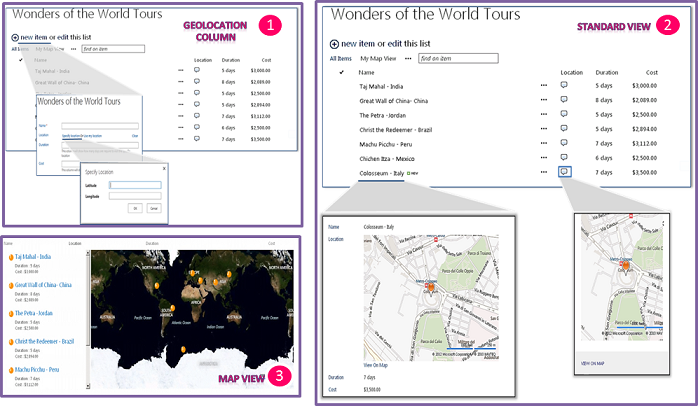

# Integrating location and map functionality in SharePoint 2013
Learn how to integrate location information and maps in SharePoint lists and location-based web and mobile apps for SharePoint, by using the new Geolocation field, and by creating your own Geolocation-based field types based on Geolocation.
## What are the location and map features in SharePoint 2013?

SharePoint 2013 introduces a new field type named Geolocation that enables you to annotate SharePoint lists with location information. In columns of type Geolocation, you can enter location information as a pair of latitude and longitude coordinates in decimal degrees or retrieve the coordinates of the user's current location from the browser if it implements the W3C Geolocation API. In the list, SharePoint 2013 displays the location on a map powered by Bing Maps. In addition, a new view named Map View displays the list items as pushpins on a Bing Maps Ajax control V7 with the list items as cards on the left pane. Figure 1 summarizes the default location and map features in SharePoint 2013. Together, the Geolocation field and the Map View enable you to give a spatial context to any information by integrating data from SharePoint into a mapping experience, and let your users engage in new ways in your web and mobile apps and solutions.
  
    
    

> **Note:**
> An MSI package named SQLSysClrTypes.msi must be installed on every SharePoint front-end web server to view the geolocation field value or data in a list. This package installs components that implement the new geometry, geography, and hierarchy ID types in SQL Server 2008. By default, this file is installed for SharePoint Online. However, it is not for an on-premises deployment of SharePoint Server 2013. You must be a member of the Farm Administrators group to perform this operation. To download SQLSysClrTypes.msi, see  [Microsoft SQL Server 2008 R2 SP1 Feature Pack](http://www.microsoft.com/en-us/download/details.aspx?id=26728) for SQL Server 2008, or [Microsoft SQL Server 2012 Feature Pack](http://www.microsoft.com/en-us/download/details.aspx?id=29065)for SQL Server 2012 in the Microsoft Download Center. 
  
    
    

**Figure 1.Summarized view of the default location and map features**

  
    
    

  
    
    

  
    
    

  
    
    

  
    
    

## What can you do with the location and map features?

The location and map features in SharePoint 2013 provide unique opportunities for developers to incorporate location, maps, and proximity search features into their web and mobile apps and solutions. Table 1 contains some basic tasks that help you integrate location and map features in your apps and solutions.
  
    
    

**Table 1. Basic tasks for integrating location and maps functionality**

|**Task**|**Description**|
|:-----|:-----|
| [How to: Set the Bing Maps key at the web and farm level in SharePoint 2013](how-to-set-the-bing-maps-key-at-the-web-and-farm-level-in-sharepoint.md)   |SharePoint 2013 uses Bings Maps to render the map of the location. To be able to use the Bing Maps feature, you need to create a Bing Maps key and set the key at the web or farm level. The article shows the various ways you can set the key in SharePoint 2013 and when to choose which option. You see an error message on the map if you do not use a valid Bing Maps key or if a key is not set at the web that contains the list or at the farm level.    |
| [How to: Add a Geolocation column to a list programmatically in SharePoint 2013](how-to-add-a-geolocation-column-to-a-list-programmatically-in-sharepoint.md)   |The Geolocation column is not available in SharePoint lists for users, by default. To add the column to a SharePoint list, you need to write code. In this topic, learn how to add the Geolocation field to a list programmatically.    |
| [How to: Extend the Geolocation field type using client-side rendering](how-to-extend-the-geolocation-field-type-using-client-side-rendering.md)   |You can provide your own rendering to default user interface (UI), logic, and behavior of the Geolocation field by creating custom field types that derive from the Geolocation field. SharePoint 2013 simplifies the creation of custom field types by enabling you to run JavaScript by providing a new JSLink property in the Geolocation field class, which points to a custom .js file that renders the field.    **Note:** The JSLink property is not supported on Survey or Events lists. A SharePoint calendar is an Events list.           |
   

## Additional resources

-  [How to: Add a Geolocation column to a list programmatically in SharePoint 2013](how-to-add-a-geolocation-column-to-a-list-programmatically-in-sharepoint.md)
    
  
-  [How to: Set the Bing Maps key at the web and farm level in SharePoint 2013](how-to-set-the-bing-maps-key-at-the-web-and-farm-level-in-sharepoint.md)
    
  
-  [How to: Extend the Geolocation field type using client-side rendering](how-to-extend-the-geolocation-field-type-using-client-side-rendering.md)
    
  
-  [How to: Integrate maps with Windows Phone apps and SharePoint 2013 lists](how-to-integrate-maps-with-windows-phone-apps-and-sharepoint-lists.md)
    
  
-  [Use the SharePoint 2013 location field type in mobile applications](http://technet.microsoft.com/en-us/library/fp161355%28v=office.15%29.aspx)
    
  
