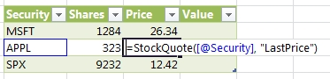

# JavaScript user-defined functions overview
JavaScript user-defined functions (UDFs) are new in Excel Services in SharePoint. This article provides a high-level look at JavaScript UDFs, including basic information on how they work in Excel Services.
## What are UDFs?
<a name="xlsWhatAreUdfs"> </a>

A user-defined function (UDF) is a function that you can create yourself and then add to the list of available functions in Excel when Excel doesn't provide the type of function that you want right out of the box.
  
    
    
Excel Services already allows you to create UDFs using managed code, so if you have worked with the existing Excel Services UDFs, JavaScript UDFs should look familiar to you. For more information about creating UDFs using managed code, see  [Excel Services User-Defined Functions](excel-services-user-defined-functions.md).
  
    
    

## JavaScript UDFs
<a name="xlsJsUDFs"> </a>

JavaScript UDFs are UDFs that run in the browser on a webpage that has an embedded Excel workbook. You use the JavaScript UDF inside of the embedded workbook. As long as you are working with the workbook in the browser, you can use the JavaScript UDF just like you use the built-in Excel functions. When the webpage is closed, the JavaScript UDF is no longer available.
  
    
    

## How do JavaScript UDFs work?
<a name="xlsJsUDFs"> </a>

To use a JavaScript UDF, you have to have the ability to modify the content of the webpage where you embed the workbook. After you reference the correct Excel Services JavaScript source file, you add your JavaScript UDF code to the page. Additionally, before you use your JavaScript UDF, you first have to register the UDF with the Excel Calculation Services. The JavaScript UDF API provides methods to both register and unregister your JavaScript UDF.
  
    
    
When the webpage with the Excel Web Access web part or embedded workbook renders, you can invoke the JavaScript UDF in the workbook just like any other Excel workbook.
  
    
    
For example, you may have a function that gets the current stock price for a specific stock. You could add a JavaScript UDF to the webpage that hosts your Excel workbook (assuming you have authoring rights for the webpage) that uses JavaScript code as follows.
  
    
    


```

function StockInfo(symbol, measure) {
  var req = new XMLHttpRequest();
  req.open('GET', 'http://www.contoso-stock-quotes.com/quote/' + symbol + '/' + measure, false); 
  req.send(null);
  if (req.status == 200) {
    return req.responseText;
  } else {
    throw new Error(ExcelCalcError.Value);
  }
 
ewa.BrowserUdfs.add("StockQuote",
                       StockInfo,
                       "Gets a stock quote given a security symbol and measure to return."
                       false,
                       false
                       );

```

You could then call the JavaScript UDF, StockInfo, in a formula from a cell inside the Excel Online.
  
    
    

**Figure 1. JavaScript UDF invoked in Excel Online**

  
    
    

  
    
    

  
    
    

  
    
    

  
    
    

## Where can I use JavaScript UDFs?
<a name="xlsWhereUseJsUdfs"> </a>

You can create and use JavaScript UDFs either on workbooks displayed in SharePoint Excel Web Access web parts or on a host webpage that has an embedded workbook. The workbook must be stored on Microsoft OneDrive. The main difference is that JavaScript UDFs added to Excel Web Access web parts require a SharePoint server. JavaScript UDFs added to host webpages that have embedded workbooks require only that the workbook be stored on OneDrive.
  
    
    

## Key points
<a name="xlsWhereUseJsUdfs"> </a>


- JavaScript UDFs only live as long as the webpage they are on is being displayed. They do not persist beyond the lifetime of the webpage where they were created.
    
  
- You can't make calls to the Excel Services JavaScript object model from within a JavaScript UDF.
    
  

## See also
<a name="bk_addresources"> </a>


-  [Excel Services in SharePoint](excel-services-in-sharepoint.md)
    
  
-  [Excel Services User-Defined Functions](http://msdn.microsoft.com/en-us/library/ms493934)
    
  

