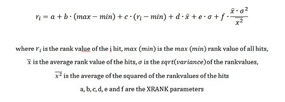

---
title: Keyword Query Language (KQL) syntax reference
ms.date: 09/25/2017
ms.prod: sharepoint
ms.assetid: d8489f59-522f-433c-b9c1-69e597be51c7
---

# Keyword Query Language (KQL) syntax reference
Learn to construct KQL queries for Search in SharePoint. This syntax reference describes KQL query elements and how to use property restrictions and operators in KQL queries.
## Elements of a KQL query

A KQL query consists of one or more of the following elements: 
  
    
    

- Free text-keywords—words or phrases 
    
  
- Property restrictions 
    
  
You can combine KQL query elements with one or more of the available operators.
  
    
    
If the KQL query contains only operators or is empty, it isn't valid. KQL queries are case-insensitive but the operators are case-sensitive (uppercase).
  
    
    

> **Note:**
> The length limit of a KQL query varies depending on how you create it. If you create the KQL query by using the default SharePoint search front end, the length limit is 2,048 characters. However, KQL queries you create programmatically by using the Query object model have a default length limit of 4,096 characters. You can increase this limit up to 20,480 characters by using the  [MaxKeywordQueryTextLength](https://msdn.microsoft.com/library/Microsoft.Office.Server.Search.Administration.SearchServiceApplication.MaxKeywordQueryTextLength.aspx) property or the [DiscoveryMaxKeywordQueryTextLength](https://msdn.microsoft.com/library/Microsoft.Office.Server.Search.Administration.SearchServiceApplication.DiscoveryMaxKeywordQueryTextLength.aspx) property (for eDiscovery).
  
    
    

## Constructing free-text queries using KQL

When you construct your KQL query by using free-text expressions, Search in SharePoint matches results for the terms you chose for the query based on terms stored in the full-text index. This includes managed property values where  [FullTextQueriable](https://msdn.microsoft.com/library/Microsoft.Office.Server.Search.Administration.ManagedProperty.FullTextQueriable.aspx) is set to **true**.
  
    
    
Free text KQL queries are case-insensitive but the operators must be in uppercase. You can construct KQL queries by using one or more of the following as free-text expressions:
  
    
    

- A **word** (includes one or more characters without spaces or punctuation)
    
  
- A **phrase** (includes two or more words together, separated by spaces; however, the words must be enclosed in double quotation marks)
    
  
To construct complex queries, you can combine multiple free-text expressions with KQL query operators. If there are multiple free-text expressions without any operators in between them, the query behavior is the same as using the **AND** operator.
  
    
    

### Using words in the free-text KQL query

When you use words in a free-text KQL query, Search in SharePoint returns results based on exact matches of your words with the terms stored in the full-text index. You can use just a part of a word, from the beginning of the word, by using the wildcard operator (*) to enable prefix matching. In prefix matching, Search in SharePoint matches results with terms that contain the word followed by zero or more characters.
  
    
    
For example, the following KQL queries return content items that contain the terms "federated" and "search": 
  
    
    
 `federated search`
  
    
    
 `federat* search`
  
    
    
 `search fed*`
  
    
    
KQL queries don't support suffix matching.
  
    
    

### Using phrases in the free-text KQL query

When you use phrases in a free-text KQL query, Search in SharePoint returns only the items in which the words in your phrase are located next to each other. To specify a phrase in a KQL query, you must use double quotation marks. 
  
    
    
KQL queries don't support suffix matching, so you can't use the wildcard operator before a phrase in free-text queries. However, you can use the wildcard operator after a phrase.
  
    
    

## Property restriction queries in KQL

Using KQL, you can construct queries that use property restrictions to narrow the focus of the query to match only results based on a specified condition.
  
    
    

### Specifying property restrictions

A basic property restriction consists of the following:
  
    
    
 `<Property Name><Property Operator><Property Value>`
  
    
    
Table 1 lists some examples of valid property restrictions syntax in KQL queries.
  
    
    

**Table 1. Valid property restriction syntax**

|**Syntax**|**Returns**|
|:-----|:-----|
| `author:"John Smith"`   |Returns content items authored by John Smith.    |
| `filetype:docx`   |Returns Microsoft Word documents.    |
| `filename:budget.xlsx`   |Returns content items with the file name  `budget.xlsx`.    |
   
The property restriction must not include white space between the property name, property operator, and the property value, or the property restriction is treated as a free-text query. The length of a property restriction is limited to 2,048 characters. 
  
    
    
In the following examples, the white space causes the query to return content items containing the terms "author" and "John Smith", instead of content items authored by John Smith:
  
    
    
 `author: "John Smith"`
  
    
    
 `author :"John Smith"`
  
    
    
 `author : "John Smith"`
  
    
    
In other words, the previous property restrictions are equivalent to the following:
  
    
    
 `author "John Smith"`
  
    
    

### Specifying property names for property restrictions

You must specify a valid managed property name for the property restriction. By default, Search in SharePoint includes several managed properties for documents.
  
    
    
To specify a property restriction for a crawled property value, you must first map the crawled property to a managed property. See **Managed and crawled properties** in [Plan the end-user search experience](http://technet.microsoft.com/en-us/library/cc263089.aspx). 
  
    
    
The managed property must be  [Queryable](https://msdn.microsoft.com/library/Microsoft.Office.Server.Search.Administration.ManagedProperty.Queryable.aspx) so that you can search for that managed property in a document. In addition, the managed property may be [Retrievable](https://msdn.microsoft.com/library/Microsoft.Office.Server.Search.Administration.ManagedProperty.Retrievable.aspx) for the managed property to be retrieved. However, the managed property doesn't have to be [Retrievable](https://msdn.microsoft.com/library/Microsoft.Office.Server.Search.Administration.ManagedProperty.Retrievable.aspx) to carry out property searches.
  
    
    

### Property operators that are supported in property restrictions

Search in SharePoint supports several property operators for property restrictions, as shown in Table 2. 
  
    
    

**Table 2. Valid property operators for property restrictions**

|**Operator**|**Description**|**Supported managed property type**|
|:-----|:-----|:-----|
|:    |Returns results where the value specified in the property restriction is equal to the property value that is stored in the Property Store database, or matches individual terms in the property value that is stored in the full-text index.    | [Text](https://msdn.microsoft.com/library/Microsoft.Office.Server.Search.Administration.ManagedDataType.Text.aspx)    [DateTime](https://msdn.microsoft.com/library/Microsoft.Office.Server.Search.Administration.ManagedDataType.DateTime.aspx)    [Integer](https://msdn.microsoft.com/library/Microsoft.Office.Server.Search.Administration.ManagedDataType.Integer.aspx)    [Decimal](https://msdn.microsoft.com/library/Microsoft.Office.Server.Search.Administration.ManagedDataType.Decimal.aspx)    [Double](https://msdn.microsoft.com/library/Microsoft.Office.Server.Search.Administration.ManagedDataType.Double.aspx)    [YesNo](https://msdn.microsoft.com/library/Microsoft.Office.Server.Search.Administration.ManagedDataType.YesNo.aspx)   |
|=    |Returns search results where the property value is equal to the value specified in the property restriction.    **Note:** We do not recommend combining the **=** operator together with asterisk ( **\***) when you do exact matching.           | [Text](https://msdn.microsoft.com/library/Microsoft.Office.Server.Search.Administration.ManagedDataType.Text.aspx)    [DateTime](https://msdn.microsoft.com/library/Microsoft.Office.Server.Search.Administration.ManagedDataType.DateTime.aspx)    [Integer](https://msdn.microsoft.com/library/Microsoft.Office.Server.Search.Administration.ManagedDataType.Integer.aspx)    [Decimal](https://msdn.microsoft.com/library/Microsoft.Office.Server.Search.Administration.ManagedDataType.Decimal.aspx)    [Double](https://msdn.microsoft.com/library/Microsoft.Office.Server.Search.Administration.ManagedDataType.Double.aspx)    [YesNo](https://msdn.microsoft.com/library/Microsoft.Office.Server.Search.Administration.ManagedDataType.YesNo.aspx)   |
|<    |Returns results where the property value is less than the value specified in the property restriction.    | [DateTime](https://msdn.microsoft.com/library/Microsoft.Office.Server.Search.Administration.ManagedDataType.DateTime.aspx)    [Integer](https://msdn.microsoft.com/library/Microsoft.Office.Server.Search.Administration.ManagedDataType.Integer.aspx)    [Decimal](https://msdn.microsoft.com/library/Microsoft.Office.Server.Search.Administration.ManagedDataType.Decimal.aspx)    [Double](https://msdn.microsoft.com/library/Microsoft.Office.Server.Search.Administration.ManagedDataType.Double.aspx)   |
|>    |Returns search results where the property value is greater than the value specified in the property restriction.    | [DateTime](https://msdn.microsoft.com/library/Microsoft.Office.Server.Search.Administration.ManagedDataType.DateTime.aspx)    [Integer](https://msdn.microsoft.com/library/Microsoft.Office.Server.Search.Administration.ManagedDataType.Integer.aspx)    [Decimal](https://msdn.microsoft.com/library/Microsoft.Office.Server.Search.Administration.ManagedDataType.Decimal.aspx)    [Double](https://msdn.microsoft.com/library/Microsoft.Office.Server.Search.Administration.ManagedDataType.Double.aspx)   |
|<=    |Returns search results where the property value is less than or equal to the value specified in the property restriction.    | [DateTime](https://msdn.microsoft.com/library/Microsoft.Office.Server.Search.Administration.ManagedDataType.DateTime.aspx)    [Integer](https://msdn.microsoft.com/library/Microsoft.Office.Server.Search.Administration.ManagedDataType.Integer.aspx)    [Decimal](https://msdn.microsoft.com/library/Microsoft.Office.Server.Search.Administration.ManagedDataType.Decimal.aspx)    [Double](https://msdn.microsoft.com/library/Microsoft.Office.Server.Search.Administration.ManagedDataType.Double.aspx)   |
|>=    |Returns search results where the property value is greater than or equal to the value specified in the property restriction.    | [DateTime](https://msdn.microsoft.com/library/Microsoft.Office.Server.Search.Administration.ManagedDataType.DateTime.aspx)    [Integer](https://msdn.microsoft.com/library/Microsoft.Office.Server.Search.Administration.ManagedDataType.Integer.aspx)    [Decimal](https://msdn.microsoft.com/library/Microsoft.Office.Server.Search.Administration.ManagedDataType.Decimal.aspx)    [Double](https://msdn.microsoft.com/library/Microsoft.Office.Server.Search.Administration.ManagedDataType.Double.aspx)   |
|\<\>    |Returns search results where the property value does not equal the value specified in the property restriction.    | [DateTime](https://msdn.microsoft.com/library/Microsoft.Office.Server.Search.Administration.ManagedDataType.DateTime.aspx)    [Integer](https://msdn.microsoft.com/library/Microsoft.Office.Server.Search.Administration.ManagedDataType.Integer.aspx)    [Decimal](https://msdn.microsoft.com/library/Microsoft.Office.Server.Search.Administration.ManagedDataType.Decimal.aspx)    [Text](https://msdn.microsoft.com/library/Microsoft.Office.Server.Search.Administration.ManagedDataType.Text.aspx)    [Double](https://msdn.microsoft.com/library/Microsoft.Office.Server.Search.Administration.ManagedDataType.Double.aspx)    [YesNo](https://msdn.microsoft.com/library/Microsoft.Office.Server.Search.Administration.ManagedDataType.YesNo.aspx)   |
|..    |Returns search results where the property value falls within the range specified in the property restriction.    For example, the range A..B represents a set of values from A to B where both A and B are inclusive. For date ranges this means from the beginning of day A to the end of day B.    | [DateTime](https://msdn.microsoft.com/library/Microsoft.Office.Server.Search.Administration.ManagedDataType.DateTime.aspx)    [Integer](https://msdn.microsoft.com/library/Microsoft.Office.Server.Search.Administration.ManagedDataType.Integer.aspx)    [Decimal](https://msdn.microsoft.com/library/Microsoft.Office.Server.Search.Administration.ManagedDataType.Decimal.aspx)    [Double](https://msdn.microsoft.com/library/Microsoft.Office.Server.Search.Administration.ManagedDataType.Double.aspx)   |
   

### Specifying property values

You must specify a property value that is a valid data type for the managed property's type. Table 3 lists these type mappings.
  
    
    

**Table 3. Valid data type mappings for managed property types**

|**Managed type**|**Data type**|
|:-----|:-----|
| [Text](https://msdn.microsoft.com/library/Microsoft.Office.Server.Search.Administration.ManagedDataType.Text.aspx)   | [String](https://msdn.microsoft.com/library/System.String.aspx)   |
| [Integer](https://msdn.microsoft.com/library/Microsoft.Office.Server.Search.Administration.ManagedDataType.Integer.aspx)   | [Int64](https://msdn.microsoft.com/library/System.Int64.aspx)   |
| [Double](https://msdn.microsoft.com/library/Microsoft.Office.Server.Search.Administration.ManagedDataType.Double.aspx)   | [System.Double](https://msdn.microsoft.com/library/System.Double.aspx)   |
| [Decimal](https://msdn.microsoft.com/library/Microsoft.Office.Server.Search.Administration.ManagedDataType.Decimal.aspx)   | [Decimal](https://msdn.microsoft.com/library/System.Decimal.aspx)   |
| [DateTime()](https://msdn.microsoft.com/library/Microsoft.Office.Server.Search.Administration.ManagedDataType.DateTime.aspx)   | [DateTime](https://msdn.microsoft.com/library/System.DateTime.aspx)   |
| [YesNo](https://msdn.microsoft.com/library/Microsoft.Office.Server.Search.Administration.ManagedDataType.YesNo.aspx)   | [Boolean](https://msdn.microsoft.com/library/System.Boolean.aspx)   |
   

#### Text property values

For text property values, the matching behavior depends on whether the property is stored in the full-text index or in the search index. 
  
    
    

#### Property values in the full-text index

Property values are stored in the full-text index when the **FullTextQueriable** property is set to **true** for a managed property. You can configure this only for string properties. Property values that are specified in the query are matched against individual terms that are stored in the full-text index. Use the [NoWordBreaker](https://msdn.microsoft.com/library/Microsoft.Office.Server.Search.Administration.ManagedProperty.NoWordBreaker.aspx) property to specify whether to match with the whole property value.
  
    
    
For example, if you're searching for a content item authored by Paul Shakespear, the following KQL query returns matching results:
  
    
    
 `author:Shakespear`
  
    
    
 `author:Paul`
  
    
    
Prefix matching is also supported. You can use the wildcard operator (*), but isn't required when you specify individual words. Continuing with the previous example, the following KQL query returns content items authored by Paul Shakespear as matches: 
  
    
    
 `author:Shakesp*`
  
    
    
When you specify a phrase for the property value, matched results must contain the specified phrase within the property value that is stored in the full-text index. The following query example returns content items with the text "Advanced Search" in the title, such as "Advanced Search XML", "Learning About the Advanced Search Web Part", and so on:
  
    
    
 `title:"Advanced Search"`
  
    
    
Prefix matching is also supported with phrases specified in property values, but you must use the wildcard operator (*) in the query, and it is supported only at the end of the phrase, as follows:
  
    
    
 `title:"Advanced Sear*"`
  
    
    
The following queries do not return the expected results:
  
    
    
 `title:"Advan* Search"`
  
    
    
 `title:"Advanced Sear"`
  
    
    

#### Numerical values for properties

For numerical property values, which include the **Integer**, **Double**, and **Decimal** managed types, the property restriction is matched against the entire value of the property.
  
    
    

### Date or time values for properties

KQL provides the **datetime** data type for date and time.The following ISO 8601-compatible datetime formats are supported in queries:
  
    
    

- YYYY-MM-DD
    
  
- YYYY-MM-DDThh:mm:ss
    
  
- YYYY-MM-DDThh:mm:ssZ
    
  
- YYYY-MM-DDThh:mm:ssfrZ
    
  
In these **datetime** formats:
  
    
    

-  _YYYY_ specifies a four-digit year.
    
    > **Note:**
      > Only four-digit years are supported. 
-  _MM_ specifies a two-digit month. For example, 01 = January.
    
  
-  _DD_ specifies a two-digit day of the month (01 through 31).
    
  
-  _T_ specifies the letter "T".
    
  
-  _hh_ specifies a two-digits hour (00 through 23); A.M./P.M. indication is not allowed.
    
  
-  _mm_ specifies a two-digit minute (00 through 59).
    
  
-  _ss_ specifies a two-digit second (00 through 59).
    
  
-  _fr_ specifies an optional fraction of seconds, ss; between 1 to 7 digits that follows the **.** after the seconds. For example, 2012-09-27T11:57:34.1234567.
    
  
All date/time values must be specified according to the UTC (Coordinated Universal Time), also known as GMT (Greenwich Mean Time) time zone. The UTC time zone identifier (a trailing "Z" character) is optional.
  
    
    

#### Relevant date intervals supported by KQL

KQL enables you to build search queries that support relative "day" range query, with reserved keywords as shown in Table 4. Use double quotation marks ("") for date intervals with a space between their names.
  
    
    

|**Name of date interval**|**Description**|
|:-----|:-----|
|today    |Represents the time from the beginning of the current day until the end of the current day.    |
|yesterday    |Represents the time from the beginning of the day until the end of the day that precedes the current day.    |
|this week    |Represents the time from the beginning of the current week until the end of the current week. The culture in which the query text was formulated is taken into account to determine the first day of the week.    |
|this month    |Represents the time from the beginning of the current month until the end of the current month.    |
|last month    |Represents the entire month that precedes the current month.    |
|this year    |Represents the time from the beginning of the current year until the end of the current year.    |
|last year    |Represents the entire year that precedes the current year.    |
   

### Using multiple property restrictions within a KQL query

Search in SharePoint supports the use of multiple property restrictions within the same KQL query. You can use either the same property for more than one property restriction, or a different property for each property restriction. 
  
    
    
When you use multiple instances of the same property restriction, matches are based on the union of the property restrictions in the KQL query. Matches would include content items authored by John Smith or Jane Smith, as follows:
  
    
    
 `author:"John Smith" author:"Jane Smith"`
  
    
    
This functionally is the same as using the **OR** Boolean operator, as follows:
  
    
    
 `author:"John Smith" OR author:"Jane Smith"`
  
    
    
When you use different property restrictions, matches are based on an intersection of the property restrictions in the KQL query, as follows:
  
    
    
 `author:"John Smith" filetype:docx`
  
    
    
Matches would include Microsoft Word documents authored by John Smith. This is the same as using the **AND** Boolean operator, as follows:
  
    
    
 `author:"John Smith" AND filetype:docx`
  
    
    

## KQL operators for complex queries

KQL syntax includes several operators that you can use to construct complex queries. 
  
    
    

### Boolean operators

You use Boolean operators to broaden or narrow your search. You can use Boolean operators with free text expressions and property restrictions in KQL queries. Table 5 lists the supported Boolean operators.
  
    
    

**Table 5. Boolean operators supported in KQL**

|**Operator**|**Description**|
|:-----|:-----|
|**AND**   |Returns search results that include all of the free text expressions, or property restrictions specified with the **AND** operator. You must specify a valid free text expression and/or a valid property restriction both preceding and following the **AND** operator. This is the same as using the plus ("+") character.   |
|**NOT**   |Returns search results that don't include the specified free text expressions or property restrictions. You must specify a valid free text expression and/or a valid property restriction following the **NOT** operator. This is the same as using the minus ("-") character.   |
|**OR**   |Returns search results that include one or more of the specified free text expressions or property restrictions. You must specify a valid free text expression and/or a valid property restriction both preceding and following the **OR** operator.   |
   

  
    
    

### Proximity operators

You use proximity operators to match the results where the specified search terms are within close proximity to each other. Proximity operators can be used with free-text expressions only; they are not supported with property restrictions in KQL queries. There are two proximity operators: **NEAR** and **ONEAR**.
  
    
    

#### NEAR operator

The **NEAR** operator matches the results where the specified search terms are within close proximity to each other, without preserving the order of the terms. The syntax for **NEAR** is as follows:
  
    
    
 `<expression> NEAR(n=4) <expression>`
  
    
    
Where  _n_ is an optional parameter that indicates maximum distance between the terms. The value of _n_ is an integer >= 0 with a default of **8**.
  
    
    
The parameter  _n_ can be specified as `n=v` where _v_ represents the value, or shortened to only _v_; such as  `NEAR(4)` where _v_ is 4.
  
    
    
For example:
  
    
    
 `"acquisition" NEAR "debt"`
  
    
    
This query matches items where the terms "acquisition" and "debt" appear within the same item, where an instance of "acquisition" is followed by up to eight other terms, and then an instance of the term "debt"; or vice versa. The order of the terms is not significant for the match.
  
    
    
If you need a smaller distance between the terms, you can specify it. The following query matches items where the terms "acquisition" and "debt" appear within the same item, where a maximum distance of 3 between the terms. Once again the order of the terms does not affect the match.
  
    
    
 `"acquisition" NEAR(n=3) "debt"`
  
    
    

> **Note:**
> In SharePoint the **NEAR** operator no longer preserves the ordering of tokens. In addition, the **NEAR** operator now receives an optional parameter that indicates maximum token distance. However, the default value is still **8**. If you must use the previous behavior, use **ONEAR** instead.
  
    
    

#### ONEAR operator

The **ONEAR** operator matches the results where the specified search terms are within close proximity to each other, while preserving the order of the terms. The syntax for **ONEAR** is as follows, where _n_ is an optional parameter that indicates maximum distance between the terms. The value of _n_ is an integer >= 0 with a default of **8**.
  
    
    
 `<expression> ONEAR(n=4) <expression>`
  
    
    
The parameter  _n_ can be specified as `n=v` where _v_ represents the value, or shortened to only _v_; such as  `ONEAR(4)` where _v_ is 4.
  
    
    
For example, the following query matches items where the terms "acquisition" and "debt" appear within the same item, where an instance of "acquisition" is followed by up to eight other terms, and then an instance of the term "debt". The order of the terms **must** match for an item to be returned:
  
    
    
 `"acquisition" ONEAR "debt"`
  
    
    
If you require a smaller distance between the terms, you can specify it as follows. This query matches items where the terms "acquisition" and "debt" appear within the same item, where a maximum distance of 3 between the terms. The order of the terms **must** match for an item to be returned:
  
    
    
 `"acquisition" ONEAR(n=3) "debt"`
  
    
    

### Synonym operators

You use the **WORDS** operator to specify that the terms in the query are synonyms, and that results returned should match either of the specified terms. You can use the **WORDS** operator with free text expressions only; it is not supported with property restrictions in KQL queries.
  
    
    
The following query example matches results that contain either the term "TV" or the term "television". This matching behavior is the same as if you had used the following query:
  
    
    
 `WORDS(TV, Television)`
  
    
    
 `TV OR Television`
  
    
    
These queries differ in how the results are ranked. When you use the **WORDS** operator, the terms "TV" and "television" are treated as synonyms instead of separate terms. Therefore, instances of either term are ranked as if they were the same term. For example, a content item that contained one instance of the term "television" and five instances of the term "TV" would be ranked the same as a content item with six instances of the term "TV".
  
    
    

### Wildcard operator

You use the wildcard operator—the asterisk character (" **\*** ")—to enable prefix matching. You can specify part of a word, from the beginning of the word, followed by the wildcard operator, in your query, as follows. This query would match results that include terms beginning with "serv", followed by zero or more characters, such as serve, server, service, and so on:
  
    
    
 `serv*`
  
    
    

### Inclusion and exclusion operators

You can specify whether the results that are returned should include or exclude content that matches the value specified in the free text expression or the property restriction by using the inclusion and exclusion operators, described in Table 6.
  
    
    

**Table 6. Operators for including and excluding content in results**

|**Name**|**Operator**|**Behavior**|
|:-----|:-----|:-----|
|Inclusion    |" **+** "   |Includes content with values that match the inclusion.    This is the default behavior if no character is specified. This is the same as using the **AND** operator.   |
|Exclusion    |" **-** "   |Excludes content with values that match the exclusion. This is the same as using the **NOT** operator.   |
   

### Dynamic ranking operator

You use the **XRANK** operator to boost the dynamic rank of items based on certain term occurrences within the _match expression_, without changing which items match the query. An **XRANK** expression contains one component that must be matched, the _match expression_, and one or more components that contribute only to dynamic ranking, the  _rank expression_. At least **one** of the parameters, excluding _n_, must be specified for an **XRANK** expression to be valid.
  
    
    
 _Match expressions_ may be any valid KQL expression, including nested **XRANK** expressions. _Rank expressions_ may be any valid KQL expression without **XRANK** expressions. If your KQL queries have multiple **XRANK** operators, the final dynamic rank value is calculated as a sum of boosts across all **XRANK** operators.
  
    
    

> **Note:**
> Use parenthesis to explicitly indicate the order of computation for KQL queries that have more than one **XRANK** operator at the same level.
  
    
    

You can use the **XRANK** operator in the following syntax:
  
    
    
 `<match expression> XRANK(cb=100, rb=0.4, pb=0.4, avgb=0.4, stdb=0.4, nb=0.4, n=200) <rank expression>`
  
    
    
The **XRANK** operator's dynamic ranking calculation is based on this formula:
  
    
    

  
    
    

  
    
    
Table 7 lists the basic parameters available for the **XRANK** operator.
  
    
    

**Table 7. XRANK operator parameters**

|**Parameter**|**Value**|**Description**|
|:-----|:-----|:-----|
| _n_   | _<integer_value>_   |Specifies the number of results to compute statistics from.    This parameter does not affect the number of results that the dynamic rank contributes to; it is just a means to exclude irrelevant items from the statistics calculations.    Default: **0**. A zero value carries the semantic of *all documents*  .   |
| _nb_   | _<float_value>_   |The  _nb_ parameter refers to normalized boost. This parameter specifies the factor that is multiplied with the product of the variance and average score of the rank values of the results set.    _f_ in the XRANK formula.   |
   
Typically, normalized boost,  _nb_, is the only parameter that is modified. This parameter provides the necessary control to promote or demote a particular item, without taking standard deviation into account. 
  
    
    
The following advanced parameters are also available. However, typically they're not used.
  
    
    

**Table 8. Advanced parameters for XRANK**

|**Parameter**|**Value**|**Description**|
|:-----|:-----|:-----|
| _cb_   | _<float_value>_   |The  _cb_ parameter refers to constant boost.   Default: **0**.    _a_ in the XRANK formula.   |
| _stdb_   | _<float_value>_   |The  _stdb_ parameter refers to standard deviation boost.   Default: **0**.    _e_ in the XRANK formula.   |
| _avgb_   | _<float_value>_   |The  _avgb_ parameter refers to average boost.   Default: **0**.    _d_ in the XRANK formula.   |
| _rb_   | _<float_value>_   |The  _rb_ parameter refers to range boost. This factor is multiplied with the range of rank values in the results set.   Default: **0**.    _b_ in the XRANK formula.   |
| _pb_   | _<float_value>_   |The  _pb_ parameter refers to percentage boost. This factor is multiplied with the item's own rank compared to the minimum value in the corpus.   Default: **0**.    _c_ in the XRANK formula.   |
   

#### Examples

 **Example 1.** The following expression matches items for which the default full-text index contains either "cat" or "dog". The expression increases dynamic rank of those items with a constant boost of 100 for items that also contain "thoroughbred".
  
    
    
 `(cat OR dog) XRANK(cb=100) thoroughbred`
  
    
    
 **Example 2.** The following expression matches items for which the default full-text index contains either "cat" or "dog". The expression increases dynamic rank of those items with a normalized boost of 1.5 for items that also contain "thoroughbred".
  
    
    
 `(cat OR dog) XRANK(nb=1.5) thoroughbred`
  
    
    
 **Example 3.** The following expression matches items for which the default full-text index contains either "cat" or "dog". The expression increases dynamic rank of those items with a constant boost of 100 and a normalized boost of 1.5, for items that also contain "thoroughbred".
  
    
    
 `(cat OR dog) XRANK(cb=100, nb=1.5) thoroughbred`
  
    
    
 **Example 4.** The following expression matches all items containing the term "animals", and boosts dynamic rank as follows:
  
    
    

- Dynamic rank of items that contain the term "dogs" is boosted by 100 points.
    
  
- Dynamic rank of items that contain the term "cats" is boosted by 200 points.
    
  
- Dynamic rank of items that contain both the terms "dogs" and "cats" is boosted by 300 points.
    
  
 `(animals XRANK(cb=100) dogs) XRANK(cb=200) cats`
  
    
    

### Parenthesis

You can combine different parts of a keyword query by using the opening parenthesis character " **(** " and closing parenthesis character " **)** ". Each opening parenthesis " **(** " must have a matching closing parenthesis " **)** ". A white space before or after a parenthesis does not affect the query.
  
    
    

## Additional resources

-  [Building search queries in SharePoint](building-search-queries-in-sharepoint.md)
    
  
