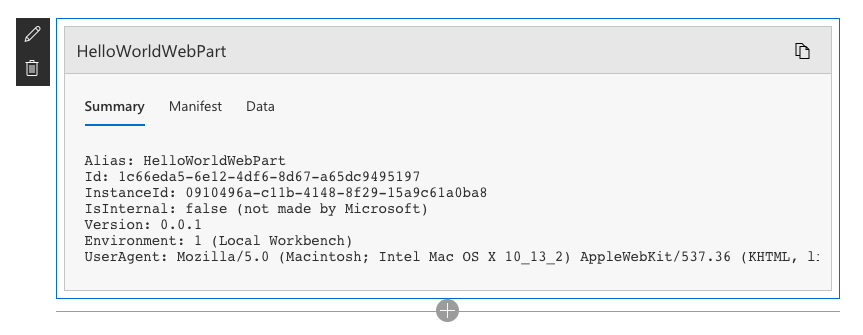
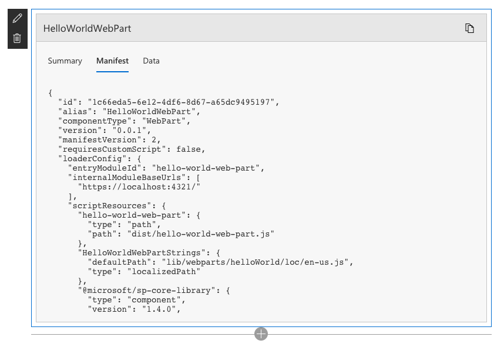

# Maintenance mode for client-side web parts

_**Applies to:** Office 365_

When working with client-side web parts, you can load them in maintenance mode. The maintenance mode can be helpful when trying to debug issues related to web parts placed on the page.

## Switch to maintenance mode

> [!NOTE]
> In order to load a page in the maintenance mode, you have to have edit permissions for that specific page.

To switch to the maintenance mode, navigate to the page and in the URL append `?maintenancemode=true`, for example:

```text
https://contoso.sharepoint.com/sites/team?maintenancemode=true
```

To leave the maintenance mode, remove `?maintenancemode=true` from the URL and reload the page.

## Available information

The maintenance mode shows various information about each web part on the page.

### Web part summary

When in maintenance mode, for each web part you will see the following summary information:



Property|Description
--------|-----------
Alias|Web part alias
Id|The unique ID of the web part
InstanceId|The ID of a specific instance of a web part (that is, if you have two more of the same web parts on a page, they will each have the same web part ID, but a different instance ID.
IsInternal|Indicates whether the web part was made by Microsoft or a third party. If `true`, it is made by Microsoft. If `false`, it is made by a third party.
Version|The version number of the web part.
Environment|Enumeration indicating the environment on which the web part is running. Possible values: `1` - Local Workbench, `2` - SharePoint
UserAgent|A string that contains information about the device and software in use (such as browser type and version).

### Web part manifest

To get more information about the web part, switch to the **Manifest** tab.



By exploring the manifest information, you can learn details such as:

- where the web part bundle is hosted
- which external scripts is the web part loading and from where
- what version of the SharePoint Framework has the web part been built on
- which components of the SharePoint Framework does the web part use

This information can be invaluable when trying to find a reason why the particular web part is malfunctioning.

### Web part data

Another piece of information available in the maintenance mode, is web part data.


Using the information from the **Data** tab, you can see the configuration for each web part. This is helpful when trying to reproduce errors reported by users which could be caused by a specific web part configuration.

If the web part [integrates its properties with SharePoint](../spfx/web-parts/guidance/integrate-web-part-properties-with-sharepoint.md), the data section shows the types and values that are passed to SharePoint for further processing.

## Considerations

- the maintenance mode works for client-side web parts placed on both modern and classic SharePoint pages. See the [Open and use the web part maintenance page](https://support.office.com/en-us/article/Open-and-use-the-web-part-maintenance-page-eff9ce22-d04a-44dd-ae83-ac29a5e396c2#PickTab=2016,_2013) support article, to get more information about opening classic web parts in maintenance view
- to open page in maintenance mode, you have to have edit permissions for that page
- when in maintenance mode, web part code is not being executed and you cannot edit web part properties
- in maintenance mode, you can delete or move web parts on the page
- the maintenance mode shows only information about web parts. You cannot use it to show information about SharePoint Framework extensions that are executed on the page
- switching to maintenance mode only disables executing web part code. Any SharePoint Framework extensions registered on the page will still execute

## See also

- [Open and use the web part maintenance page](https://support.office.com/en-us/article/Open-and-use-the-web-part-maintenance-page-eff9ce22-d04a-44dd-ae83-ac29a5e396c2)