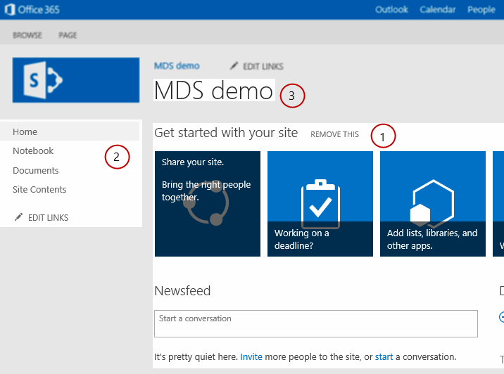

# Modify SharePoint components for MDS
Learn how to modify the components in your SharePoint project to take advantage of Minimal Download Strategy (MDS) in SharePoint.
Minimal Download Strategy (MDS) improves the user experience by returning from the server only the portions of a page required to render it properly in the browser. Because the fully-rendered page is not returned to the client, the server must be able to accurately identify the portions that are required to render the page. You might need to modify the components in your SharePoint project so that they are identified as MDS-compliant and can work with the MDS engine. Learn more about MDS in  [Minimal Download Strategy overview](minimal-download-strategy-overview.md).
  
    
    


## Why modify SharePoint components?
<a name="bk_whymodify"> </a>

As explained in  [Minimal Download Strategy overview](minimal-download-strategy-overview.md), SharePoint controls work whether or not you modify them to take full advantage of MDS. However, when your components are not MDS compliant, the MDS engine issues a failover. In a failover, the MDS engine takes an extra round trip to redirect the browser to the full version of the new page, which takes time. Users have the best experience when you modify components to work with MDS and avoid a failover every time they browse to a new page in SharePoint. You usually need to modify master pages, ASP.NET pages, controls, and web parts. 
  
    
    

  
    
    

## Master pages
<a name="SP15MDSDev_MasterPages"> </a>

The master page provides a template that lets MDS identify the content regions that may need to be updated when someone navigates to a new page. Optimizing your master pages is one of the most important steps to take when optimizing performance because master pages identify sections that require updated content.. The Seattle.master master page included with SharePoint is a good example of an optimized master page. Figure 1 shows examples of components in the Seattle.master master page that change from page to page, such as the (1) main content area, (2) left navigation bar, and (3) page title.
  
    
    

**Figure 1. Components that require updates in a master page**  
    

  
> [!NOTE]
> There are many more components in the Seattle.master master page that change from page to page, such as style sheets and JavaScript files. Figure 1 shows only a few examples. 
  
    
    

There are different patterns to optimize the components in a master page. You can use a pattern for the following components:
  
    
    

- HTML regions and controls
    
  
- Style sheets
    
  
- JavaScript files
    
  
- Page title
    
  
HTML regions and controls are MDS compatible if they are wrapped in **SharePoint:AjaxDelta** tags. By wrapping the content in **SharePoint:AjaxDelta** tags, you are signaling that the MDS engine should update the enclosed controls and HTML. If a control or HTML section doesn't change from page to page, it should not be sent to the client. Therefore, you should keep these controls outside of **AjaxDelta** tags. In the Seattle.master master page shown in Figure 1, the (1) main content area is wrapped in **AjaxDelta** tags, as shown here.
  
    
    


```cs
<SharePoint:AjaxDelta
            id="DeltaPlaceHolderMain"
            BlockElement="true"
            IsMainContent="true"
            runat="server">
    <a id="mainContent" name="mainContent" tabindex="-1"></a>
    <asp:ContentPlaceHolder id="PlaceHolderMain" runat="server" />
</SharePoint:AjaxDelta>
```

Another example of the **AjaxDelta** pattern is the (2) left navigation bar in Figure 1. The following code shows how the control is wrapped in **AjaxDelta** tags along with many other controls and HTML.
  
    
    


```cs
<SharePoint:AjaxDelta
            id="DeltaPlaceHolderLeftNavBar"
            BlockElement="true"
            CssClass="ms-core-navigation"
            role="navigation"
            runat="server">
    <asp:ContentPlaceHolder id="PlaceHolderLeftNavBar" runat="server">
        <a id="startNavigation" name="startNavigation" tabIndex="-1"></a>
        <asp:ContentPlaceHolder id="PlaceHolderLeftNavBarTop" runat="server" />
        <asp:ContentPlaceHolder id="PlaceHolderQuickLaunchTop" runat="server" />
        <asp:ContentPlaceHolder id="PlaceHolderLeftNavBarDataSource" runat="server" />
        <asp:ContentPlaceHolder id="PlaceHolderCalendarNavigator" runat="server" />
        <asp:ContentPlaceHolder id="PlaceHolderLeftActions" runat="server" />
        <!-- There are more controls and HTML in this placeholder in the Seattle master page -->
    </asp:ContentPlaceHolder>
</SharePoint:AjaxDelta>
```

One last thing to remember about **AjaxDelta** tags is that you can't nest them. You should specify **AjaxDelta** tags at the highest required level in the master page structure.
  
    
    
The last example in Figure 1 is the (3) page title, which requires a special pattern that uses the **SharePoint:PageTitle** tag. The following code shows the **PageTitle** tag as used in the Seattle.master master page.
  
    
    


```cs

<SharePoint:PageTitle runat="server">
    <asp:ContentPlaceHolder id="PlaceHolderPageTitle" runat="server">
        <SharePoint:ProjectProperty Property="Title" runat="server" />
    </asp:ContentPlaceHolder>
</SharePoint:PageTitle>
```

Your master page can also include style sheets and JavaScript files. The server engine needs to identify both CSS and JavaScript files as required. To identify the CSS files resources as required, use the following pattern.
  
    
    


```cs

<SharePoint:CssLink runat="server" Version="15"/>
<SharePoint:CssRegistration Name="my_styles.css" runat="server" />
```

Note that you can have only one **CssLink** tag per master page, but you can have many **CssRegistration** tags, so you can add many CSS files. Use the following pattern for JavaScript files.
  
    
    


```cs

<SharePoint:ScriptLink language="javascript" name="my_javascript.js" runat="server" />
```

Including CSS and JavaScript files using HTML **style** and **script** tags is not supported in MDS.
  
    
    

## ASP.NET pages
<a name="SP15MDSDev_ASPNET"> </a>

If your project includes ASP.NET pages, you probably need to reference CSS and JavaScript files. The HTML **style** and **script** tags are not compatible with MDS. Instead, use the **CssRegistration** and **ScriptLink** patterns explained in the previous section.
  
    
    
Your ASP.NET pages may also use the **Response.Output** method to write content to the page, which is not allowed in MDS. Instead, you can use the following MDS-compliant methods of the [SPHttpUtility](https://msdn.microsoft.com/library/Microsoft.SharePoint.Utilities.SPHttpUtility.aspx) class:
  
    
    

-  [WriteNoEncode()](https://msdn.microsoft.com/library/Microsoft.SharePoint.Utilities.SPHttpUtility.WriteNoEncode.aspx)
    
  
-  [WriteHtmlEncode()](https://msdn.microsoft.com/library/Microsoft.SharePoint.Utilities.SPHttpUtility.WriteHtmlEncode.aspx)
    
  
-  [WriteEcmaScriptStringLiteralEncode()](https://msdn.microsoft.com/library/Microsoft.SharePoint.Utilities.SPHttpUtility.WriteEcmaScriptStringLiteralEncode.aspx)
    
  
-  [WriteHtmlEncodeAllowSimpleTextFormatting()](https://msdn.microsoft.com/library/Microsoft.SharePoint.Utilities.SPHttpUtility.WriteHtmlEncodeAllowSimpleTextFormatting.aspx)
    
  
-  [WriteHtmlUrlAttributeEncode()](https://msdn.microsoft.com/library/Microsoft.SharePoint.Utilities.SPHttpUtility.WriteHtmlUrlAttributeEncode.aspx)
    
  
-  [WriteUrlKeyValueEncode()](https://msdn.microsoft.com/library/Microsoft.SharePoint.Utilities.SPHttpUtility.WriteUrlKeyValueEncode.aspx)
    
  
-  [WriteUrlPathEncode()](https://msdn.microsoft.com/library/Microsoft.SharePoint.Utilities.SPHttpUtility.WriteUrlPathEncode.aspx)
    
  
Besides referencing JavaScript files, your ASP.NET pages can have inline JavaScript code. Use the following pattern to make your script blocks MDS compatible.
  
    
    


```cs
<SharePoint:ScriptBlock runat="server" >
    // Your JavaScript code here.
</SharePoint:ScriptBlock>
```


## Controls and web parts
<a name="SP15MDSDev_WebParts"> </a>

You also need to mark your controls and web parts as MDS compliant. The following code shows the pattern to use.
  
    
    

```cs

[assembly: Microsoft.SharePoint.WebControls.MdsCompliantAttribute(IsCompliant = true)]
namespace VisualWebPartProject2.VisualWebPart1
{
    // Rest of your control logic
```

Also, your controls and web parts need to register their resources using the methods in the  [SPPageContentManager](https://msdn.microsoft.com/library/Microsoft.SharePoint.WebControls.SPPageContentManager.aspx) class. The most common resources are JavaScript snippets and hidden files, which can be registered using the **RegisterClientScriptBlock** and **RegisterHiddenField**, respectively.
  
    
    
Your controls and web parts can also use XSLT files to control the rendering process. Your XSLT files can have embedded JavaScript code or files. The MDS engine needs to know about these resources. You can register the JavaScript resources using an XSLT extension object named **pcm**. A great example of how to use the **pcm** object is in the %ProgramFiles%\\Common Files\\Microsoft Shared\\web server extensions\\15\\TEMPLATE\\LAYOUTS\\XSL\\fldtypes.xsl file. The following code shows how the **fldtypes.xsl** file uses the **pcm** object to register JavaScript resources.
  
    
    


```XML

<xsl:value-of select="pcm:RegisterScriptBlock(concat('block1',$ViewCounter), string($scriptbody1))"/>
<xsl:value-of select="pcm:RegisterScriptLink('/_layouts/15/wssactionmenu.js')"/>
```


## See also
<a name="bk_addresources"> </a>


-  [Minimal Download Strategy overview](minimal-download-strategy-overview.md)
    
  
-  [Build sites for SharePoint](build-sites-for-sharepoint.md)
    
  

