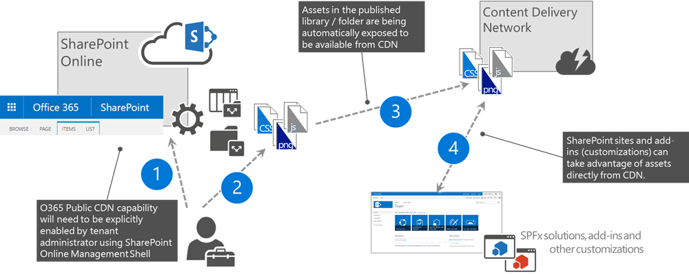
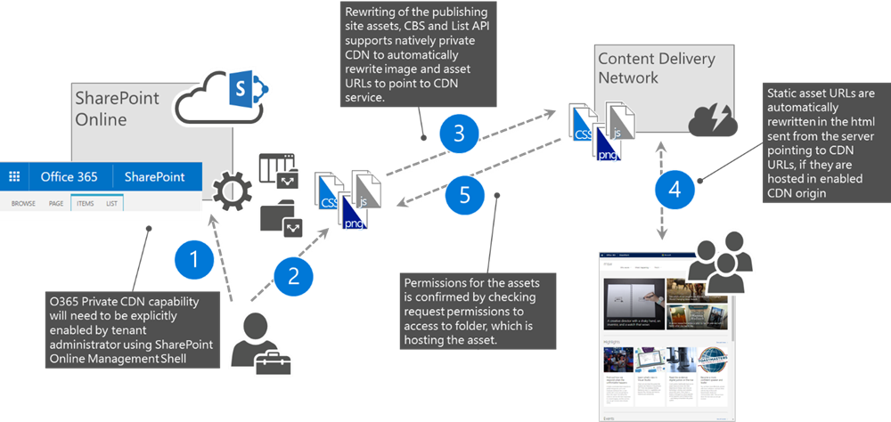

# Use the Office 365 content delivery network (CDN)

_**Applies to:** Office 365_

You can host static assets in the Office 365 content delivery network (CDN) to provide better performance for your SharePoint Online pages. Static assets are files that don't change very often, like images, video and audio, style sheets, fonts, and JavaScript files. The CDN works as a geographically distributed caching proxy, by caching static assets closer to the browsers requesting them.

## Office 365 CDN basics

The Office 365 CDN is included as part of your SharePoint Online subscription. You don't have to pay extra for it. Office 365 provides support for both private and public access and allows you to host static assets in multiple locations, or origins. The Office 365 CDN is not the same as the Azure CDN. If you need more information about why to use a CDN or about general CDN concepts, see [Content delivery networks](https://support.office.com/en-us/article/Content-delivery-networks-0140f704-6614-49bb-aa6c-89b75dcd7f1f).

## Office 365 CDN types

Office 365 offers you two types of CDNs: Public and Private. Both options provide performance improvements, but each has unique attributes and advantages.

### Office 365 Public CDN



1. Administrator enables Office 365 Public CDN for the tenant.
1. Static assets to be shared from CDN are uploaded to SharePoint libraries, which are enabled as Public CDN origins.
1. Assets from the configured libraries and folders are propagated to the CDN service.
1. URLs pointing to CDN location are available to be used in the SharePoint sites and in customizations running on SharePoint pages.

> [!NOTE]
> You should never place resources that are considered sensitive to your organization in a Document library configured as a Public CDN origin.

#### Office 365 Public CDN attributes and advantages

- Assets exposed in a public origin are accessible by everyone anonymously.
- If you remove an asset from a public origin, the asset may continue to be available for up to 30 days from the cache; however, we will invalidate links to the asset in the CDN within 15 minutes.
- When you host style sheets (CSS files) in a public origin, you can use relative paths and URIs within the code. This means that you can reference the location of background images and other objects relative to the location of the asset that's calling it.
- While you can hard code a public origin's URL, doing so is not recommended. The reason for this is that if access to the CDN becomes unavailable, the URL will not automatically resolve to your organization in SharePoint Online and might result in broken links and other errors. Therefore, the recommendation is to use SharePoint URLs and have SharePoint automatically rewrite the URL to the public CDN URL when it's enabled.
- The default file types that are included for public origins are .css, .eot, .gif, .ico, .jpeg, .jpg, .js, .map, .png, .svg, .ttf, and .woff. You can specify additional file types by changing the [CDN's configuration](https://docs.microsoft.com/en-us/powershell/module/sharepoint-online/set-spotenantcdnpolicy?view=sharepoint-ps).
- If you want, you can configure a policy to exclude assets that have been identified by site classifications that you specify. For example, you can choose to exclude all assets that are marked as "confidential" or "restricted" even if they are an allowed file type and are located in a public origin.

### Office 365 Private CDN



1. Administrator enables Office 365 Private CDN for the tenant
1. Static assets to be shared from CDN are uploaded to SharePoint libraries, which are enabled as Private CDN origins
1. Assets from the designated Private CDN Origins are distributed to the CDN service
1. When users request pages using assets stored in any of the CDN origins, SharePoint automatically rewrites the assets' URL to the CDN URL, so that these assets are served from the CDN
1. Assets being served from the CDN must have a major version published and users must have permissions to access these assets, when URL rewriting happens

#### Office 365 Private CDN attributes and advantages

- Users can only access the assets from a private origin if they are authorized to do so. Anonymous access to these assets is prevented.
- If you remove an asset from the private origin, the asset may continue to be available for up to an hour from the cache; however, we will invalidate links to the asset in the CDN within 15 minutes.
- The default file types that are included for private origins are .gif, .ico, .jpeg, .jpg, .js, and .png. You can specify additional file types by changing the [CDN's configuration](https://docs.microsoft.com/en-us/powershell/module/sharepoint-online/set-spotenantcdnpolicy?view=sharepoint-ps).
- Just like public origins, you can configure a policy to exclude assets that have been identified by site classifications that you specify even if you use wildcards to include all assets within a folder or site library.

### Publishing feature auto-rewriting to CDN URLs

To help organizations take advantage of the Office 365 CDN capabilities without having to update their existing portals, the SharePoint Publishing feature has been updated to automatically rewrite URLs of assets stored in CDN origins to their CDN equivalents so that assets are served from the CDN service instead of SharePoint.

The following is an overview of which links are automatically rewritten by the SharePoint Publishing feature:

- IMG/LINK/CSS URLs in classic publishing page HTML responses
  - This includes images added by authors within the HTML content of a page
  - When extending pages, you can temporarily disable auto-rewriting URLs on a page by:
    - checking out the page
    - providing the query string parameter `?NoAutoReWrites=true`
- Picture Library SlideShow webpart image URLs
- Image fields in SPList REST API (RenderListDataAsStream) results
  - Use the new property ImageFieldsToTryRewriteToCdnUrls to provide a comma separated list of Fields.
  - Supports Hyperlink Fields (Picture or Link) and PublishingImage Fields.
- SharePoint Image renditions

## Set up and configure the Office 365 CDN

You can set up and configure the Office 365 CDN in your tenant using the SharePoint Online Management Shell or the Office 365 CLI.

### Set up and configure the Office 365 CDN using the SharePoint Online Management Shell

> [!NOTE]
> Before you can manage site collection app catalogs in your tenant, ensure that you have installed the [SharePoint Online Management Shell](https://www.microsoft.com/en-us/download/details.aspx?id=35588). Next, connect to your SharePoint Online tenant using the `Connect-SPOService` cmdlet.

#### Enable Office 365 CDN

You can manage the state of the Office 365 CDN in your tenant using the [Set-SPOTenantCdnEnabled](https://docs.microsoft.com/en-us/powershell/module/sharepoint-online/set-spotenantcdnenabled?view=sharepoint-ps) cmdlet.

To enable the Office 365 Public CDN in your tenant execute:

```powershell
Set-SPOTenantCdnEnabled -CdnType Public -Enable $true
```

To enable the Office 365 Private CDN, execute:

```powershell
Set-SPOTenantCdnEnabled -CdnType Private -Enable $true
```

Alternatively, if you want to use both CDN types, you can enable them using:

```powershell
Set-SPOTenantCdnEnabled -CdnType Both -Enable $true
```

If you don't want to use the standard CDN origins, add the `-NoDefaultOrigins` parameter:

```powershell
Set-SPOTenantCdnEnabled -CdnType Both -Enable $true -NoDefaultOrigins
```

#### View the current status of the Office 365 CDN

To check, if the particular type of Office 365 CDN is enabled or disabled, use the [Get-SPOTenantCdnEnabled](https://docs.microsoft.com/en-us/powershell/module/sharepoint-online/get-spotenantcdnenabled?view=sharepoint-ps) cmdlet.

To check if the Office 365 Public CDN is enabled, execute:

```powershell
Get-SPOTenantCdnEnabled -CdnType Public
```

#### View Office 365 CDN origins

To view the currently configured Office 365 Public CDN origins execute:

```powershell
Get-SPOTenantCdnOrigins -CdnType Public
```

#### Add Office 365 CDN origin

> [!NOTE]
> You should never place resources that are considered sensitive to your organization in a SharePoint Document library configured as a Public CDN origin

Use the [Add-SPOTenantCdnOrigin](https://docs.microsoft.com/en-us/powershell/module/sharepoint-online/add-spotenantcdnorigin?view=sharepoint-ps) cmdlet to define a CDN origin. You can define multiple origins. The origin is a URL that points to a SharePoint library or folder that contains the assets that you want to be hosted by the CDN.

```powershell
Add-SPOTenantCdnOrigin -CdnType <Public | Private> -OriginUrl <path>
```

Where `path` is the path to the folder that contains the assets. You can use wildcards in addition to relative paths.

To include all assets in the Master Page Gallery of all sites as a public CDN origin, execute:

```powershell
Add-SPOTenantCdnOrigin -CdnType Public -OriginUrl */masterpage
```

To configure a private origin for a specific site collection, execute:

```powershell
Add-SPOTenantCdnOrigin -CdnType Private -OriginUrl sites/site1/siteassets
```

> [!NOTE]
> After adding a CDN origin, it might take up to 15 minutes for you to be able to retrieve files via the CDN service. You can verify if the particular origin has already been enabled using the [Get-SPOTenantCdnOrigins](https://docs.microsoft.com/en-us/powershell/module/sharepoint-online/get-spotenantcdnorigins?view=sharepoint-ps) cmdlet.

#### Remove Office 365 CDN origin

Use the [Remove-SPOTenantCdnOrigin](https://docs.microsoft.com/en-us/powershell/module/sharepoint-online/remove-spotenantcdnorigin?view=sharepoint-ps) cmdlet to remove a CDN origin for the specified CDN type.

To remove an origin from the Public CDN configuration, execute:

```powershell
Remove-SPOTenantCdnOrigin -CdnType Public -OriginUrl */masterpage
```

> [!NOTE]
> Removing a CDN origin doesn't affect the files stored in any Document library matching that origin. If these assets have been referenced using their SharePoint URL, SharePoint will automatically switch back to the original URL pointing to the Document library. If, however, assets have been referenced using the Public CDN URL, then these links will now be broken and will need to be manually changed.

#### Modify Office 365 CDN origin

It's not possible to modify an existing CDN origin. Instead, you should remove the previously defined CDN origin using the `Remove-SPOTenantCdnOrigin` cmdlet and add a new one using the `Add-SPOTenantCdnOrigin` cmdlet.

#### Change the types of files to include in Office 365 CDN

By default, the following file types are included in the Public CDN: _.css, .eot, .gif, .ico, .jpeg, .jpg, .js, .map, .png, .svg, .ttf, and .woff_. If you need to include additional file types in the CDN, you can change the CDN configuration using the [Set-SPOTenantCdnPolicy](https://docs.microsoft.com/en-us/powershell/module/sharepoint-online/set-spotenantcdnpolicy?view=sharepoint-ps) cmdlet.

> [!NOTE]
> When changing the list of file types, you overwrite the currently defined list. If you want to include additional file types, first use the [Get-SPOTenantCdnPolicies](https://docs.microsoft.com/en-us/powershell/module/sharepoint-online/get-spotenantcdnpolicies?view=sharepoint-ps) cmdlet to find out which file types are currently configured.

To add the _JSON_ file type to the default list of file types included in the Public CDN, execute:

```powershell
Set-SPOTenantCdnPolicy -CdnType Public -PolicyType IncludeFileExtensions -PolicyValue "CSS,EOT,GIF,ICO,JPEG,JPG,JS,MAP,PNG,SVG,TTF,WOFF,JSON"
```

#### Change the list of site classifications you want to exclude from the Office 365 CDN

Use the [Set-SPOTenantCdnPolicy](https://docs.microsoft.com/en-us/powershell/module/sharepoint-online/set-spotenantcdnpolicy?view=sharepoint-ps) cmdlet to exclude site classifications that you do not want to make available over the CDN. By default, no site classifications are excluded.

> [!NOTE]
> When changing the list of excluded site classifications, you overwrite the currently defined list. If you want to exclude additional classifications, first use the [Get-SPOTenantCdnPolicies](https://docs.microsoft.com/en-us/powershell/module/sharepoint-online/get-spotenantcdnpolicies?view=sharepoint-ps) cmdlet to find out which classifications are currently configured.

To exclude sites classified as _HBI_ from the Public CDN, execute

```powershell
Set-SPOTenantCdnPolicy -CdnType Public -PolicyType ExcludeRestrictedSiteClassifications -PolicyValue "HBI"
```

#### Disable Office 365 CDN

To disable the Office 365 CDN use the `Set-SPOTenantCdnEnabled` cmdlet, for example:

```powershell
Set-SPOTenantCdnEnabled -CdnType Public -Enable $false
```

### Set up and configure the Office 365 CDN using the Office 365 CLI

> [!NOTE]
> Before you can manage site collection app catalogs in your tenant, ensure that you have installed the [Office 365 CLI](https://aka.ms/o365cli). Next, connect to your SharePoint Online tenant using the [spo connect](https://pnp.github.io/office365-cli/cmd/spo/connect/) command.

#### Enable Office 365 CDN

You can manage the state of the Office 365 CDN in your tenant using the [spo cdn set](https://pnp.github.io/office365-cli/cmd/spo/cdn/cdn-set/) command.

To enable the Office 365 Public CDN in your tenant execute:

```sh
spo cdn set --type Public --enabled true
```

To enable the Office 365 Private CDN, execute:

```sh
spo cdn set --type Private --enabled true
```

#### View the current status of the Office 365 CDN

To check, if the particular type of Office 365 CDN is enabled or disabled, use the [spo cdn get](https://pnp.github.io/office365-cli/cmd/spo/cdn/cdn-get/) command.

To check if the Office 365 Public CDN is enabled, execute:

```sh
spo cdn get --type Public
```

#### View Office 365 CDN origins

To view the currently configured Office 365 Public CDN origins execute:

```sh
spo cdn origin list --type Public
```

#### Add Office 365 CDN origin

> [!NOTE]
> You should never place resources that are considered sensitive to your organization in a SharePoint Document library configured as a Public CDN origin

Use the [spo cdn origin add](https://pnp.github.io/office365-cli/cmd/spo/cdn/cdn-origin-add/) command to define a CDN origin. You can define multiple origins. The origin is a URL that points to a SharePoint library or folder that contains the assets that you want to be hosted by the CDN.

```sh
spo cdn origin add --type [Public | Private] --origin <path>
```

Where `path` is the path to the folder that contains the assets. You can use wildcards in addition to relative paths.

To include all assets in the Master Page Gallery of all sites as a public CDN origin, execute:

```sh
spo cdn origin add --type Public --origin */masterpage
```

To configure a private origin for a specific site collection, execute:

```sh
spo cdn origin add --type Private --origin sites/site1/siteassets
```

> [!NOTE]
> After adding a CDN origin, it might take up to 15 minutes for you to be able to retrieve files via the CDN service. You can verify if the particular origin has already been enabled using the [spo cdn origin list](https://pnp.github.io/office365-cli/cmd/spo/cdn/cdn-origin-list/) command.

#### Remove Office 365 CDN origin

Use the [spo cdn origin remove](https://pnp.github.io/office365-cli/cmd/spo/cdn/cdn-origin-remove/) command to remove a CDN origin for the specified CDN type.

To remove an origin from the Public CDN configuration, execute:

```sh
spo cdn origin remove --type Public --origin */masterpage
```

> [!NOTE]
> Removing a CDN origin doesn't affect the files stored in any Document library matching that origin. If these assets have been referenced using their SharePoint URL, SharePoint will automatically switch back to the original URL pointing to the Document library. If, however, assets have been referenced using the Public CDN URL, then these links will now be broken and will need to be manually changed.

#### Modify Office 365 CDN origin

It's not possible to modify an existing CDN origin. Instead, you should remove the previously defined CDN origin using the `spo cdn origin remove` command and add a new one using the `spo cdn origin add` command.

#### Change the types of files to include in Office 365 CDN

By default, the following file types are included in the CDN: _.css, .eot, .gif, .ico, .jpeg, .jpg, .js, .map, .png, .svg, .ttf, and .woff_. If you need to include additional file types in the CDN, you can change the CDN configuration using the [spo cdn policy set](https://pnp.github.io/office365-cli/cmd/spo/cdn/cdn-policy-set/) command.

> [!NOTE]
> When changing the list of file types, you overwrite the currently defined list. If you want to include additional file types, first use the [spo cdn policy list](https://pnp.github.io/office365-cli/cmd/spo/cdn/cdn-origin-list/) command to find out which file types are currently configured.

To add the _JSON_ file type to the default list of file types included in the Public CDN, execute:

```sh
spo cdn policy set --type Public --policy IncludeFileExtensions --value "CSS,EOT,GIF,ICO,JPEG,JPG,JS,MAP,PNG,SVG,TTF,WOFF,JSON"
```

#### Change the list of site classifications you want to exclude from the Office 365 CDN

Use the [spo cdn policy set](https://pnp.github.io/office365-cli/cmd/spo/cdn/cdn-policy-set/) command to exclude site classifications that you do not want to make available over the CDN. By default, no site classifications are excluded.

> [!NOTE]
> When changing the list of excluded site classifications, you overwrite the currently defined list. If you want to exclude additional classifications, first use the [spo cdn policy list](https://pnp.github.io/office365-cli/cmd/spo/cdn/cdn-policy-list/) command to find out which classifications are currently configured.

To exclude sites classified as _HBI_ from the Public CDN, execute

```sh
spo cdn policy set --type Public --policy ExcludeRestrictedSiteClassifications --value "HBI"
```

#### Disable Office 365 CDN

To disable the Office 365 CDN use the `spo cdn set` command, for example:

```sh
spo cdn set --type Public --enabled false
```

## See also

- [Use the Office 365 content delivery network with SharePoint Online](https://support.office.com/en-us/article/use-the-office-365-content-delivery-network-with-sharepoint-online-bebb285f-1d54-4f79-90a5-94985afc6af8)
- [Video on getting started with Office 365 CDN](https://youtu.be/2kI2LnQ-3wQ?list=PLR9nK3mnD-OWSbg0o9a7mx_E7s2u7h_o2)
