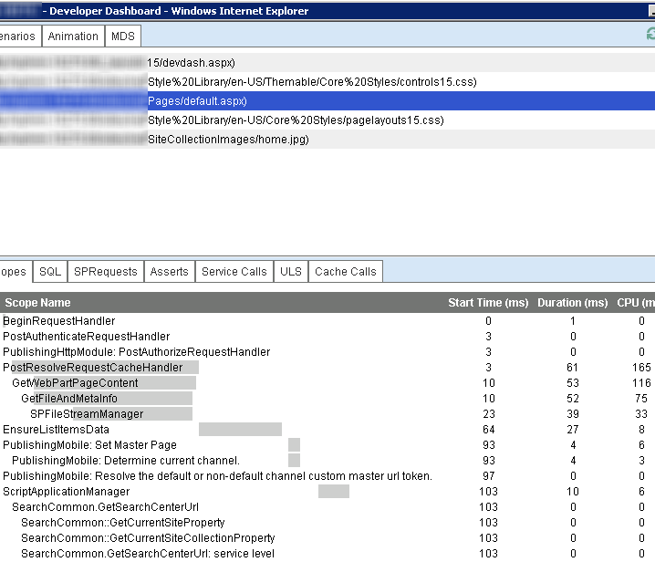

# Optimize page performance in SharePoint

Learn about features to improve performance in pages in SharePoint. These features can be used to enhance the experience in geographically distributed implementations.

**Provided by:** David Crawford, Microsoft Corporation

This article provides instructions that will help optimize performance in SharePoint. SharePoint includes features that help optimize page loading over a Wide Area Network (WAN). Designing pages to make them as small and responsive as possible complements these performance improvements.

## Minimal Download Strategy (MDS)
<a name="MDS"> </a>

Minimal Download Strategy (MDS) relies on the ability to download only specific portions of a page that is rendered fully on the server. Downloading only the specific portions provides a very efficient loading model. The fully rendered page is not returned to the client. The server must be able to accurately identify those pieces that must be part of the response and those that are not necessary. The pieces that may or may be not part of the response include scripts, styles, and markup.

The following table shows some benefits of using MDS.

<br/>

**Table 1. Benefits of using MDS**

|**Performance**|**Visuals**|
|:-----|:-----|
|Fewer amounts of data downloaded per page request.|No browser flashing caused by full page reload.|
|Browser needs to update only the regions of the page that changed since the last request.|Easy to identify animations.|
|Small amount of processing required on the client.<br/><br/>**Note:** Half of client Page-Load-Time 1 (PLT1) is due to chrome cascading style sheet (CSS) rendering and JavaScript parsing and execution. |Changes in the page attract user's attention. |

<br/>

Both AJAX and MDS are technologies that request only sections of the page to minimize data download and improve page responsiveness. The following figure shows the MDS architecture.

<br/>

*Figure 1. MDS architecture*   
    


The MDS framework assumes that a master page defines a chrome and content regions. In MDS, SharePoint navigating to a page means requesting just the content for those regions and the resources that the page depends on. Once that content downloads to the browser, script code applies the markup or resources to the page as appropriate. The browser behaves as if the requested page had been loaded completely from the server.

<br/>

*Figure 2. Page chrome and regions in a SharePoint page*


 
When users are browsing a SharePoint website in MDS mode, they will not cause full page postbacks and full page reloads. Instead, the URL for the page they are visiting will remain the same, and the fragment identifier (a "#"sign) will change to contain the page they are visiting. The format of the URL is: `[Path to site (spweb)] + /_layouts/15/start.aspx# + [path to page] + [query string]`.
  
The following table shows some examples of URLs formatted in MDS mode.

<br/>

**Table 2. URLs formatted in MDS mode**

|**Non-MDS URL**|**MDS URL**|
|:-----|:-----|
|`http://server/SitePages/`  <br/> |`http://server/_layouts/15/start.aspx#/SitePages/`  <br/> |
|`http://server/subsite/SitePages/home.aspx`  <br/> |`http://server/subsite/_layouts/15/start.aspx#/SitePages/home.aspx`  <br/> |
|`http://server/_layouts/15/viewlsts.aspx?BaseType=0`  <br/> |`http://server/_layouts/15/start.aspx#/_layouts/viewlsts.aspx?BaseType=0` <br/> |

<br/>

The object used for the AJAX navigation is **AjaxNavigate**. By default, there is an instance of **AjaxNavigate** available for you to use named **ajaxNavigate**. To use the **ajaxNavigate** instance:

```cs

ajaxNavigate.update(serverRelativeURL, null);
```

If you want a control or web part to listen to the navigation events, you can use the **add\_navigate** handler. When the handler is called, your callback function receives a reference to the navigation object and the parsed hash values in a dictionary. The control or web part can retrieve the value for the parameter of interest from the dictionary, compare it to the current value, and decide what action it needs to take. A common action is to send an AJAX request to the server to retrieve some data or reorder the items in the view. When a control has finished listening to navigation events, it can use the **remove\_navigate** handler.

MDS also supports multiple hash marks in key/value pairs. MDS appends the hash marks after the URL. The format of hash marks in the URL is: `http://server/_layouts/15/start.aspx#/SitePages/page.aspx#key1=value1#key2=value2`. The following code example shows how to update the hash marks.

```
var updateParts;
updateParts = {key1: "value1", key2: "value2", keyn: "valuen"}
ajaxNavigate.update(null, updateParts);

```

If you find that the pages in your website constantly fall back to download the full page, you might want to consider turning the MDS feature off. You might also want to turn the MDS feature off if you need to use a different strategy to improve performance.

A particular element in the page must make sure that the critical resources needed to work are known to the MDS infrastructure at server rendering time. To convert an existing project to use MDS, you need to update the following files and components:

- Master pages
- ASP.NET pages
- Custom master pages for errors
- JavaScript files
- Controls and web parts

### Master pages

The main change in the master page is to surround the regions of HTML markup that will be sent to the client with a special control named **SharePoint:AjaxDelta**. The most common parts that need to be surrounded by a **SharePoint:AjaxDelta** control are the controls embedded in the master page chrome and the content place holders. If a control is the same on all pages within a site, it should not be wrapped by a **SharePoint:AjaxDelta** control. The following markup shows a visible content placeholder surrounded by a **SharePoint:AjaxDelta** control.


```HTML

<SharePoint:AjaxDelta id="DeltaPlaceHolderMain" IsMainContent="true" runat="server">
    <asp:ContentPlaceHolder id="PlaceHolderMain" runat="server" />
</SharePoint:AjaxDelta>
```

Controls that have content dependent on the current URL must be wrapped in a **SharePoint:AjaxDelta** control. The following markup shows a menu surrounded by a **SharePoint:AjaxDelta** control.

```HTML

<SharePoint:AjaxDelta id="DeltaBreadcrumbDropdown" runat="server">
    <SharePoint:PopoutMenu
        runat="server"
        ID="GlobalBreadCrumbNavPopout"
        IconUrl=IMGCLUSTER_FG_IMG
        IconAlt=LOC_ATTR_WSS(master_breadcrumbIconAlt)
        IconOffsetX=IMGCLUSTER_FG_LEFT(BREADCRUMBBUTTON)
        IconOffsetY=IMGCLUSTER_FG_TOP(BREADCRUMBBUTTON)
        IconWidth=IMGCLUSTER_FG_WIDTH(BREADCRUMBBUTTON)
        IconHeight=IMGCLUSTER_FG_HEIGHT(BREADCRUMBBUTTON)
        AnchorCss="s4-breadcrumb-anchor"
        AnchorOpenCss="s4-breadcrumb-anchor-open"
        MenuCss="s4-breadcrumb-menu">
    </SharePoint:PopoutMenu>
</SharePoint:AjaxDelta>

```

> [!NOTE]
> The **SharePoint:AjaxDelta** control should not be nested within itself. Specify this control at the highest required level.

If you need to include a cascading style sheet (CSS) file, you need to use the **SharePoint:CssLink** and **SharePoint:CssRegistration** controls. These controls have been updated to work in both MDS and non-MDS mode. The following markup shows how to use the **SharePoint:CssLink** and **SharePoint:CssRegistration** controls.

```HTML

<SharePoint:CssLink runat="server" Version="15"/>
<SharePoint:CssRegistration Name="my_stylesheet.css" runat="server" />
```


> [!CAUTION]
> You can have only one **SharePoint:CssLink** control per page. In MDS mode, you get an error if you have more than one **SharePoint:CssLink** control in a page. Including a CSS file using an HTML style element is not supported in MDS mode, because the server logic cannot identify the file as a required resource when the response is rendered.

To include a JavaScript file, use the **SharePoint:ScriptLink** control. The following markup shows how to use the **SharePoint:ScriptLink** control.

```HTML

<SharePoint:ScriptLink language="javascript" name="my_javascriptfile.js" runat="server" />
```

> [!CAUTION]
> Including a JavaScript file using the HTML script tag is not supported in MDS mode, because the server logic cannot identify the file as a required resource when the response is rendered. 

To render the title element inside the head element in the page, we use a special pattern using the **SharePoint:PageTitle** control. The following markup shows how to use the **SharePoint:PageTitle** control.
  

```HTML
<SharePoint:PageTitle runat="server">
    <asp:ContentPlaceHolder id="PlaceHolderPageTitle" runat="server" />
</SharePoint:PageTitle>

```

> [!NOTE]
> Each individual page must override the title by providing a replacement for the **asp:ContentPlaceHolder** control inside the **SharePoint:PageTitle** control.
  

### ASP.NET pages

To include a JavaScript or CSS file, use the same **SharePoint:ScriptLink** and **SharePoint:CssLink** controls described in the previous section.

In previous versions of SharePoint, some pages write content by using the **Response.Output** property. If you are using MDS, this is no longer allowed. You have to change the calls to **Response.Output** to use a new API. The following table shows APIs that are commonly used in SharePoint pages and the new MDS-complaint API.

<br/>

**Table 3. Commonly used APIs and their MDS-compliant alternatives**

|**Commonly used API**|**MDS-compliant alternative**|
|:-----|:-----|
| [NoEncode()](https://msdn.microsoft.com/library/Microsoft.SharePoint.Utilities.SPHttpUtility.NoEncode.aspx) <br/> | [WriteNoEncode()](https://msdn.microsoft.com/library/Microsoft.SharePoint.Utilities.SPHttpUtility.WriteNoEncode.aspx) <br/> |
| [HtmlEncode()](https://msdn.microsoft.com/library/Microsoft.SharePoint.Utilities.SPHttpUtility.HtmlEncode.aspx) <br/> | [WriteHtmlEncode()](https://msdn.microsoft.com/library/Microsoft.SharePoint.Utilities.SPHttpUtility.WriteHtmlEncode.aspx) <br/> |
| [EcmaScriptStringLiteralEncode()](https://msdn.microsoft.com/library/Microsoft.SharePoint.Utilities.SPHttpUtility.EcmaScriptStringLiteralEncode.aspx) <br/> | [WriteEcmaScriptStringLiteralEncode()](https://msdn.microsoft.com/library/Microsoft.SharePoint.Utilities.SPHttpUtility.WriteEcmaScriptStringLiteralEncode.aspx) <br/> |
| [HtmlEncodeAllowSimpleTextFormatting()](https://msdn.microsoft.com/library/Microsoft.SharePoint.Utilities.SPHttpUtility.HtmlEncodeAllowSimpleTextFormatting.aspx) <br/> | [WriteHtmlEncodeAllowSimpleTextFormatting()](https://msdn.microsoft.com/library/Microsoft.SharePoint.Utilities.SPHttpUtility.WriteHtmlEncodeAllowSimpleTextFormatting.aspx) <br/> |
| [HtmlUrlAttributeEncode()](https://msdn.microsoft.com/library/Microsoft.SharePoint.Utilities.SPHttpUtility.HtmlUrlAttributeEncode.aspx) <br/> | [WriteHtmlUrlAttributeEncode()](https://msdn.microsoft.com/library/Microsoft.SharePoint.Utilities.SPHttpUtility.WriteHtmlUrlAttributeEncode.aspx) <br/> |
| [UrlKeyValueEncode()](https://msdn.microsoft.com/library/Microsoft.SharePoint.Utilities.SPHttpUtility.UrlKeyValueEncode.aspx) <br/> | [WriteUrlKeyValueEncode()](https://msdn.microsoft.com/library/Microsoft.SharePoint.Utilities.SPHttpUtility.WriteUrlKeyValueEncode.aspx) <br/> |
| [UrlPathEncode()](https://msdn.microsoft.com/library/Microsoft.SharePoint.Utilities.SPHttpUtility.UrlPathEncode.aspx) <br/> | [WriteUrlPathEncode()](https://msdn.microsoft.com/library/Microsoft.SharePoint.Utilities.SPHttpUtility.WriteUrlPathEncode.aspx) <br/> |

<br/>

If a page, control, or web part directs its output to the **Response.Output** property, it causes MDS to fail back. When MDS fails back, it performs a full navigation to the requested page. You can find the offending control by using the **DeltaPage .\_shipRender** property while debugging the server component.

You should replace HTML inline script elements with **SharePoint:ScriptBlock** controls. The following shows an HTML inline script element and its MDS-compliant alternative **SharePoint:ScriptBlock** control.

- **HTML inline script element** 
    
    `<script type="text/javascript">`<br/>&nbsp;&nbsp;&nbsp;`// Your JavaScript code goes here.`<br/>`</script>`

- **MDS-compliant alternative** 
    
    `<SharePoint:ScriptBlock runat="server">`<br/>&nbsp;&nbsp;&nbsp;`// Your JavaScript code goes here.`<br/>`</SharePoint:ScriptBlock>`

The introduction of the **SharePoint:ScriptBlock** in the page can change the scope of variables in page. Sometimes it is necessary to move the declaration of variables from `<% %>` to `<script runat="server"> <script>`. To test this, load the page in the browser after you perform updates.
  
> [!NOTE]
> The MDS infrastructure does not support VBScript, because it cannot be registered as a script in ASP.NET. Scripts have to be converted to JavaScript. 

HyperLinks in ASP.NET pages must be updated to use **SPUpdatePage** type. The following shows hyperlinks in ASP.NET pages and the same links updated by using **SPUpdatePage** type.  

- **Hyperlink in ASP.NET** 
    
    `<a`<br/>&nbsp;&nbsp;&nbsp;`id=<%_STSWriteHTML("viewlist" + spList.BaseTemplate.ToString());%>`<br/>&nbsp;&nbsp;&nbsp;`href=<%_STSWriteURL(listViewUrl);%>`<br/>`>`

- **MDS-compliant alternative** 
    
    `<a`<br/>&nbsp;&nbsp;&nbsp;`id=<%_STSWriteHTML("viewlist" + spList.BaseTemplate.ToString());%>`<br/>&nbsp;&nbsp;&nbsp;`href=<%_STSWriteURL(listViewUrl);%>`<br/>&nbsp;&nbsp;&nbsp;`onclick="if (typeof(SPUpdatePage) !== 'undefined') return SPUpdatePage(this.href);"`<br/>`>`

### Custom master pages for errors

You can display error messages in MDS mode, even when you are using a custom master page for errors. To use a custom master page for errors in MDS mode, you must define an **AjaxDelta** in the error master page that has the **id** property set to the string **"DeltaPlaceHolderMain"**. The content of the error message must be rendered into the **AjaxDelta**. When the error page is returned to the browser from the server, the browser identifies this as the main content to display and shows it to the user.

Although the master page for the error page and the master page for **start.aspx** are not an explicit match, the browser can detect that an error has occurred. The browser allows MDS to use the relevant error message content within the existing master page in order to maintain a consistent and smooth user experience.

### JavaScript files

JavaScript files should include only function declarations. Nonetheless, there are many legacy scripts that contain global variable initializations. Global variables need to be reinitialized when a new page is rendered in MDS mode. You can use the **ExecuteAndRegisterBeginEndFunctions** to initialize global variables. The following code example shows how to use the **ExecuteAndRegisterBeginEndFunctions**.

```
function ExecuteAndRegisterBeginEndFunctions(tag, beginFunc, endFunc, loadFunc)
```

The **ExecuteAndRegisterBeginEndFunctions** has the following parameters:

-  _tag_: The name of the file that registers the callbacks; it is used only for debugging purposes.     
-  _beginFunc_: A function that is called before you request the page delta.    
-  _endFunc_: A function that is called after you retrieve the delta, but before the HTML and JavaScript for the new page are applied.
-  _loadFunc_: A function that is called after the HTML and JavaScript for the new page is applied.

### Controls and web parts

To use MDS, controls and web parts have to register page resources by using the **SPPageContentManager** object. The most frequently registered resources using **SPPageContentManager** are JavaScript snippets (functions or JSON variables) and hidden fields. The following table shows common patterns for inserting hidden fields and JavaScript snippets, and how to do the same by using the **SPPageContentManager** object. 
    
<br/>    

**Table 4. Common practices for rendering content and their MDS-compliant alternatives**

|**Common practice for rendering content**|**MDS-compliant alternative**|
|:-----|:-----|
|`output.Write("<input type=\\"hidden\\" name=\\"");`<br/>`output.Write(SPHttpUtility.NoEncode("HiddenField));`<br/>`output.Write("\\" value=\\"");`<br/>`output.Write(DigestValue);`<br/>`output.Write("\\" />");`|`SPPageContentManager.RegisterHiddenField(this, "HiddenField", DigestValue);`|
|`Page.ClientScript.RegisterClientScriptBlock(typeof(MyType), "MyKey", "var myvar=1", true);`|`SPPageContentManager.RegisterClientScriptBlock(this, typeof(MyType), "MyKey", "var myvar=1");`|

<br/>

> [!NOTE]
> The **RegisterHiddenField** and **RegisterClientScriptBlock** functions in the **SPPageContentManager** object expect an object of type **Control** or **Page** in the first parameter.

The MDS engine uses the first parameter to filter the scripts. Here are the rules for filtering when a page is rendered in MDS delta mode:

- If the first argument is of type **Page**, the scripts will execute in the browser.

- If the first argument is not of type **Page** and the control falls under a **SharePoint:AsyncDelta**, the scripts will execute in the browser.

- If the first argument is a web part, the scripts will execute in the browser.

Many APIs in previous versions of SharePoint did not provide the current control as an argument. The public object model in SharePoint was designed to provide an alternate method to register the resources. The methods that do not provide the current control as an argument are still in the API for backward compatibility.

You can navigate between two pages by using a new function named **SPUpdatePage**. When a control or web part is rendered in MDS delta mode, the **HyperLink** controls must add the **onclick** handler and call **SPUpdatePage**.
 
You must update the XSLT used by web parts because all the resources must be added by using the **SPPageContentManager** object to make them MDS-compliant. You can add JavaScript snippets to the XSLT by using the **RegisterScriptLink** and **RegisterScriptBlock** methods of the **SPPageContentManager** object.

## Optimize page downloads
<a name="MDS"> </a>

After you understand the composition of a page, you can use different methods to optimize the download experience for that page. In general, the goal is to minimize the number of round trips between client and server computers and to reduce the amount of data that goes over the network. The guidance in this article includes recommendations that you can apply broadly to a variety of different implementations of SharePoint.

Table 5 shows example loading times that illustrate the difference between the first, second, and subsequent page loads.   

**Table 5. Page loading times**

|||
|:-----|:-----|
|First page load  <br/> |3-4 seconds  <br/> |
|Second page load  <br/> |1.5 seconds  <br/> |
|Subsequent page loads  <br/> |1 second  <br/> |

> [!NOTE]
> Loading times might be different in your particular scenario. Loading times are affected by many variables, including, but not limited to, page size, latency, and server load. 

You should categorize page optimization techniques into one of two categories: first page request and subsequent page requests. Optimizations for the first page request (page load time 1 or PLT1) are those kinds of optimizations that are effective the first time the page is requested, but that don't necessarily affect subsequent page requests. The following are some optimizations for PLT1:

- Optimize HTML markup.
- Use consolidated images and files; for example, combine multiple CSS files into one. Combine images into an image strip or cluster.
- Use compression (crunch) techniques. For more information, see  [Compress (crunch) JavaScript and CSS files](optimize-page-performance-in-sharepoint.md#OptimizingPagePerformance_Crunch).
- Verify that you are referencing the production version of common JavaScript libraries, such as jQuery, instead of the debug versions.
- Consider using a well-known content delivery network (CDN) such as the  [Microsoft Ajax Content Delivery Network](http://www.asp.net/ajaxlibrary/cdn.ashx). The files required in your pages may already be cached by the client browser.

Optimizations for subsequent page requests are those that can improve the user experience for a subsequent page load. The key is that you need to balance loss in functionality against the gain achieved. If gain is only realized the first time a user hits a site, the optimization might not be worth the loss in functionality.

## Compress (crunch) JavaScript and CSS files
<a name="OptimizingPagePerformance_Crunch"> </a>

Files that contain JavaScript and styles may be significantly reduced in size by removing whitespaces, style inheritance, and code reuse. Some libraries come in both regular (debug) and compressed (crunched) versions. You can find a variety of tools to automate file crunching by searching the Internet.

Verify that the compressed versions are deployed to production servers. This example shows how a CSS file can be reduced in size through some relatively simple rewriting.

```
.article-ByLine  {
  font-family: Tahoma,sans-serif; 
  font-size: 9.5pt; 
  font-style: normal; 
  line-height: normal; 
  font-weight: normal; 
  color: #000000
}
.article-Caption { 
  font-family: Tahoma,sans-serif; 
  font-size: 8pt; 
  font-style: normal; 
  line-height: normal; 
  font-weight: normal; 
  color: #000000
}
.article-Headline { 
  font-family: Tahoma,sans-serif; 
  font-size: 14pt; 
  font-style: normal; 
  line-height: normal; 
  font-weight: bold; 
  color: #000000
}
.article-SubHead  { 
  font-family: Tahoma, sans-serif; 
  font-size: 11pt; 
  font-style: normal; 
  line-height: normal; 
  font-weight: normal; 
  color: #000000
}
.article-Text {
  font-family: Tahoma, sans-serif; 
  font-size: 10pt; 
  font-style: normal; 
  line-height: normal; 
  font-weight: normal; 
  color: #000000
}

```

<br/>

You can usually find ways to achieve the same styling and reduce the size of your files by efficiently rewriting your CSS files. The following example shows how to optimize the previous CSS size by inheriting the styles from a parent element.

```
BODY {font:100% Tahoma,sans-serif}
.art-By {font: 79%}
.art-Cap {font: 67%}
.art-Head {font: bold 117%}
.art-Sub {font: 92%}
.art-Txt {font: 83%}
```

The first version of the CSS is 783 characters long, and the second is 140 characters long.

## Entity tags
<a name="OptimizingPagePerformance_Crunch"> </a>

Entity tags (ETags) can cause the client to unnecessarily reload files. ETags are meant to uniquely identify files by using a number that the server generates. In clusters of servers, each server will create a different number. For example, a browser is sending a **Get** method with an **If-Modified** header field for a file that it found in its cache. If there is only one server, the file will probably match, and a **304 Not-Modified** http status will be sent. But, if the user is accessing a large server farm, it will probably hit a different server with a different entity tag, causing that server to send the file to the browser.

## Cache settings
<a name="OptimizingPagePerformance_Crunch"> </a>

Use Fiddler or a similar tool to verify whether the cache is serving requests. Some common reasons caching not serving requests include:

- Resources do not have an expiration date value.
- The query string constantly changes.
- The sum of **max-age** cache-control directive plus **last-modified** header results in a date previous to today.
- The proxy servers do not support the **max-age** property.
- The **cache-control** header has a value of **no-cache**. A value of **private** caches the resource only for the user that issues the request.

## Number and size of images
<a name="OptimizingPagePerformance_Crunch"> </a>

You should minimize the number of images in your site. To help with that effort, you can embed multiple images in a single file and then reference individual images in your page. Not only will file download size decrease, but fewer files result in less network traffic. It is more complicated to author pages by using this technique, but in situations where every round trip and file size counts, it can prove to be valuable way to help improve performance. 

Figure 3 shows an example of a single image file that contains multiple images.   

*Figure 3. Single image file that contains multiple images*
    


<br/>

Figure 4 shows how the image file is subsequently changed to display as individual pictures in a table.

*Figure 4. Multiple images displayed in a table*


     
Manipulation of the images was done entirely through style sheet classes. There were two primary classes used in **div** and **img** elements in each table cell. Those classes are as follows.

```
BODY {font:100% Tahoma,sans-serif}
.art-By  {font: 79%}
.art-Cap {font: 67%}
.art-Head {font: bold 117%}
.art-Sub  {font: 92%}
.art-Txt {font: 83%}


.cluster { 
   height:50px; 
   position:relative; 
   width:50px; 
} 
.cluster img { 
   position:absolute; 
}
```

Each image has a class associated with it based on the identifier (ID) for the image. That style clips the picture and defines an offset from the initial picture in the cluster. Those classes are as follows.

```
#person {
   border:none; 
   clip:rect(0, 49, 49, 0); 
} 
#keys { 
   clip:rect(0, 99, 49, 50); 
   left:-50px; 
} 
#people { 
   clip: rect(0, 149, 49, 100); 
   left:-100px; 
} 
#lock { 
   clip:rect(0, 199, 49, 150); 
   left:-150px; 
} 
#phone { 
   clip:rect(0,249, 49, 200); 
   left:-200px; 
}
#question {
    clip: rect(0, 299, 49, 250);
    left: -250px;
}
```


## List view pages
<a name="OptimizingPagePerformance_Crunch"> </a>

Microsoft has worked to quantify and improve the performance of list view page rendering times. A list view page is the AllItems.aspx page that is used by each list and library to enable browsing of content. The rendering time of that page can vary widely based on the number of columns that are visible in the view and the format of the columns. For example, displaying options and enabling presence icons can greatly affect rendering time. The collapsed grouping option took significantly longer to render than the expanded grouping option, and both were slower than no grouping option at all.

These sorts of nuances are why it is important to carefully consider how views are constructed in list view pages, especially over slow network connections. When working with lists that contain a lot of data, it is important to carefully design all views, especially the default view. In general, you can speed up the rendering time of list view pages by using the following recommendations:

- Show only the strictly required columns.
- If possible, exclude columns that include presence information.
- Use a link instead of an edit menu to view the item details.

The following table describes customizations that reduce the time that is required for a view to render.

<br/>

**Table 6. Customizations that reduce the time required for the view to render**

|**Item**|**Description**|
|:-----|:-----|
|View type  <br/> |Create a view as a datasheet view instead of a standard view.<br/>|
|View: Item limit  <br/> |Anything over 1,000 will likely render slowly.<br/>Over a slow connection, it is important to experiment to find the right balance between<br/>the quantity of data shown at a time and the number of round trips necessary to view all the data.<br/>The more rows that display at a time, the fewer round trips, but larger pages.  <br/> |
|View: Filter  <br/> |Use **[Today]** and **[Me]** keywords to filter items by freshness or assignment.<br/>Use Status fields to show only active items in default views. <br/> |
|View: Columns  <br/> |Include the smallest number of columns.<br/>Create a default view with few columns that allows high-level browsing after which people can drill down.  <br/> |

<br/>

The following table describes customizations that will increase the time that is required for a view to render. Each additional column increases rendering time by a slight amount: up to a half-second per column over a fast network connection for a list of 1,000 items. Some columns increase rendering time more than others, as noted in the table.

<br/>

**Table 7. Customizations that increase the time required for the view to render**

|**Item**|**Description**|
|:-----|:-----|
|Group By  <br/> |Grouping adds HTML and JScript, which slows down rendering for large lists.<br/>Making all groups collapsed by default actually increases rendering time further<br/>because of additional operations on the browser object model.  <br/> |
|Column - title linked to item with edit menu  <br/> |The option "linked to item with edit menu" takes the longest.<br/>The similar option "linked to item" does not increase rendering time noticeably.  <br/> |
   
<br/>

## Developer Dashboard
<a name="DeveloperDashboard"> </a>

The Developer Dashboard is rebuilt for SharePoint to provide more information, including MDS. It runs in a separate window to avoid affecting rendering of the actual page, and it provides detailed request information per page with a chart view. It also includes a dedicated tab for Unified Logging System (ULS) log entries for a particular request. Additional detailed information is included for request analysis. It uses a dedicated Windows Communication Foundation (WCF) service (diagnosticsdata.svc) designed to provide tracing information.
 
To learn more about the Developer Dashboard:

-  [Use the developer dashboard](https://docs.microsoft.com/en-us/sharepoint/dev/spfx/use-developer-dashboard).
-  [Renewed Developer Dashboard](http://download.microsoft.com/download/7/7/3/773CA2C2-579B-408C-808E-A6F561194E20/Ig15_SP_IT_M10V3_devdash.pptx) (PowerPoint slide deck).
     
To enable the Developer Dashboard, use the following Windows PowerShell snippet code.

```
$content = ([Microsoft.SharePoint.Administration.SPWebService]::ContentService)
$appsetting =$content.DeveloperDashboardSettings
$appsetting.DisplayLevel = [Microsoft.SharePoint.Administration.SPDeveloperDashboardLevel]::On
$appsetting.Update() 

```

<br/>

Figure 5 shows the Developer Dashboard.

*Figure 5. Developer Dashboard*



<br/>

It is important to understand how these requests and the number of images and queries affect performance. There are similarities when it comes to server-side rendered list views (XSL or CAML) as they follow the same size recommendations as client-side rendered list views. However, server list view guidance is to create only list views necessary to accomplish your requirements when your goal is optimal performance, as thousands of views will cause greater degradation in performance due to compilation cache management. The physical characteristics of the computer, such as memory and processor speed, will factor into the overall speed. 

There is also consideration for where the requests route or how they are distributed. To better understand how SharePoint routes and distributes requests, you can use the Request Manager tool. However, discussing request distribution is beyond the scope of this article. For more information, see [Configure Request Manager in SharePoint](http://technet.microsoft.com/library/jj712708.aspx).

## Conclusion
<a name="bk_conclusion"> </a>

Much of the guidance for SharePoint 2010 page performance optimization applies to SharePoint. This article provides some of the elements of guidance for SharePoint 2010 while diving into new areas that would specifically benefit performance. We covered some obvious changes or enhancements, for example, MDS and the enhanced Developer Dashboard. We wrapped up with the classic guidance: crunch down JavaScript and cascading style sheets, use a CDN for common JavaScript libraries if possible for caching, combine and compress images as much as possible, limit or remove unnecessary data from view, and construct list views judiciously. The techniques and features discussed in this article contribute to supporting your performance goals.

## See also
<a name="bk_addresources"> </a>

-  [Build sites for SharePoint](build-sites-for-sharepoint.md)  
-  [SharePoint Design Manager image renditions](sharepoint-design-manager-image-renditions.md)
-  [Overview of Design Manager in SharePoint](overview-of-design-manager-in-sharepoint.md)
-  [Overview of the SharePoint page model](overview-of-the-sharepoint-page-model.md)
    
  
