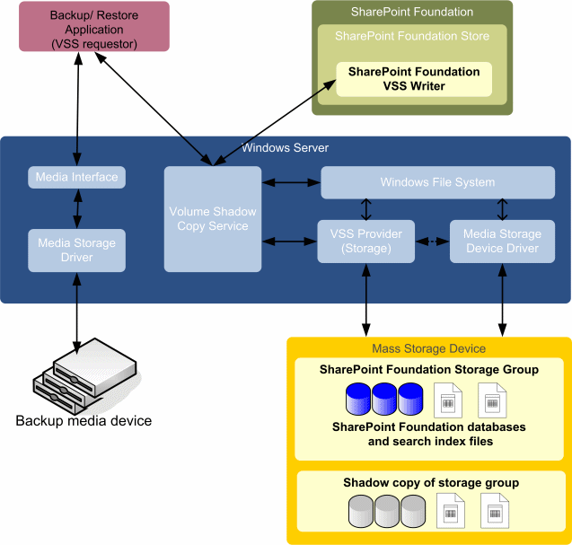

# Overview of SharePoint and the Volume Shadow Copy Service
 **Summary:** Learn about the Microsoft SharePoint interface to the Volume Shadow Copy Service (VSS).
For backup vendors, the Volume Shadow Copy Service (VSS) simplifies backing up Microsoft server solutions by using a centralized API. Microsoft SharePoint Foundation includes a referential VSS writer (hereafter, called "the SPF-VSS Writer") that integrates with the Windows VSS backup framework, enabling backup applications to back up and restore SharePoint Foundation data. It supports a catastrophic overwrite scenario for the entire farm (search index included). On recovery, it hooks up databases and synchronizes site mappings.
  
    
    

## Design of the System

The following figure shows the main components in the system: Microsoft Windows Server (and the Volume Shadow Copy Service), SharePoint Foundation (and the SPF-VSS Writer for the Windows Server Volume Shadow Copy Service), and the third-party (or custom) backup/restore application (including the requestor and the provider).
  
    
    

  
    
    

  
    
    
The VSS communicates with the Windows Server file system and with the mass storage device driver through a third-party (or custom) provider. The hardware provider must determine where the shadow copy is created. The VSS abstracts the hardware-specific shadow copy so the backup/restore application can access the shadow copy in a uniform manner without knowing the hardware implementation details. 
  
    
    
The SharePoint Foundation store is a component of SharePoint Foundation and accesses SharePoint Foundation storage groups through the Windows Server file system. Within the file system, each SharePoint Foundation storage group includes configuration, content, Search databases, and any third-party databases registered in the configuration database and search index files. Also included are any services built on the SharePoint Foundation Service Application Framework. 
  
    
    
To support the VSS, SharePoint Foundation includes the SPF-VSS Writer. The SPF-VSS Writer coordinates with the SharePoint Foundation store (operating on behalf of the requestor) to freeze and dismount the storage group before backing it up, and then to unfreeze and mount the storage group after the backup is complete.
  
    
    
During a recovery, the backup/restore application instructs the SPF-VSS Writer to coordinate with the SharePoint Foundation store (operating on behalf of the requestor) to dismount the storage group, replace the database files, and mount the storage group.
  
    
    

    
> **Note:**
> See "Restoring" in  [VSS requestors and SharePoint](vss-requestors-and-sharepoint) for important information about restorations.
  
    
    

A requestor is a third-party (or custom) application designed to use the VSS to properly back up and restore SharePoint Foundation data. The requestor communicates with the VSS to obtain information about SharePoint Foundation, command the creation of shadow copies, and gain access to the data for backup. 
  
    
    
When restoring, the requestor also communicates with the VSS to prepare the system for the restore operation, and then to put the data back onto the mass storage device. The backup/restore application is also responsible for working with Windows Server to read data from and write data to the backup storage media, whether a tape archive, a storage area network, or other backup medium. 
  
    
    
Information needed to successfully complete backup and restore operations among SharePoint Foundation, the VSS, and the backup/restore application is transferred as part of the SPF-VSS Writer metadata.
  
    
    
The following is the high-level sequence of events during backup or restore operations:
  
    
    

  
    
    

1. The backup program (or agent) runs a scheduled job. 
    
  
2. The VSS requestor in the backup/restore application sends a command to the VSS to take a shadow copy of the selected SharePoint Foundation storage groups. 
    
  
3. The VSS communicates with the SPF-VSS Writer to prepare for a snapshot backup. SharePoint Foundation prohibits administrative actions against the storage group, checks volume dependencies, and suspends all write operations to database and transaction log files while allowing read-only access. 
    
  
4. The VSS communicates with the appropriate storage provider to create a shadow copy of the storage volume that contains the SharePoint Foundation storage group. 
    
  
5. The VSS releases SharePoint Foundation to resume ordinary operations.
    
  
6. The VSS requestor verifies the integrity of the backup set prior to signaling that the backup succeeded. SharePoint Foundation records the time of the last backup for the database.
    
  

## Additional resources

-  [SharePoint VSS Writer](sharepoint-vss-writer)
    
  
-  [VSS requestors and SharePoint](vss-requestors-and-sharepoint)
    
  
-  [How to: Create a VSS requestor for use with SharePoint](how-to-create-a-vss-requestor-for-use-with-sharepoint)
    
  
-  [How to: Back up and restore SharePoint using a VSS requestor](how-to-back-up-and-restore-sharepoint-using-a-vss-requestor)
    
  
-  [How to: Back up and restore a search service application in SharePoint using VSS](how-to-back-up-and-restore-a-search-service-application-in-sharepoint-using)
    
  
-  [Starting and Configuring the WSS Writer Service](http://msdn.microsoft.com/library/c9243dd6-e61e-4783-9fef-48d0122f1c09.aspx)
    
  
-  [Volume Shadow Copy Service](http://msdn.microsoft.com/en-us/library/windows/desktop/bb968832%28v=vs.85%29.aspx)
    
  
-  [Volume Shadow Copy Service Technical Reference](http://msdn.microsoft.com/en-us/library/windows/desktop/aa384648%28v=vs.85%29.aspx)
    
  

