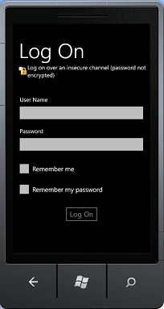

# Overview of the SharePoint mobile client authentication object model

> [!IMPORTANT]
> **LEGACY CONTENT**
> This article is retained for historical reference only. It describes deprecated SharePoint authentication APIs for Silverlight and Windows Phone applications.
>
> These APIs and platforms are no longer supported. For current development guidance, use:
> - Microsoft Authentication Library (MSAL)
> - Microsoft Graph API
> - SharePoint Online REST APIs with OAuth 2.0

Get an overview of development with the authentication APIs of the SharePoint client object model for Silverlight.
## Authentication and client context on a Windows Phone

The process of authenticating a SharePoint user on a Windows Phone 7.5 is a little different from the same process on a client computer. Client code on a Windows Phone 7.5 first creates an object of the `Authenticator` class or `ODataAuthenticator` class, which were added to the `SharePointClient` object model for Microsoft Silverlight for Windows Phone. It then uses this object as the user's credentials.

> [!NOTE]
> For more information about the APIs that are discussed in this section, see [Overview of the SharePoint mobile object model](overview-of-the-sharepoint-mobile-object-model.md). For more information about the SharePoint client object model for Silverlight, see [Managed Client Object Model](/previous-versions/office/developer/sharepoint-2010/ee537247(v=office.14)) and [Using the Silverlight Object Model](/previous-versions/office/developer/sharepoint-2010/ee538971(v=office.14)).

## Authenticating the user in the SharePoint client object model for Silverlight

The following are the required steps to get an authenticated client context object:

1. Obtain a [`ClientContext`](/previous-versions/office/sharepoint-server/ee538685(v=office.15)) object.
1. Construct a new `Authenticator` object and initialize its properties.

    > [!NOTE]
    > One `Authenticator` object can be used with one `ClientContext` object only. You can't share an `Authenticator` object across multiple `ClientContext` objects with different URLs.

1. The `Authenticator` class implements the [`ICredentials`](/dotnet/api/system.net.icredentials) interface, so you assign the object to the [`Credentials`](/previous-versions/office/sharepoint-server/ee537379(v=office.15)) property of the `ClientContext` object.

You can then add the rest of your client object model code and call `ExecuteQueryAsync`.

The following code shows these steps.

```csharp
ClientContext context = new ClientContext(ListUrl);

// Create an instance of Authenticator object.
Authenticator at = new Authenticator();

// Replace <username> and <password> with valid values.
at.UserName = "<username>";
at.Password = "<password>";
at.AuthenticationMode = ClientAuthenticationMode.FormsAuthentication;

at.CookieCachingEnabled = true;

// Assign the instance of Authenticator object to the ClientContext.Credential property.
// ClientContext is the object that is central to the client object model for making
//   calls to the server running SharePoint for fetching and updating data.
context.Credentials = at;

ListItemCollection items = context.Web.Lists.GetByTitle(ListName)
                                            .GetItems(CamlQuery.CreateAllItemsQuery());

// Load the query and execute the request to fetch data.
context.Load(items);
context.ExecuteQueryAsync(
  (object obj, ClientRequestSucceededEventArgs args) => {
    // Success logic
  },
  (object obj, ClientRequestFailedEventArgs args) =>{
    // Failure logic
  });
```

Optionally, you can specify a Unified Access Gateway (UAG) server by setting the `Authenticator.UagServerUrl` property.

If the SharePoint URL has basic or forms-based authentication support, the `ExecuteQueryAsync` calls prompt the user for sign-in information, as shown in Figure 1. Otherwise, the call will fail. Enable basic or forms-based authentication authorization on the SharePoint site to avoid an authentication error.

**Figure 1. SharePoint client authentication**



The user enters the user name and password and chooses **Log On**, as shown in Figure 1. The user has the option to choose **Remember me** to remember their user name and has the option to choose **Remember my password** to remember their password, as shown in Figure 1. After the user name or password is remembered, the user doesn't have to enter credentials the next time the app is started. The `ExecuteQueryAsync` then uses the logged on credentials to make web requests to the server running SharePoint to fetch data.

## Authenticating the user in the SharePoint OData object model

The following are the required steps to get an authenticated OData context object.

1. Construct a new `ODataAuthenticator` object and initialize its properties.
1. Register a handler for the **AuthenticationCompleted** event.
1. Call the `ODataAuthenticator.Authenticate` method, which will raise the **AuthenticationCompleted** event.
1. Obtain an OData context object inside the `OnAuthenticationCompleted` handler.

You can then add the rest of your OData calls in the `OnAuthenticationCompleted` handler.

The following code shows these steps.

```csharp
ODataAuthenticator oat = new ODataAuthenticator();

// Replace <username> and <password> with valid values.
oat.UserName = "<username>";
oat.Password = "<password>";

oat.AuthenticationMode = ClientAuthenticationMode.FormsAuthentication;

oat.AuthenticationCompleted +=
           new EventHandler<SendingRequestEventArgs>(OnAuthenticationCompleted);

// The Authenticate method will raise the AuthenticationCompleted event.
oat.Authenticate("My_service_URL");
```

Your code must also implement two event handlers, as described in the following section.

### Implementing the OnAuthenticationCompleted and OnSendingRequest handlers and getting the ClientContext object

An implementation of the `OnAuthenticationCompleted` handler should first check for any errors in the authentication. If there are any, it should handle them appropriately, such as displaying an error message to the user, and then exit.

If there are no errors, the handler should create an instance of a new `DataServiceContext` object and then register a handler for the **SendingRequest** event. From that point, your OData calling code is programmed against the `DataServiceContext` object just as it is on a computer.

The following is an example of an implementation of an `OnAuthenticationCompleted` handler.

```csharp
void OnAuthenticationCompleted(object sender, AuthenticationCompletedEventArgs e)
{
  if (e.Error != null)
  {
    MessageBox.Show(error);
    return;
  }
  ODataAuthenticator oat = sender as ODataAuthenticator;

  // Construct an OData context object.
  contextObj = new DataServiceContext(oat.ResolvedUrl);

  // Register the SendingRequest event handler.
  contextObj.SendingRequest +=
    new EventHandler<SendingRequestEventArgs>(OnSendingRequest);

  // Your data retrieval logic goes here.
  // For example, if there is a GetData method:
  // contextObj.GetData();
}
```

All that the `OnSendingRequest` handler needs to do is set the cookie container of the `Request` object to the cookie container of the `ODataAuthenticator` object. The following is an example.

```csharp
void OnSendingRequest(object sender, SendingRequestEventArgs e)
{
  ODataAuthenticator oat = sender as ODataAuthenticator;
  ((HttpWebRequest)e.Request).CookieContainer = oat.CookieContainer;
}
```

## Advanced usage

1. You can choose to construct an `Authenticator` object with a hard-coded user name/password option. The user of the app won't be prompted for a user name and password, and hard-coded credentials will be used for authenticating the user.

    ```csharp
    public Authenticator(string userName, string password)
    public Authenticator(string userName, string password, string domain)
    ```

    The same constructor can be used to create a custom sign-in page. You can write a custom sign-in page by passing the credentials from code-behind files.

    ```csharp
    Authenticator at = new Authenticator();
    at.AuthenticationMode = ClientAuthenticationMode.MicrosoftOnline;
    ```

1. Authentication type can be set. By default, basic authentication is used.

### Authenticating against SharePoint Online

To authenticate against a SharePoint Online URL, set the `AuthenticationMode` property of the `Authenticator` object to `MicrosoftOnline` mode. The remaining steps in the procedure are the same as those for an on-premises SharePoint URL.

> [!NOTE]
> The user name and password can't be hard coded for SharePoint Online. The user will be prompted for sign-in credentials.

#### Federation Authentication

`FederationAuthURI` property is used to pass **ADFS** authentication scheme preference where, **ADFS** is configured to use multiple authentication handlers. `FederationAuthURI` specifies the type of authentication required by Authentication request when, SharePoint Online authentication is used with Federation. This parameter can override the priority established by the order in which authentication handlers are configured. To know more about Authentication handler, see [Authentication Handler Overview](/previous-versions/adfs-2.0/ee895365(v=msdn.10)).

```csharp
Authenticator auth = new Authenticator("domain\\\\name", "xyz");
auth.FederationPassiveAuthUri = "urn:oasis:names:tc:SAML:2.0:ac:classes:Password";

// Replace <SiteUrl> with valid value
ClientContext ctx = new ClientContext("SiteUrl");
ctx.Credentials = auth;
ctx.ExecuteQueryAsync(
  (object sender, ClientRequestSucceededEventArgs args) =>
  {
    /* successful callback code */
  },
  (object sender, ClientRequestFailedEventArgs args) =>
  {
    /* failure callback code */
  });
```

 **ADFS** is an optional property that will be effective only when it's used with Microsoft SharePoint Online. Using **ADFS** authentication with any other authentication scheme won't have any effect. With Microsoft SharePoint Online, if **ADFS** isn't set then default scheme will be used, that is, server preference.

## Cookie caching

The `Authenticator` class also includes members that you can use to enable and manage caching of cookies or credentials or both. For information about these members of the `Authenticator` class and their uses, see [Overview of the SharePoint mobile object model](overview-of-the-sharepoint-mobile-object-model.md).

## See also

- [Build Windows Phone apps that access SharePoint](build-windows-phone-apps-that-access-sharepoint.md)
- [Overview of the SharePoint mobile object model](overview-of-the-sharepoint-mobile-object-model.md)
