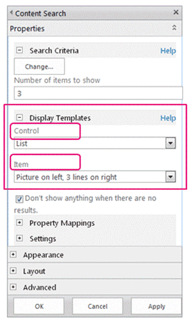

# Overview of the SharePoint page model
Learn about the revised page model—including master pages and page layouts—redesigned for SharePoint.
## Introduction to the page model

Before you design or brand a SharePoint site, you need a basic understanding of the parts of a SharePoint site and how a SharePoint page is put together. This article gives you a visual overview of the pieces to think about as you plan how to brand your site. This article applies specifically to publishing sites in SharePoint.
  
    
    

## Master pages, page layouts, and pages

SharePoint uses templates to define and render the pages that a site displays. The structure of a SharePoint page includes three main elements:
  
    
    

- Master pages define the shared framing elements—the chrome—for all pages in your site.
    
  
- Page layouts define the layout for a specific class of pages.
    
  
- Pages are created from a page layout by authors who add content to page fields.
    
  

**Figure 1. Master page, page layout, and page**

  
    
    

  
    
    

  
    
    

### Master pages

A master page defines the chrome (the shared framing elements) of your site. These elements may include the header and footer, top navigation, breadcrumbs, search box, site logo, and other branding elements. The master page remains consistent as visitors navigate through your site.
  
    
    

**Figure 2. Master page**

  
    
    

  
    
    

  
    
    
A master page also defines regions called content placeholders that are filled in by content from matching regions on page layouts. Most commonly, the body of a master page contains just a single content placeholder (named **PlaceHolderMain**, which is created automatically), and all of the content from a page layout appears inside this one content placeholder (the **PlaceHolderMain** content placeholder is outlined in red in Figure 3).
  
    
    

**Figure 3. Master page with page layout outlined**

  
    
    

  
    
    

  
    
    
When you preview a master page in Design Manager, you see the following message. This **
** resides inside the main content placeholder. Put simply, the master page defines the chrome of a page, and the page layout defines the body contained in the main content placeholder.
  
    
    

**Figure 4. Master page preview message**

  
    
    

  
    
    

  
    
    

  
    
    

  
    
    

### Page layouts

A page layout is a template for a specific type of page in your site, such as an article page or a product details page. Just like its name implies, you can think of a page layout as defining the layout or structure for the body of a page.
  
    
    

**Figure 5. Page layout**

  
    
    

  
    
    

  
    
    
Page layouts define regions or content areas that map to content placeholders on the master page (outlined in red in Figure 6). Again, the most common scenario is that a page layout defines a single content region that maps to the single content placeholder that is created automatically on a master page.
  
    
    

**Figure 6. Content region and content placeholder**

  
    
    

  
    
    

  
    
    

  
    
    

  
    
    

### Page field controls

The primary purpose of a page layout is to arrange page fields. When you design a page layout, you insert, position, and style elements called page field controls. These controls will eventually contain content when an author creates a page based on that page layout. In addition to page fields, page layouts can also contain Web Part zones, to which content authors can add Web Parts. (Master pages can't contain Web Part zones.)
  
    
    
With a page field control, you can define the styles used by the content. Authors can add content to a page, but the designer has ultimate control over how that content is rendered through CSS applied to those controls.
  
    
    

**Figure 7. Page layout with page field controls**

  
    
    

  
    
    

  
    
    
Every page layout is associated with a content type in the Pages library of a site. A content type is a schema of columns and data types. For any page layout, the page fields that are available for that layout correspond directly to the columns defined for that page layout's content type.
  
    
    

### Relationship of master pages and page layouts

Together, a master page and a page layout create a content page.
  
    
    

**Figure 8. Master page with page layout**

  
    
    

  
    
    

  
    
    
The master page defines the chrome for all pages in the site so, often many page layouts (and therefore many pages created from those page layouts) are associated with one master page.
  
    
    

**Figure 9. One master page tied to three page layouts**

  
    
    

  
    
    

  
    
    
But, your site will likely use multiple master pages. For example, in addition to the default master page, you may have one or more master pages that target specific devices such as smart phones or tablets. In this case, one page layout is used by many master pages (see the section about device channels).
  
    
    
You can use one master page per channel per SharePoint site.
  
    
    

### Pages

Authors can create pages and add content to the page fields, and they can add Web Parts to any Web Part zones or Rich Text Editors. Pages are structured so that content authors cannot make changes outside of page fields.
  
    
    

**Figure 10. Page with authored content**

  
    
    

  
    
    

  
    
    
The rendered page is what site visitors see. When a page is requested by the browser, the master page is merged with a page layout to create a content page, and the content for that page is merged into the page fields from that page in the Pages library.
  
    
    

**Figure 11. Rendered page in browser**

  
    
    

  
    
    

  
    
    

**Figure 12. Master page, page layout, and page**

  
    
    

  
    
    

  
    
    

  
    
    

  
    
    

## Search-driven Web Parts and display templates

The previous section explains the SharePoint page model in terms of master pages, page layouts (with page fields), and pages. These elements are the most common in a publishing site in which authors regularly create and publish new content. When it comes to surfacing that content on your site, though, a couple more elements come into play. Whether you have connected to an external catalog or simply want to show a particular set of search results, search-driven Web Parts can help you achieve your goal.
  
    
    
In the search-driven pages scenario, a SharePoint page contains these main elements:
  
    
    

- Master pages
    
  
- Page layouts:
    
  - Regular page layouts that you created for specific content types, as described previously in this article
    
  
  - Category and item details page layouts that are created through cross-site publishing of a catalog
    
  
- Pages
    
  
- Search-driven Web Parts, such as the Content Search Web Part
    
  
- Display templates to control which managed properties appear in the search results of a search-driven Web Part, and control the styling and behavior of those search results:
    
  - Control display templates, which control the layout of search results and any elements common to all results such as paging, sorting, and other links
    
  
  - Item display templates, which control how each search result is displayed and repeated for each result
    
  

**Figure 13. Master page, page layout, and page with Web Part**

  
    
    

  
    
    

  
    
    

### Search-driven Web Parts

With search-driven Web Parts, you can dynamically present information stored in the search index. The presentation of data in the Content Search Web Part is controlled by display templates, which reside in the Master Page Gallery alongside master pages and page layouts.
  
    
    
SharePoint includes several ready-to-use display templates such as lists and slideshows for your Content Search Web Parts. When you configure a Content Search Web Part in the browser, you choose which display templates to use.
  
    
    

**Figure 14. Tool pane of Content Search Web Part**

  
    
    

  
    
    

  
    
    
Content Search Web Parts use two types of display templates, control and item. As part of the design or branding of your site, you can create custom display templates that use layouts, styles, and behaviors that you define.
  
    
    

**Figure 15. Two diagrams of Content Search Web Parts**

  
    
    

  
    
    

  
    
    

  
    
    

  
    
    

### Control display template

The control template determines the overall structure and layout of how you want to present the search results, such as a list with paging or a slideshow. Each Content Search Web Part uses one control template.
  
    
    
The control template also includes functionality common to all the search results, including paging, sorting, view options, and separators.
  
    
    

**Figure 16. Control template outlined on Web Part and webpage**

  
    
    

  
    
    

  
    
    

  
    
    

  
    
    

### Item display template

The item template determines how each result in the set is displayed, and the template is repeated for each result. An item template can display an image, an image with text, a video, and other content.
  
    
    
The item display template also determines which managed properties and values are displayed by the Content Search Web Part. In this example, the item template displays three managed properties: a small-sized image, a product name as a hyperlink, and a brief text description.
  
    
    

**Figure 17. Item templates outlined on Web Part and webpage**

  
    
    

  
    
    

  
    
    

  
    
    

  
    
    

## Device channels and device channel panels

In SharePoint, you can use device channels to render a single publishing site in multiple ways by using different designs that target different devices. You create a single site and author the content in it a single time. Then, that site and content can be mapped to use different master pages and style sheets to target a specific device or group of devices.
  
    
    
When you design for more than one device, consider these elements:
  
    
    

- Device channels:
    
  - By using different master pages and CSS per channel, identical page content can be presented in different ways for specific devices (for example, Windows Phone) or groups of devices (all smart phones).
    
  
- Page layouts:
    
  - If the content does not change, you use the same page layouts for all device channels, though they can be styled differently based on the CSS of the different master page for each channel.
    
  
  - If you want to include content only for specific devices, use device channel panels.
    
  
- Pages
    
  

### Device channels

When you create a device channel, you specify the user agent substrings for the devices that you want the channel to target. This gives you fine-tuned control over what devices (or browsers) are captured by each channel. Then you assign a master page to that channel; in turn, each master page links to its own style sheet where the layout and styles are optimized for that type of device.
  
    
    

**Figure 18. Two device channels with separate master pages**

  
    
    

  
    
    

  
    
    
You can accomplish a great deal using only CSS. It is possible for the master pages for two different channels (for example, desktop and phone) to be identical except that they link to different style sheets. The CSS files simply use different styles for the same page elements.
  
    
    

### Relationship of master pages and page layouts

Unlike master pages, you do not specify different page layouts for different device channels. All page layouts work with all channels that you create. Thus, one page layout applies to many device channels and master pages.
  
    
    
This is one of the primary benefits of device channels: the design changes (the master page and CSS), but the content stays the same (page layouts and pages). But, you can vary what content from a page layout is displayed across different channels by using device channel panels (see the next section).
  
    
    

**Figure 19. One page layout working with two master pages**

  
    
    

  
    
    

  
    
    

  
    
    

  
    
    

### Device channel panels

A device channel panel is a control that you can add to a master page, page layout, or display template to control what content is rendered in each channel. A channel panel is basically a container that specifies one or more channels; if one or more of those channels are active when the page is rendered, all of the contents of the channel panel are also rendered. A channel panel can include any type of content, including a link to a CSS file or a .js file, and is an easy way to include specific content for specific channels.
  
    
    
Perhaps the most common scenario for using channel panels is to selectively include parts of a page layout for specific channels. For example, you may have a page layout with separate text fields for a long greeting and a short greeting. By placing the page fields inside channel panels, you can display the short greeting only to phones and the long greeting only to desktops. The content of a device channel panel is not displayed to channels that it doesn't include—and the content inside that device channel panel is not rendered at all, which prevents bytes from going across the wire.
  
    
    

**Figure 20. Page layout with channel panels**

  
    
    

  
    
    

  
    
    
You can also use channel panels on master pages. For example, if you have a master page that can accommodate two different devices (or two different browsers) with only minimal changes, you can use channel panels to hold the content on the master page that is specific to each of those devices.
  
    
    
Or, you can use a channel panel inside the item display template of a Content Search Web Part, to display additional managed properties for that item from the catalog only for desktops and not for phones.
  
    
    

**Figure 21. Page layout and item templates with channel panels**

  
    
    

  
    
    

  
    
    

  
    
    

  
    
    

## Additional resources

-  [Overview of Design Manager in SharePoint](overview-of-design-manager-in-sharepoint.md)
    
  
-  [Build sites for SharePoint](build-sites-for-sharepoint.md)
    
  
-  [SharePoint Design Manager display templates](sharepoint-design-manager-display-templates.md)
    
  
-  [SharePoint Design Manager device channels](sharepoint-design-manager-device-channels.md)
    
  

