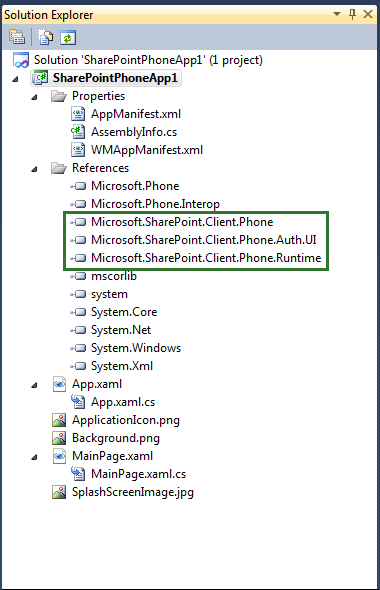
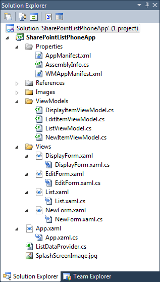

# Overview of Windows Phone SharePoint application templates in Visual Studio
Learn about the Visual Studio templates installed by the Windows Phone SharePoint Software Development Kit for mobile app development.
## Templates installed by the Windows Phone SharePoint Software Development Kit
<a name="BKMK_TemplatesInstalled"> </a>

After you set up your development environment and install the Windows Phone SharePoint Software Development Kit (SDK), two additional Silverlight for Windows Phone templates are available for projects:
  
    
    

- The Windows Phone Empty SharePoint Application template
    
  
- The Windows Phone SharePoint List Application template
    
  
Currently, these templates are designed to be used only in C# projects. They are not available for Visual Basic projects. The templates are available, however, for use in Visual Studio 2012 and Visual Studio Express 2012 for Windows Phone 8 and in Visual Studio 2010 and Visual Studio 2010 Express for Windows Phone 7.
  
    
    

> **Note:**
> Windows Phone SharePoint templates don't appear in the **New Project** menu of Expression Blend. However, you can edit a project in Expression Blend by choosing **Open in Expression Blend** from a shortcut menu in Visual Studio.
  
    
    

When you create a project based on either one of these templates, you are not given the option of choosing a target Windows Phone platform. As for projects created from Visual Studio Express 2012 using these templates target Windows Phone 8 applications against SharePoint ; And projects created from Visual Studio 2010 Express using these templates target Windows Phone OS version 7.1 by default That is, the **AppPlatformVersion** attribute of the **Deployment** element in the WMAppManifest.xml file has a value of 7.1.
  
    
    


```XML

<Deployment xmlns="http://schemas.microsoft.com/windowsphone/2009/deployment" AppPlatformVersion="7.1">
```


> **Note:**
> For more information about settings in the WMAppManifest.xml file, see  [Application Manifest File for Windows Phone](http://msdn.microsoft.com/en-us/library/ff769509.aspx). 
  
    
    


## Starting a project based on the Windows Phone Empty SharePoint Application template
<a name="BKMK_EmptySPAppTemplate"> </a>

If you create a Visual Studio project based on the Windows Phone Empty SharePoint Application template, the starting project is similar to a project created by using the basic Windows Phone Application template (installed by the Windows Phone SDK 7.1), with the addition of references to DLLs installed by the Windows Phone SharePoint SDK (Microsoft.SharePoint.Client.Phone.dll, Microsoft.SharePoint.Client.Phone.Auth.UI, and Microsoft.SharePoint.Client.Phone.Runtime.dll as shown in Figure 1) and a few other reconfigurations.
  
    
    

> **Note:**
> The same templates are available for Windows Phone 8 in Visual Studio Express 2012. 
  
    
    


**Figure 1. Files in a Windows Phone Empty SharePoint Application project**

  
    
    

  
    
    

  
    
    
The files in a project based on the Windows Phone Empty SharePoint Application template are the standard files of a Silverlight Windows Phone app. The MainPage.xaml file contains XAML declarations that constitute the user interface (UI) of the app. A code-behind file, MainPage.xaml.cs, is associated with the MainPage.xaml file by using the mechanism of partial classes, as are the other code-behind files in the project. (See  [Code-Behind and Partial Classes](http://msdn.microsoft.com/en-us/library/cc221357.aspx).) The MainPage.xaml.cs file contains procedural code to implement logic to support operations and events in the UI. The App.xaml file represents the overall Windows app. The associated code-behind file, App.xaml.cs, includes procedural code to handle life-cycle events for the app.
  
    
    

## Starting a project based on the Windows Phone SharePoint List Application template
<a name="BKMK_SPListAppTemplate"> </a>

The Windows Phone SharePoint List Application template is considerably more powerful than the Windows Phone Empty SharePoint Application template. This template was designed to help you create Windows Phone apps to handle a likely scenario in mobile application development for SharePoint: accessing and manipulating data stored in a SharePoint list from a Windows Phone. When you create a Visual Studio project based on this template, a wizard guides you through the necessary configuration steps and generates solution files for a functional Windows Phone app that can work with SharePoint list data. You can build and deploy the app from the generated files with little or no modification.
  
    
    

> **Note:**
> The same templates are available for Windows Phone 8 in Visual Studio Express 2012. 
  
    
    


### Understanding the solution files in a Windows Phone SharePoint List Application project

The files generated for a Visual Studio project using the Windows Phone SharePoint List Application template are shown in Figure 2. (References to other assemblies—not shown in Figure 2—such as System.Runtime.Serialization.dll and Microsoft.Phone.Controls.dll are additional to those references included by the Windows Phone Empty SharePoint Application template. These additional assemblies support the management of SharePoint list data and the visual controls to represent that data.)
  
    
    

**Figure 2. Files in a Windows Phone SharePoint List Application project**

  
    
    

  
    
    

  
    
    
The project files for are described in Table 1.
  
    
    

**Table 1. Windows Phone SharePoint List Application project files**


|**File**|**Description**|
|:-----|:-----|
|App.xaml  <br/> |Represents the overall Windows Phone application. Includes declarations of elements related to the application (instead of to individual pages within the application), such as application life-cycle events like **Application_Deactivated** and **Application_Closing**.  <br/> |
|App.xaml.cs  <br/> |The code-behind file associated with App.xaml (using the partial-class mechanism, as is the case for the other code-behind files in the project). Includes procedural code to handle the operations in the life-cycle events, such as **Application_Deactivated** and **Application_Closing**. You write code in this file to manage offline (local) storage of data.  <br/> |
|ListDataProvider.cs  <br/> |Contains code for accessing data on the SharePoint Server and provides access to the query syntax on which the various list views of the application are based.  <br/> |
|List.xaml  <br/> |Defines the UI elements for the default view form in the phone application; analogous to the All Items (or All Tasks, All Contacts, or similar) view in SharePoint. The List.xaml file contains the **Pivot** control that constitutes the primary container for visual elements in the application, including the **PivotItem** controls that render the list views chosen by the developer to be included in the Windows Phone app. <br/> |
|List.xaml.cs  <br/> |The code-behind file associated with List.xaml. Includes code to implement the methods and handlers for the buttons on the form, such as **New** and **Refresh**.  <br/> |
|DisplayForm.xaml  <br/> |Defines the UI elements for the **Display Item** form (or page) in the application; analogous to the **View Item** form in SharePoint. In the Windows Phone app, the fields are rendered in a vertical "stack" by using a **StackPanel** control contained in a Silverlight **Pivot** control. <br/> |
|DisplayForm.xaml.cs  <br/> |The code-behind file associated with DisplayForm.xaml. Includes code to implement the methods and handlers for the buttons on the form, such as **Edit** and **Delete**.  <br/> |
|EditForm.xaml  <br/> |Defines the UI elements for the **Edit Item** form in the phone application; analogous to the **Edit Item** form in SharePoint. As with the **Display Item** form, fields are rendered in a **StackPanel** control. <br/> |
|EditForm.xaml.cs  <br/> |The code-behind file associated with EditForm.xaml. Includes code to implement the methods and handlers for the buttons on the form, such as **Submit** and **Cancel**.  <br/> |
|NewForm.xaml  <br/> |Defines the UI elements for the **New Item** form in the phone application; analogous to the **New Item** form in SharePoint. Fields are rendered in a **StackPanel** control. <br/> |
|NewForm.xaml.cs  <br/> |The code-behind file associated with NewForm.xaml. Includes code to implement the methods and handlers for the buttons on the form, such as **Submit** and **Cancel**.  <br/> |
|DisplayItemViewModel.cs  <br/> |Serves as the data source for the DisplayForm.xaml file.  <br/> |
|EditItemViewModel.cs  <br/> |Serves as the data source for the EditForm.xaml file. You write code in this file to validate data entered by users when editing a list item.  <br/> |
|ListViewModel.cs  <br/> |Serves as the data source for the List.xaml file.  <br/> |
|NewItemViewModel.cs  <br/> |Serves as the data source for the NewForm.xaml file. You write code in this file to validate data entered by users when adding a new list item.  <br/> |
   
For the details of the steps involved in creating a Windows Phone app by using the Windows Phone SharePoint List Application template, see  [How to: Create a Windows Phone SharePoint list app](how-to-create-a-windows-phone-sharepoint-list-app.md).
  
    
    

## Additional resources
<a name="SP15winphoneover_addlresources"> </a>


-  [Build Windows Phone apps that access SharePoint](build-windows-phone-apps-that-access-sharepoint.md)
    
  
-  [How to: Set up an environment for developing mobile apps for SharePoint](how-to-set-up-an-environment-for-developing-mobile-apps-for-sharepoint.md)
    
  
-  [Windows Phone SDK 8.0](http://www.microsoft.com/en-us/download/details.aspx?id=35471)
    
  
-  [Microsoft SharePoint SDK for Windows Phone 8](http://www.microsoft.com/en-us/download/details.aspx?id=36818)
    
  
-  [Windows Phone SDK 7.1](http://www.microsoft.com/en-us/download/details.aspx?id=27570)
    
  
-  [Microsoft SharePoint SDK for Windows Phone 7.1](http://www.microsoft.com/en-us/download/details.aspx?id=30476)
    
  
-  [Windows Phone Development](http://msdn.microsoft.com/en-us/library/ff402535%28v=vs.92%29.aspx)
    
  

