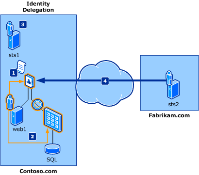
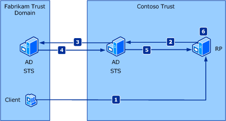
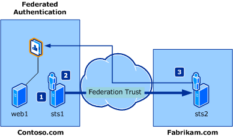

# Sample delegation, federation, and authentication scenario in SharePoint
This article provides sample scenarios for identity delegation and identity federation.
## Sample scenarios

The following fictional companies and their stated business needs are used in the sample scenarios that are described in this article:
  
    
    

- **Contoso Hybrid** is an international automobile engine supply company that specializes in manufacturing electric and fuel cell-based hybrid engines to car manufactures inside and outside of the United States. In a strategic effort to meet the parts ordering demands of its customers, the IT department at Contoso is tasked with developing and deploying a secure Internet-accessible parts ordering application through their host name, Contoso.com. This application must also provide multiple levels of access for various internal users (Contoso employees) and external users (car manufacturer employees). To minimize costs associated with maintaining the parts ordering application, IT must also avoid the need for the application to use and maintain an additional account store for internal and external users to access the application.
    
  
- **Fabrikam Motors** is a Swedish manufacturer of fuel-efficient compact cars and small cars that is known worldwide for its low price point on hybrid automobiles. Although sales have accelerated consistently year after year for Fabrikam, there has been a noticeable increase in hybrid engine failure rates within their first year, in cars sold to customers. For Fabrikam Motors to maintain its standard for high levels of service, it must implement a more efficient way for hybrid engine parts to be ordered through Contoso Hybrid.
    
  
The following are related concepts:
  
    
    

- **Identity federation**. Explains the establishment of federation between Contoso Hybrid and Fabrikam Motors so that Fabrikam users get a single sign-on experience when accessing Contoso Hybrid resources.
    
  
- **Identity delegation**. Explains the ability to access the resources from a Contoso Hybrid web service that requires an ActAs token; that is, the service requires the identity of the immediate caller (typically the identity of the service) and the original user who initiated the request (typically the identity of the interactive user).
    
  

## Identity delegation

This scenario describes an application that needs to access back-end resources that require the identity delegation chain to perform access control checks. A simple identity delegation chain usually consists of the information on the initial caller and the identity of the immediate caller. 
  
    
    
With the Kerberos delegation model on the Windows platform today, the back-end resources have access only to the identity of the immediate caller and not to that of the initial caller. This model is commonly referred to as the trusted subsystem model. Windows Identity Foundation (WIF) maintains the identity of the initial caller and the immediate caller in the delegation chain by using the  [Delegate()](https://msdn.microsoft.com/library/Microsoft.IdentityModel.Claims.IClaimsIdentity.Delegate.aspx) property.
  
    
    
Figure 1 shows a typical identity delegation scenario in which a Fabrikam employee accesses resources exposed in a Contoso.com application.
**Figure 1. Claims federation authentication**

  
    
    

  
    
    

  
    
    
The fictional users participating in this scenario are:
- Frank: A Fabrikam employee who wants to access Contoso resources.
    
  
- Daniel: A Contoso application developer who implements the necessary changes in the application.
    
  
- Adam: The Contoso IT administrator.
    
  
The components involved in this scenario are:
- web1: A web application with links to back-end resources that require the delegated identity of the initial caller. This application is built with ASP.NET.
    
  
- A web service that accesses a computer running Microsoft SQL Server, which requires the delegated identity of the initial caller and of the immediate caller. This service is built with Windows Communication Foundation (WCF).
    
  
- sts1: A security token service (STS) that is in the role of federation provider, and emits claims that are expected by the application (web1). It has established trust with Fabrikam.com and also with the application.
    
  
- sts2: An STS that is in the role of identity provider for Fabrikam.com and that provides an endpoint that the Fabrikam employee uses to authenticate. It has established trust with Contoso.com so that Fabrikam employees are allowed to access resources on Contoso.com.
    
  
Note that the term "ActAs token" refers to a token that is issued by an STS and that contains the user's identity. The  [Delegate()](https://msdn.microsoft.com/library/Microsoft.IdentityModel.Claims.IClaimsIdentity.Delegate.aspx) property contains the STS's identity.As shown in Figure 1, the flow in this scenario is:
  
    
    

1. The Contoso application is configured to obtain an ActAs token that contains both the Fabrikam employee's identity and the immediate caller's identity in the  [Delegate()](https://msdn.microsoft.com/library/Microsoft.IdentityModel.Claims.IClaimsIdentity.Delegate.aspx) property. Daniel implements these changes to the application.
    
  
2. The Contoso application is configured to pass the ActAs token to the back-end service. Daniel implements these changes to the application.
    
  
3. The Contoso web service is configured to validate the ActAs token by calling sts1. Adam enables sts1 to process delegation requests.
    
  
4. Fabrikam user Frank accesses the Contoso application and is given access to the back-end resources.
    
  

## Federated authentication

Federated authentication allows a security token service (STS) in one trust domain to provide authentication information to an STS in another trust domain when there is a trust relationship between the two domains. An example of this is shown in Figure 2.
  
    
    

**Figure 2. Claims federation scenario**

  
    
    

  
    
    

  
    
    

  
    
    

1. A client in the Fabrikam trust domain sends a request to a relying party application in the Contoso trust domain.
    
  
2. The relying party redirects the client to an STS in the Contoso trust domain. This STS has no knowledge of the client.
    
  
3. The Contoso STS redirects the client to an STS in the Fabrikam trust domain, with which the Contoso trust domain has a trust relationship.
    
  
4. The Fabrikam STS verifies the client's identity and issues a security token to the Contoso STS.
    
  
5. The Contoso STS uses the Fabrikam token to create its own token, which it sends to the relying party.
    
  
6. The relying party extracts the client's claims from the security token and makes an authentication decision.
    
  
This scenario describes a sign-on experience for a partner employee when she tries to access resources from another partner's domain. She has to sign-on only once. There are three major players in a federation scenario: an identity provider, a federation provider, and a relying party. WIF offers APIs to build all three players. Figure 3 shows a typical federation scenario where a Fabrikam employee wants to access Contoso.com resources without having to re-login; that is, the Fabrikam employee wants to use single sign-on.
**Figure 3. Claims identity delegation scenario**

  
    
    

  
    
    

  
    
    
The fictional users participating in this scenario are:
- Frank: A Fabrikam employee who wants to access Contoso resources.
    
  
- Daniel: A Contoso application developer who implements the necessary changes in the application.
    
  
- Adam: The Contoso IT administrator.
    
  
The components involved in this scenario are:
- web1: A parts ordering web application that is built with ASP.NET and controls access to the relevant parts.
    
  
- sts1: An STS that is in the role of federation provider in Contoso.com and emits claims that are expected by the application (web1). It has established trust with Fabrikam.com and is configured to allow access to Fabrikam employees.
    
  
- sts2: An STS that is in the role of identity provider in Fabrikam.com and provides an endpoint to which the Fabrikam employee is authenticated. It has established trust with Contoso.com so that Fabrikam employees are allowed to access the Contoso.com resources.
    
  
As shown in Figure 3, the flow in this scenario is:
  
    
    

1. Contoso administrator Adam configures the trust between the application (relying party) and sts1.
    
  
2. Contoso administrator Adam configures the trust with sts2 as an identity provider.
    
  
3. Fabrikam administrator Frank configures the trust with sts1 as a federation provider and then accesses the application.
    
  

## Additional resources

-  [Claims-based identity and concepts in SharePoint](claims-based-identity-and-concepts-in-sharepoint.md)
    
  
-  [Claims-based identity term definitions](claims-based-identity-term-definitions.md)
    
  

