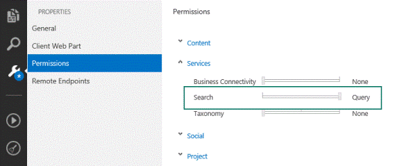

# Search add-ins in SharePoint
Learn about search SharePoint Add-ins and how you can create your own search add-ins. The add-ins you create can be added to the SharePoint add-ins catalog so that they can be used in both on-premises deployment and Office 365. Search add-ins only work with data that is stored in the search index and not with the original source documents.
SharePoint Add-ins are self-contained pieces of functionality that extend the capabilities of a SharePoint website. These add-ins solve specific business and end-user needs by integrating the best of the web and SharePoint. An add-in can contain various SharePoint elements like Lists, Remote Event Receivers, Content Types, Workflows, Workflow Custom Activities, Site Columns, Modules, Menu Item Custom Actions, Client Web Parts, and Search Configurations. For more information, see  [SharePoint Add-ins](http://msdn.microsoft.com/library/cd1eda9e-8e54-4223-93a9-a6ea0d18df70%28Office.15%29.aspx).
  
    
    

A search add-in is an SharePoint Add-in that uses search functionality. In a search add-in, you can use the SharePoint Search API to locate content. Depending on the type of permissions set up in your [add-in manifest](http://msdn.microsoft.com/library/7cd5850f-cbf3-48d2-bcb7-59b8f4ed0e63%28Office.15%29.aspx), you can search either inside or outside the contents of the add-in. In addition, you can also use a search add-in to distribute search configurations from one SharePoint installation to another.
The core design of a search add-in depends on the deployment method that you choose. The following section summarizes the available options and their benefits. For more information, see  [Choose patterns for developing and hosting your SharePoint Add-in](http://msdn.microsoft.com/library/05ce5435-0a03-4ddc-976b-c33b08d03457%28Office.15%29.aspx)
  
    
    


## Deploy your search add-ins
<a name="SP15_Deploy_search_apps"> </a>

There are two ways to deploy your search add-in:
  
    
    

1. SharePoint hosted - On-premises deployment. The search add-in is hosted inside the corporate network on the company's servers. The company's administrators manage the add-in. This scenario offers flexibility in deployment and support because the hardware and software is maintained locally by the administrators.
    
  
2. Provider hosted - Any web server hosting. The search add-in is hosted by any provider, outside of the customer's SharePoint server. 
    
  

## Search add-in development environment
<a name="SP15_Search_app_dev_environment"> </a>

To create a search add-in, use one of these two environments:
  
    
    

- Microsoft Visual Studio 2012 or Microsoft Visual Studio 2013 or Visual Studio 2015
    
  
- Napa Office 365 Development Tools
    
  
With Visual Studio 2013 and later, you can publish your search add-ins to both on-premises or in Office 365. For more information about the development environments and how to use them to create search add-ins, see  [Set up a general development environment for SharePoint](set-up-a-general-development-environment-for-sharepoint.md).
  
    
    

## APIs for search add-ins
<a name="SP15_APIs_search_apps"> </a>

You can use the wide range of search-related APIs that SharePoint offers for search add-ins. The following table lists these APIs and the location of their class libraries.
  
    
    

**SharePoint APIs for Search add-ins**


|**API name**|**Class library**|
|:-----|:-----|
|.NET client object model (CSOM)  <br/> |Microsoft.SharePoint.Client.Search.dll  <br/> |
|Silverlight CSOM  <br/> |Microsoft.SharePoint.Client.Search.Silverlight.dll  <br/> |
|ECMAScript (JavaScript, JScript) object model (JSOM)  <br/> |SP.search.js  <br/> |
|Search REST API  <br/> |http://server/_api/search/query  <br/> |
   

### Code examples

Here are some code examples using the different APIs. Each code example sends a simple Search query that contains the keyword "SharePoint" to the Search service application (SSA).
  
    
    
 **Client-side Object Model (CSOM)**
  
    
    

  
    
    


```cs

using (ClientContext clientContext = new ClientContext("http://localhost"))
{
    KeywordQuery keywordQuery = new KeywordQuery(clientContext);
    keywordQuery.QueryText = "*";
    SearchExecutor searchExecutor = new SearchExecutor(clientContext);
    ClientResult<ResultTableCollection> results = 
        searchExecutor.ExecuteQuery(keywordQuery);
    clientContext.ExecuteQuery();
}
```

 **JavaScript Object Model (JSOM)**
  
    
    

  
    
    


```

var keywordQuery = new
Microsoft.SharePoint.Client.Search.Query.KeywordQuery(context);
keywordQuery.set_queryText('SharePoint');
var searchExecutor = new Microsoft.SharePoint.Client.Search.Query.SearchExecutor(context);
results = searchExecutor.executeQuery(keywordQuery);
context.executeQueryAsync(onQuerySuccess, onQueryFail);
```

 **REST**
  
    
    

  
    
    
HTTP GET request
  
    
    


```HTML

http://mylocalhost/_api/search/query?querytext='SharePoint'
```

HTTP POST request
  
    
    


```HTML
{
'__metadata' : {'type' : 'Microsoft.Office.Server.Search.REST.SearchRequest'},
'Querytext' : 'SharePoint'
}
```


## Search add-in permissions
<a name="SP15_Search_app_permissions"> </a>

Search add-ins send query requests to the Search service application (SSA), and the add-ins require different types of permissions to function correctly. You can configure these permissions via the add-in manifest file, which is a part of each SharePoint add-in. You can modify the add-in manifest file directly with a text editor, or you can modify it with Visual Studio or Napa, as shown in the following figures. 
  
    
    

**Figure 1: Setting up permissions for search add-ins in Visual Studio 2015**

  
    
    

  
    
    

  
    
    

  
    
    

  
    
    

**Figure 2: Setting up permissions for search add-ins in "Napa" Office 365 Development Tools**

  
    
    

  
    
    

  
    
    
An SharePoint Add-in has its own identity and is associated with a security principal, called an add-in principal. Like users and groups, an add-in principal has certain permissions and rights. The add-in principal has full control rights to the add-in web, so it only needs to request permissions to SharePoint resources in the host web or other locations outside the add-in web, such as site collections. Unlike other SharePoint Add-ins, a search add-in requires only user-level permissions, known as **QueryAsUserIgnoreAppPrincipal**. This permission lets you query the search add-in based on the user's permissions. This means that search results will be returned based on the user's ACLs. 
  
    
    

### Request permissions in the add-in manifest file

The add-in manifest file is in XML format and can be edited directly. To get permissions, you write a request, as shown in the following example:
  
    
    

```XML

<AppPermissionRequests>
  <AppPermissionRequest Scope="http://sharepoint/search" Right="QueryAsUserIgnoreAppPrincipal" />
</AppPermissionRequests>
```


## Additional resources
<a name="SP15_Search_app_addresources"> </a>


-  [SharePoint Add-ins](http://msdn.microsoft.com/library/cd1eda9e-8e54-4223-93a9-a6ea0d18df70%28Office.15%29.aspx)
    
  
-  [Choose patterns for developing and hosting your SharePoint Add-in](http://msdn.microsoft.com/library/05ce5435-0a03-4ddc-976b-c33b08d03457%28Office.15%29.aspx)
    
  
-  [Add-in permissions in SharePoint](http://msdn.microsoft.com/library/5f7a8440-3c09-4cf8-83ec-c236bfa2d6c4%28Office.15%29.aspx)
    
  
-  [Add-in authorization policy types in SharePoint](http://msdn.microsoft.com/library/124879c7-a746-4c10-96a7-da76ad5327f0%28Office.15%29.aspx)
    
  
-  [Important aspects of the SharePoint Add-in architecture and development landscape](http://msdn.microsoft.com/library/ae96572b-8f06-4fd3-854f-fc312f7f2d88%28Office.15%29.aspx)
    
  
-  [Explore the app manifest structure and the package of a SharePoint Add-in](http://msdn.microsoft.com/library/7cd5850f-cbf3-48d2-bcb7-59b8f4ed0e63%28Office.15%29.aspx)
    
  
-  [Add search capabilities to your add-ins for SharePoint](http://blogs.msdn.com/b/officeapps/archive/2013/05/30/add-search-capabilities-to-your-apps-for-sharepoint.aspx)
    
  
-  [Exporting and importing search configuration settings in SharePoint](exporting-and-importing-search-configuration-settings-in-sharepoint.md)
    
  
-  [Export and import customized search configuration settings in SharePoint (TechNet)](http://technet.microsoft.com/en-us/library/jj871675.aspx)
    
  

